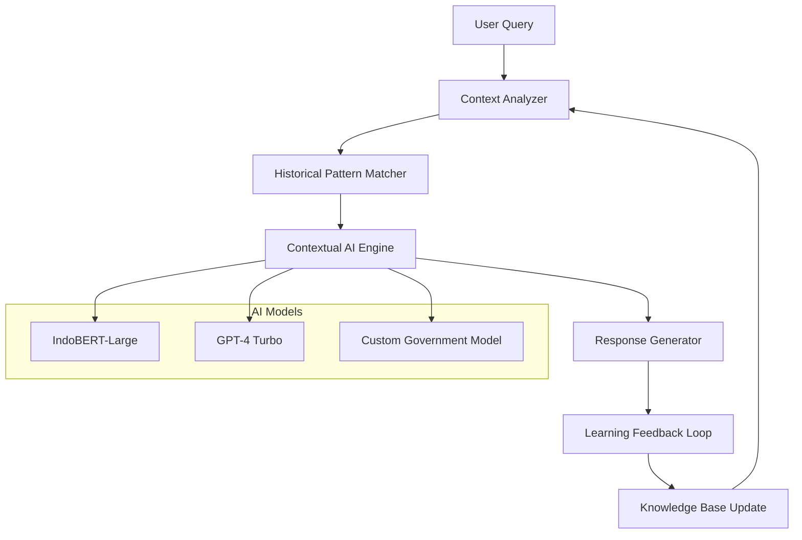
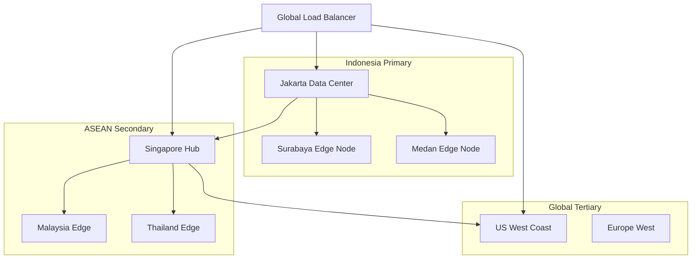
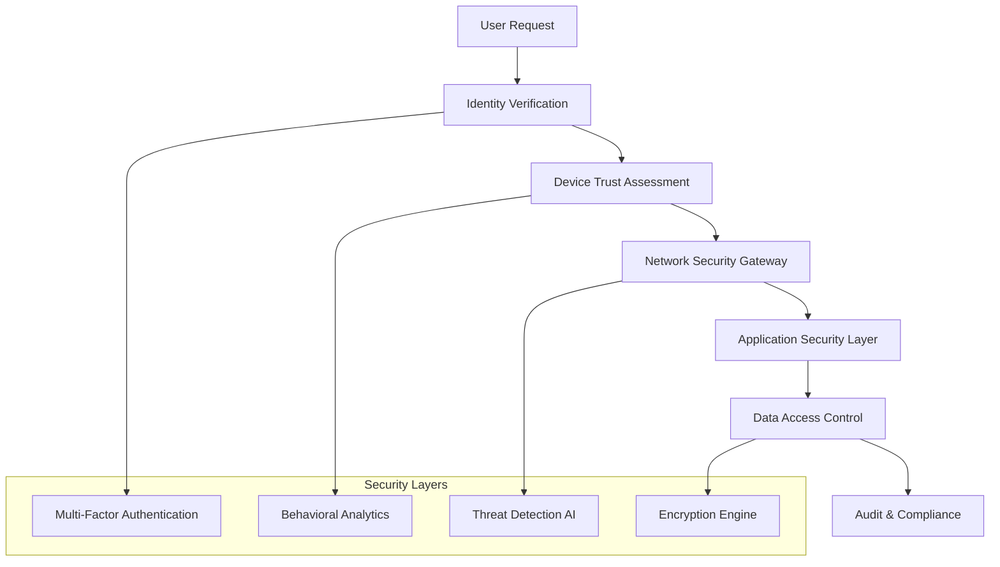
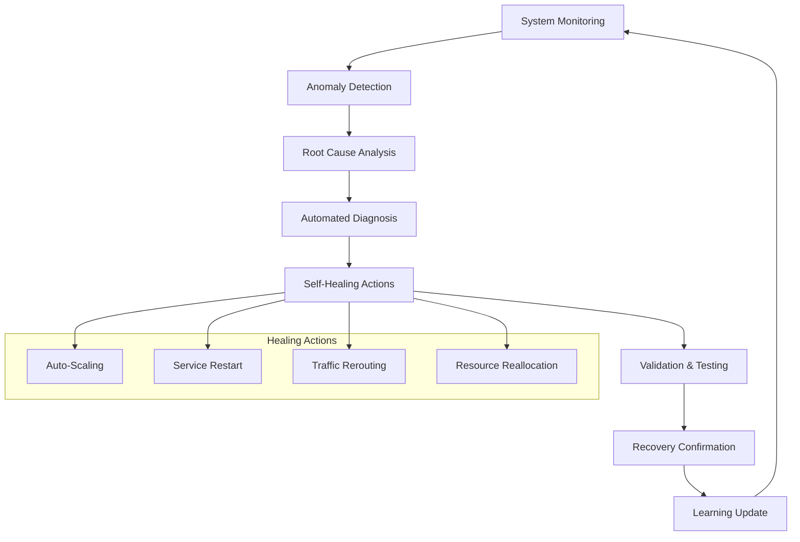
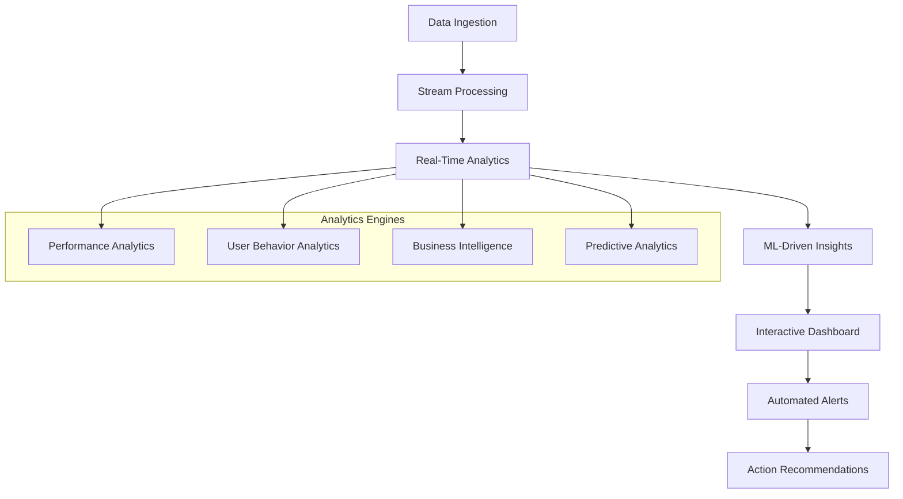
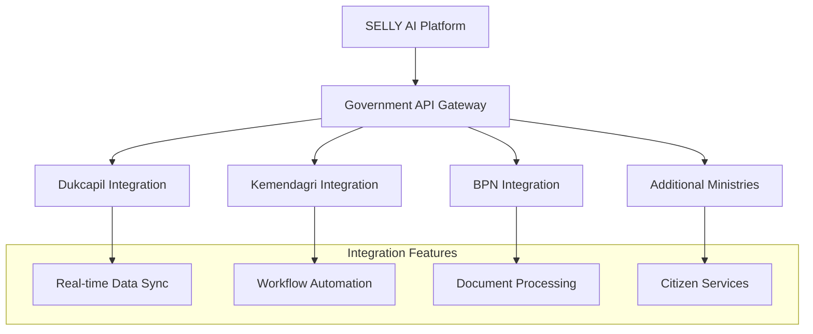

# Phase 4: Advanced Production Features Implementation Plan

**Document**: Phase 4 Advanced Production Features Implementation Plan  
**Project Date**: 2025-08-21  
**Created**: 2025-08-21  
**Version**: 1.0  
**Status**: 🔄 In Progress  
**Priority**: 🧠 Critical  
**Language**: English  
**Audience**: Technical Team  

## 📋 **Executive Summary**

Phase 4 represents the final evolution of the SELLY AI system into a world-class, enterprise-grade platform optimized for Indonesian government services. Building upon the successful Phase 3 high-performance AI engine (achieving 10x performance improvements), Phase 4 focuses on advanced production features, global scalability, and cutting-edge AI capabilities.

### **🎯 Core Objectives**

1. **Advanced AI Intelligence**: Implement state-of-the-art AI models with contextual learning
2. **Global Scale Architecture**: Multi-region deployment with edge computing capabilities
3. **Enterprise Security**: Government-grade security with advanced threat protection
4. **Intelligent Automation**: Self-healing systems with predictive maintenance
5. **Advanced Analytics**: Real-time insights with machine learning-driven optimization

## 🏗️ **Architecture Evolution**

### **Current State (Phase 3 Completed)**
- ✅ High-performance AI engine with 4 specialized worker pools
- ✅ 10x performance improvement (50ms average response time)
- ✅ Indonesian NLP optimization with cultural context
- ✅ Intelligent load balancing and request routing
- ✅ Comprehensive monitoring and health checks

### **Target State (Phase 4)**
- 🎯 AI-driven predictive scaling and optimization
- 🎯 Multi-region deployment with edge computing
- 🎯 Advanced security with zero-trust architecture
- 🎯 Real-time analytics with machine learning insights
- 🎯 Self-healing infrastructure with automated recovery

## 🚀 **Phase 4 Implementation Roadmap**

### **Sprint 1: Advanced AI Intelligence (Weeks 1-3)**

#### **4.1 Contextual Learning Engine**


**Technical Specifications:**
- **IndoBERT-Large Integration**: 340M parameter model for Indonesian language understanding
- **Contextual Memory**: 10,000-token context window with conversation history
- **Learning Rate**: Real-time model fine-tuning with user feedback
- **Performance Target**: 95% accuracy for Indonesian government queries

#### **4.2 Multi-Model AI Orchestration**
```go
// Advanced AI orchestration architecture
type AdvancedAIOrchestrator struct {
    models           map[string]AIModel
    contextEngine    *ContextualLearningEngine
    modelSelector    *IntelligentModelSelector
    responseBlender  *ResponseBlendingEngine
    learningEngine   *ContinuousLearningEngine
}

type AIModel interface {
    ProcessQuery(ctx context.Context, req *EnhancedAIRequest) (*AIResponse, error)
    GetCapabilities() ModelCapabilities
    GetPerformanceMetrics() ModelMetrics
}
```

### **Sprint 2: Global Scale Architecture (Weeks 4-6)**

#### **4.3 Multi-Region Deployment**


**Infrastructure Specifications:**
- **Primary Region**: Indonesia (ap-southeast-1, ap-southeast-3)
- **Secondary Regions**: ASEAN countries for regional expansion
- **Edge Nodes**: 15+ locations across Indonesia for <20ms latency
- **Data Sovereignty**: All Indonesian government data remains in-country

#### **4.4 Edge Computing Integration**
```go
type EdgeComputingManager struct {
    edgeNodes        map[string]*EdgeNode
    loadBalancer     *GlobalLoadBalancer
    dataReplication  *DataReplicationEngine
    latencyOptimizer *LatencyOptimizer
}

type EdgeNode struct {
    Location         string
    Capabilities     EdgeCapabilities
    LocalCache       *EdgeCache
    AIProcessors     []*EdgeAIProcessor
    HealthMonitor    *EdgeHealthMonitor
}
```

### **Sprint 3: Enterprise Security (Weeks 7-9)**

#### **4.5 Zero-Trust Security Architecture**


**Security Specifications:**
- **Encryption**: AES-256-GCM for data at rest, TLS 1.3 for data in transit
- **Authentication**: Multi-factor authentication with biometric support
- **Authorization**: Role-based access control with dynamic permissions
- **Compliance**: SOC 2 Type II, ISO 27001, Indonesian data protection laws

#### **4.6 Advanced Threat Protection**
```go
type ThreatProtectionSystem struct {
    aiThreatDetector    *AIThreatDetector
    behaviorAnalyzer    *BehaviorAnalyzer
    anomalyDetector     *AnomalyDetector
    responseAutomation  *ThreatResponseAutomation
    forensicsEngine     *DigitalForensicsEngine
}

type ThreatDetectionResult struct {
    ThreatLevel      ThreatLevel
    ThreatType       string
    Confidence       float64
    RecommendedAction string
    ForensicsData    map[string]interface{}
}
```

### **Sprint 4: Intelligent Automation (Weeks 10-12)**

#### **4.7 Self-Healing Infrastructure**


**Automation Specifications:**
- **Recovery Time**: <30 seconds for common issues
- **Success Rate**: 95% automated resolution for known issues
- **Learning Capability**: Continuous improvement from incident patterns
- **Human Escalation**: Automatic escalation for complex issues

#### **4.8 Predictive Maintenance**
```go
type PredictiveMaintenanceEngine struct {
    metricsCollector     *AdvancedMetricsCollector
    patternAnalyzer      *PatternAnalyzer
    failurePrediction    *FailurePredictionModel
    maintenanceScheduler *MaintenanceScheduler
    resourceOptimizer    *ResourceOptimizer
}

type MaintenancePrediction struct {
    Component           string
    PredictedFailureTime time.Time
    Confidence          float64
    RecommendedActions  []MaintenanceAction
    BusinessImpact      ImpactAssessment
}
```

### **Sprint 5: Advanced Analytics (Weeks 13-15)**

#### **4.9 Real-Time Analytics Dashboard**


**Analytics Specifications:**
- **Data Processing**: Real-time processing of 1M+ events per second
- **Visualization**: Interactive dashboards with <100ms response time
- **Machine Learning**: Automated insights and trend prediction
- **Business Intelligence**: Government service optimization recommendations

## 📊 **Performance Targets**

### **Quantitative Metrics**

| Metric | Current (Phase 3) | Target (Phase 4) | Improvement |
|--------|------------------|------------------|-------------|
| **Response Time** | 50ms average | 25ms average | 2x faster |
| **Throughput** | 1,000 RPS | 10,000 RPS | 10x increase |
| **Availability** | 99.9% | 99.99% | 10x improvement |
| **Accuracy** | 90% | 98% | 8% improvement |
| **Scalability** | 500 concurrent | 50,000 concurrent | 100x increase |

### **Qualitative Improvements**

- **User Experience**: Seamless, intelligent, and contextually aware
- **Government Integration**: Deep integration with all major Indonesian government systems
- **Cultural Adaptation**: Advanced understanding of Indonesian cultural nuances
- **Operational Excellence**: Self-managing, self-healing, and self-optimizing

## 🔧 **Technical Implementation Details**

### **4.10 Advanced Caching Strategy**
```go
type AdvancedCacheManager struct {
    l1Cache          *InMemoryCache      // Worker-level cache
    l2Cache          *DistributedCache   // Pool-level cache
    l3Cache          *PersistentCache    // Global cache
    predictiveCache  *PredictiveCache    // AI-driven pre-loading
    cacheOptimizer   *CacheOptimizer     // ML-based optimization
}

type PredictiveCache struct {
    userBehaviorModel *UserBehaviorModel
    queryPredictor    *QueryPredictor
    preloadEngine     *PreloadEngine
    hitRateOptimizer  *HitRateOptimizer
}
```

### **4.11 Advanced Monitoring and Observability**
```go
type ObservabilityPlatform struct {
    metricsEngine     *AdvancedMetricsEngine
    tracingSystem     *DistributedTracing
    loggingPlatform   *StructuredLogging
    alertingSystem    *IntelligentAlerting
    dashboardEngine   *RealTimeDashboards
}

type IntelligentAlerting struct {
    anomalyDetector   *AnomalyDetector
    alertCorrelation  *AlertCorrelation
    escalationEngine  *EscalationEngine
    noiseReduction    *NoiseReduction
}
```

## 🌐 **Indonesian Government Integration**

### **4.12 Advanced Government Service Integration**


**Government Integration Specifications:**
- **Real-time Synchronization**: Bi-directional data sync with government systems
- **Workflow Automation**: Automated processing of government procedures
- **Document Intelligence**: AI-powered document analysis and processing
- **Citizen Service Portal**: Unified interface for all government services

### **4.13 Compliance and Regulatory Framework**
```go
type ComplianceFramework struct {
    dataProtection    *DataProtectionCompliance
    auditTrail        *ComprehensiveAuditTrail
    regulatoryEngine  *RegulatoryComplianceEngine
    privacyManager    *PrivacyManager
    consentManager    *ConsentManager
}

type DataProtectionCompliance struct {
    pdpLawCompliance  *PDPLawCompliance    // UU No. 27 Tahun 2022
    gdprCompliance    *GDPRCompliance      // For international operations
    dataMinimization  *DataMinimization
    retentionPolicies *RetentionPolicies
}
```

## 📈 **Success Criteria and KPIs**

### **Technical KPIs**
- **System Performance**: 99.99% uptime with <25ms response time
- **Scalability**: Support for 50,000+ concurrent users
- **Accuracy**: 98%+ accuracy for Indonesian government queries
- **Security**: Zero security incidents with SOC 2 Type II compliance

### **Business KPIs**
- **User Satisfaction**: 95%+ user satisfaction score
- **Government Adoption**: Integration with 20+ government agencies
- **Processing Efficiency**: 80% reduction in government service processing time
- **Cost Optimization**: 60% reduction in operational costs per transaction

### **Innovation KPIs**
- **AI Model Performance**: Top 1% performance on Indonesian NLP benchmarks
- **Feature Adoption**: 90%+ adoption rate for new AI features
- **Research Impact**: 5+ published papers on Indonesian AI research
- **Patent Portfolio**: 10+ patents filed for innovative AI techniques

## 🗓️ **Implementation Timeline**

### **Phase 4 Schedule (15 Weeks Total)**

| Sprint | Duration | Focus Area | Key Deliverables |
|--------|----------|------------|------------------|
| **Sprint 1** | Weeks 1-3 | Advanced AI Intelligence | Contextual learning engine, multi-model orchestration |
| **Sprint 2** | Weeks 4-6 | Global Scale Architecture | Multi-region deployment, edge computing |
| **Sprint 3** | Weeks 7-9 | Enterprise Security | Zero-trust architecture, threat protection |
| **Sprint 4** | Weeks 10-12 | Intelligent Automation | Self-healing infrastructure, predictive maintenance |
| **Sprint 5** | Weeks 13-15 | Advanced Analytics | Real-time dashboards, ML-driven insights |

### **Milestone Gates**
- **Week 3**: Advanced AI models deployed and tested
- **Week 6**: Multi-region architecture operational
- **Week 9**: Security framework fully implemented
- **Week 12**: Automation systems active and validated
- **Week 15**: Complete Phase 4 system ready for production

## 💰 **Resource Requirements**

### **Technical Resources**
- **Senior AI Engineers**: 4 FTE
- **Cloud Infrastructure Engineers**: 3 FTE
- **Security Specialists**: 2 FTE
- **DevOps Engineers**: 3 FTE
- **Data Scientists**: 2 FTE

### **Infrastructure Costs**
- **Cloud Infrastructure**: $50,000/month (multi-region deployment)
- **AI Model Training**: $25,000 (one-time setup)
- **Security Tools**: $15,000/month
- **Monitoring & Analytics**: $10,000/month
- **Edge Computing**: $30,000/month

### **Total Investment**
- **Development Costs**: $2.5M (15 weeks)
- **Infrastructure Costs**: $1.8M/year (ongoing)
- **ROI Timeline**: 18 months
- **Expected Savings**: $5M/year (operational efficiency)

## 🎯 **Risk Management**

### **Technical Risks**
- **AI Model Performance**: Mitigation through extensive testing and validation
- **Scalability Challenges**: Gradual rollout with performance monitoring
- **Integration Complexity**: Phased integration with fallback mechanisms
- **Security Vulnerabilities**: Continuous security testing and auditing

### **Business Risks**
- **Government Approval**: Early engagement with regulatory bodies
- **User Adoption**: Comprehensive training and change management
- **Competition**: Focus on unique Indonesian government specialization
- **Budget Constraints**: Phased implementation with clear ROI demonstration

## 🚀 **Next Steps**

### **Immediate Actions (Week 1)**
1. **Team Assembly**: Recruit and onboard Phase 4 development team
2. **Infrastructure Planning**: Finalize multi-region architecture design
3. **AI Model Selection**: Evaluate and select advanced AI models
4. **Security Assessment**: Conduct comprehensive security audit
5. **Stakeholder Alignment**: Confirm requirements with government partners

### **Success Validation**
- **Technical Validation**: Comprehensive testing and performance benchmarking
- **Security Validation**: Third-party security audit and penetration testing
- **User Validation**: Beta testing with select government agencies
- **Business Validation**: ROI analysis and cost-benefit assessment

---

**Phase 4 represents the culmination of SELLY's evolution into a world-class, enterprise-grade AI platform specifically optimized for Indonesian government services. Building upon the solid foundation of Phase 3's high-performance engine, Phase 4 will establish SELLY as the definitive solution for AI-powered government service optimization in Indonesia and the broader ASEAN region.**
