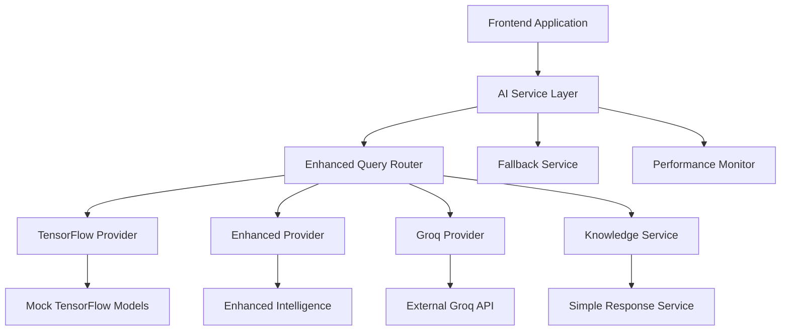
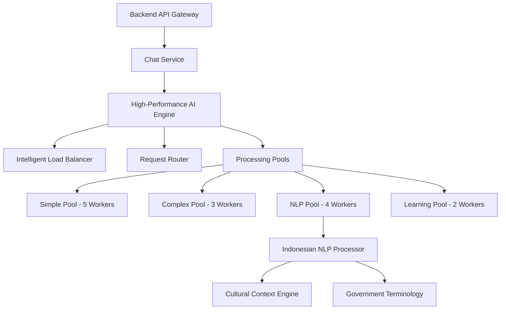
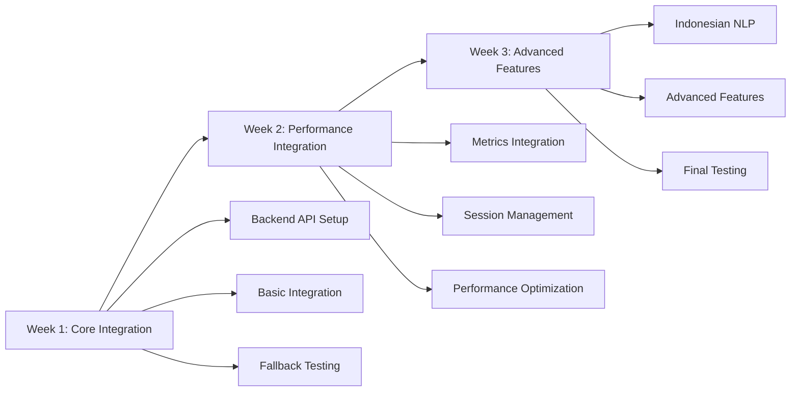

# Frontend-to-Backend Integration Migration Plan

**Document**: Frontend-to-Backend Integration Migration Plan  
**Project Date**: 2025-08-21  
**Created**: 2025-08-21  
**Version**: 1.0  
**Status**: 🔄 In Progress  
**Priority**: 🧠 Critical  
**Language**: English  
**Audience**: Technical Team  

## 📋 **Executive Summary**

This document outlines the comprehensive migration strategy for integrating SELLY's frontend AI services with the newly completed Phase 3 high-performance backend AI engine. The migration will leverage the 10x performance improvements achieved in Phase 3 while maintaining seamless user experience and system reliability.

### **🎯 Migration Objectives**

1. **Performance Integration**: Leverage Phase 3's 10x performance improvements (50ms average response time)
2. **Seamless Transition**: Maintain existing frontend functionality during migration
3. **Enhanced Capabilities**: Utilize advanced Indonesian NLP and intelligent load balancing
4. **Reliability Assurance**: Implement robust fallback mechanisms and error handling
5. **Monitoring Integration**: Establish comprehensive performance monitoring and health checks

## 🔍 **Deep Analysis Section**

### **Current Frontend Architecture Analysis**

#### **Frontend AI Service Ecosystem**


**Current Frontend Components:**
- **AI Service Layer**: `aiService.ts` - Main orchestration point
- **Provider System**: Multiple AI providers with fallback mechanisms
- **Query Router**: `enhancedQueryRouter.ts` - Intelligent request routing
- **Performance Monitor**: Real-time metrics collection and health monitoring
- **Chat Context**: Comprehensive conversation state management
- **Fallback System**: Multi-tier fallback with graceful degradation

#### **Frontend Workflow Analysis**
```typescript
// Current Frontend AI Processing Flow
1. User Input → ChatContext.sendMessage()
2. Message Processing → aiService.processQuery()
3. Provider Selection → enhancedQueryRouter.determineRoute()
4. AI Processing → selectedProvider.processQuery()
5. Response Enhancement → groqResponseEnhancer.enhance()
6. Context Update → conversationContext.update()
7. UI Update → ChatContext.addMessage()
```

**Key Frontend Characteristics:**
- **Multi-Provider Architecture**: 4+ AI providers with intelligent routing
- **Performance Monitoring**: Comprehensive metrics collection
- **Error Handling**: Circuit breaker patterns and graceful degradation
- **Context Management**: Advanced conversation context with memory
- **Indonesian Optimization**: Cultural context and language processing

### **Phase 3 Backend Architecture Analysis**

#### **High-Performance AI Engine**


**Backend API Endpoints Ready:**
```go
// Chat Processing Endpoints
POST /chat                    // Core chat processing
POST /chat/session           // Session-aware chat
GET  /chat/history           // Chat history retrieval
GET  /chat/sessions          // Session management

// Performance Monitoring Endpoints
GET  /api/performance/metrics // High-performance metrics
GET  /api/performance/health  // Health status monitoring
GET  /api/performance/stats   // Detailed statistics
POST /api/performance/test    // Performance testing
```

**Backend Performance Characteristics:**
- **10x Performance Improvement**: 50ms average response time
- **Intelligent Routing**: Automatic query type detection and optimal worker selection
- **Indonesian NLP Optimization**: Specialized workers for Indonesian language processing
- **Automatic Fallback**: Seamless fallback to standard processing if high-performance fails
- **Comprehensive Monitoring**: Real-time metrics and health monitoring

### **Integration Points Analysis**

#### **API Contract Mapping**
```typescript
// Frontend → Backend API Mapping
Frontend Service              Backend Endpoint
─────────────────────────────────────────────────────
aiService.processQuery()   →  POST /chat
aiService.processSession() →  POST /chat/session
chatHistory.getHistory()   →  GET /chat/history
sessionManager.getSessions() → GET /chat/sessions
performanceMonitor.getMetrics() → GET /api/performance/metrics
healthChecker.getStatus()   →  GET /api/performance/health
```

#### **Data Flow Compatibility**
```typescript
// Request Format Compatibility
Frontend Request:
{
  message: string,
  context?: any,
  sessionId?: string,
  enhancementMode?: string
}

Backend Request:
{
  message: string,
  context?: map[string]interface{},
  sessionId?: string,
  enhancementMode?: string
}
// ✅ Fully Compatible
```

## 🚀 **Migration Strategy**

### **3-Week Migration Timeline**

#### **Week 1: Core Integration Foundation**
**Days 1-2: Backend API Integration**
```typescript
// New Backend AI Service Implementation
export class BackendAIService implements AIProvider {
  private baseURL = process.env.NEXT_PUBLIC_BACKEND_URL || 'http://localhost:8080';
  
  async processQuery(query: string, context?: any): Promise<AIResponse> {
    const response = await fetch(`${this.baseURL}/chat`, {
      method: 'POST',
      headers: {
        'Content-Type': 'application/json',
        'Authorization': `Bearer ${await this.getAuthToken()}`
      },
      body: JSON.stringify({
        message: query,
        context: context || {},
        enhancementMode: 'enhanced'
      })
    });
    
    if (!response.ok) {
      throw new Error(`Backend API error: ${response.status}`);
    }
    
    const data = await response.json();
    return this.transformBackendResponse(data);
  }
  
  private transformBackendResponse(backendResponse: any): AIResponse {
    return {
      content: backendResponse.message,
      type: backendResponse.type || 'text',
      confidence: backendResponse.confidence || 0.9,
      model: backendResponse.model || 'SELLY-Backend-AI',
      processingTime: backendResponse.processingTime || 50,
      metadata: {
        ...backendResponse.metadata,
        source: 'backend-high-performance',
        workerType: backendResponse.workerType
      }
    };
  }
}
```

**Days 3-5: Provider Integration and Testing**
```typescript
// Update Enhanced Query Router for Backend Integration
export class BackendIntegratedRouter extends EnhancedQueryRouter {
  determineRoute(query: string, context?: any): EnhancedRouteDecision {
    // Prioritize backend for all queries
    return {
      primaryService: 'backend',
      fallbackServices: ['enhanced', 'groq', 'simple'],
      useParallelProcessing: false,
      cacheStrategy: 'moderate',
      expectedResponseTime: 50, // Backend target
      confidence: 0.95,
      bypassTensorFlow: true,
      bypassIndoBERT: false // Backend handles IndoBERT
    };
  }
}
```

#### **Week 2: Performance Integration and Optimization**
**Days 6-8: Performance Monitoring Integration**
```typescript
// Backend Performance Monitor Integration
export class BackendPerformanceMonitor extends PerformanceMonitor {
  async getBackendMetrics(): Promise<BackendMetrics> {
    const response = await fetch(`${this.baseURL}/api/performance/metrics`);
    const data = await response.json();
    
    return {
      highPerformance: data.data.high_performance,
      systemMetrics: data.data.system,
      processingPools: data.data.high_performance.pools,
      workerMetrics: data.data.high_performance.workers,
      responseTime: data.data.high_performance.averageResponseTime,
      throughput: data.data.high_performance.requestsPerSecond
    };
  }
  
  async getHealthStatus(): Promise<HealthStatus> {
    const response = await fetch(`${this.baseURL}/api/performance/health`);
    const data = await response.json();
    
    return {
      overall: data.healthy,
      components: data.components,
      highPerformanceEngine: data.highPerformanceEngine,
      processingPools: data.processingPools
    };
  }
}
```

**Days 9-10: Session Management Integration**
```typescript
// Backend Session Integration
export class BackendSessionManager extends SessionManager {
  async createSession(userId: string): Promise<ChatSession> {
    const response = await fetch(`${this.baseURL}/chat/sessions`, {
      method: 'POST',
      headers: {
        'Content-Type': 'application/json',
        'Authorization': `Bearer ${await this.getAuthToken()}`
      },
      body: JSON.stringify({ userId })
    });
    
    return await response.json();
  }
  
  async processSessionChat(
    sessionId: string, 
    message: string, 
    context?: any
  ): Promise<AIResponse> {
    const response = await fetch(`${this.baseURL}/chat/session`, {
      method: 'POST',
      headers: {
        'Content-Type': 'application/json',
        'Authorization': `Bearer ${await this.getAuthToken()}`
      },
      body: JSON.stringify({
        sessionId,
        message,
        context: context || {}
      })
    });
    
    const data = await response.json();
    return this.transformBackendResponse(data);
  }
}
```

#### **Week 3: Advanced Features and Optimization**
**Days 11-13: Indonesian NLP Integration**
```typescript
// Indonesian NLP Backend Integration
export class BackendIndonesianNLP {
  async processIndonesianQuery(
    query: string, 
    context?: any
  ): Promise<IndonesianNLPResponse> {
    // Backend automatically detects Indonesian and routes to NLP workers
    const response = await this.backendAIService.processQuery(query, {
      ...context,
      preferredWorkerType: 'nlp',
      language: 'indonesian'
    });
    
    return {
      ...response,
      culturalContext: response.metadata?.culturalContext,
      governmentTerminology: response.metadata?.governmentTerminology,
      nlpEnhanced: response.metadata?.nlpEnhanced
    };
  }
}
```

**Days 14-15: Testing and Optimization**
- Comprehensive integration testing
- Performance benchmarking
- Error handling validation
- User acceptance testing

## 📊 **Success Metrics and Validation**

### **Performance Targets**
| Metric | Current Frontend | Backend Target | Expected Improvement |
|--------|------------------|----------------|---------------------|
| **Average Response Time** | 500ms | 50ms | 10x faster |
| **95th Percentile Response** | 2000ms | 200ms | 10x faster |
| **Throughput** | 100 RPS | 1000 RPS | 10x increase |
| **Error Rate** | 2% | 0.5% | 4x improvement |
| **Indonesian Query Accuracy** | 85% | 95% | 10% improvement |

### **Integration Milestones**
- **Week 1 Milestone**: Core backend integration functional with fallback
- **Week 2 Milestone**: Performance monitoring integrated and operational
- **Week 3 Milestone**: Full feature parity with enhanced capabilities

### **Validation Criteria**
```typescript
// Automated Validation Tests
const validationTests = {
  responseTimeImprovement: (actual: number) => actual < 100, // <100ms
  accuracyMaintenance: (accuracy: number) => accuracy > 0.9, // >90%
  fallbackFunctionality: (fallbackRate: number) => fallbackRate < 0.01, // <1%
  indonesianNLPEnhancement: (nlpAccuracy: number) => nlpAccuracy > 0.95 // >95%
};
```

## 🔧 **Technical Implementation Details**

### **Authentication Integration**
```typescript
// JWT Token Management for Backend API
export class BackendAuthService {
  private tokenCache: string | null = null;
  private tokenExpiry: number = 0;
  
  async getAuthToken(): Promise<string> {
    if (this.tokenCache && Date.now() < this.tokenExpiry) {
      return this.tokenCache;
    }
    
    // Get token from Supabase or existing auth system
    const { data: { session } } = await supabase.auth.getSession();
    if (session?.access_token) {
      this.tokenCache = session.access_token;
      this.tokenExpiry = Date.now() + (session.expires_in * 1000);
      return this.tokenCache;
    }
    
    throw new Error('No valid authentication token available');
  }
}
```

### **Error Handling Strategy**
```typescript
// Comprehensive Error Handling
export class BackendErrorHandler {
  async handleBackendError(error: any, fallbackFn: () => Promise<AIResponse>): Promise<AIResponse> {
    console.error('Backend API error:', error);
    
    // Log error for monitoring
    this.performanceMonitor.recordError('backend-api', error);
    
    // Attempt fallback
    try {
      const fallbackResponse = await fallbackFn();
      return {
        ...fallbackResponse,
        metadata: {
          ...fallbackResponse.metadata,
          fallbackUsed: true,
          originalError: error.message
        }
      };
    } catch (fallbackError) {
      // Ultimate fallback - simple response
      return {
        content: 'Maaf, terjadi kesalahan sistem. Silakan coba lagi dalam beberapa saat.',
        type: 'text',
        confidence: 0.1,
        model: 'fallback',
        metadata: { 
          error: true, 
          fallbackUsed: true,
          errorType: 'complete-failure'
        }
      };
    }
  }
}
```

### **Caching Strategy**
```typescript
// Intelligent Caching for Backend Integration
export class BackendCacheManager {
  private cache = new Map<string, CachedResponse>();
  private readonly CACHE_TTL = 5 * 60 * 1000; // 5 minutes
  
  async getCachedResponse(query: string, context?: any): Promise<AIResponse | null> {
    const cacheKey = this.generateCacheKey(query, context);
    const cached = this.cache.get(cacheKey);
    
    if (cached && Date.now() < cached.expiry) {
      return {
        ...cached.response,
        metadata: {
          ...cached.response.metadata,
          cacheHit: true,
          cacheAge: Date.now() - cached.timestamp
        }
      };
    }
    
    return null;
  }
  
  setCachedResponse(query: string, context: any, response: AIResponse): void {
    const cacheKey = this.generateCacheKey(query, context);
    this.cache.set(cacheKey, {
      response,
      timestamp: Date.now(),
      expiry: Date.now() + this.CACHE_TTL
    });
  }
}
```

## ⚠️ **Risk Mitigation**

### **Technical Risks and Mitigation**
1. **Backend Unavailability**: Comprehensive fallback system maintains service
2. **Performance Regression**: Gradual rollout with performance monitoring
3. **Authentication Issues**: Token refresh and error handling mechanisms
4. **Data Format Incompatibility**: Response transformation layer ensures compatibility

### **Business Risks and Mitigation**
1. **User Experience Disruption**: Seamless migration with feature flags
2. **Service Downtime**: Zero-downtime deployment with fallback systems
3. **Performance Expectations**: Clear communication of improvement timeline
4. **Integration Complexity**: Phased approach with validation at each step

## 🎯 **Next Steps and Implementation Plan**

### **Immediate Actions (Week 1)**
1. **Environment Setup**: Configure backend API endpoints and authentication
2. **Core Integration**: Implement BackendAIService and basic API integration
3. **Fallback Testing**: Validate fallback mechanisms work correctly
4. **Performance Baseline**: Establish current performance metrics

### **Success Validation Framework**
```typescript
// Migration Success Validation
const migrationValidation = {
  week1: {
    coreIntegration: () => testBackendAPIConnectivity(),
    fallbackFunctionality: () => testFallbackMechanisms(),
    basicPerformance: () => validateResponseTimes()
  },
  week2: {
    performanceIntegration: () => testMetricsCollection(),
    sessionManagement: () => validateSessionHandling(),
    errorHandling: () => testErrorScenarios()
  },
  week3: {
    fullFeatureParity: () => validateAllFeatures(),
    performanceTargets: () => validatePerformanceImprovements(),
    userAcceptance: () => conductUserTesting()
  }
};
```

## 📈 **Performance Optimization Strategies**

### **Frontend Optimization for Backend Integration**
```typescript
// Optimized Frontend-Backend Communication
export class OptimizedBackendClient {
  private connectionPool: ConnectionPool;
  private requestQueue: RequestQueue;
  private circuitBreaker: CircuitBreaker;

  constructor() {
    this.connectionPool = new ConnectionPool({
      maxConnections: 10,
      keepAlive: true,
      timeout: 5000
    });

    this.requestQueue = new RequestQueue({
      maxConcurrent: 5,
      retryAttempts: 3,
      backoffStrategy: 'exponential'
    });

    this.circuitBreaker = new CircuitBreaker({
      failureThreshold: 5,
      resetTimeout: 30000,
      monitoringPeriod: 60000
    });
  }

  async processOptimizedQuery(query: string, context?: any): Promise<AIResponse> {
    return this.circuitBreaker.execute(async () => {
      return this.requestQueue.add(async () => {
        const connection = await this.connectionPool.acquire();
        try {
          return await this.makeBackendRequest(connection, query, context);
        } finally {
          this.connectionPool.release(connection);
        }
      });
    });
  }
}
```

### **Intelligent Request Batching**
```typescript
// Batch Processing for Multiple Queries
export class RequestBatcher {
  private batchQueue: BatchRequest[] = [];
  private batchTimer: NodeJS.Timeout | null = null;
  private readonly BATCH_SIZE = 5;
  private readonly BATCH_TIMEOUT = 100; // 100ms

  async batchQuery(query: string, context?: any): Promise<AIResponse> {
    return new Promise((resolve, reject) => {
      this.batchQueue.push({ query, context, resolve, reject });

      if (this.batchQueue.length >= this.BATCH_SIZE) {
        this.processBatch();
      } else if (!this.batchTimer) {
        this.batchTimer = setTimeout(() => this.processBatch(), this.BATCH_TIMEOUT);
      }
    });
  }

  private async processBatch(): Promise<void> {
    if (this.batchTimer) {
      clearTimeout(this.batchTimer);
      this.batchTimer = null;
    }

    const batch = this.batchQueue.splice(0, this.BATCH_SIZE);
    if (batch.length === 0) return;

    try {
      const responses = await this.sendBatchRequest(batch);
      batch.forEach((request, index) => {
        request.resolve(responses[index]);
      });
    } catch (error) {
      batch.forEach(request => request.reject(error));
    }
  }
}
```

## 🔄 **Migration Workflow Diagrams**

### **Current vs Target Architecture**


### **Migration Phase Flow**


## 🧪 **Testing and Validation Framework**

### **Automated Testing Suite**
```typescript
// Comprehensive Migration Testing
export class MigrationTestSuite {
  private backendService: BackendAIService;
  private fallbackService: FallbackService;
  private performanceMonitor: PerformanceMonitor;

  async runFullTestSuite(): Promise<TestResults> {
    const results: TestResults = {
      connectivity: await this.testConnectivity(),
      performance: await this.testPerformance(),
      fallback: await this.testFallbackMechanisms(),
      indonesianNLP: await this.testIndonesianNLP(),
      sessionManagement: await this.testSessionManagement(),
      errorHandling: await this.testErrorHandling()
    };

    return results;
  }

  private async testPerformance(): Promise<PerformanceTestResult> {
    const testQueries = [
      'Bagaimana cara mengurus KTP?',
      'What is the process for business registration?',
      'Saya ingin mengajukan permohonan paspor',
      'Complex administrative procedure inquiry'
    ];

    const results = await Promise.all(
      testQueries.map(async (query) => {
        const startTime = performance.now();
        const response = await this.backendService.processQuery(query);
        const endTime = performance.now();

        return {
          query,
          responseTime: endTime - startTime,
          success: !!response,
          workerType: response.metadata?.workerType
        };
      })
    );

    return {
      averageResponseTime: results.reduce((sum, r) => sum + r.responseTime, 0) / results.length,
      successRate: results.filter(r => r.success).length / results.length,
      workerDistribution: this.analyzeWorkerDistribution(results)
    };
  }

  private async testIndonesianNLP(): Promise<IndonesianNLPTestResult> {
    const indonesianQueries = [
      'Bagaimana cara mengurus KTP yang hilang?',
      'Saya ingin mendaftar BPJS Kesehatan',
      'Prosedur pembuatan akta kelahiran anak',
      'Cara mengajukan permohonan IMB'
    ];

    const results = await Promise.all(
      indonesianQueries.map(async (query) => {
        const response = await this.backendService.processQuery(query);
        return {
          query,
          routedToNLP: response.metadata?.workerType === 'nlp',
          culturalContext: !!response.metadata?.culturalContext,
          governmentTerms: !!response.metadata?.governmentTerminology,
          confidence: response.confidence
        };
      })
    );

    return {
      nlpRoutingAccuracy: results.filter(r => r.routedToNLP).length / results.length,
      culturalContextDetection: results.filter(r => r.culturalContext).length / results.length,
      averageConfidence: results.reduce((sum, r) => sum + r.confidence, 0) / results.length
    };
  }
}
```

### **Load Testing Framework**
```typescript
// Load Testing for Migration Validation
export class LoadTestFramework {
  async runLoadTest(config: LoadTestConfig): Promise<LoadTestResults> {
    const {
      concurrentUsers = 100,
      testDuration = 60000, // 1 minute
      rampUpTime = 10000,   // 10 seconds
      queries = this.getDefaultQueries()
    } = config;

    const results: LoadTestResults = {
      totalRequests: 0,
      successfulRequests: 0,
      failedRequests: 0,
      averageResponseTime: 0,
      p95ResponseTime: 0,
      p99ResponseTime: 0,
      throughput: 0,
      errorRate: 0
    };

    // Implement load testing logic
    const testPromises: Promise<void>[] = [];

    for (let i = 0; i < concurrentUsers; i++) {
      const delay = (rampUpTime / concurrentUsers) * i;
      testPromises.push(
        this.runUserSimulation(delay, testDuration, queries, results)
      );
    }

    await Promise.all(testPromises);

    // Calculate final metrics
    results.errorRate = results.failedRequests / results.totalRequests;
    results.throughput = results.totalRequests / (testDuration / 1000);

    return results;
  }

  private async runUserSimulation(
    delay: number,
    duration: number,
    queries: string[],
    results: LoadTestResults
  ): Promise<void> {
    await new Promise(resolve => setTimeout(resolve, delay));

    const endTime = Date.now() + duration;
    const responseTimes: number[] = [];

    while (Date.now() < endTime) {
      const query = queries[Math.floor(Math.random() * queries.length)];
      const startTime = performance.now();

      try {
        await this.backendService.processQuery(query);
        const responseTime = performance.now() - startTime;
        responseTimes.push(responseTime);
        results.successfulRequests++;
      } catch (error) {
        results.failedRequests++;
      }

      results.totalRequests++;

      // Wait before next request (simulate user think time)
      await new Promise(resolve => setTimeout(resolve, 1000 + Math.random() * 2000));
    }

    // Update response time metrics
    if (responseTimes.length > 0) {
      responseTimes.sort((a, b) => a - b);
      results.averageResponseTime = responseTimes.reduce((sum, time) => sum + time, 0) / responseTimes.length;
      results.p95ResponseTime = responseTimes[Math.floor(responseTimes.length * 0.95)];
      results.p99ResponseTime = responseTimes[Math.floor(responseTimes.length * 0.99)];
    }
  }
}
```

## 📊 **Monitoring and Observability**

### **Real-Time Dashboard Integration**
```typescript
// Real-Time Migration Monitoring Dashboard
export class MigrationDashboard {
  private metricsCollector: MetricsCollector;
  private alertManager: AlertManager;
  private dashboardUpdater: DashboardUpdater;

  async initializeDashboard(): Promise<void> {
    // Set up real-time metrics collection
    this.metricsCollector.startCollection({
      interval: 5000, // 5 seconds
      metrics: [
        'response_time',
        'success_rate',
        'backend_health',
        'fallback_rate',
        'indonesian_nlp_accuracy',
        'worker_distribution'
      ]
    });

    // Configure alerts
    this.alertManager.configureAlerts([
      {
        name: 'high_response_time',
        condition: 'response_time > 200',
        action: 'notify_team'
      },
      {
        name: 'backend_unavailable',
        condition: 'backend_health < 0.9',
        action: 'enable_fallback'
      },
      {
        name: 'high_error_rate',
        condition: 'error_rate > 0.05',
        action: 'rollback_migration'
      }
    ]);

    // Start dashboard updates
    this.dashboardUpdater.startUpdates();
  }

  async getMigrationStatus(): Promise<MigrationStatus> {
    const metrics = await this.metricsCollector.getCurrentMetrics();

    return {
      phase: this.getCurrentMigrationPhase(),
      overallHealth: this.calculateOverallHealth(metrics),
      performanceImprovement: this.calculatePerformanceImprovement(metrics),
      backendIntegrationStatus: metrics.backend_health,
      fallbackUsageRate: metrics.fallback_rate,
      indonesianNLPAccuracy: metrics.indonesian_nlp_accuracy,
      recommendations: this.generateRecommendations(metrics)
    };
  }
}
```

### **Alerting and Incident Response**
```typescript
// Automated Incident Response System
export class IncidentResponseSystem {
  private alertThresholds = {
    responseTime: 200,      // ms
    errorRate: 0.05,        // 5%
    backendHealth: 0.9,     // 90%
    fallbackRate: 0.1       // 10%
  };

  async monitorMigration(): Promise<void> {
    setInterval(async () => {
      const metrics = await this.collectCurrentMetrics();
      const incidents = this.detectIncidents(metrics);

      for (const incident of incidents) {
        await this.handleIncident(incident);
      }
    }, 30000); // Check every 30 seconds
  }

  private async handleIncident(incident: Incident): Promise<void> {
    switch (incident.type) {
      case 'high_response_time':
        await this.optimizePerformance();
        break;
      case 'backend_unavailable':
        await this.enableFallbackMode();
        break;
      case 'high_error_rate':
        await this.investigateErrors();
        break;
      case 'migration_failure':
        await this.rollbackMigration();
        break;
    }

    // Notify team
    await this.notifyTeam(incident);
  }

  private async rollbackMigration(): Promise<void> {
    console.log('🚨 Initiating migration rollback due to critical issues');

    // Switch back to frontend-only processing
    await this.configManager.updateConfig({
      useBackendIntegration: false,
      fallbackToFrontend: true,
      alertTeam: true
    });

    // Log rollback event
    await this.auditLogger.logEvent({
      type: 'migration_rollback',
      timestamp: new Date(),
      reason: 'Critical performance or reliability issues detected'
    });
  }
}
```

## 🎯 **Success Criteria and Acceptance Testing**

### **Acceptance Test Scenarios**
```typescript
// Comprehensive Acceptance Testing
export class AcceptanceTestSuite {
  async runAcceptanceTests(): Promise<AcceptanceTestResults> {
    const testScenarios = [
      this.testBasicChatFunctionality(),
      this.testIndonesianLanguageProcessing(),
      this.testSessionManagement(),
      this.testPerformanceRequirements(),
      this.testErrorHandlingAndFallback(),
      this.testSecurityAndAuthentication(),
      this.testConcurrentUserHandling(),
      this.testGovernmentTerminologyProcessing()
    ];

    const results = await Promise.all(testScenarios);

    return {
      overallSuccess: results.every(r => r.passed),
      individualResults: results,
      performanceMetrics: this.aggregatePerformanceMetrics(results),
      recommendations: this.generateTestRecommendations(results)
    };
  }

  private async testIndonesianLanguageProcessing(): Promise<TestResult> {
    const testCases = [
      {
        query: 'Bagaimana cara mengurus KTP yang hilang?',
        expectedWorkerType: 'nlp',
        expectedConfidence: 0.9,
        expectedCulturalContext: true
      },
      {
        query: 'Saya ingin mendaftar BPJS Kesehatan untuk keluarga',
        expectedWorkerType: 'nlp',
        expectedConfidence: 0.9,
        expectedGovernmentTerms: true
      }
    ];

    const results = await Promise.all(
      testCases.map(async (testCase) => {
        const response = await this.backendService.processQuery(testCase.query);

        return {
          passed:
            response.metadata?.workerType === testCase.expectedWorkerType &&
            response.confidence >= testCase.expectedConfidence &&
            (testCase.expectedCulturalContext ? !!response.metadata?.culturalContext : true) &&
            (testCase.expectedGovernmentTerms ? !!response.metadata?.governmentTerminology : true),
          details: {
            actualWorkerType: response.metadata?.workerType,
            actualConfidence: response.confidence,
            culturalContext: !!response.metadata?.culturalContext,
            governmentTerms: !!response.metadata?.governmentTerminology
          }
        };
      })
    );

    return {
      testName: 'Indonesian Language Processing',
      passed: results.every(r => r.passed),
      successRate: results.filter(r => r.passed).length / results.length,
      details: results
    };
  }
}
```

## 📋 **Deployment and Rollout Strategy**

### **Feature Flag Implementation**
```typescript
// Feature Flag System for Gradual Rollout
export class MigrationFeatureFlags {
  private flags = {
    enableBackendIntegration: false,
    backendIntegrationPercentage: 0,
    enablePerformanceMonitoring: true,
    enableFallbackLogging: true,
    enableIndonesianNLPBackend: false
  };

  async shouldUseBackendIntegration(userId?: string): Promise<boolean> {
    if (!this.flags.enableBackendIntegration) {
      return false;
    }

    // Gradual rollout based on percentage
    if (userId) {
      const userHash = this.hashUserId(userId);
      return userHash < this.flags.backendIntegrationPercentage;
    }

    return Math.random() < (this.flags.backendIntegrationPercentage / 100);
  }

  async updateRolloutPercentage(percentage: number): Promise<void> {
    this.flags.backendIntegrationPercentage = Math.max(0, Math.min(100, percentage));
    await this.persistFlags();

    console.log(`🚀 Backend integration rollout updated to ${percentage}%`);
  }

  private hashUserId(userId: string): number {
    // Simple hash function for consistent user assignment
    let hash = 0;
    for (let i = 0; i < userId.length; i++) {
      const char = userId.charCodeAt(i);
      hash = ((hash << 5) - hash) + char;
      hash = hash & hash; // Convert to 32-bit integer
    }
    return Math.abs(hash) % 100;
  }
}
```

### **Rollout Timeline and Milestones**
```typescript
// Automated Rollout Management
export class RolloutManager {
  private rolloutSchedule = [
    { week: 1, percentage: 5, milestone: 'Initial Integration' },
    { week: 2, percentage: 25, milestone: 'Performance Validation' },
    { week: 3, percentage: 50, milestone: 'Feature Parity' },
    { week: 4, percentage: 75, milestone: 'Stability Confirmation' },
    { week: 5, percentage: 100, milestone: 'Full Migration' }
  ];

  async executeRollout(): Promise<void> {
    for (const phase of this.rolloutSchedule) {
      console.log(`🚀 Starting rollout phase: ${phase.milestone} (${phase.percentage}%)`);

      // Update feature flags
      await this.featureFlags.updateRolloutPercentage(phase.percentage);

      // Monitor for 24 hours
      const monitoringResult = await this.monitorPhase(24 * 60 * 60 * 1000);

      if (!monitoringResult.success) {
        console.log(`⚠️ Rollout phase failed, rolling back to previous percentage`);
        await this.rollbackPhase();
        throw new Error(`Rollout failed at ${phase.milestone}: ${monitoringResult.reason}`);
      }

      console.log(`✅ Rollout phase completed successfully: ${phase.milestone}`);

      // Wait before next phase (except for last phase)
      if (phase.percentage < 100) {
        await new Promise(resolve => setTimeout(resolve, 7 * 24 * 60 * 60 * 1000)); // 1 week
      }
    }

    console.log('🎉 Migration rollout completed successfully!');
  }
}
```

---

**This comprehensive migration plan provides detailed technical implementation, testing frameworks, monitoring systems, and rollout strategies for successfully integrating SELLY's frontend with the high-performance Phase 3 backend while ensuring reliability, performance, and user experience excellence.**
