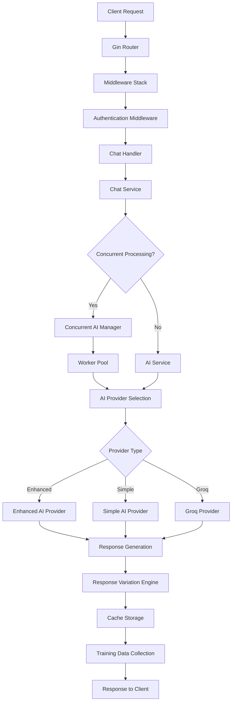

# SELLY AI Data Flow Diagrams

**Document**: Data Flow Analysis & Request/Response Patterns
**Project Date**: 2025-08-28
**Created**: 2025-08-28
**Version**: 1.0
**Status**: ✅ Complete
**Priority**: 🧠 Critical
**Language**: English
**Audience**: Technical Team

## Complete Request/Response Flow

### 1. Chat Request Processing Flow



### 2. Detailed Service Layer Flow

**File**: `backend/internal/api/handlers/chat.go` → `backend/internal/services/chat/service.go`

```
HTTP Request → Chat Handler → Chat Service → AI Service → Provider → Response
     ↓              ↓             ↓           ↓          ↓         ↓
[JSON Payload] [Validation] [Session Mgmt] [Routing] [Processing] [JSON Response]
     ↓              ↓             ↓           ↓          ↓         ↓
[Auth Context] [Error Handle] [Context Build] [Fallback] [Caching] [Metrics]
```

## Request Processing Pipeline

### 1. HTTP Request Ingestion

**Entry Point**: `backend/internal/api/handlers/chat.go`

```go
func (h *ChatHandler) ProcessChat(c *gin.Context) {
    // 1. Request validation and parsing
    var req ChatRequest
    if err := c.ShouldBindJSON(&req); err != nil {
        c.JSON(400, gin.H{"error": "Invalid request format"})
        return
    }
    
    // 2. Authentication context extraction
    authContext := c.MustGet("auth_context")
    
    // 3. Service layer delegation
    response, err := h.chatService.ProcessChat(c.Request.Context(), &req, authContext)
    if err != nil {
        h.handleError(c, err)
        return
    }
    
    // 4. Response formatting and return
    c.JSON(200, response)
}
```

### 2. Service Layer Processing

**File**: `backend/internal/services/chat/service.go`

```go
func (s *Service) ProcessChat(ctx context.Context, req *ChatRequest, authContext interface{}) (*ChatResponse, error) {
    startTime := time.Now()
    
    // 1. Session management
    sessionID := s.getOrCreateSession(authContext.(*auth.AuthContext).UserID)
    
    // 2. Context building
    aiRequest := &AIRequest{
        Query:           req.Message,
        UserID:          authContext.(*auth.AuthContext).UserID,
        SessionID:       sessionID,
        Context:         req.Context,
        EnhancementMode: req.EnhancementMode,
    }
    
    // 3. AI processing
    aiResponse, err := s.aiService.ProcessQuery(ctx, aiRequest)
    if err != nil {
        return nil, fmt.Errorf("AI processing failed: %w", err)
    }
    
    // 4. Response construction
    response := &ChatResponse{
        Response:        aiResponse.Content,
        Type:            aiResponse.Type,
        Confidence:      aiResponse.Confidence,
        Model:           aiResponse.Model,
        ProcessingTime:  time.Since(startTime).Seconds() * 1000,
        CacheHit:        aiResponse.CacheHit,
        SessionID:       sessionID,
    }
    
    // 5. Async operations (training data, metrics)
    go s.collectTrainingData(aiRequest, aiResponse)
    s.monitoring.RecordRequest(time.Since(startTime))
    
    return response, nil
}
```

## AI Processing Flow

### 1. Provider Selection & Routing

**File**: `backend/internal/services/chat/ai_service.go`

```
Query Analysis → Provider Selection → Health Check → Processing → Response
      ↓                ↓               ↓            ↓           ↓
[Query Length]   [Enhanced/Simple]  [IsHealthy()]  [ProcessQuery] [Variation]
[Enhancement]    [Groq/Fallback]   [Circuit Break] [Timeout]     [Caching]
[Context]        [Load Balance]     [Retry Logic]   [Error Handle] [Metrics]
```

### 2. Enhanced Provider Processing

```go
func (s *AIService) ProcessQuery(ctx context.Context, req *AIRequest) (*AIResponse, error) {
    // 1. Provider selection with intelligence
    if s.enhancedSelectionEnabled {
        selectionResp, err := s.providerSelector.SelectProvider(ctx, selectionReq)
        providerName = selectionResp.SelectedProvider
    } else {
        providerName = s.selectBestProvider(req)
    }
    
    // 2. Provider health validation
    provider, exists := s.providers[providerName]
    if !exists || !provider.IsHealthy() {
        provider = s.fallback
    }
    
    // 3. Query processing with monitoring
    response, err := provider.ProcessQuery(ctx, req)
    if err != nil {
        return nil, fmt.Errorf("AI processing failed: %w", err)
    }
    
    // 4. Response enhancement
    if s.variationEnabled {
        response.Content = s.variationEngine.VaryResponse(response.Content, req.Context)
    }
    
    return response, nil
}
```

## Concurrent Processing Flow

### 1. Concurrent AI Manager

**File**: `backend/internal/services/concurrent/ai_manager.go`

```
Request → Rate Limiter → Circuit Breaker → Worker Pool → AI Service → Response
   ↓          ↓              ↓               ↓            ↓           ↓
[Queuing]  [Throttling]  [Health Check]  [Parallel]   [Processing] [Aggregation]
[Priority] [Backpressure] [Failure Track] [Load Dist]  [Timeout]   [Error Handle]
```

### 2. Worker Pool Processing

```go
func (cam *ConcurrentAIManager) ProcessRequest(ctx context.Context, req *AIRequest) (*AIResponse, error) {
    // 1. Rate limiting check
    if !cam.rateLimiter.Allow() {
        return nil, fmt.Errorf("rate limit exceeded")
    }
    
    // 2. Circuit breaker validation
    if !cam.circuitBreaker.Allow() {
        return nil, fmt.Errorf("circuit breaker is open")
    }
    
    // 3. Worker pool submission
    requestID := fmt.Sprintf("req_%d", time.Now().UnixNano())
    responseCh := make(chan *AIResponseWrapper, 1)
    
    wrapper := &AIRequestWrapper{
        Request:     req,
        ResponseCh:  responseCh,
        Context:     ctx,
        RequestID:   requestID,
        SubmittedAt: time.Now(),
        Priority:    PriorityNormal,
    }
    
    err := cam.workerPool.Submit(func() {
        cam.processRequestAsync(wrapper)
    })
    
    // 4. Response collection with timeout
    select {
    case response := <-responseCh:
        if response.Error != nil {
            return nil, response.Error
        }
        return response.Response, nil
    case <-time.After(cam.config.RequestTimeout):
        return nil, fmt.Errorf("request timeout")
    }
}
```

## Caching Flow

### 1. Multi-Level Cache Strategy

```
Request → L1 Cache (Memory) → L2 Cache (Redis) → AI Processing → Cache Storage
   ↓           ↓                    ↓                ↓              ↓
[Cache Key] [<1ms lookup]      [<30ms lookup]   [100ms process] [TTL Storage]
[Hash Gen]  [Memory Hit]       [Redis Hit]      [Provider Call] [Intelligent TTL]
[Context]   [Ultra Fast]       [Network Call]   [Full Process]  [Multi-level Store]
```

### 2. Cache Key Generation

**File**: `backend/internal/services/cache/service.go`

```go
func (s *Service) generateCacheKey(prefix, key string, context map[string]interface{}) string {
    // 1. Base key construction
    baseKey := fmt.Sprintf("%s:%s", prefix, key)
    
    // 2. Context-aware key enhancement
    if userID, exists := context["user_id"]; exists {
        baseKey += fmt.Sprintf(":user:%v", userID)
    }
    
    if sessionID, exists := context["session_id"]; exists {
        baseKey += fmt.Sprintf(":session:%v", sessionID)
    }
    
    // 3. Hash for long keys
    if len(baseKey) > 250 {
        hash := sha256.Sum256([]byte(baseKey))
        baseKey = fmt.Sprintf("%s:hash:%x", prefix, hash[:8])
    }
    
    return baseKey
}
```

## Knowledge Base & RAG Flow

### 1. Document Processing Pipeline

```
Document → File Watcher → Document Loader → Chunking → Embedding → Vector DB
    ↓           ↓              ↓              ↓          ↓           ↓
[.md File]  [fsnotify]    [Parse Content]  [800 chars] [Generate]  [Redis Store]
[Change]    [Auto Detect] [Extract Meta]   [Overlap]   [Embedding] [HNSW Index]
[Update]    [Queue Job]   [Validation]     [Keywords]  [Cache]     [Search Ready]
```

### 2. RAG Query Processing

**File**: `backend/internal/services/rag/redis_rag_service.go`

```go
func (rrs *RedisRAGService) SearchSimilar(ctx context.Context, query string, limit int) (*RAGSearchResult, error) {
    startTime := time.Now()
    
    // 1. Intelligent cache check (L1 → L2 → L3)
    if rrs.config.CacheEnabled {
        if cached := rrs.cacheOptimizer.GetCachedResult(query, limit); cached != nil {
            cached.CacheHit = true
            return cached, nil
        }
    }
    
    // 2. Query embedding generation
    queryEmbedding, err := rrs.embeddingService.GenerateEmbedding(ctx, query)
    if err != nil {
        return nil, fmt.Errorf("failed to generate query embedding: %w", err)
    }
    
    // 3. Vector similarity search
    results, err := rrs.vectorOperations.SearchSimilar(ctx, queryEmbedding, limit)
    if err != nil {
        return nil, fmt.Errorf("vector search failed: %w", err)
    }
    
    // 4. Result construction and caching
    searchResult := &RAGSearchResult{
        Documents:    results.Documents,
        Scores:       results.Scores,
        QueryTime:    time.Since(startTime),
        TotalResults: len(results.Documents),
        CacheHit:     false,
    }
    
    // 5. Multi-level result caching
    if rrs.config.CacheEnabled {
        rrs.cacheOptimizer.CacheResult(query, limit, searchResult)
    }
    
    return searchResult, nil
}
```

## Training Data Collection Flow

### 1. Async Training Data Pipeline

```
AI Response → Training Collector → Validation → Batch Processing → Database Storage
     ↓              ↓                 ↓             ↓                ↓
[Query/Response] [Data Collection] [Quality Check] [Batch Queue]  [Supabase Store]
[User Context]   [Metadata Enrich] [Format Valid]  [Async Process] [Training Table]
[Feedback]       [Async Queue]     [Content Filter] [Bulk Insert]  [Analytics Ready]
```

### 2. Batch Processing Implementation

**File**: `backend/internal/services/training/service.go`

```go
func (dc *DataCollector) AddToBatch(data TrainingData) {
    dc.batchMutex.Lock()
    defer dc.batchMutex.Unlock()
    
    // 1. Add to pending batch
    dc.pendingBatch = append(dc.pendingBatch, data)
    
    // 2. Check batch size trigger
    if len(dc.pendingBatch) >= dc.batchSize {
        go dc.processBatch() // Immediate processing
    } else if dc.flushTimer == nil {
        // 3. Set timeout trigger
        dc.flushTimer = time.AfterFunc(dc.batchTimeout, func() {
            dc.processBatch()
        })
    }
}
```

## Error Handling Flow

### 1. Error Propagation Chain

```
Service Error → Error Wrapper → Logging → Monitoring → Client Response
     ↓              ↓             ↓          ↓             ↓
[Original Error] [Context Add] [Structured] [Metrics]   [User Friendly]
[Stack Trace]    [Request ID]  [Log Level]  [Alerting]   [Error Code]
[Service Info]   [User Context] [Fields]    [Dashboard]  [Recovery Info]
```

### 2. Graceful Degradation

```go
func (s *Service) ProcessChatWithFallback(ctx context.Context, req *ChatRequest) (*ChatResponse, error) {
    // 1. Primary processing attempt
    response, err := s.ProcessChat(ctx, req)
    if err == nil {
        return response, nil
    }
    
    // 2. Fallback to simple processing
    logrus.WithError(err).Warn("Primary chat processing failed, using fallback")
    
    fallbackReq := &ChatRequest{
        Message:         req.Message,
        EnhancementMode: "simple",
        Context:         req.Context,
    }
    
    // 3. Simple response generation
    return s.generateSimpleResponse(ctx, fallbackReq)
}
```

## Performance Monitoring Flow

### 1. Metrics Collection Pipeline

```
Request → Middleware → Service → Monitoring Service → Metrics Storage → Dashboard
   ↓          ↓          ↓           ↓                  ↓                ↓
[Start Time] [Duration] [Success]  [Record Metrics]   [Time Series]   [Visualization]
[Request ID] [Headers]  [Errors]   [Aggregation]      [Redis/Memory]  [Alerts]
[User Info]  [Response] [Latency]  [Health Checks]    [Retention]     [Reports]
```

### 2. Real-time Health Monitoring

**File**: `backend/internal/services/monitoring/service.go`

```go
func (s *Service) RecordRequest(duration time.Duration) {
    s.mu.Lock()
    defer s.mu.Unlock()
    
    // 1. Update request metrics
    s.metrics.TotalRequests++
    s.metrics.TotalResponseTime += duration.Seconds()
    s.metrics.AverageResponseTime = s.metrics.TotalResponseTime / float64(s.metrics.TotalRequests)
    
    // 2. Update response time histogram
    s.responseTimeHistogram = append(s.responseTimeHistogram, duration.Seconds())
    if len(s.responseTimeHistogram) > 1000 {
        s.responseTimeHistogram = s.responseTimeHistogram[1:] // Keep last 1000
    }
    
    // 3. Check performance thresholds
    if duration > s.slowRequestThreshold {
        s.metrics.SlowRequests++
        logrus.WithField("duration", duration).Warn("Slow request detected")
    }
}
```

This comprehensive data flow documentation provides detailed insights into how requests flow through the SELLY AI backend system, enabling better understanding, debugging, and optimization of the system architecture.
