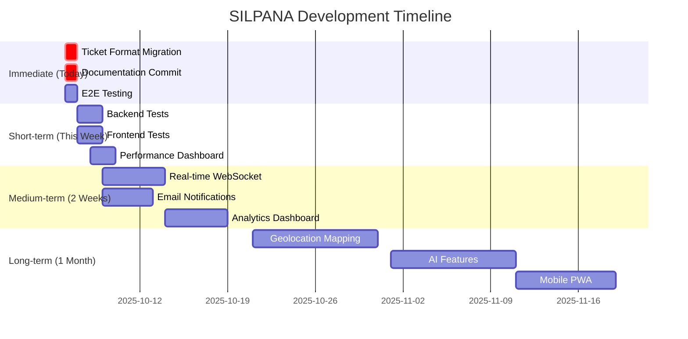

# SILPANA Development Roadmap

**Document**: SILPANA Feature Development & Enhancement Roadmap
**Project Date**: 2025-10-06
**Created**: 2025-10-06
**Version**: 1.0
**Status**: 🚀 Ready
**Priority**: 📈 High
**Language**: English
**Audience**: Development Team
**Type**: Planning & Strategy

## Executive Summary

Strategic roadmap for SILPANA ticketing system development, prioritizing critical fixes, feature enhancements, and performance optimizations. This document outlines immediate actions, short-term improvements, and long-term strategic initiatives to deliver a world-class civil records management system with AI assistance.

## Current State Assessment

### ✅ Completed Features

| Feature | Status | Performance | Notes |
|---------|--------|-------------|-------|
| **Ticket Creation** | ✅ Complete | 28ms avg | Go backend integration |
| **Ticket Lookup** | ⚠️ Needs Migration | - | Format mismatch pending fix |
| **Multi-step Form** | ✅ Complete | Excellent UX | Flowbite Phase 3 |
| **Admin Table** | ✅ Complete | Fast rendering | Flowbite Phase 4 |
| **Email Field** | ✅ Complete | Optional | Recently added |
| **Address Field** | ✅ Complete | Optional | Recently added |
| **Flowbite UI** | ✅ Complete | Modern design | All 6 phases done |

### 🚧 In Progress

| Feature | Status | Completion | ETA |
|---------|--------|------------|-----|
| **Ticket Format Fix** | 🔧 Migration Ready | 95% | Today |
| **Documentation** | 📝 Ongoing | 90% | This week |
| **Testing Suite** | 🧪 Partial | 60% | This week |

### ❌ Not Started

| Feature | Priority | Complexity | Dependencies |
|---------|----------|------------|--------------|
| **Real-time WebSocket** | High | Medium | Infrastructure ready |
| **Email Notifications** | High | Low | Email field integrated |
| **Analytics Dashboard** | Medium | High | Database queries needed |
| **Geolocation Mapping** | Low | High | Address field integrated |

## Immediate Actions (Today)

### Priority 1: Apply Ticket Format Migration ⚠️ CRITICAL

**Issue**: Database generates `SILP-2025-000001`, frontend expects `SPL251005XXXXXXXX`

**Impact**: 100% ticket lookup failure rate

**Solution**:

```powershell
# Step 1: Open Supabase SQL Editor
# Step 2: Copy backend/migrations/007_update_ticket_code_format.sql
# Step 3: Execute migration
# Step 4: Verify format

SELECT generate_ticket_code() as test_code;
# Expected: SPL251006XXXXXXXX (today's date)
```

**Verification Checklist**:

- [ ] Migration executed without errors
- [ ] Test code generation returns correct format
- [ ] Create new ticket via form
- [ ] Verify new ticket has correct format
- [ ] Test lookup with new ticket code
- [ ] Confirm no "Format tiket tidak valid" errors

**Time Estimate**: 10 minutes

---

### Priority 2: Commit Untracked Documentation

**Files to Commit**:

- `QUICK-FIX-LOOKUP-COLUMN-MISMATCH.md`
- `QUICK-FIX-LOOKUP-DIAGNOSTIC.md`
- `QUICK-FIX-TICKET-FORMAT.md`
- `SILPANA-PUSH-HISTORY-ANALYSIS.md` (this analysis)
- `SILPANA-DEVELOPMENT-ROADMAP.md` (this roadmap)

**Command**:

```powershell
# Stage all new documentation
git add *.md

# Commit with descriptive message
git commit -m "docs(silpana): add comprehensive analysis and quick fix guides"

# Push to current branch
git push origin fix/silpana-ticket-lookup-column-mismatch
```

**Time Estimate**: 5 minutes

---

### Priority 3: End-to-End Testing

**Test Scenario 1: Ticket Creation**:

1. Go to `http://localhost:3000/silpana?mode=form`
2. Fill in form with test data:
   - NIK: `3273052309950003`
   - Name: `Test User`
   - Phone: `085158041223`
   - Email: `test@silpana.local`
   - Address: `Jl. Test No. 123, Jakarta`
   - Category: `Akta Kelahiran`
   - Description: `Test ticket for validation`
3. Submit form
4. **Expected**: Success message with ticket code `SPL251006XXXXXXXX`
5. Copy ticket code

**Test Scenario 2: Ticket Lookup**:

1. Go to `http://localhost:3000/silpana?mode=lookup`
2. Enter ticket code from Scenario 1
3. Enter phone: `085158041223`
4. Click "Cari Tiket"
5. **Expected**: Ticket details displayed with all fields including email and address

**Test Scenario 3: Backend API**:

```powershell
# Test ticket lookup via API
$body = @{
    code = "SPL251006XXXXXXXX"  # Use actual code from test
    requester_phone = "085158041223"
    requester_nik = "3273052309950003"
} | ConvertTo-Json

Invoke-RestMethod -Uri "http://localhost:8080/api/v1/silpana/tickets/lookup" `
                  -Method POST `
                  -Body $body `
                  -ContentType "application/json"
```

**Expected**: JSON response with ticket details

**Time Estimate**: 15 minutes

---

## Short-Term Improvements (This Week)

### Feature 1: Backend Integration Tests

**Objective**: Ensure service reliability with comprehensive test coverage

**Implementation**:

```go
// File: backend/test/integration/silpana_test.go

package integration_test

import (
    "context"
    "testing"
    "github.com/stretchr/testify/assert"
    "backend/internal/services/silpana"
)

func TestCreateTicket(t *testing.T) {
    // Test ticket creation
    req := &silpana.CreateTicketRequest{
        RequesterName:  "Test User",
        RequesterNIK:   "3273052309950003",
        RequesterPhone: "085158041223",
        DocumentType:   "Akta Kelahiran",
        Purpose:        "Test purpose",
    }
    
    response, err := silpanaService.CreateTicket(context.Background(), req)
    
    assert.NoError(t, err)
    assert.NotEmpty(t, response.Ticket.Code)
    assert.Regexp(t, `^SPL\d{6}[0-9A-F]{8}$`, response.Ticket.Code)
}

func TestLookupTicket(t *testing.T) {
    // Test ticket lookup with various authentication combinations
    tests := []struct {
        name  string
        phone string
        nik   string
        valid bool
    }{
        {"Phone only", "085158041223", "", true},
        {"NIK only", "", "3273052309950003", true},
        {"Both", "085158041223", "3273052309950003", true},
        {"Wrong phone", "085158041224", "", false},
        {"Neither", "", "", false},
    }
    
    for _, tt := range tests {
        t.Run(tt.name, func(t *testing.T) {
            req := &silpana.TicketLookupRequest{
                Code:          testTicketCode,
                RequesterPhone: tt.phone,
                RequesterNIK:   tt.nik,
            }
            
            response, err := silpanaService.LookupTicket(context.Background(), req)
            
            if tt.valid {
                assert.NoError(t, err)
                assert.NotNil(t, response.Ticket)
            } else {
                assert.Error(t, err)
            }
        })
    }
}

func TestEmailAndAddressFields(t *testing.T) {
    // Test optional email and address fields
    req := &silpana.CreateTicketRequest{
        RequesterName:    "Test User",
        RequesterNIK:     "3273052309950003",
        RequesterPhone:   "085158041223",
        RequesterEmail:   "test@example.com",
        RequesterAddress: "Jl. Test No. 123",
        DocumentType:     "Akta Kelahiran",
        Purpose:          "Test purpose",
    }
    
    response, err := silpanaService.CreateTicket(context.Background(), req)
    
    assert.NoError(t, err)
    assert.Equal(t, "test@example.com", response.Ticket.RequesterEmail)
    assert.Equal(t, "Jl. Test No. 123", response.Ticket.RequesterAddress)
}
```

**Files to Create**:

- `backend/test/integration/silpana_test.go` - Integration tests
- `backend/test/unit/silpana_service_test.go` - Unit tests
- `backend/test/fixtures/silpana_fixtures.go` - Test data

**Commands**:

```powershell
# Run integration tests
cd backend
go test ./test/integration/... -v

# Run unit tests
go test ./internal/services/silpana/... -v

# Run all tests with coverage
go test ./... -cover -coverprofile=coverage.out
go tool cover -html=coverage.out -o coverage.html
```

**Success Criteria**:

- [ ] 80%+ test coverage for SILPANA service
- [ ] All critical paths tested
- [ ] Edge cases covered (null values, invalid data)
- [ ] Performance tests added

**Time Estimate**: 4-6 hours

---

### Feature 2: Frontend Component Tests

**Objective**: Ensure UI components work correctly with all field combinations

**Implementation**:

```typescript
// File: frontend/src/__tests__/silpana/SilpanaForm.test.tsx

import { render, screen, fireEvent, waitFor } from '@testing-library/react';
import SilpanaForm from '@/components/silpana/SilpanaForm';

describe('SilpanaForm', () => {
  it('should render all form fields', () => {
    render(<SilpanaForm />);
    
    expect(screen.getByLabelText(/NIK/i)).toBeInTheDocument();
    expect(screen.getByLabelText(/Nama/i)).toBeInTheDocument();
    expect(screen.getByLabelText(/Nomor Telepon/i)).toBeInTheDocument();
    expect(screen.getByLabelText(/Email/i)).toBeInTheDocument();
    expect(screen.getByLabelText(/Alamat/i)).toBeInTheDocument();
  });

  it('should validate required fields', async () => {
    render(<SilpanaForm />);
    
    const submitButton = screen.getByText(/Kirim/i);
    fireEvent.click(submitButton);
    
    await waitFor(() => {
      expect(screen.getByText(/NIK wajib diisi/i)).toBeInTheDocument();
    });
  });

  it('should accept optional email and address', async () => {
    render(<SilpanaForm />);
    
    // Fill required fields
    fireEvent.change(screen.getByLabelText(/NIK/i), {
      target: { value: '3273052309950003' }
    });
    // ... fill other required fields
    
    // Leave email and address empty
    // Should still allow submission
    
    const submitButton = screen.getByText(/Kirim/i);
    fireEvent.click(submitButton);
    
    await waitFor(() => {
      expect(screen.queryByText(/Email wajib diisi/i)).not.toBeInTheDocument();
      expect(screen.queryByText(/Alamat wajib diisi/i)).not.toBeInTheDocument();
    });
  });

  it('should validate email format', async () => {
    render(<SilpanaForm />);
    
    const emailInput = screen.getByLabelText(/Email/i);
    fireEvent.change(emailInput, { target: { value: 'invalid-email' } });
    fireEvent.blur(emailInput);
    
    await waitFor(() => {
      expect(screen.getByText(/Format email tidak valid/i)).toBeInTheDocument();
    });
  });
});
```

**Commands**:

```powershell
# Run frontend tests
cd frontend
pnpm test

# Run with coverage
pnpm test:coverage

# Run specific test file
pnpm test SilpanaForm.test.tsx
```

**Success Criteria**:

- [ ] All components have tests
- [ ] Form validation tested
- [ ] Optional fields tested
- [ ] Error states covered

**Time Estimate**: 3-4 hours

---

### Feature 3: Performance Monitoring Dashboard

**Objective**: Real-time visibility into SILPANA service performance

**Implementation**:

**1. Add Grafana Dashboard** (already have infrastructure)

```powershell
# Access Grafana
# URL: http://localhost:3001
# Username: admin
# Password: admin
```

**2. Create SILPANA-specific dashboard panels**:

- **Panel 1**: Ticket Creation Rate (tickets/hour)
- **Panel 2**: Lookup Success Rate (%)
- **Panel 3**: Average Response Time (ms)
- **Panel 4**: Cache Hit Ratio (%)
- **Panel 5**: Error Rate by Type

**3. Add backend metrics** (in `backend/internal/services/silpana/service.go`):

```go
// Add to CreateTicket method
s.monitoringService.IncrementCounter("silpana_tickets_created", map[string]string{
    "document_type": req.DocumentType,
    "priority": string(req.Priority),
})

// Add to LookupTicket method
s.monitoringService.IncrementCounter("silpana_lookups_total", map[string]string{
    "auth_method": getAuthMethod(req), // "phone", "nik", or "both"
})

// Track cache hits/misses
s.monitoringService.RecordMetric("silpana_cache_hit_ratio", cacheHitRatio, map[string]string{})
```

**4. Export dashboard configuration**:

```json
// File: backend/monitoring/grafana-silpana-dashboard.json
{
  "dashboard": {
    "title": "SILPANA Service Monitoring",
    "panels": [
      {
        "title": "Ticket Creation Rate",
        "targets": [
          {
            "expr": "rate(silpana_tickets_created[5m])"
          }
        ]
      }
      // ... more panels
    ]
  }
}
```

**Success Criteria**:

- [ ] Grafana dashboard configured
- [ ] All key metrics tracked
- [ ] Alerts configured for anomalies
- [ ] Dashboard accessible by team

**Time Estimate**: 2-3 hours

---

## Medium-Term Features (Next 2 Weeks)

### Feature 1: Real-Time WebSocket Updates

**Status**: Infrastructure ready in `feat/silpana-dev-phase4-realtime` branch

**Objective**: Live ticket status updates without page refresh

**Implementation Plan**:

**Phase 1: Backend WebSocket Hub** (Already Implemented)

- Location: `backend/internal/services/websocket/`
- Features: Room-based broadcasting, auto-reconnect, ping/pong

**Phase 2: SILPANA Integration**

```go
// File: backend/internal/services/silpana/service.go

func (s *Service) UpdateTicketStatus(ctx context.Context, ticketID, newStatus string) error {
    // Update database
    err := s.dbService.Execute(ctx, updateQuery, newStatus, ticketID)
    if err != nil {
        return err
    }
    
    // Broadcast update via WebSocket
    event := &websocket.TicketUpdateEvent{
        TicketID: ticketID,
        Status:   newStatus,
        UpdatedAt: time.Now(),
    }
    s.websocketHub.BroadcastToRoom("ticket-"+ticketID, event)
    
    return nil
}
```

**Phase 3: Frontend Integration**

```typescript
// File: frontend/src/hooks/useTicketUpdates.ts

import { useWebSocket } from '@/lib/websocket/client';

export function useTicketUpdates(ticketCode: string) {
  const { subscribe, unsubscribe } = useWebSocket();
  const [ticketData, setTicketData] = useState<SilpanaData | null>(null);

  useEffect(() => {
    // Subscribe to ticket-specific room
    const handleUpdate = (event: TicketUpdateEvent) => {
      setTicketData(prev => ({
        ...prev,
        ticket_status: event.status,
        updated_at: event.updatedAt,
      }));
    };

    subscribe(`ticket-${ticketCode}`, handleUpdate);

    return () => {
      unsubscribe(`ticket-${ticketCode}`);
    };
  }, [ticketCode]);

  return ticketData;
}
```

**Phase 4: UI Integration**

```tsx
// Update TicketStatusDisplay.tsx to use real-time data
const ticketData = useTicketUpdates(ticket.ticket_code);

return (
  <div>
    <Badge className={getStatusColor(ticketData?.ticket_status)}>
      {ticketData?.ticket_status}
    </Badge>
    <AnimatePresence>
      {isUpdating && (
        <motion.div>
          <Loader2 className="animate-spin" />
          Memperbarui status...
        </motion.div>
      )}
    </AnimatePresence>
  </div>
);
```

**Success Criteria**:

- [ ] WebSocket connection established on ticket lookup
- [ ] Status updates appear instantly (< 100ms latency)
- [ ] Auto-reconnect works on network failure
- [ ] No memory leaks from long-running connections
- [ ] Mobile-friendly (handles background/foreground transitions)

**Time Estimate**: 8-10 hours

---

### Feature 2: Email Notification System

**Objective**: Automated email notifications for ticket lifecycle events

**Implementation**:

**Phase 1: Email Service Integration**

```go
// File: backend/internal/services/email/service.go

type EmailService struct {
    smtpHost     string
    smtpPort     int
    senderEmail  string
    senderName   string
}

func (e *EmailService) SendTicketCreatedEmail(ticket *silpana.SilpanaTicket) error {
    template := `
Halo {{.RequesterName}},

Tiket Anda telah berhasil dibuat!

Kode Tiket: {{.Code}}
Jenis Pengaduan: {{.DocumentType}}
Status: {{.Status}}

Anda dapat melacak status tiket Anda di:
https://selly.go.id/silpana?mode=lookup

Terima kasih,
Tim SILPANA
    `
    
    return e.sendEmail(ticket.RequesterEmail, "Tiket SILPANA Dibuat", template, ticket)
}

func (e *EmailService) SendStatusUpdateEmail(ticket *silpana.SilpanaTicket, oldStatus, newStatus string) error {
    template := `
Halo {{.RequesterName}},

Status tiket Anda telah diperbarui!

Kode Tiket: {{.Code}}
Status Lama: {{.OldStatus}}
Status Baru: {{.NewStatus}}

{{if eq .NewStatus "completed"}}
Catatan Penyelesaian: {{.Notes}}
{{end}}

Lihat detail lengkap di:
https://selly.go.id/silpana?mode=lookup

Terima kasih,
Tim SILPANA
    `
    
    data := struct {
        *silpana.SilpanaTicket
        OldStatus string
    }{ticket, oldStatus}
    
    return e.sendEmail(ticket.RequesterEmail, "Update Status Tiket SILPANA", template, data)
}
```

**Phase 2: Integration with SILPANA Service**

```go
// Update service.go

func (s *Service) CreateTicket(ctx context.Context, req *CreateTicketRequest) (*TicketResponse, error) {
    // ... existing creation logic ...
    
    // Send email notification if email provided
    if ticket.RequesterEmail != "" {
        go func() {
            if err := s.emailService.SendTicketCreatedEmail(ticket); err != nil {
                logrus.WithError(err).Error("Failed to send ticket creation email")
                // Don't fail ticket creation if email fails
            }
        }()
    }
    
    return &TicketResponse{Ticket: ticket, Message: "Ticket created successfully"}, nil
}
```

**Phase 3: Admin Notification Settings**

```typescript
// File: frontend/src/components/silpana/NotificationSettings.tsx

export default function NotificationSettings() {
  const [emailNotifications, setEmailNotifications] = useState(true);
  const [statusUpdates, setStatusUpdates] = useState(true);
  
  return (
    <Card>
      <CardHeader>
        <CardTitle>Pengaturan Notifikasi</CardTitle>
      </CardHeader>
      <CardContent>
        <div className="space-y-4">
          <div className="flex items-center justify-between">
            <Label>Email Notifikasi</Label>
            <Switch
              checked={emailNotifications}
              onCheckedChange={setEmailNotifications}
            />
          </div>
          <div className="flex items-center justify-between">
            <Label>Update Status</Label>
            <Switch
              checked={statusUpdates}
              onCheckedChange={setStatusUpdates}
            />
          </div>
        </div>
      </CardContent>
    </Card>
  );
}
```

**Success Criteria**:

- [ ] Email sent on ticket creation (if email provided)
- [ ] Email sent on status updates
- [ ] Email template is professional and localized (Indonesian)
- [ ] Unsubscribe link included
- [ ] Delivery tracking implemented
- [ ] Rate limiting to prevent spam

**Time Estimate**: 6-8 hours

---

### Feature 3: Enhanced Analytics Dashboard

**Objective**: Data-driven insights for administrators

**Implementation**:

**Phase 1: Analytics Queries**

```sql
-- File: backend/internal/services/analytics/queries.sql

-- Tickets by category (last 30 days)
SELECT 
    jenis_pengaduan as category,
    COUNT(*) as count,
    AVG(EXTRACT(EPOCH FROM (updated_at - created_at))) / 3600 as avg_resolution_hours
FROM silpana
WHERE created_at >= NOW() - INTERVAL '30 days'
GROUP BY jenis_pengaduan
ORDER BY count DESC;

-- Status distribution
SELECT 
    ticket_status as status,
    COUNT(*) as count,
    ROUND(COUNT(*)::numeric / SUM(COUNT(*)) OVER () * 100, 2) as percentage
FROM silpana
GROUP BY ticket_status;

-- Priority trends
SELECT 
    DATE_TRUNC('day', created_at) as date,
    priority_level,
    COUNT(*) as count
FROM silpana
WHERE created_at >= NOW() - INTERVAL '7 days'
GROUP BY date, priority_level
ORDER BY date, priority_level;

-- Response time by priority
SELECT 
    priority_level,
    AVG(EXTRACT(EPOCH FROM (updated_at - created_at))) / 3600 as avg_hours,
    MIN(EXTRACT(EPOCH FROM (updated_at - created_at))) / 3600 as min_hours,
    MAX(EXTRACT(EPOCH FROM (updated_at - created_at))) / 3600 as max_hours
FROM silpana
WHERE ticket_status = 'completed'
GROUP BY priority_level;
```

**Phase 2: Analytics Service**

```go
// File: backend/internal/services/analytics/service.go

type AnalyticsService struct {
    db database.DatabaseService
}

type CategoryStats struct {
    Category           string  `json:"category"`
    Count              int     `json:"count"`
    AvgResolutionHours float64 `json:"avg_resolution_hours"`
}

func (a *AnalyticsService) GetCategoryStats(ctx context.Context, days int) ([]CategoryStats, error) {
    query := `
        SELECT jenis_pengaduan, COUNT(*), 
               AVG(EXTRACT(EPOCH FROM (updated_at - created_at))) / 3600
        FROM silpana
        WHERE created_at >= NOW() - INTERVAL '$1 days'
        GROUP BY jenis_pengaduan
        ORDER BY COUNT(*) DESC
    `
    
    results, err := a.db.Query(ctx, query, days)
    if err != nil {
        return nil, err
    }
    
    // Parse and return results
    // ...
}
```

**Phase 3: Dashboard Component**

```typescript
// File: frontend/src/components/silpana/AnalyticsDashboard.tsx

export default function AnalyticsDashboard() {
  const { data: categoryStats } = useSWR('/api/v1/silpana/analytics/categories', fetcher);
  const { data: statusDistribution } = useSWR('/api/v1/silpana/analytics/status', fetcher);
  
  return (
    <div className="grid grid-cols-1 md:grid-cols-2 lg:grid-cols-3 gap-6">
      {/* Tickets by Category */}
      <Card>
        <CardHeader>
          <CardTitle>Pengaduan per Kategori</CardTitle>
        </CardHeader>
        <CardContent>
          <BarChart data={categoryStats} />
        </CardContent>
      </Card>
      
      {/* Status Distribution */}
      <Card>
        <CardHeader>
          <CardTitle>Distribusi Status</CardTitle>
        </CardHeader>
        <CardContent>
          <PieChart data={statusDistribution} />
        </CardContent>
      </Card>
      
      {/* Average Response Time */}
      <Card>
        <CardHeader>
          <CardTitle>Waktu Respons Rata-rata</CardTitle>
        </CardHeader>
        <CardContent>
          <div className="text-3xl font-bold">
            {averageResponseTime} jam
          </div>
          <Progress value={performancePercentage} />
        </CardContent>
      </Card>
    </div>
  );
}
```

**Success Criteria**:

- [ ] Dashboard shows real-time statistics
- [ ] Charts are interactive and responsive
- [ ] Data refreshes automatically
- [ ] Export to CSV/PDF available
- [ ] Date range filters work
- [ ] Mobile-friendly layout

**Time Estimate**: 10-12 hours

---

## Long-Term Strategic Initiatives (Next Month)

### Initiative 1: Address Geolocation & Mapping

**Objective**: Visualize complaint locations and optimize service routing

**Technologies**:

- **Mapping**: Leaflet.js or Mapbox GL JS
- **Geocoding**: Google Maps Geocoding API or Nominatim (OpenStreetMap)
- **Database**: PostGIS extension for spatial queries

**Implementation**:

```typescript
// File: frontend/src/components/silpana/ComplaintMap.tsx

import { MapContainer, TileLayer, Marker, Popup } from 'react-leaflet';

export default function ComplaintMap({ tickets }: { tickets: SilpanaData[] }) {
  return (
    <MapContainer center={[-6.2088, 106.8456]} zoom={11} className="h-[600px]">
      <TileLayer
        url="https://{s}.tile.openstreetmap.org/{z}/{x}/{y}.png"
        attribution="&copy; OpenStreetMap contributors"
      />
      
      {tickets.map((ticket) => (
        <Marker
          key={ticket.id}
          position={[ticket.latitude, ticket.longitude]}
        >
          <Popup>
            <div>
              <strong>{ticket.ticket_code}</strong>
              <p>{ticket.jenis_pengaduan}</p>
              <p>{ticket.alamat}</p>
              <Badge>{ticket.ticket_status}</Badge>
            </div>
          </Popup>
        </Marker>
      ))}
    </MapContainer>
  );
}
```

**Features**:

- [ ] Geocode addresses to lat/lng coordinates
- [ ] Display tickets on interactive map
- [ ] Cluster markers for better visualization
- [ ] Heat map for high-complaint areas
- [ ] Route optimization for field staff
- [ ] Distance-based assignment

**Time Estimate**: 15-20 hours

---

### Initiative 2: AI-Powered Features

**Objective**: Leverage AI to improve user experience and efficiency

**Features**:

1. **Smart Category Classification**
   - Auto-suggest category based on description
   - Use existing chat AI service
   - Train on historical data

2. **Sentiment Analysis**
   - Detect urgent/critical tickets from description
   - Auto-assign priority based on sentiment
   - Flag potentially escalating issues

3. **Duplicate Detection**
   - Find similar existing tickets
   - Suggest resolution from past cases
   - Reduce duplicate submissions

4. **Smart Responses**
   - AI-generated status update templates
   - Personalized responses based on ticket context
   - Multi-language support

**Implementation Sketch**:

```go
// File: backend/internal/services/ai/silpana_assistant.go

type SILPANAAssistant struct {
    chatService *chat.Service
}

func (a *SILPANAAssistant) ClassifyCategory(description string) (string, float64, error) {
    prompt := fmt.Sprintf(`
Klasifikasikan pengaduan berikut ke salah satu kategori:
- Akta Kelahiran
- Akta Kematian
- KTP
- KK (Kartu Keluarga)
- Lainnya

Pengaduan: "%s"

Jawab dengan format JSON: {"category": "...", "confidence": 0.95}
    `, description)
    
    response, err := a.chatService.Process(prompt)
    if err != nil {
        return "", 0, err
    }
    
    // Parse JSON response
    var result struct {
        Category   string  `json:"category"`
        Confidence float64 `json:"confidence"`
    }
    
    json.Unmarshal([]byte(response), &result)
    return result.Category, result.Confidence, nil
}

func (a *SILPANAAssistant) DetectUrgency(description string) (string, error) {
    // Analyze sentiment and urgency
    // Return: "low", "medium", "high", "urgent"
}

func (a *SILPANAAssistant) FindSimilarTickets(ctx context.Context, description string) ([]string, error) {
    // Use semantic search to find similar tickets
    // Return ticket IDs
}
```

**Success Criteria**:

- [ ] 90%+ accuracy in category classification
- [ ] 80%+ accuracy in urgency detection
- [ ] <500ms AI processing time
- [ ] Helpful suggestions shown to users
- [ ] Reduces admin workload by 30%

**Time Estimate**: 20-25 hours

---

### Initiative 3: Mobile App (Progressive Web App)

**Objective**: Mobile-first experience for citizens

**Technologies**:

- **PWA**: Next.js built-in PWA support
- **Offline**: Service Workers for offline ticket viewing
- **Push Notifications**: Web Push API for status updates
- **Camera**: Access device camera for document photos

**Implementation**:

```typescript
// File: frontend/next.config.mjs

import withPWA from 'next-pwa';

const config = withPWA({
  dest: 'public',
  register: true,
  skipWaiting: true,
  disable: process.env.NODE_ENV === 'development',
  runtimeCaching: [
    {
      urlPattern: /^https:\/\/api\.selly\.go\.id\/.*$/,
      handler: 'NetworkFirst',
      options: {
        cacheName: 'api-cache',
        expiration: {
          maxEntries: 50,
          maxAgeSeconds: 24 * 60 * 60, // 24 hours
        },
      },
    },
  ],
});

export default config;
```

**Features**:

- [ ] Install prompt for home screen
- [ ] Offline ticket viewing
- [ ] Camera integration for document upload
- [ ] Push notifications for status updates
- [ ] Optimized for touch interfaces
- [ ] Fast loading on slow connections

**Time Estimate**: 15-20 hours

---

## Risk Mitigation

### Technical Risks

| Risk | Impact | Probability | Mitigation |
|------|--------|-------------|------------|
| **Database migration failure** | High | Low | Test on staging, have rollback ready |
| **WebSocket connection stability** | Medium | Medium | Implement fallback to polling |
| **Email delivery issues** | Medium | Medium | Use reliable SMTP provider, queue retries |
| **Performance degradation** | High | Low | Load testing, monitoring, caching |
| **Data loss** | High | Very Low | Regular backups, transaction safety |

### Operational Risks

| Risk | Impact | Probability | Mitigation |
|------|--------|-------------|------------|
| **Increased support load** | Medium | Medium | Clear documentation, FAQ, chatbot |
| **Feature complexity** | Medium | Medium | Iterative development, user testing |
| **Team capacity** | High | Medium | Prioritization, clear roadmap |
| **User adoption** | High | Low | Training, onboarding, support |

## Success Metrics

### Technical Metrics

- **Response Time**: < 50ms average (currently 28ms) ✅
- **Uptime**: > 99.9%
- **Error Rate**: < 0.1% (currently 0%) ✅
- **Cache Hit Ratio**: > 85% (currently optimizing)
- **Test Coverage**: > 80%

### Business Metrics

- **Ticket Creation Rate**: Track trends
- **Lookup Success Rate**: > 95%
- **Average Resolution Time**: Reduce by 20%
- **User Satisfaction**: > 4.5/5 stars
- **Return User Rate**: > 60%

### User Experience Metrics

- **Page Load Time**: < 2 seconds
- **Form Completion Rate**: > 90%
- **Mobile Usage**: Track percentage
- **Feature Adoption**: Track usage of new features

## Resource Requirements

### Development Team

- **Backend Developer**: 1 person, 20 hours/week
- **Frontend Developer**: 1 person, 20 hours/week
- **DevOps Engineer**: 0.5 person, 10 hours/week
- **QA Engineer**: 0.5 person, 10 hours/week

### Infrastructure

- **Supabase**: Current plan sufficient
- **Redis**: Required for caching (already configured)
- **Email Service**: SendGrid or Amazon SES (~$10-50/month)
- **Monitoring**: Grafana + Prometheus (already configured)

### Tools & Services

- **Development**: VS Code, GitHub, Copilot ✅
- **Testing**: Jest, Go testing, Artillery ✅
- **CI/CD**: GitHub Actions (to be configured)
- **Documentation**: Markdown, Mermaid diagrams ✅

## Timeline Summary



## Conclusion

This roadmap provides a clear path forward for SILPANA development, balancing immediate fixes, short-term improvements, and long-term strategic initiatives. The prioritization ensures critical issues are addressed first while building towards a comprehensive, AI-powered civil records management system.

**Next Actions**:

1. ✅ Apply ticket format migration (TODAY)
2. ✅ Commit documentation (TODAY)
3. ✅ Run E2E tests (TODAY)
4. 📋 Review roadmap with team
5. 🚀 Begin short-term feature development

---

**Last Updated**: 2025-10-06
**Document Owner**: Development Team
**Review Cycle**: Weekly
**Status**: 🚀 Active Development
