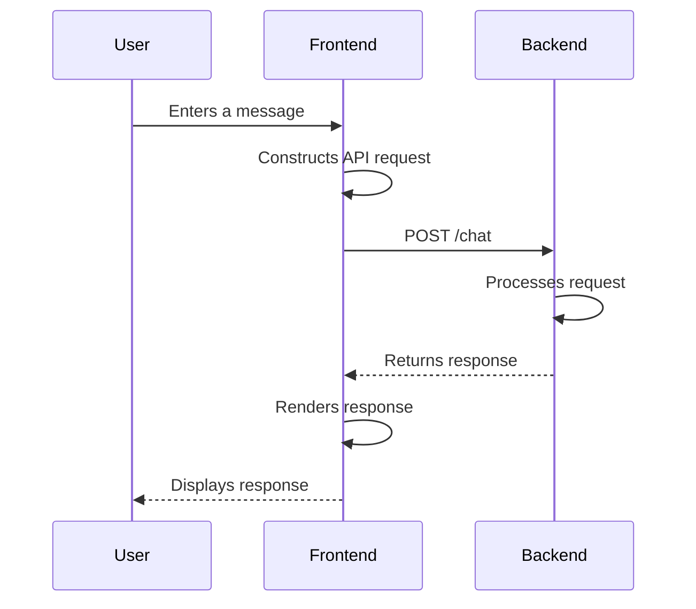
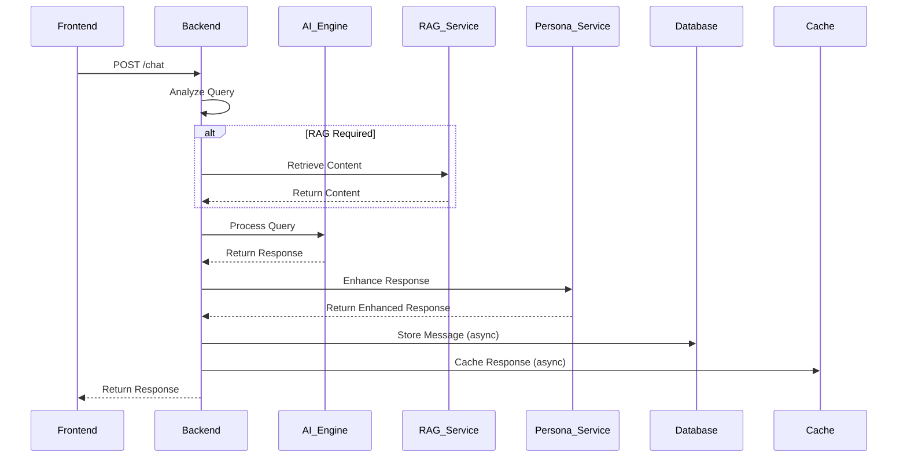
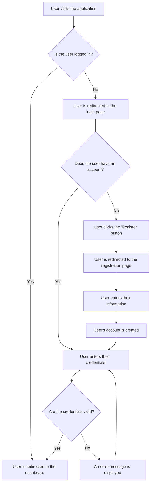

# Comprehensive Documentation for the Selly Application

## Introduction

This document provides a comprehensive analysis of the Selly application, a web-based platform with a Next.js frontend and a Go backend. The application appears to be an AI-powered chatbot designed to assist users with inquiries related to government services, specifically those provided by the Dinas Kependudukan dan Pencatatan Sipil Kabupaten Garut (the Population and Civil Registry Office of Garut Regency).

The application's core functionality is centered around the "Selly AI" assistant, which is capable of understanding and responding to user queries in Indonesian. The AI is designed to be culturally aware and can handle a variety of topics, including birth certificates, death certificates, and family cards.

## Architecture Overview

The Selly application follows a modern, decoupled architecture with a separate frontend and backend.

*   **Frontend**: A Next.js application responsible for the user interface and client-side logic. It communicates with the backend via a RESTful API.
*   **Backend**: A Go application built with the Gin framework. It exposes a set of API endpoints that the frontend consumes. The backend is responsible for processing chat requests, managing user sessions, and integrating with various services, including a database, a cache, and an AI engine.

### Technology Stack

| Category      | Technology                                                                                                                              |
| :------------ | :-------------------------------------------------------------------------------------------------------------------------------------- |
| **Frontend**  | [Next.js](https://nextjs.org/) (v15.4.4), [React](https://react.dev/) (v19.1.0), [Tailwind CSS](https://tailwindcss.com/), [MUI](https://mui.com/), [@tanstack/react-query](https://tanstack.com/query/latest) |
| **Backend**   | [Go](https://go.dev/) (v1.23.0), [Gin](https://gin-gonic.com/), [Supabase](https://supabase.com/), [Redis](https://redis.io/)                                                                 |
| **Database**  | [PostgreSQL](https://www.postgresql.org/) (via Supabase)                                                                                |
| **Caching**   | [Redis](https://redis.io/) (via Upstash)                                                                                                |
| **AI**        | Custom-built engine with Retrieval-Augmented Generation (RAG)                                                                           |
| **Deployment**| Docker                                                                                                                                  |

### High-Level Architecture Diagram

```mermaid
graph TD
    A[User] --> B{Next.js Frontend};
    B --> C{Go Backend (Gin)};
    C --> D[Supabase (PostgreSQL)];
    C --> E[Redis (Upstash)];
    C --> F[AI Engine (RAG)];
```

## Frontend Details

The frontend of the Selly application is a modern Next.js application that uses the App Router for routing and server-side rendering. It is responsible for providing a responsive and interactive user interface for the Selly AI chatbot.

### Code Structure

The frontend code is organized into the following key directories:

*   `src/app`: Contains the application's routes, with each subdirectory representing a different page. The `(protected)` directory contains routes that require authentication.
*   `src/components`: Contains reusable UI components, organized by feature. The `ui` subdirectory contains a set of generic, unstyled components that are used to build the application's design system.
*   `src/services`: Contains the API service layer, which is responsible for making requests to the backend. The `sellyApiService.ts` file is the primary interface for communicating with the backend's chat endpoint.
*   `src/contexts`: Contains React contexts for managing global state, such as the authentication context.

### User Interface

The user interface is built with a combination of Tailwind CSS and MUI components. The application has a clean and modern design, with a focus on usability and accessibility.

### API Integration

The frontend communicates with the backend via a RESTful API. The `sellyApiService.ts` file provides a set of methods for interacting with the backend's chat endpoint. The service includes robust error handling, with features like automatic retries and intelligent fallbacks for when the backend is unavailable.

### Frontend Workflow Diagram



## Backend Details

The backend of the Selly application is a Go application built with the Gin framework. It is responsible for processing chat requests, managing user sessions, and integrating with various services, including a database, a cache, and an AI engine.

### Code Structure

The backend code is organized into the following key directories:

*   `internal/api`: Contains the API layer, which is responsible for defining the application's routes and handlers.
*   `internal/services`: Contains the business logic of the application, with each subdirectory representing a different service. The `chat` service is the core of the application and is responsible for processing chat requests.
*   `internal/infrastructure`: Contains the infrastructure layer, which is responsible for integrating with external services like the database and the cache.

### API Endpoints

The backend exposes a set of RESTful API endpoints that the frontend consumes. The primary endpoint is `/chat`, which is used to process chat requests. The backend also provides endpoints for authentication, health checks, and metrics.

### Business Logic

The core of the backend's business logic is in the `chat` service. This service is responsible for the following:

*   **Query Analysis**: The service analyzes incoming user queries to determine the user's intent and whether a RAG (Retrieval-Augmented Generation) retrieval is required.
*   **RAG Retrieval**: If a RAG retrieval is required, the service retrieves relevant content from a knowledge base.
*   **AI Processing**: The service uses a high-performance AI engine to generate a response to the user's query.
*   **Persona Enhancement**: The service applies a "Selly" persona to the AI's response to make it more engaging and culturally appropriate.
*   **Session Management**: The service manages user sessions to provide a personalized and contextualized experience.

### Backend Workflow Diagram



## Features

The Selly application provides the following key features:

*   **AI-Powered Chatbot**: The core feature of the application is the "Selly AI" assistant, which is capable of understanding and responding to user queries in Indonesian.
*   **Government Service Information**: The chatbot is specifically designed to provide information about government services, such as birth certificates, death certificates, and family cards.
*   **Culturally-Aware Responses**: The AI is designed to be culturally aware and can provide responses that are appropriate for the Indonesian context.
*   **Personalized Experience**: The application uses session management to provide a personalized and contextualized experience for each user.
*   **Admin Dashboard**: The application includes an admin dashboard for managing users and monitoring the application.

## Workflow Diagrams

### User Registration and Login



## Dependencies

A complete list of frontend and backend dependencies can be found in `frontend/package.json` and `backend/go.mod`, respectively.

## Setup Instructions

### Frontend

1.  Navigate to the `frontend` directory.
2.  Install the dependencies with `pnpm install`.
3.  Run the development server with `pnpm run dev`.

### Backend

1.  Navigate to the `backend` directory.
2.  Install the dependencies with `go mod tidy`.
3.  Run the development server with `go run ./cmd/server/main.go`.

## Testing Guide

### Frontend

The frontend uses Jest and React Testing Library for testing. To run the tests, navigate to the `frontend` directory and run `pnpm test`.

### Backend

The backend uses the standard Go testing package and the `testify` library for assertions. To run the tests, navigate to the `backend` directory and run `go test ./...`.

## Security Audit

*   **Authentication**: The application uses JWTs for authentication, which is a secure and industry-standard approach.
*   **Input Sanitization**: The backend should implement proper input sanitization to prevent SQL injection and other attacks.
*   **Cross-Site Scripting (XSS)**: The frontend should be audited for XSS vulnerabilities.
*   **Cross-Site Request Forgery (CSRF)**: The application should implement CSRF protection.

## Potential Improvements

*   **Internationalization**: The application could be internationalized to support multiple languages.
*   **Real-time Chat**: The application could be improved by adding real-time chat functionality with WebSockets.
*   **Expanded Knowledge Base**: The AI's knowledge base could be expanded to cover a wider range of government services.
*   **CI/CD Pipeline**: A CI/CD pipeline could be implemented to automate the testing and deployment process.

## Glossary

*   **AI**: Artificial Intelligence
*   **API**: Application Programming Interface
*   **CSRF**: Cross-Site Request Forgery
*   **JWT**: JSON Web Token
*   **RAG**: Retrieval-Augmented Generation
*   **UI**: User Interface
*   **XSS**: Cross-Site Scripting
