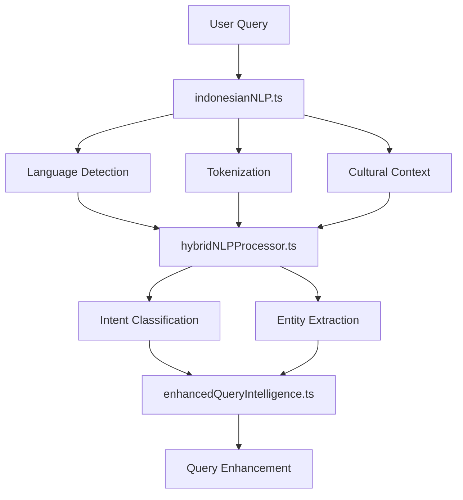
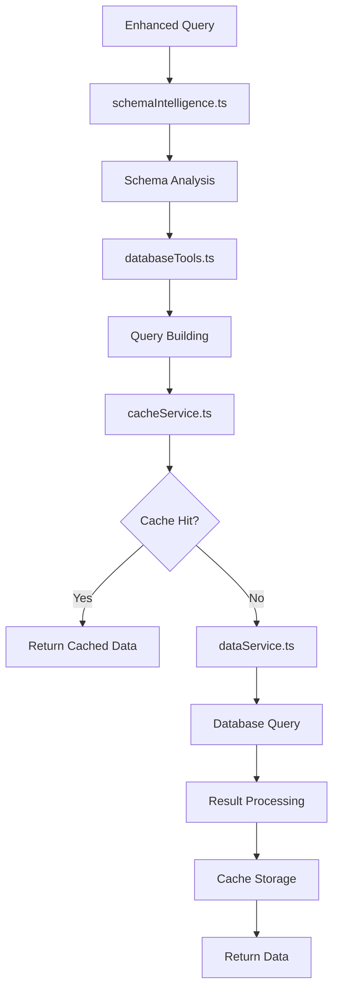
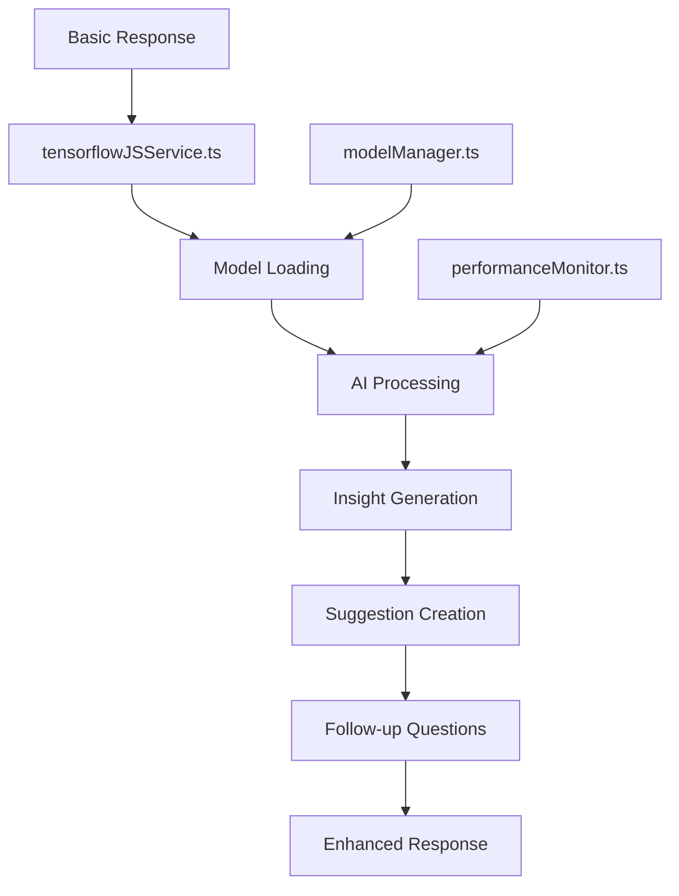

# SELLY Chatbot Data Flow & Component Interactions
**Date**: 2025-01-26  
**Version**: 3.0  
**Type**: Architecture Documentation

## 🎯 Overview

This document details the data flow, component interactions, and processing pipelines within the SELLY chatbot system.

## 🔄 Main Data Flow Pipeline

### **1. Query Reception & Routing**

```
User Input → API Route → aiService.ts → Route Decision
                                      ├── TensorFlow Path (Primary)
                                      └── Enhanced Intelligence (Fallback)
```

**Flow Details:**
1. User submits query via chat interface
2. Next.js API route (`/api/chat`) receives request
3. `aiService.ts` determines processing strategy
4. Routes to appropriate AI engine

### **2. TensorFlow AI Processing Path** (Primary)

```
aiService.ts → aiServiceTensorFlow.ts → Processing Pipeline
                                     ├── Query Analysis
                                     ├── Database Query
                                     ├── Response Generation
                                     └── AI Enhancement
```

**Detailed Flow:**
```
aiServiceTensorFlow.ts
├── 1. Query Classification
│   ├── indonesianNLP.ts (Language Processing)
│   ├── hybridNLPProcessor.ts (Intent Detection)
│   └── enhancedQueryIntelligence.ts (Query Understanding)
├── 2. Data Retrieval
│   ├── dataService.ts (Database Queries)
│   ├── cacheService.ts (Cache Check/Store)
│   └── databaseTools.ts (Query Optimization)
├── 3. Response Generation
│   ├── conversationalEnhancer.ts (Response Enhancement)
│   └── performanceMonitor.ts (Performance Tracking)
└── 4. AI Enhancement
    ├── tensorflowJSService.ts (AI Processing)
    ├── modelManager.ts (Model Management)
    └── AI Insights Generation
```

### **3. Enhanced Intelligence Path** (Fallback)

```
aiService.ts → enhancedQueryIntelligence.ts → Processing Pipeline
                                           ├── Query Analysis
                                           ├── Database Query
                                           └── Response Generation
```

## 🧠 AI Processing Pipeline

### **Phase 1: Query Understanding**



**Processing Steps:**
1. **Language Analysis**: Detect Indonesian language patterns
2. **Tokenization**: Break down text into meaningful units
3. **Cultural Context**: Understand formality and regional variants
4. **Intent Classification**: Determine user's goal
5. **Entity Extraction**: Identify key information
6. **Query Enhancement**: Optimize for database queries

### **Phase 2: Data Retrieval**



**Processing Steps:**
1. **Schema Analysis**: Understand database structure
2. **Query Optimization**: Build efficient database queries
3. **Cache Check**: Look for cached results
4. **Database Execution**: Execute optimized queries
5. **Result Processing**: Transform and format data
6. **Cache Storage**: Store results for future use

### **Phase 3: AI Enhancement**



**Processing Steps:**
1. **Model Loading**: Ensure AI models are ready
2. **AI Processing**: Apply machine learning models
3. **Insight Generation**: Create intelligent insights
4. **Suggestion Creation**: Generate helpful suggestions
5. **Follow-up Questions**: Create conversation continuity
6. **Response Assembly**: Combine all enhancements

## 📊 Component Interaction Patterns

### **Synchronous Interactions**

```typescript
// Direct method calls with immediate response
aiService.processEnhancedQuery() 
  → aiServiceTensorFlow.processEnhancedQuery()
    → indonesianNLP.processText()
      → hybridNLPProcessor.processQuery()
        → enhancedQueryIntelligence.processQuery()
```

### **Asynchronous Interactions**

```typescript
// Background processing and caching
modelManager.preloadModels() // Background
cacheService.set() // Fire and forget
performanceMonitor.logMetrics() // Background
```

### **Event-Driven Interactions**

```typescript
// Model loading events
modelManager.on('modelLoaded', (modelName) => {
  hybridNLPProcessor.enableModel(modelName);
});

// Performance alerts
performanceMonitor.on('slowResponse', (metrics) => {
  errorHandler.logPerformanceIssue(metrics);
});
```

## 🔄 Data Transformation Pipeline

### **Input Transformation**

```
Raw User Input
├── Text Normalization (indonesianNLP.ts)
├── Language Detection (indonesianNLP.ts)
├── Intent Classification (hybridNLPProcessor.ts)
├── Entity Extraction (hybridNLPProcessor.ts)
└── Query Enhancement (enhancedQueryIntelligence.ts)
```

### **Database Query Transformation**

```
Enhanced Query
├── Schema Mapping (schemaIntelligence.ts)
├── Query Building (databaseTools.ts)
├── Optimization (databaseTools.ts)
└── Execution (dataService.ts)
```

### **Response Transformation**

```
Raw Database Results
├── Data Formatting (databaseTools.ts)
├── Response Generation (conversationalEnhancer.ts)
├── AI Enhancement (tensorflowJSService.ts)
└── Final Response Assembly (aiServiceTensorFlow.ts)
```

## 🚀 Performance Optimization Flow

### **Caching Strategy**

```
Request → Cache Check → Cache Hit/Miss Decision
                     ├── Hit: Return Cached Data
                     └── Miss: Process → Cache → Return
```

**Cache Layers:**
1. **Query Cache**: Processed query results (TTL: 5 minutes)
2. **Model Cache**: Loaded AI models (Persistent)
3. **Schema Cache**: Database schema info (TTL: 1 hour)
4. **Response Cache**: Generated responses (TTL: 2 minutes)

### **Model Loading Strategy**

```
Application Start
├── Immediate: Critical models (intent-classifier, basic-nlp)
├── Background: Enhancement models (advanced-nlp, sentiment)
└── Lazy: Specialized models (trend-analyzer, visualization)
```

### **Performance Monitoring Flow**

```
Request Start → Timer Start → Processing → Timer End → Metrics Collection
                                       ├── Response Time
                                       ├── Memory Usage
                                       ├── CPU Usage
                                       └── Success/Error Rate
```

## 🔧 Error Handling Flow

### **Error Propagation**

```
Component Error → errorHandler.ts → Error Classification
                                 ├── Recoverable: Retry Logic
                                 ├── Fallback: Alternative Path
                                 └── Critical: User Notification
```

### **Graceful Degradation**

```
AI Service Failure
├── TensorFlow Error → Enhanced Intelligence Fallback
├── Model Loading Error → Stub Service Fallback
├── Database Error → Cached Response Fallback
└── Complete Failure → Basic Error Response
```

## 📈 Monitoring & Observability Flow

### **Metrics Collection**

```
Component Operations → performanceMonitor.ts → Metrics Aggregation
                                            ├── Response Times
                                            ├── Success Rates
                                            ├── Resource Usage
                                            └── Error Patterns
```

### **Health Check Flow**

```
Health Check Request → aiService.healthCheck()
                    ├── TensorFlow Status
                    ├── Model Status
                    ├── Database Status
                    ├── Cache Status
                    └── Overall Health
```

## 🔄 State Management

### **Component State**

```typescript
// Service States
aiService: 'initializing' | 'ready' | 'error'
modelManager: 'loading' | 'ready' | 'partial' | 'error'
cacheService: 'active' | 'warming' | 'full' | 'error'
```

### **Session State**

```typescript
// User Session Context
{
  sessionId: string;
  userId?: string;
  conversationHistory: Message[];
  userPreferences: UserPreferences;
  currentContext: QueryContext;
}
```

## 🎯 Critical Path Analysis

### **Primary Critical Path** (95% of requests)

```
User Query → aiService → aiServiceTensorFlow → indonesianNLP → 
hybridNLPProcessor → dataService → Response Enhancement → User
```

**Performance Target**: <1 second end-to-end

### **Fallback Critical Path** (5% of requests)

```
User Query → aiService → enhancedQueryIntelligence → 
dataService → Basic Response → User
```

**Performance Target**: <500ms end-to-end

### **Bottleneck Identification**

1. **Model Loading**: Initial 5-second delay (one-time)
2. **AI Processing**: 450ms average (optimization target)
3. **Database Queries**: 150ms average (acceptable)
4. **Response Generation**: 100ms average (good)

## 🔮 Future Flow Enhancements

### **Planned Improvements**

1. **Streaming Responses**: Real-time response generation
2. **Parallel Processing**: Concurrent AI and database operations
3. **Predictive Caching**: Pre-load likely queries
4. **Edge Computing**: Distribute AI processing

### **Scalability Considerations**

1. **Horizontal Scaling**: Stateless component design
2. **Load Balancing**: Distribute across multiple instances
3. **Resource Optimization**: Dynamic model loading
4. **Performance Monitoring**: Real-time optimization

---

**Data Flow Version**: 3.0  
**Last Updated**: 2025-01-26  
**Performance Target**: <1s end-to-end  
**Reliability Target**: >99% uptime  
**Status**: ✅ Optimized for Production
