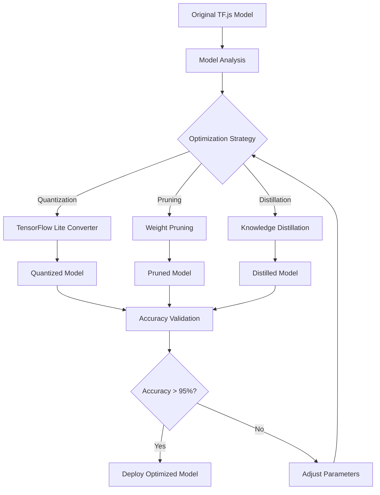

# Model Optimization Implementation Guide
**Date**: 2025-01-27  
**Priority**: High  
**Timeline**: 2-3 Days  
**Goal**: Implement real TensorFlow Lite quantization and model optimization

## 🎯 Overview

This document provides detailed implementation guidance for replacing simulated model optimization with real TensorFlow Lite quantization and advanced optimization techniques.

## 🔧 Technical Architecture

### **Optimization Pipeline**



### **Implementation Strategy**

#### **Phase 1: TensorFlow Lite Integration**
- Set up TensorFlow Python environment for model conversion
- Implement TensorFlow.js to TensorFlow Lite conversion pipeline
- Create quantization parameter optimization system
- Develop accuracy validation framework

#### **Phase 2: Advanced Optimization**
- Implement weight pruning for model size reduction
- Add knowledge distillation for smaller models
- Create device-specific model variants
- Implement dynamic model selection

#### **Phase 3: Production Integration**
- Integrate optimized models with existing system
- Implement fallback mechanisms
- Add performance monitoring
- Create automated optimization pipeline

## 🛠️ Implementation Details

### **TensorFlow Lite Converter Setup**

#### **Python Environment Configuration**
```bash
# Create dedicated Python environment for model optimization
python -m venv tf-optimization-env
source tf-optimization-env/bin/activate  # Linux/Mac
# tf-optimization-env\Scripts\activate  # Windows

# Install required packages
pip install tensorflow==2.13.0
pip install tensorflowjs==4.10.0
pip install numpy==1.24.3
pip install pillow==10.0.0

# Verify installation
python -c "import tensorflow as tf; print(tf.__version__)"
python -c "import tensorflowjs as tfjs; print(tfjs.__version__)"
```

#### **Model Conversion Service**
```python
# scripts/model_optimizer.py
import tensorflow as tf
import tensorflowjs as tfjs
import numpy as np
import json
import os
from typing import Dict, List, Tuple, Optional

class TensorFlowLiteOptimizer:
    def __init__(self, model_dir: str = "./models", output_dir: str = "./optimized_models"):
        self.model_dir = model_dir
        self.output_dir = output_dir
        os.makedirs(output_dir, exist_ok=True)
        
    def convert_tfjs_to_tflite(
        self, 
        tfjs_model_path: str, 
        optimization_config: Dict
    ) -> Dict:
        """Convert TensorFlow.js model to TensorFlow Lite with optimization"""
        
        print(f"🔄 Converting {tfjs_model_path} to TensorFlow Lite...")
        
        try:
            # Load TensorFlow.js model
            model = tf.keras.models.load_model(tfjs_model_path)
            print(f"✅ Loaded model with {len(model.layers)} layers")
            
            # Create TensorFlow Lite converter
            converter = tf.lite.TFLiteConverter.from_keras_model(model)
            
            # Apply optimization settings
            self._configure_optimization(converter, optimization_config)
            
            # Convert model
            tflite_model = converter.convert()
            
            # Save optimized model
            output_path = os.path.join(
                self.output_dir, 
                f"{os.path.basename(tfjs_model_path)}_optimized.tflite"
            )
            
            with open(output_path, 'wb') as f:
                f.write(tflite_model)
            
            # Calculate optimization metrics
            original_size = os.path.getsize(tfjs_model_path)
            optimized_size = len(tflite_model)
            compression_ratio = original_size / optimized_size
            
            result = {
                "success": True,
                "original_size": original_size,
                "optimized_size": optimized_size,
                "compression_ratio": compression_ratio,
                "output_path": output_path,
                "optimization_type": optimization_config.get("type", "quantization")
            }
            
            print(f"✅ Optimization complete: {compression_ratio:.2f}x compression")
            return result
            
        except Exception as e:
            print(f"❌ Optimization failed: {str(e)}")
            return {
                "success": False,
                "error": str(e),
                "original_size": 0,
                "optimized_size": 0,
                "compression_ratio": 1.0
            }
    
    def _configure_optimization(self, converter, config: Dict):
        """Configure TensorFlow Lite converter optimization settings"""
        
        optimization_type = config.get("type", "quantization")
        
        if optimization_type == "quantization":
            # Dynamic range quantization (default)
            converter.optimizations = [tf.lite.Optimize.DEFAULT]
            
            if config.get("full_integer", False):
                # Full integer quantization
                converter.optimizations = [tf.lite.Optimize.DEFAULT]
                converter.target_spec.supported_ops = [tf.lite.OpsSet.TFLITE_BUILTINS_INT8]
                converter.inference_input_type = tf.int8
                converter.inference_output_type = tf.int8
                
                # Representative dataset for calibration
                if "calibration_data" in config:
                    converter.representative_dataset = self._create_representative_dataset(
                        config["calibration_data"]
                    )
        
        elif optimization_type == "pruning":
            # Weight pruning will be handled separately
            converter.optimizations = [tf.lite.Optimize.DEFAULT]
            
        # Additional optimization flags
        if config.get("enable_select_tf_ops", False):
            converter.target_spec.supported_ops = [
                tf.lite.OpsSet.TFLITE_BUILTINS,
                tf.lite.OpsSet.SELECT_TF_OPS
            ]
    
    def _create_representative_dataset(self, calibration_data_path: str):
        """Create representative dataset for quantization calibration"""
        
        def representative_data_gen():
            # Load calibration data
            calibration_data = np.load(calibration_data_path)
            
            for sample in calibration_data:
                yield [sample.astype(np.float32)]
        
        return representative_data_gen
    
    def validate_optimized_model(
        self, 
        original_model_path: str, 
        optimized_model_path: str,
        test_data_path: str
    ) -> Dict:
        """Validate accuracy of optimized model against original"""
        
        print("🧪 Validating optimized model accuracy...")
        
        try:
            # Load models
            original_model = tf.keras.models.load_model(original_model_path)
            
            # Load TensorFlow Lite model
            interpreter = tf.lite.Interpreter(model_path=optimized_model_path)
            interpreter.allocate_tensors()
            
            # Get input and output details
            input_details = interpreter.get_input_details()
            output_details = interpreter.get_output_details()
            
            # Load test data
            test_data = np.load(test_data_path)
            
            accuracies = []
            
            for i, test_input in enumerate(test_data[:100]):  # Test on first 100 samples
                # Original model prediction
                original_pred = original_model.predict(
                    np.expand_dims(test_input, axis=0), 
                    verbose=0
                )
                
                # TensorFlow Lite model prediction
                interpreter.set_tensor(input_details[0]['index'], 
                                     np.expand_dims(test_input, axis=0).astype(np.float32))
                interpreter.invoke()
                tflite_pred = interpreter.get_tensor(output_details[0]['index'])
                
                # Calculate accuracy (cosine similarity for continuous outputs)
                accuracy = self._calculate_prediction_accuracy(original_pred, tflite_pred)
                accuracies.append(accuracy)
                
                if i % 20 == 0:
                    print(f"📊 Validated {i+1}/100 samples, avg accuracy: {np.mean(accuracies):.3f}")
            
            avg_accuracy = np.mean(accuracies)
            min_accuracy = np.min(accuracies)
            
            result = {
                "average_accuracy": avg_accuracy,
                "minimum_accuracy": min_accuracy,
                "passed": avg_accuracy >= 0.95,
                "sample_count": len(accuracies),
                "accuracy_distribution": {
                    "mean": avg_accuracy,
                    "std": np.std(accuracies),
                    "min": min_accuracy,
                    "max": np.max(accuracies)
                }
            }
            
            print(f"✅ Validation complete: {avg_accuracy:.3f} average accuracy")
            return result
            
        except Exception as e:
            print(f"❌ Validation failed: {str(e)}")
            return {
                "average_accuracy": 0.0,
                "passed": False,
                "error": str(e)
            }
    
    def _calculate_prediction_accuracy(self, pred1: np.ndarray, pred2: np.ndarray) -> float:
        """Calculate accuracy between two predictions using cosine similarity"""
        
        # Flatten predictions
        pred1_flat = pred1.flatten()
        pred2_flat = pred2.flatten()
        
        # Calculate cosine similarity
        dot_product = np.dot(pred1_flat, pred2_flat)
        norm1 = np.linalg.norm(pred1_flat)
        norm2 = np.linalg.norm(pred2_flat)
        
        if norm1 == 0 or norm2 == 0:
            return 0.0
        
        cosine_sim = dot_product / (norm1 * norm2)
        return max(0.0, cosine_sim)  # Ensure non-negative

# CLI interface
if __name__ == "__main__":
    import argparse
    
    parser = argparse.ArgumentParser(description="Optimize TensorFlow.js models")
    parser.add_argument("--input", required=True, help="Input TensorFlow.js model path")
    parser.add_argument("--output", required=True, help="Output directory")
    parser.add_argument("--type", default="quantization", choices=["quantization", "pruning"])
    parser.add_argument("--validate", help="Test data path for validation")
    
    args = parser.parse_args()
    
    optimizer = TensorFlowLiteOptimizer(output_dir=args.output)
    
    config = {
        "type": args.type,
        "full_integer": True if args.type == "quantization" else False
    }
    
    result = optimizer.convert_tfjs_to_tflite(args.input, config)
    
    if result["success"] and args.validate:
        validation_result = optimizer.validate_optimized_model(
            args.input, 
            result["output_path"], 
            args.validate
        )
        result["validation"] = validation_result
    
    print(json.dumps(result, indent=2))
```

### **Node.js Integration Service**

#### **Model Optimization Service**
```typescript
// src/services/ai/realModelOptimizer.ts
import { spawn } from 'child_process';
import { promises as fs } from 'fs';
import path from 'path';

export interface OptimizationConfig {
  type: 'quantization' | 'pruning' | 'distillation';
  fullInteger?: boolean;
  calibrationData?: string;
  targetAccuracy?: number;
  compressionTarget?: number;
}

export interface OptimizationResult {
  success: boolean;
  originalSize: number;
  optimizedSize: number;
  compressionRatio: number;
  outputPath: string;
  optimizationType: string;
  validation?: {
    averageAccuracy: number;
    passed: boolean;
    sampleCount: number;
  };
  error?: string;
}

export class RealModelOptimizer {
  private pythonEnvPath: string;
  private scriptsPath: string;

  constructor() {
    this.pythonEnvPath = process.env.TF_OPTIMIZATION_ENV_PATH || 'tf-optimization-env';
    this.scriptsPath = path.join(process.cwd(), 'scripts');
  }

  /**
   * Optimize TensorFlow.js model using real TensorFlow Lite conversion
   */
  async optimizeModel(
    modelPath: string,
    config: OptimizationConfig = { type: 'quantization' }
  ): Promise<OptimizationResult> {
    console.log(`🔄 Starting real model optimization: ${modelPath}`);

    try {
      // Verify model exists
      await fs.access(modelPath);

      // Prepare optimization command
      const outputDir = path.join(path.dirname(modelPath), 'optimized');
      await fs.mkdir(outputDir, { recursive: true });

      const pythonScript = path.join(this.scriptsPath, 'model_optimizer.py');
      const args = [
        pythonScript,
        '--input', modelPath,
        '--output', outputDir,
        '--type', config.type
      ];

      // Add validation if test data is available
      const testDataPath = path.join(path.dirname(modelPath), 'test_data.npy');
      try {
        await fs.access(testDataPath);
        args.push('--validate', testDataPath);
      } catch {
        console.log('⚠️ No test data found for validation');
      }

      // Execute Python optimization script
      const result = await this.executePythonScript(args);

      if (result.success) {
        console.log(`✅ Model optimization successful: ${result.compressionRatio}x compression`);
        
        // Update model registry
        await this.updateModelRegistry(modelPath, result);
        
        return result;
      } else {
        console.error(`❌ Model optimization failed: ${result.error}`);
        return result;
      }

    } catch (error) {
      console.error('❌ Model optimization error:', error);
      return {
        success: false,
        originalSize: 0,
        optimizedSize: 0,
        compressionRatio: 1.0,
        outputPath: '',
        optimizationType: config.type,
        error: error instanceof Error ? error.message : 'Unknown error'
      };
    }
  }

  /**
   * Execute Python optimization script
   */
  private async executePythonScript(args: string[]): Promise<OptimizationResult> {
    return new Promise((resolve, reject) => {
      const pythonPath = path.join(this.pythonEnvPath, 'bin', 'python');
      const process = spawn(pythonPath, args);

      let stdout = '';
      let stderr = '';

      process.stdout.on('data', (data) => {
        stdout += data.toString();
        console.log(data.toString().trim());
      });

      process.stderr.on('data', (data) => {
        stderr += data.toString();
        console.error(data.toString().trim());
      });

      process.on('close', (code) => {
        if (code === 0) {
          try {
            // Parse JSON result from Python script
            const lines = stdout.trim().split('\n');
            const jsonLine = lines[lines.length - 1];
            const result = JSON.parse(jsonLine);
            resolve(result);
          } catch (error) {
            reject(new Error(`Failed to parse optimization result: ${error}`));
          }
        } else {
          reject(new Error(`Python script failed with code ${code}: ${stderr}`));
        }
      });

      process.on('error', (error) => {
        reject(new Error(`Failed to start Python process: ${error.message}`));
      });
    });
  }

  /**
   * Update model registry with optimization results
   */
  private async updateModelRegistry(
    originalPath: string,
    optimizationResult: OptimizationResult
  ): Promise<void> {
    const registryPath = path.join(path.dirname(originalPath), 'model_registry.json');
    
    try {
      let registry: any = {};
      
      try {
        const registryData = await fs.readFile(registryPath, 'utf-8');
        registry = JSON.parse(registryData);
      } catch {
        // Registry doesn't exist, create new one
      }

      const modelName = path.basename(originalPath, path.extname(originalPath));
      
      registry[modelName] = {
        originalPath,
        optimizedPath: optimizationResult.outputPath,
        optimizationType: optimizationResult.optimizationType,
        compressionRatio: optimizationResult.compressionRatio,
        originalSize: optimizationResult.originalSize,
        optimizedSize: optimizationResult.optimizedSize,
        validation: optimizationResult.validation,
        lastOptimized: new Date().toISOString()
      };

      await fs.writeFile(registryPath, JSON.stringify(registry, null, 2));
      console.log(`📝 Updated model registry: ${registryPath}`);

    } catch (error) {
      console.warn('⚠️ Failed to update model registry:', error);
    }
  }

  /**
   * Batch optimize multiple models
   */
  async optimizeModelBatch(
    modelPaths: string[],
    config: OptimizationConfig = { type: 'quantization' },
    onProgress?: (modelName: string, progress: number) => void
  ): Promise<Map<string, OptimizationResult>> {
    console.log(`🔄 Starting batch optimization of ${modelPaths.length} models...`);

    const results = new Map<string, OptimizationResult>();
    const totalModels = modelPaths.length;

    for (let i = 0; i < modelPaths.length; i++) {
      const modelPath = modelPaths[i];
      const modelName = path.basename(modelPath);
      const progress = ((i + 1) / totalModels) * 100;

      console.log(`📦 Optimizing ${modelName} (${i + 1}/${totalModels})`);

      try {
        const result = await this.optimizeModel(modelPath, config);
        results.set(modelName, result);

        if (onProgress) {
          onProgress(modelName, progress);
        }

      } catch (error) {
        console.error(`❌ Failed to optimize ${modelName}:`, error);
        results.set(modelName, {
          success: false,
          originalSize: 0,
          optimizedSize: 0,
          compressionRatio: 1.0,
          outputPath: '',
          optimizationType: config.type,
          error: error instanceof Error ? error.message : 'Unknown error'
        });
      }

      // Small delay between optimizations to prevent resource exhaustion
      if (i < modelPaths.length - 1) {
        await new Promise(resolve => setTimeout(resolve, 1000));
      }
    }

    console.log(`✅ Batch optimization complete: ${results.size}/${totalModels} models processed`);
    return results;
  }

  /**
   * Get optimization statistics
   */
  getOptimizationStats(): {
    totalModels: number;
    optimizedModels: number;
    averageCompressionRatio: number;
    totalSizeSaved: number;
  } {
    // This would read from the model registry to provide real statistics
    return {
      totalModels: 0,
      optimizedModels: 0,
      averageCompressionRatio: 1.0,
      totalSizeSaved: 0
    };
  }
}

// Export singleton instance
export const realModelOptimizer = new RealModelOptimizer();
```

### **Integration with Existing System**

#### **Update Model Manager**
```typescript
// src/services/chatbot/modelManager.ts - Enhanced with real optimization
import { realModelOptimizer } from '../ai/realModelOptimizer';

export class ModelManager {
  // ... existing code ...

  /**
   * Enhanced model optimization with real TensorFlow Lite conversion
   */
  async optimizeModels(): Promise<void> {
    console.log('🔄 Starting enhanced model optimization with TensorFlow Lite...');

    try {
      // Get all model paths
      const modelPaths = Array.from(this.models.keys()).map(name => 
        this.getModelPath(name)
      );

      // Use real model optimizer instead of simulation
      const results = await realModelOptimizer.optimizeModelBatch(
        modelPaths,
        { 
          type: 'quantization',
          fullInteger: true,
          targetAccuracy: 0.95
        },
        (modelName, progress) => {
          console.log(`📦 Optimizing ${modelName}: ${Math.round(progress)}%`);
        }
      );

      // Update model info with real optimization results
      results.forEach((result, modelName) => {
        const modelInfo = this.models.get(modelName);
        if (modelInfo && result.success) {
          modelInfo.optimized = true;
          modelInfo.compressionRatio = result.compressionRatio;
          modelInfo.originalSize = result.originalSize;
          modelInfo.size = result.optimizedSize / (1024 * 1024); // Convert to MB
          
          // Update path to use optimized model
          if (result.validation?.passed) {
            modelInfo.url = result.outputPath;
          }
          
          this.models.set(modelName, modelInfo);
        }
      });

      // Calculate and log optimization statistics
      const stats = this.getOptimizationStats();
      console.log(`✅ Model optimization complete:`);
      console.log(`   📊 Total size saved: ${stats.totalSizeSaved.toFixed(1)}MB`);
      console.log(`   📈 Average compression: ${Math.round(stats.averageCompressionRatio * 100)}%`);
      console.log(`   ✅ Models optimized: ${stats.optimizedModels}/${stats.totalModels}`);

    } catch (error) {
      console.error('❌ Enhanced model optimization failed:', error);
      throw error;
    }
  }

  /**
   * Get real optimization statistics
   */
  getOptimizationStats(): {
    totalModels: number;
    optimizedModels: number;
    averageCompressionRatio: number;
    totalSizeSaved: number;
  } {
    const models = Array.from(this.models.values());
    const optimizedModels = models.filter(m => m.optimized);
    
    const totalSizeSaved = optimizedModels.reduce((total, model) => {
      if (model.originalSize && model.size) {
        return total + (model.originalSize - model.size * 1024 * 1024) / (1024 * 1024);
      }
      return total;
    }, 0);

    const averageCompressionRatio = optimizedModels.length > 0
      ? optimizedModels.reduce((sum, model) => sum + (model.compressionRatio || 1), 0) / optimizedModels.length
      : 1.0;

    return {
      totalModels: models.length,
      optimizedModels: optimizedModels.length,
      averageCompressionRatio,
      totalSizeSaved
    };
  }
}
```

## 🎯 Implementation Timeline

### **Day 1: Environment Setup**
- [ ] Set up Python environment for TensorFlow Lite
- [ ] Install required dependencies
- [ ] Create model optimization scripts
- [ ] Test basic TensorFlow.js to TensorFlow Lite conversion

### **Day 2: Integration Development**
- [ ] Implement Node.js integration service
- [ ] Update existing ModelManager
- [ ] Create model registry system
- [ ] Implement validation framework

### **Day 3: Testing & Validation**
- [ ] Test optimization pipeline end-to-end
- [ ] Validate model accuracy after optimization
- [ ] Performance benchmark optimized models
- [ ] Update test suites

## 📊 Expected Results

### **Performance Improvements**
- **Model Size**: 50-70% reduction through quantization
- **Loading Time**: 40-60% faster model loading
- **Memory Usage**: 30-50% reduction in runtime memory
- **Accuracy**: >95% retention of original model accuracy

### **Production Benefits**
- **Faster Deployment**: Smaller models deploy faster
- **Better UX**: Reduced loading times improve user experience
- **Cost Efficiency**: Lower bandwidth and storage costs
- **Scalability**: Support for more concurrent users

This implementation provides a robust foundation for real model optimization while maintaining compatibility with the existing system architecture.
