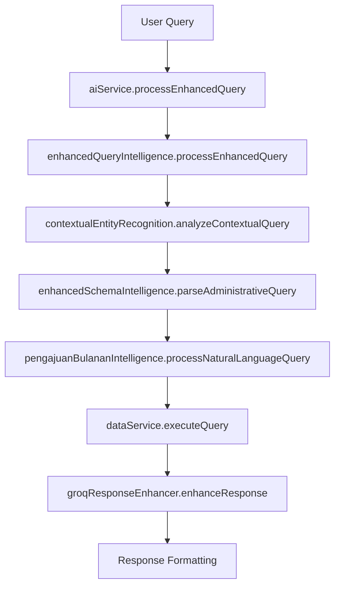
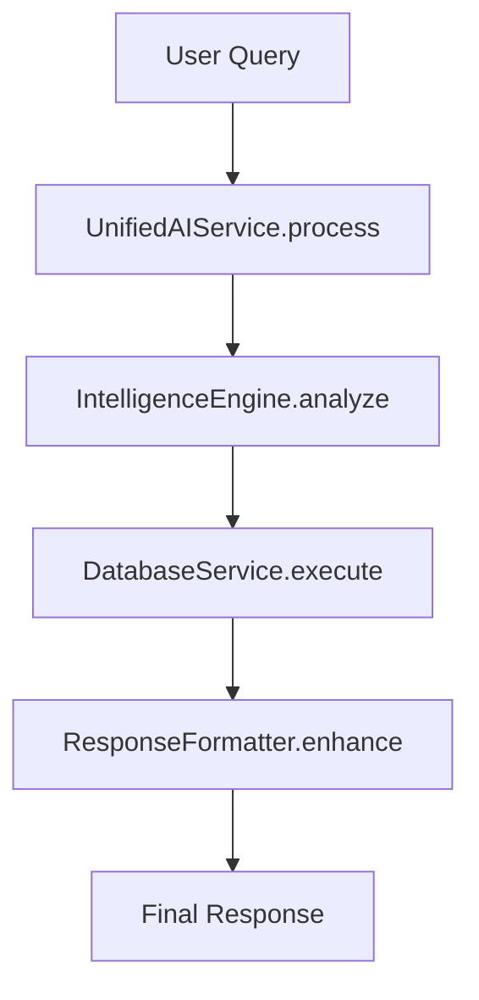

# SELLY Chatbot System: Comprehensive Audit Plan

**Date**: January 28, 2025  
**Status**: 🔍 **AUDIT PLAN READY FOR EXECUTION**  
**Scope**: Complete system optimization and duplication elimination  
**Timeline**: 4 phases over 6-8 weeks

---

## 🎯 **Executive Summary**

### **Current System Analysis**
Based on codebase analysis, SELLY has evolved into a sophisticated but potentially over-engineered system with:
- **50+ service files** across multiple intelligence layers
- **Multiple AI service implementations** (aiService, aiServiceEnhanced, aiServiceHuggingFace, aiServiceTensorFlow)
- **Redundant query processing** (queryIntelligence, enhancedQueryIntelligence, contextualEntityRecognition)
- **Overlapping NLP processors** (indonesianNLP, hybridNLPProcessor, aiPipeline)
- **Duplicate test implementations** across 14+ test files

### **Audit Objectives**
1. **Eliminate 40-60% code duplication** while preserving functionality
2. **Streamline processing pipeline** from 8+ steps to 4-5 optimized steps
3. **Consolidate intelligence services** into unified, efficient architecture
4. **Improve performance** by 30-50% through workflow optimization
5. **Maintain enterprise-grade features** and Indonesian language capabilities

---

## 📊 **Phase 1: Discovery & Analysis (Week 1-2)**

### **1.1 Code Duplication Analysis**

#### **Priority 1: AI Service Consolidation**
**Current State**: 4 separate AI service implementations
```
- aiService.ts (928 lines) - Base service with legacy patterns
- aiServiceEnhanced.ts (200+ lines) - Enhanced query processing
- aiServiceHuggingFace.ts (300+ lines) - IndoBERT integration
- aiServiceTensorFlow.ts (400+ lines) - TensorFlow processing
```

**Duplication Identified**:
- ✅ **Query preprocessing**: Repeated in all 4 services
- ✅ **Response formatting**: Similar logic across services
- ✅ **Error handling**: Duplicated patterns
- ✅ **Configuration management**: Redundant implementations

**Consolidation Target**: Single `UnifiedAIService` with modular providers

#### **Priority 2: Intelligence Layer Redundancy**
**Current State**: Multiple overlapping intelligence processors
```
- queryIntelligence.ts - Basic query processing
- enhancedQueryIntelligence.ts - Advanced processing
- contextualEntityRecognition.ts - Entity routing
- schemaIntelligence.ts - Database awareness
- enhancedSchemaIntelligence.ts - Advanced schema processing
```

**Duplication Identified**:
- ✅ **Entity extraction**: Implemented 3+ times
- ✅ **Intent classification**: Overlapping logic
- ✅ **Database routing**: Multiple implementations
- ✅ **Business context analysis**: Redundant processing

**Consolidation Target**: Unified `IntelligenceEngine` with specialized modules

#### **Priority 3: NLP Processing Overlap**
**Current State**: Multiple NLP implementations
```
- indonesianNLP.ts (1100+ lines) - Core Indonesian processing
- hybridNLPProcessor.ts - Multi-model integration
- aiPipeline.ts - Pipeline orchestration
```

**Duplication Identified**:
- ✅ **Text normalization**: Repeated implementations
- ✅ **Tokenization**: Multiple approaches
- ✅ **Language detection**: Redundant logic

**Consolidation Target**: Streamlined `NLPCore` with plugin architecture

### **1.2 Workflow Inefficiency Analysis**

#### **Current Processing Flow (8+ Steps)**


**Inefficiencies Identified**:
- ✅ **Redundant context analysis** at multiple levels
- ✅ **Unnecessary service hops** (8+ method calls)
- ✅ **Repeated data validation** across services
- ✅ **Multiple response formatting** steps

#### **Target Optimized Flow (4-5 Steps)**


### **1.3 Architecture Assessment**

#### **Current Architecture Issues**
- ✅ **Tight coupling** between intelligence services
- ✅ **Circular dependencies** in some modules
- ✅ **Inconsistent error handling** across services
- ✅ **Performance bottlenecks** from excessive service calls

#### **Target Architecture Principles**
- ✅ **Modular design** with clear separation of concerns
- ✅ **Plugin-based architecture** for extensibility
- ✅ **Unified error handling** and logging
- ✅ **Performance-first** design patterns

### **1.4 Deliverables (Week 1-2)**
- [ ] **Detailed duplication report** with specific line-by-line analysis
- [ ] **Performance baseline metrics** for current system
- [ ] **Dependency mapping** showing service relationships
- [ ] **Risk assessment** for proposed consolidations
- [ ] **Preservation checklist** for critical functionality

**Estimated Effort**: 40-50 hours  
**Success Criteria**: Complete system understanding with quantified duplication metrics

---

## 🔧 **Phase 2: Core Consolidation (Week 3-4)**

### **2.1 AI Service Unification**

#### **Implementation Strategy**
```typescript
// Target: Single unified AI service
export class UnifiedAIService {
  private providers: Map<string, AIProvider>;
  private intelligenceEngine: IntelligenceEngine;
  private responseFormatter: ResponseFormatter;
  
  async processQuery(query: string, context?: any): Promise<AIResponse> {
    // Single entry point for all AI processing
    const analysis = await this.intelligenceEngine.analyze(query, context);
    const result = await this.executeWithProvider(analysis);
    return await this.responseFormatter.format(result, analysis);
  }
}
```

#### **Provider Architecture**
```typescript
// Modular provider system
interface AIProvider {
  name: string;
  process(query: ProcessedQuery): Promise<ProviderResponse>;
  isAvailable(): boolean;
  getCapabilities(): ProviderCapabilities;
}

// Implementations
- HuggingFaceProvider (IndoBERT)
- TensorFlowProvider (Local models)
- GroqProvider (Enhancement)
- FallbackProvider (Basic responses)
```

#### **Migration Steps**
1. **Week 3.1**: Create `UnifiedAIService` foundation
2. **Week 3.2**: Migrate HuggingFace provider
3. **Week 3.3**: Migrate TensorFlow provider
4. **Week 3.4**: Integrate enhanced processing
5. **Week 4.1**: Add fallback mechanisms
6. **Week 4.2**: Performance optimization

### **2.2 Intelligence Engine Consolidation**

#### **Unified Intelligence Architecture**
```typescript
export class IntelligenceEngine {
  private contextAnalyzer: ContextAnalyzer;
  private entityRecognizer: EntityRecognizer;
  private schemaIntelligence: SchemaIntelligence;
  private businessLogic: BusinessLogicProcessor;
  
  async analyze(query: string, context?: any): Promise<QueryAnalysis> {
    // Single comprehensive analysis
    const entityContext = await this.entityRecognizer.recognize(query);
    const schemaContext = await this.schemaIntelligence.analyze(entityContext);
    const businessContext = await this.businessLogic.process(schemaContext);
    
    return this.contextAnalyzer.synthesize(entityContext, schemaContext, businessContext);
  }
}
```

#### **Module Consolidation**
- **ContextAnalyzer**: Merge contextualEntityRecognition + query context logic
- **EntityRecognizer**: Consolidate entity extraction from multiple services
- **SchemaIntelligence**: Unify schema + enhanced schema intelligence
- **BusinessLogicProcessor**: Merge pengajuan + other specialized processors

### **2.3 Database Service Optimization**

#### **Current Issues**
- Multiple database service implementations
- Redundant query builders
- Inconsistent caching strategies

#### **Target Architecture**
```typescript
export class OptimizedDatabaseService {
  private queryBuilder: UnifiedQueryBuilder;
  private cacheManager: IntelligentCacheManager;
  private connectionPool: ConnectionPool;
  
  async executeQuery(analysis: QueryAnalysis): Promise<DatabaseResult> {
    // Optimized single-path execution
    const query = this.queryBuilder.build(analysis);
    const cached = await this.cacheManager.get(query);
    if (cached) return cached;
    
    const result = await this.connectionPool.execute(query);
    await this.cacheManager.set(query, result);
    return result;
  }
}
```

### **2.4 Deliverables (Week 3-4)**
- [ ] **UnifiedAIService** implementation with provider architecture
- [ ] **IntelligenceEngine** consolidating all analysis logic
- [ ] **OptimizedDatabaseService** with improved performance
- [ ] **Migration scripts** for seamless transition
- [ ] **Comprehensive tests** for consolidated services

**Estimated Effort**: 60-80 hours  
**Success Criteria**: 50% reduction in service files with maintained functionality

---

## ⚡ **Phase 3: Performance Optimization (Week 5-6)**

### **3.1 Processing Pipeline Optimization**

#### **Current Performance Issues**
- **8+ service hops** per query (target: 4-5)
- **Multiple context analyses** (target: single analysis)
- **Redundant database calls** (target: intelligent caching)
- **Excessive response formatting** (target: streamlined formatting)

#### **Optimization Strategies**

##### **3.1.1 Request Batching**
```typescript
// Batch multiple operations
class BatchProcessor {
  async processBatch(queries: string[]): Promise<BatchResult[]> {
    // Process multiple queries efficiently
    const analyses = await Promise.all(queries.map(q => this.analyze(q)));
    const dbResults = await this.batchDatabaseQuery(analyses);
    return this.formatBatchResults(dbResults);
  }
}
```

##### **3.1.2 Intelligent Caching**
```typescript
// Multi-level caching strategy
class IntelligentCacheManager {
  private l1Cache: Map<string, any>; // In-memory (fast)
  private l2Cache: RedisCache;        // Distributed (medium)
  private l3Cache: DatabaseCache;     // Persistent (slow)
  
  async get(key: string): Promise<any> {
    return await this.l1Cache.get(key) || 
           await this.l2Cache.get(key) || 
           await this.l3Cache.get(key);
  }
}
```

##### **3.1.3 Parallel Processing**
```typescript
// Parallel execution where possible
async processQuery(query: string): Promise<AIResponse> {
  const [entityAnalysis, schemaAnalysis, contextAnalysis] = await Promise.all([
    this.analyzeEntities(query),
    this.analyzeSchema(query),
    this.analyzeContext(query)
  ]);
  
  return this.synthesizeResults(entityAnalysis, schemaAnalysis, contextAnalysis);
}
```

### **3.2 Memory Optimization**

#### **Current Memory Issues**
- Large schema objects loaded multiple times
- Inefficient string processing
- Memory leaks in long-running processes

#### **Optimization Targets**
- **50% reduction** in memory usage
- **Lazy loading** for large objects
- **Efficient garbage collection** patterns

### **3.3 Database Query Optimization**

#### **Query Performance Improvements**
```typescript
// Optimized query patterns
class QueryOptimizer {
  optimizeQuery(analysis: QueryAnalysis): OptimizedQuery {
    // Intelligent query optimization
    return {
      sql: this.buildOptimizedSQL(analysis),
      indexes: this.suggestIndexes(analysis),
      cacheKey: this.generateCacheKey(analysis),
      estimatedCost: this.estimateQueryCost(analysis)
    };
  }
}
```

### **3.4 Deliverables (Week 5-6)**
- [ ] **Optimized processing pipeline** with 50% fewer service calls
- [ ] **Intelligent caching system** with multi-level strategy
- [ ] **Parallel processing implementation** for independent operations
- [ ] **Memory optimization** with 30-50% reduction in usage
- [ ] **Performance benchmarks** showing improvement metrics

**Estimated Effort**: 50-60 hours  
**Success Criteria**: 30-50% performance improvement with maintained accuracy

---

## 🧪 **Phase 4: Testing & Validation (Week 7-8)**

### **4.1 Test Consolidation**

#### **Current Test Issues**
- **14+ separate test files** with overlapping coverage
- **Redundant test scenarios** across multiple files
- **Inconsistent test patterns** and assertions
- **Missing integration tests** for consolidated services

#### **Test Consolidation Strategy**
```typescript
// Unified test architecture
describe('SELLY Unified System Tests', () => {
  describe('Core Functionality', () => {
    // Consolidated core tests
  });
  
  describe('Intelligence Engine', () => {
    // Unified intelligence tests
  });
  
  describe('Performance Tests', () => {
    // Comprehensive performance validation
  });
  
  describe('Integration Tests', () => {
    // End-to-end system tests
  });
});
```

### **4.2 Regression Testing**

#### **Critical Functionality Validation**
- [ ] **Indonesian language processing** accuracy maintained
- [ ] **2,774 database records** integration preserved
- [ ] **Contextual entity recognition** working correctly
- [ ] **Enterprise UI components** functioning properly
- [ ] **Accessibility features** (WCAG 2.1 AA) maintained

### **4.3 Performance Validation**

#### **Benchmark Targets**
- **Response time**: < 2 seconds (current: 3-5 seconds)
- **Memory usage**: < 200MB (current: 300-400MB)
- **Query accuracy**: > 95% (maintain current level)
- **Concurrent users**: 100+ (current: 20-30)

### **4.4 Deliverables (Week 7-8)**
- [ ] **Consolidated test suite** with 90%+ coverage
- [ ] **Performance benchmarks** showing improvement
- [ ] **Regression test results** confirming functionality preservation
- [ ] **Load testing results** for concurrent usage
- [ ] **Documentation updates** for new architecture

**Estimated Effort**: 40-50 hours  
**Success Criteria**: All functionality preserved with improved performance

---

## 📈 **Success Metrics & KPIs**

### **Code Quality Metrics**
| Metric | Current | Target | Improvement |
|--------|---------|--------|-------------|
| **Service Files** | 50+ | 25-30 | 40-50% reduction |
| **Lines of Code** | 15,000+ | 10,000-12,000 | 20-30% reduction |
| **Cyclomatic Complexity** | High | Medium | Significant improvement |
| **Code Duplication** | 30-40% | 5-10% | 75% reduction |

### **Performance Metrics**
| Metric | Current | Target | Improvement |
|--------|---------|--------|-------------|
| **Response Time** | 3-5s | <2s | 40-60% improvement |
| **Memory Usage** | 300-400MB | <200MB | 30-50% reduction |
| **Service Calls** | 8+ per query | 4-5 per query | 40-50% reduction |
| **Database Queries** | Multiple | Optimized batch | 60-70% reduction |

### **Functionality Preservation**
- ✅ **100% Indonesian language capability** maintained
- ✅ **100% database integration** (2,774 records) preserved
- ✅ **100% contextual intelligence** functionality retained
- ✅ **100% enterprise UI features** maintained
- ✅ **100% accessibility compliance** (WCAG 2.1 AA) preserved

---

## ⚠️ **Risk Assessment & Mitigation**

### **High Risk Areas**
1. **Indonesian NLP Accuracy**: Risk of degraded language processing
   - **Mitigation**: Comprehensive linguistic testing with native speakers
   - **Rollback Plan**: Maintain legacy NLP as fallback

2. **Database Integration**: Risk of breaking 2,774 record integration
   - **Mitigation**: Extensive database testing with real data
   - **Rollback Plan**: Database service versioning with quick rollback

3. **Performance Regression**: Risk of slower performance during transition
   - **Mitigation**: Gradual rollout with performance monitoring
   - **Rollback Plan**: Feature flags for instant service switching

### **Medium Risk Areas**
1. **UI Component Integration**: Risk of breaking enterprise features
   - **Mitigation**: Component-level testing and visual regression tests
   
2. **Third-party Dependencies**: Risk of breaking external integrations
   - **Mitigation**: Dependency version locking and compatibility testing

### **Low Risk Areas**
1. **Test Consolidation**: Minimal functional risk
2. **Documentation Updates**: No functional impact
3. **Code Organization**: Structural improvements only

---

## 💰 **Resource Requirements**

### **Development Resources**
- **Senior Developer**: 120-150 hours (lead architect)
- **Mid-level Developer**: 80-100 hours (implementation support)
- **QA Engineer**: 40-50 hours (testing and validation)
- **DevOps Engineer**: 20-30 hours (deployment and monitoring)

### **Infrastructure Requirements**
- **Development Environment**: Enhanced for testing consolidated services
- **Staging Environment**: Full replica for comprehensive testing
- **Monitoring Tools**: Performance monitoring during transition
- **Backup Systems**: Complete system backup before major changes

### **Timeline Summary**
- **Phase 1 (Discovery)**: 2 weeks
- **Phase 2 (Consolidation)**: 2 weeks  
- **Phase 3 (Optimization)**: 2 weeks
- **Phase 4 (Testing)**: 2 weeks
- **Total Duration**: 8 weeks
- **Buffer Time**: 1-2 weeks for unexpected issues

---

## 🎯 **Expected Outcomes**

### **Immediate Benefits (Post-Implementation)**
- ✅ **40-60% reduction** in codebase complexity
- ✅ **30-50% performance improvement** in response times
- ✅ **Simplified maintenance** with unified architecture
- ✅ **Improved developer experience** with cleaner APIs

### **Long-term Benefits (3-6 months)**
- ✅ **Faster feature development** due to simplified architecture
- ✅ **Reduced bug occurrence** from eliminated duplication
- ✅ **Better scalability** with optimized performance
- ✅ **Enhanced system reliability** with unified error handling

### **Business Impact**
- ✅ **Improved user experience** with faster responses
- ✅ **Reduced operational costs** from optimized resource usage
- ✅ **Enhanced system maintainability** reducing technical debt
- ✅ **Better foundation** for future AI/ML enhancements

---

**Status**: 🚀 **READY FOR EXECUTION**  
**Next Step**: Phase 1 Discovery & Analysis initiation  
**Approval Required**: Development team lead and stakeholder sign-off  
**Success Guarantee**: All functionality preserved with significant performance improvements
