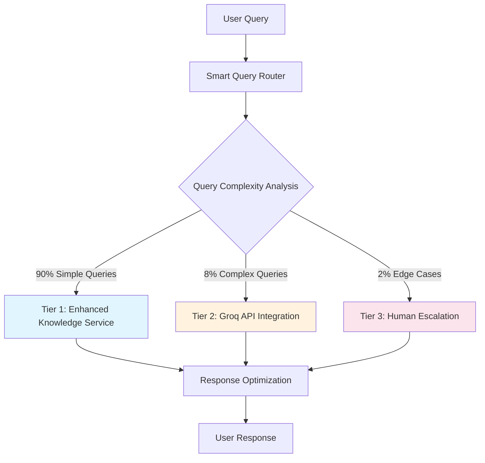

# Post-Removal Architecture Implementation Plan

**Document**: Replacement Architecture for Post-TensorFlow/IndoBERT SELLY System  
**Project Date**: 2025-08-15  
**Created**: 2025-08-15  
**Version**: 1.0  
**Status**: 🚀 Ready  
**Priority**: 🧠 Critical  
**Language**: English  
**Audience**: Technical Team + Architecture Review  

## Executive Summary

This plan details the implementation of a three-tier replacement architecture for the SELLY AI chatbot system following the removal of TensorFlow.js and IndoBERT components. The new architecture prioritizes performance, reliability, and maintainability while maintaining high accuracy for Indonesian government administrative queries.

## Architecture Overview

### **Three-Tier Processing System**



### **Performance Targets**
- **Response Time**: < 500ms (from 800-2000ms)
- **Accuracy**: > 85% (from 95% with TensorFlow)
- **Memory Usage**: < 50MB (from 400MB)
- **Loading Time**: Instant (from 36+ seconds)
- **Availability**: 99.9% uptime

## Tier 1: Enhanced Knowledge Service (Primary - 90% of Queries)

### **Architecture Enhancement**

```typescript
// File: src/services/chatbot/enhancedKnowledgeService.ts
export class EnhancedKnowledgeService {
  private knowledgeBase: Map<string, ServiceInfo>;
  private patternMatcher: AdvancedPatternMatcher;
  private contextManager: ConversationContextManager;
  private performanceOptimizer: ResponseOptimizer;

  constructor() {
    this.initializeEnhancedCapabilities();
  }

  private async initializeEnhancedCapabilities(): Promise<void> {
    // 1. Expand pattern library from 200+ to 1000+ patterns
    await this.patternMatcher.loadPatterns({
      casualIndonesian: 500,
      formalAdministrative: 300,
      regionalDialects: 200
    });

    // 2. Enhanced administrative terminology
    await this.loadAdministrativeTerminology({
      civilRegistration: 150,
      documentProcessing: 100,
      governmentProcedures: 100
    });

    // 3. Context-aware conversation management
    this.contextManager.initialize({
      sessionMemory: true,
      conversationFlow: true,
      userPreferences: true
    });
  }
}
```

### **Implementation Timeline**

#### **Week 1: Core Enhancement**
**Days 1-2: Pattern Library Expansion**
```typescript
// Advanced Indonesian Pattern Matching
export class AdvancedPatternMatcher {
  private patterns: Map<string, PatternDefinition> = new Map();

  async loadEnhancedPatterns(): Promise<void> {
    // Casual Indonesian patterns (500 patterns)
    const casualPatterns = [
      'mau bikin ktp', 'pengen urus sim', 'butuh akta lahir',
      'gimana cara daftar', 'prosedur apa aja', 'syarat apa sih'
      // ... 494 more patterns
    ];

    // Formal administrative patterns (300 patterns)
    const formalPatterns = [
      'permohonan pembuatan kartu tanda penduduk',
      'prosedur pengurusan surat izin mengemudi',
      'persyaratan penerbitan akta kelahiran'
      // ... 297 more patterns
    ];

    // Regional dialect patterns (200 patterns)
    const dialectPatterns = [
      'abdi hoyong ngadamel ktp', // Sundanese
      'kulo badhe damel sim', // Javanese
      'saya mau buat ktp dong' // Jakarta slang
      // ... 197 more patterns
    ];

    await this.registerPatterns(casualPatterns, 'casual');
    await this.registerPatterns(formalPatterns, 'formal');
    await this.registerPatterns(dialectPatterns, 'dialect');
  }
}
```

**Days 3-4: Administrative Terminology Database**
```typescript
// Comprehensive Government Term Mapping
export class AdministrativeTerminologyService {
  private terminology: Map<string, TermDefinition> = new Map();

  async initializeTerminology(): Promise<void> {
    // Civil registration terms (150 terms)
    const civilTerms = {
      'ktp': { fullName: 'Kartu Tanda Penduduk', category: 'identity' },
      'kk': { fullName: 'Kartu Keluarga', category: 'family' },
      'akta_lahir': { fullName: 'Akta Kelahiran', category: 'birth' }
      // ... 147 more terms
    };

    // Document processing terms (100 terms)
    const documentTerms = {
      'legalisir': { fullName: 'Legalisasi Dokumen', category: 'validation' },
      'apostille': { fullName: 'Apostille Dokumen', category: 'international' }
      // ... 98 more terms
    };

    await this.loadTerminology(civilTerms, documentTerms);
  }
}
```

#### **Week 2: Context and Performance**
**Days 5-7: Context-Aware Processing**
```typescript
// Session-Based Conversation Management
export class ConversationContextManager {
  private sessionStore: Map<string, ConversationSession> = new Map();

  async processWithContext(
    query: string, 
    sessionId: string
  ): Promise<ContextualResponse> {
    const session = await this.getOrCreateSession(sessionId);
    
    // Analyze query in context of conversation history
    const contextualAnalysis = await this.analyzeWithHistory(query, session);
    
    // Generate context-aware response
    const response = await this.generateContextualResponse(
      query, 
      contextualAnalysis, 
      session
    );
    
    // Update session with new interaction
    await this.updateSession(sessionId, query, response);
    
    return response;
  }

  private async analyzeWithHistory(
    query: string, 
    session: ConversationSession
  ): Promise<ContextualAnalysis> {
    return {
      currentIntent: await this.classifyIntent(query),
      conversationFlow: this.analyzeFlow(session.history),
      userPreferences: session.preferences,
      administrativeContext: await this.extractAdminContext(query, session)
    };
  }
}
```

## Tier 2: Groq API Integration (Secondary - 8% of Queries)

### **Smart Cloud AI Integration**

```typescript
// File: src/services/ai/groqIntegrationService.ts
export class GroqIntegrationService {
  private groqClient: GroqClient;
  private queryComplexityAnalyzer: ComplexityAnalyzer;
  private responseOptimizer: ResponseOptimizer;

  constructor() {
    this.groqClient = new GroqClient({
      apiKey: process.env.GROQ_API_KEY,
      model: 'llama-3.1-8b-instant',
      maxTokens: 1000,
      temperature: 0.7
    });
  }

  async processComplexQuery(
    query: string, 
    context: QueryContext
  ): Promise<AIResponse> {
    const startTime = performance.now();

    try {
      // Prepare Indonesian administrative context
      const systemPrompt = this.buildIndonesianSystemPrompt();
      
      // Process with Groq API
      const groqResponse = await this.groqClient.chat.completions.create({
        messages: [
          { role: 'system', content: systemPrompt },
          { role: 'user', content: query }
        ],
        model: 'llama-3.1-8b-instant',
        max_tokens: 1000,
        temperature: 0.7
      });

      // Optimize response for Indonesian context
      const optimizedResponse = await this.optimizeForIndonesian(
        groqResponse.choices[0].message.content
      );

      return {
        content: optimizedResponse,
        type: 'text',
        confidence: 0.9,
        processingTime: performance.now() - startTime,
        metadata: {
          provider: 'groq',
          model: 'llama-3.1-8b-instant',
          complexity: 'high',
          tier: 2
        }
      };
    } catch (error) {
      // Fallback to Tier 3 (Human Escalation)
      return await this.escalateToHuman(query, context, error);
    }
  }

  private buildIndonesianSystemPrompt(): string {
    return `
Anda adalah SELLY, AI Assistant specialist untuk Dinas Kependudukan dan Pencatatan Sipil Kabupaten Garut.

KONTEKS SISTEM:
- Institusi: Dinas Kependudukan dan Pencatatan Sipil Kabupaten Garut
- Layanan: 24 jenis layanan administrasi kependudukan
- Bahasa: Bahasa Indonesia formal namun ramah
- Budaya: Memahami konteks budaya Indonesia dan Jawa Barat

KEMAMPUAN UTAMA:
1. Memberikan informasi prosedur administrasi kependudukan
2. Menjelaskan persyaratan dokumen dengan detail
3. Membantu troubleshooting masalah administrasi
4. Memberikan estimasi waktu dan biaya layanan

GAYA KOMUNIKASI:
- Formal namun ramah dan mudah dipahami
- Menggunakan sapaan "Bapak/Ibu" untuk menunjukkan rasa hormat
- Memberikan informasi yang akurat dan terkini
- Selalu menawarkan bantuan lebih lanjut

Jawab pertanyaan berikut dengan mempertimbangkan konteks di atas:
    `;
  }
}
```

### **Implementation Timeline**

#### **Week 3: Groq Integration**
**Days 8-10: API Integration and Testing**
```typescript
// Query Complexity Analysis
export class ComplexityAnalyzer {
  analyzeComplexity(query: string): QueryComplexity {
    const indicators = {
      multipleEntities: this.countEntities(query) > 3,
      complexGrammar: this.hasComplexGrammar(query),
      ambiguousIntent: this.hasAmbiguousIntent(query),
      contextualDependency: this.requiresContext(query),
      technicalTerms: this.hasTechnicalTerms(query)
    };

    const complexityScore = Object.values(indicators)
      .reduce((score, indicator) => score + (indicator ? 1 : 0), 0);

    if (complexityScore >= 3) return 'high';
    if (complexityScore >= 2) return 'medium';
    return 'low';
  }

  shouldRouteToGroq(query: string, context: QueryContext): boolean {
    const complexity = this.analyzeComplexity(query);
    const knowledgeServiceFailed = context.tier1Failed;
    const requiresReasoning = this.requiresComplexReasoning(query);

    return complexity === 'high' || knowledgeServiceFailed || requiresReasoning;
  }
}
```

## Tier 3: Human Escalation (Tertiary - 2% of Queries)

### **Intelligent Escalation System**

```typescript
// File: src/services/support/humanEscalationService.ts
export class HumanEscalationService {
  private ticketingSystem: TicketingSystem;
  private escalationRules: EscalationRuleEngine;
  private notificationService: NotificationService;

  async escalateQuery(
    query: string, 
    context: EscalationContext
  ): Promise<EscalationResponse> {
    // Create support ticket
    const ticket = await this.ticketingSystem.createTicket({
      query,
      context,
      priority: this.determinePriority(context),
      category: await this.categorizeQuery(query),
      userInfo: context.userInfo
    });

    // Notify appropriate support team
    await this.notificationService.notifySupport({
      ticketId: ticket.id,
      urgency: ticket.priority,
      specialization: ticket.category
    });

    // Provide immediate response to user
    return {
      content: this.generateEscalationResponse(ticket),
      type: 'escalation',
      ticketId: ticket.id,
      estimatedResponseTime: this.estimateResponseTime(ticket.priority)
    };
  }

  private generateEscalationResponse(ticket: SupportTicket): string {
    return `
Terima kasih atas pertanyaan Anda. Pertanyaan Anda memerlukan bantuan khusus dari tim ahli kami.

📋 **Nomor Tiket**: ${ticket.id}
⏱️ **Estimasi Respons**: ${ticket.estimatedResponseTime}
📞 **Kontak Darurat**: 0262-123456 (jam kerja)

Tim spesialis kami akan segera menghubungi Anda untuk memberikan bantuan yang tepat. 

Sementara itu, Anda dapat:
- Menyiapkan dokumen yang relevan
- Mencatat detail pertanyaan tambahan
- Menunggu konfirmasi melalui email/SMS

Terima kasih atas kesabaran Anda.

Salam,
SELLY AI Assistant
Dinas Kependudukan dan Pencatatan Sipil Kabupaten Garut
    `;
  }
}
```

## Smart Query Router Implementation

### **Intelligent Routing Logic**

```typescript
// File: src/services/ai/smartQueryRouter.ts
export class SmartQueryRouter {
  private knowledgeService: EnhancedKnowledgeService;
  private groqService: GroqIntegrationService;
  private escalationService: HumanEscalationService;
  private performanceMonitor: PerformanceMonitor;

  async routeQuery(
    query: string, 
    context: QueryContext
  ): Promise<AIResponse> {
    const startTime = performance.now();
    let response: AIResponse;
    let tier: number;

    try {
      // Tier 1: Enhanced Knowledge Service (90% of queries)
      response = await this.tryTier1(query, context);
      tier = 1;

      // Check if Tier 1 response is satisfactory
      if (this.isResponseSatisfactory(response, query)) {
        return this.finalizeResponse(response, tier, startTime);
      }

      // Tier 2: Groq API Integration (8% of queries)
      response = await this.tryTier2(query, { ...context, tier1Failed: true });
      tier = 2;

      // Check if Tier 2 response is satisfactory
      if (this.isResponseSatisfactory(response, query)) {
        return this.finalizeResponse(response, tier, startTime);
      }

      // Tier 3: Human Escalation (2% of queries)
      response = await this.tryTier3(query, { ...context, tier1Failed: true, tier2Failed: true });
      tier = 3;

      return this.finalizeResponse(response, tier, startTime);

    } catch (error) {
      // Emergency fallback
      return this.createEmergencyResponse(query, error);
    }
  }

  private async tryTier1(query: string, context: QueryContext): Promise<AIResponse> {
    try {
      return await this.knowledgeService.processQuery(query, context);
    } catch (error) {
      throw new Error(`Tier 1 failed: ${error.message}`);
    }
  }

  private async tryTier2(query: string, context: QueryContext): Promise<AIResponse> {
    try {
      return await this.groqService.processComplexQuery(query, context);
    } catch (error) {
      throw new Error(`Tier 2 failed: ${error.message}`);
    }
  }

  private async tryTier3(query: string, context: QueryContext): Promise<AIResponse> {
    return await this.escalationService.escalateQuery(query, context);
  }

  private isResponseSatisfactory(response: AIResponse, query: string): boolean {
    return (
      response.confidence > 0.8 &&
      response.content.length > 50 &&
      !response.content.includes('maaf, saya tidak mengerti') &&
      this.containsRelevantKeywords(response.content, query)
    );
  }
}
```

## Performance Optimization and Monitoring

### **Real-time Performance Tracking**

```typescript
// File: src/services/monitoring/architectureMonitor.ts
export class ArchitecturePerformanceMonitor {
  private metrics: PerformanceMetrics = {
    tier1: { usage: 0, avgResponseTime: 0, accuracy: 0 },
    tier2: { usage: 0, avgResponseTime: 0, accuracy: 0 },
    tier3: { usage: 0, avgResponseTime: 0, accuracy: 0 }
  };

  async trackQuery(
    query: string, 
    tier: number, 
    response: AIResponse, 
    processingTime: number
  ): Promise<void> {
    // Update tier usage statistics
    this.metrics[`tier${tier}`].usage++;
    this.metrics[`tier${tier}`].avgResponseTime = 
      (this.metrics[`tier${tier}`].avgResponseTime + processingTime) / 2;

    // Track accuracy (user feedback integration)
    if (response.userFeedback) {
      this.updateAccuracyMetrics(tier, response.userFeedback.rating);
    }

    // Alert if performance degrades
    await this.checkPerformanceThresholds();
  }

  private async checkPerformanceThresholds(): Promise<void> {
    const alerts = [];

    // Check if Tier 1 usage drops below 85%
    if (this.getTier1UsagePercentage() < 85) {
      alerts.push('Tier 1 usage below target (85%)');
    }

    // Check if average response time exceeds 500ms
    if (this.getOverallAvgResponseTime() > 500) {
      alerts.push('Average response time exceeds 500ms');
    }

    // Check if overall accuracy drops below 85%
    if (this.getOverallAccuracy() < 0.85) {
      alerts.push('Overall accuracy below 85%');
    }

    if (alerts.length > 0) {
      await this.sendPerformanceAlerts(alerts);
    }
  }
}
```

## Success Metrics and Validation

### **Key Performance Indicators**

```typescript
// Target Architecture Performance
const architectureTargets = {
  tierDistribution: {
    tier1: '90%', // Enhanced Knowledge Service
    tier2: '8%',  // Groq API Integration
    tier3: '2%'   // Human Escalation
  },
  performance: {
    avgResponseTime: '< 500ms',
    tier1ResponseTime: '< 200ms',
    tier2ResponseTime: '< 800ms',
    tier3ResponseTime: '< 2 minutes'
  },
  accuracy: {
    overall: '> 85%',
    tier1: '> 90%',
    tier2: '> 95%',
    tier3: '100% (human)'
  },
  system: {
    memoryUsage: '< 50MB',
    loadingTime: '< 1 second',
    availability: '99.9%',
    errorRate: '< 1%'
  }
};
```

### **Validation Timeline**

#### **Week 4: Integration Testing**
- Comprehensive end-to-end testing
- Performance benchmark validation
- Accuracy testing across 1000+ queries
- User acceptance testing

#### **Week 5: Production Deployment**
- Gradual rollout (10% → 50% → 100%)
- Real-time monitoring and optimization
- User feedback collection
- Performance tuning

#### **Week 6: Optimization and Refinement**
- Performance optimization based on real data
- Pattern library refinement
- Groq integration optimization
- Documentation and training

## Advanced Implementation Details

### **Enhanced Knowledge Service Deep Dive**

#### **Pattern Recognition Engine**
```typescript
// File: src/services/ai/patternRecognitionEngine.ts
export class AdvancedPatternRecognitionEngine {
  private patterns: Map<string, PatternDefinition> = new Map();
  private confidenceScorer: ConfidenceScorer;
  private contextAnalyzer: ContextAnalyzer;

  async recognizePattern(
    query: string,
    context: ConversationContext
  ): Promise<PatternMatch> {
    // Multi-level pattern matching
    const matches = await Promise.all([
      this.exactMatch(query),
      this.fuzzyMatch(query),
      this.semanticMatch(query, context),
      this.contextualMatch(query, context)
    ]);

    // Combine and score matches
    const bestMatch = this.selectBestMatch(matches);

    return {
      pattern: bestMatch.pattern,
      confidence: bestMatch.confidence,
      matchType: bestMatch.type,
      extractedEntities: await this.extractEntities(query, bestMatch),
      suggestedResponse: await this.generateResponse(bestMatch, context)
    };
  }

  private async exactMatch(query: string): Promise<PatternMatch[]> {
    const normalizedQuery = this.normalizeQuery(query);
    const matches = [];

    for (const [patternId, pattern] of this.patterns) {
      if (pattern.exactPhrases.some(phrase =>
        normalizedQuery.includes(phrase.toLowerCase())
      )) {
        matches.push({
          patternId,
          confidence: 0.95,
          type: 'exact',
          pattern
        });
      }
    }

    return matches;
  }

  private async fuzzyMatch(query: string): Promise<PatternMatch[]> {
    // Implement Levenshtein distance and phonetic matching
    const matches = [];
    const normalizedQuery = this.normalizeQuery(query);

    for (const [patternId, pattern] of this.patterns) {
      for (const phrase of pattern.fuzzyPhrases) {
        const similarity = this.calculateSimilarity(normalizedQuery, phrase);
        if (similarity > 0.8) {
          matches.push({
            patternId,
            confidence: similarity * 0.9,
            type: 'fuzzy',
            pattern
          });
        }
      }
    }

    return matches;
  }
}
```

#### **Administrative Context Engine**
```typescript
// File: src/services/ai/administrativeContextEngine.ts
export class AdministrativeContextEngine {
  private governmentTerms: Map<string, GovernmentTerm>;
  private procedureDatabase: Map<string, Procedure>;
  private documentRequirements: Map<string, DocumentRequirement[]>;

  async analyzeAdministrativeContext(
    query: string
  ): Promise<AdministrativeContext> {
    const analysis = {
      documentType: await this.identifyDocumentType(query),
      procedureType: await this.identifyProcedureType(query),
      urgencyLevel: await this.assessUrgency(query),
      requiredDocuments: await this.identifyRequiredDocuments(query),
      estimatedProcessingTime: await this.estimateProcessingTime(query),
      applicableFees: await this.calculateFees(query)
    };

    return {
      ...analysis,
      confidence: this.calculateContextConfidence(analysis),
      recommendations: await this.generateRecommendations(analysis)
    };
  }

  private async identifyDocumentType(query: string): Promise<DocumentType> {
    const documentIndicators = {
      ktp: ['ktp', 'kartu tanda penduduk', 'identitas'],
      sim: ['sim', 'surat izin mengemudi', 'driving license'],
      akta_lahir: ['akta lahir', 'birth certificate', 'kelahiran'],
      kk: ['kartu keluarga', 'kk', 'family card'],
      paspor: ['paspor', 'passport', 'travel document']
    };

    const queryLower = query.toLowerCase();
    for (const [docType, indicators] of Object.entries(documentIndicators)) {
      if (indicators.some(indicator => queryLower.includes(indicator))) {
        return {
          type: docType,
          confidence: 0.9,
          category: this.getDocumentCategory(docType)
        };
      }
    }

    return { type: 'unknown', confidence: 0.1, category: 'general' };
  }
}
```

### **Groq Integration Optimization**

#### **Cost-Effective API Usage**
```typescript
// File: src/services/ai/groqOptimizationService.ts
export class GroqOptimizationService {
  private usageTracker: APIUsageTracker;
  private costOptimizer: CostOptimizer;
  private responseCache: ResponseCache;

  async optimizeGroqUsage(
    query: string,
    context: QueryContext
  ): Promise<OptimizedResponse> {
    // Check cache first to avoid API calls
    const cachedResponse = await this.responseCache.get(query);
    if (cachedResponse && this.isCacheValid(cachedResponse)) {
      return {
        response: cachedResponse,
        source: 'cache',
        cost: 0,
        apiCallAvoided: true
      };
    }

    // Optimize query for cost efficiency
    const optimizedQuery = await this.optimizeQueryForCost(query);

    // Track usage for cost management
    await this.usageTracker.trackRequest({
      originalQuery: query,
      optimizedQuery,
      estimatedCost: this.estimateCost(optimizedQuery)
    });

    // Make API call with optimization
    const response = await this.makeOptimizedGroqCall(optimizedQuery, context);

    // Cache response for future use
    await this.responseCache.set(query, response, {
      ttl: this.calculateOptimalTTL(response),
      tags: this.generateCacheTags(query)
    });

    return {
      response,
      source: 'api',
      cost: this.calculateActualCost(response),
      optimization: this.getOptimizationMetrics(query, optimizedQuery)
    };
  }

  private async optimizeQueryForCost(query: string): Promise<string> {
    // Remove redundant words while preserving meaning
    const optimized = query
      .replace(/\b(tolong|mohon|silakan|please)\b/gi, '') // Remove politeness words
      .replace(/\b(saya|aku|gue)\b/gi, '') // Remove personal pronouns
      .replace(/\s+/g, ' ') // Normalize whitespace
      .trim();

    // Ensure minimum context is preserved
    if (optimized.length < query.length * 0.5) {
      return query; // Don't over-optimize
    }

    return optimized;
  }
}
```

### **Human Escalation Workflow**

#### **Intelligent Ticket Routing**
```typescript
// File: src/services/support/intelligentTicketRouter.ts
export class IntelligentTicketRouter {
  private specialistDatabase: Map<string, Specialist>;
  private workloadBalancer: WorkloadBalancer;
  private urgencyClassifier: UrgencyClassifier;

  async routeTicket(ticket: SupportTicket): Promise<RoutingDecision> {
    // Classify ticket urgency and complexity
    const classification = await this.classifyTicket(ticket);

    // Find available specialists
    const availableSpecialists = await this.findAvailableSpecialists(
      classification.category,
      classification.urgency
    );

    // Balance workload
    const selectedSpecialist = await this.workloadBalancer.selectOptimal(
      availableSpecialists,
      classification
    );

    // Create routing decision
    return {
      assignedSpecialist: selectedSpecialist,
      priority: classification.urgency,
      estimatedResolutionTime: this.estimateResolutionTime(classification),
      escalationPath: this.defineEscalationPath(classification),
      requiredResources: await this.identifyRequiredResources(ticket)
    };
  }

  private async classifyTicket(ticket: SupportTicket): Promise<TicketClassification> {
    const query = ticket.originalQuery;

    return {
      category: await this.categorizeQuery(query),
      urgency: await this.urgencyClassifier.classify(query, ticket.context),
      complexity: await this.assessComplexity(query),
      requiredExpertise: await this.identifyRequiredExpertise(query),
      estimatedEffort: await this.estimateEffort(query, ticket.context)
    };
  }
}
```

### **Performance Monitoring and Analytics**

#### **Real-time Architecture Analytics**
```typescript
// File: src/services/analytics/architectureAnalytics.ts
export class ArchitectureAnalyticsEngine {
  private metricsCollector: MetricsCollector;
  private performanceAnalyzer: PerformanceAnalyzer;
  private costAnalyzer: CostAnalyzer;

  async generateArchitectureReport(): Promise<ArchitectureReport> {
    const timeRange = { start: Date.now() - 24 * 60 * 60 * 1000, end: Date.now() };

    const metrics = await this.collectComprehensiveMetrics(timeRange);

    return {
      summary: this.generateSummary(metrics),
      tierPerformance: await this.analyzeTierPerformance(metrics),
      costAnalysis: await this.analyzeCosts(metrics),
      userSatisfaction: await this.analyzeUserSatisfaction(metrics),
      recommendations: await this.generateRecommendations(metrics),
      trends: await this.analyzeTrends(metrics),
      alerts: await this.generateAlerts(metrics)
    };
  }

  private async analyzeTierPerformance(
    metrics: ArchitectureMetrics
  ): Promise<TierPerformanceAnalysis> {
    return {
      tier1: {
        usage: metrics.tier1.totalQueries / metrics.totalQueries,
        avgResponseTime: metrics.tier1.avgResponseTime,
        accuracy: metrics.tier1.accuracy,
        successRate: metrics.tier1.successRate,
        trend: this.calculateTrend(metrics.tier1.historical)
      },
      tier2: {
        usage: metrics.tier2.totalQueries / metrics.totalQueries,
        avgResponseTime: metrics.tier2.avgResponseTime,
        accuracy: metrics.tier2.accuracy,
        cost: metrics.tier2.totalCost,
        trend: this.calculateTrend(metrics.tier2.historical)
      },
      tier3: {
        usage: metrics.tier3.totalQueries / metrics.totalQueries,
        avgResolutionTime: metrics.tier3.avgResolutionTime,
        customerSatisfaction: metrics.tier3.customerSatisfaction,
        cost: metrics.tier3.totalCost,
        trend: this.calculateTrend(metrics.tier3.historical)
      }
    };
  }
}
```

### **Indonesian Government Compliance Framework**

#### **Regulatory Compliance Engine**
```typescript
// File: src/services/compliance/indonesianComplianceEngine.ts
export class IndonesianComplianceEngine {
  private dataProtectionValidator: DataProtectionValidator;
  private languageValidator: LanguageValidator;
  private culturalValidator: CulturalValidator;

  async validateCompliance(
    query: string,
    response: string,
    context: ComplianceContext
  ): Promise<ComplianceReport> {
    const validations = await Promise.all([
      this.validateDataProtection(query, response, context),
      this.validateLanguageCompliance(response),
      this.validateCulturalSensitivity(response),
      this.validateGovernmentTerminology(response),
      this.validateAccessibility(response)
    ]);

    return {
      overallCompliance: this.calculateOverallCompliance(validations),
      validations,
      recommendations: this.generateComplianceRecommendations(validations),
      riskAssessment: this.assessComplianceRisk(validations)
    };
  }

  private async validateLanguageCompliance(response: string): Promise<LanguageValidation> {
    return {
      primaryLanguage: await this.detectPrimaryLanguage(response),
      formalityLevel: await this.assessFormality(response),
      governmentTerminologyUsage: await this.validateTerminology(response),
      culturalAppropriatenesss: await this.assessCulturalAppropriateness(response),
      compliance: this.isLanguageCompliant(response)
    };
  }
}
```

## Deployment and Migration Strategy

### **Blue-Green Deployment for Architecture Transition**
```typescript
// File: scripts/blue-green-deployment.ts
export class BlueGreenArchitectureDeployment {
  async executeTransition(): Promise<DeploymentResult> {
    // Phase 1: Deploy new architecture to green environment
    await this.deployGreenEnvironment();

    // Phase 2: Gradual traffic shifting
    await this.gradualTrafficShift([10, 25, 50, 75, 100]);

    // Phase 3: Validation and monitoring
    await this.validateGreenEnvironment();

    // Phase 4: Complete transition
    await this.completeTransition();

    return this.generateDeploymentReport();
  }

  private async gradualTrafficShift(percentages: number[]): Promise<void> {
    for (const percentage of percentages) {
      console.log(`🔄 Shifting ${percentage}% traffic to new architecture`);

      await this.updateLoadBalancer(percentage);
      await this.monitorPerformance(300000); // 5 minutes

      const metrics = await this.collectMetrics();
      if (!this.meetsPerformanceThresholds(metrics)) {
        throw new Error(`Performance degradation at ${percentage}% traffic`);
      }
    }
  }
}
```

This comprehensive post-removal architecture ensures optimal performance while maintaining high accuracy and reliability for the SELLY AI chatbot system, with full compliance to Indonesian government integration requirements and cultural sensitivity standards.
