# SELLY Session Management Architecture Diagrams

**Document**: Technical Architecture Visualization  
**Version**: 1.0  
**Date**: January 10, 2025  
**Status**: 📋 Architecture Reference  
**Priority**: 📚 Documentation

---

## 🏗️ **System Architecture Overview**

### **High-Level Architecture Diagram**

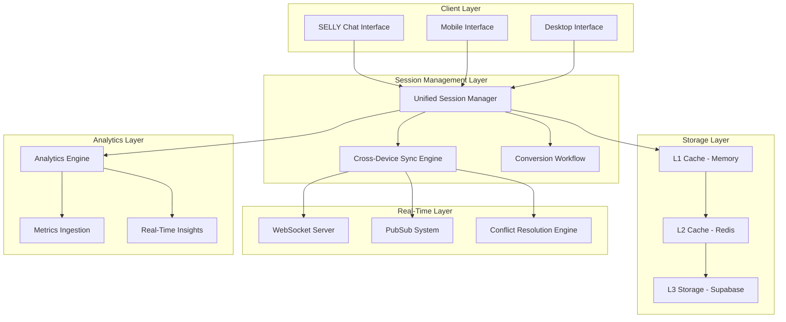

---

## 🔄 **Session Lifecycle Flow**

### **Authenticated User Session Flow**

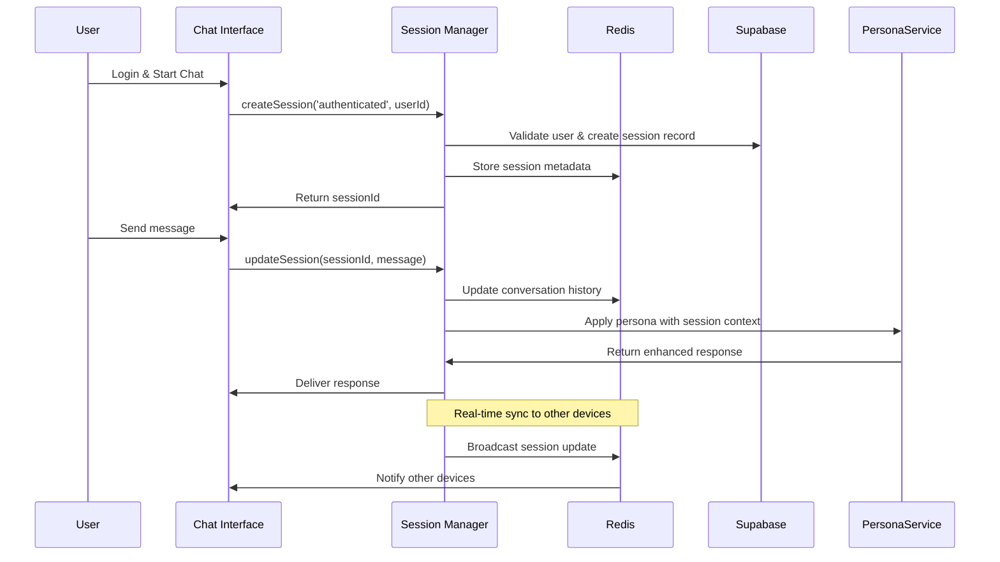

### **Guest User Session Flow**

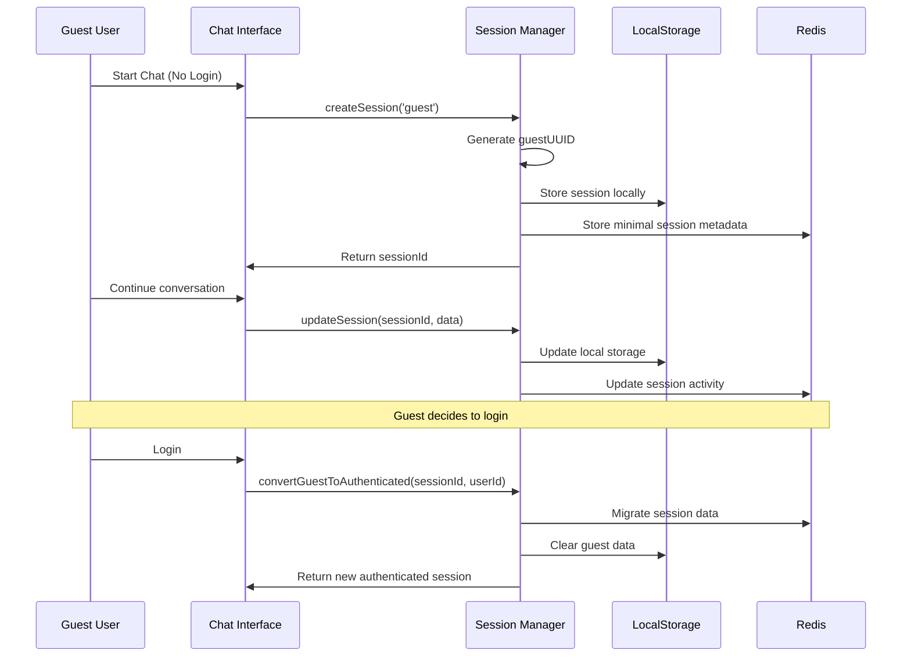

---

## 🌐 **Cross-Device Synchronization Architecture**

### **Multi-Device Session Sync**

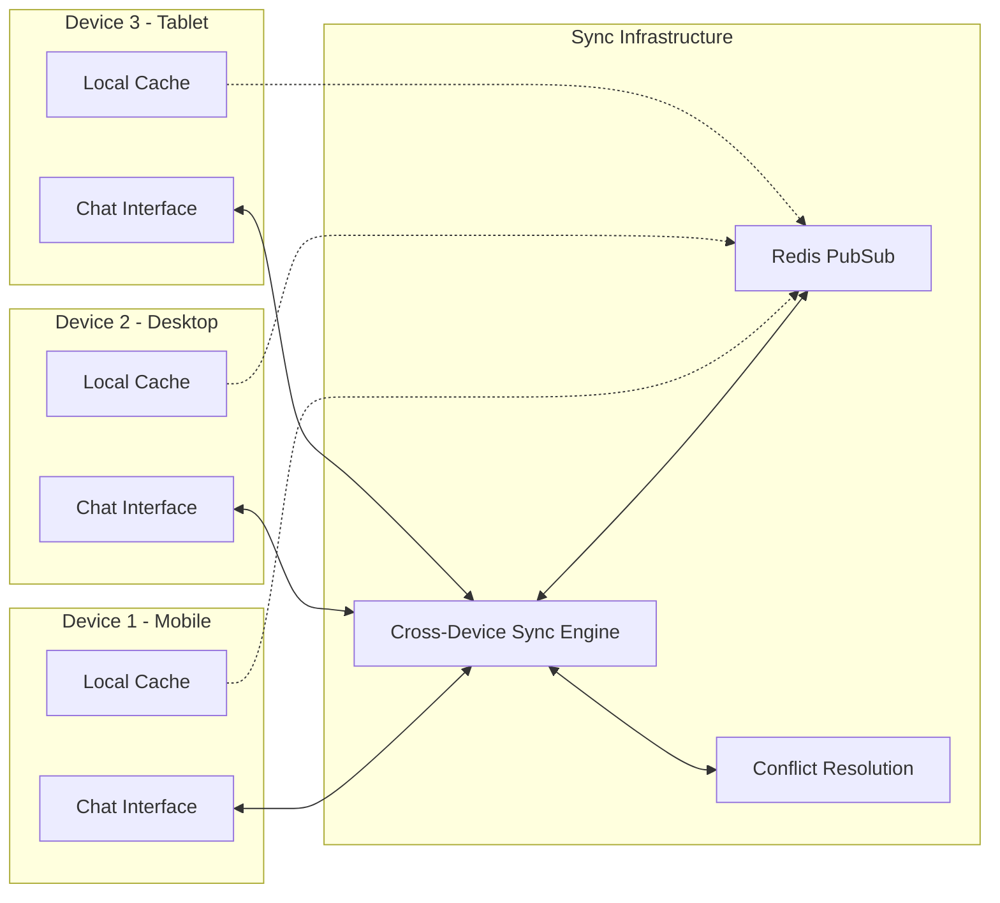

### **Conflict Resolution Flow**

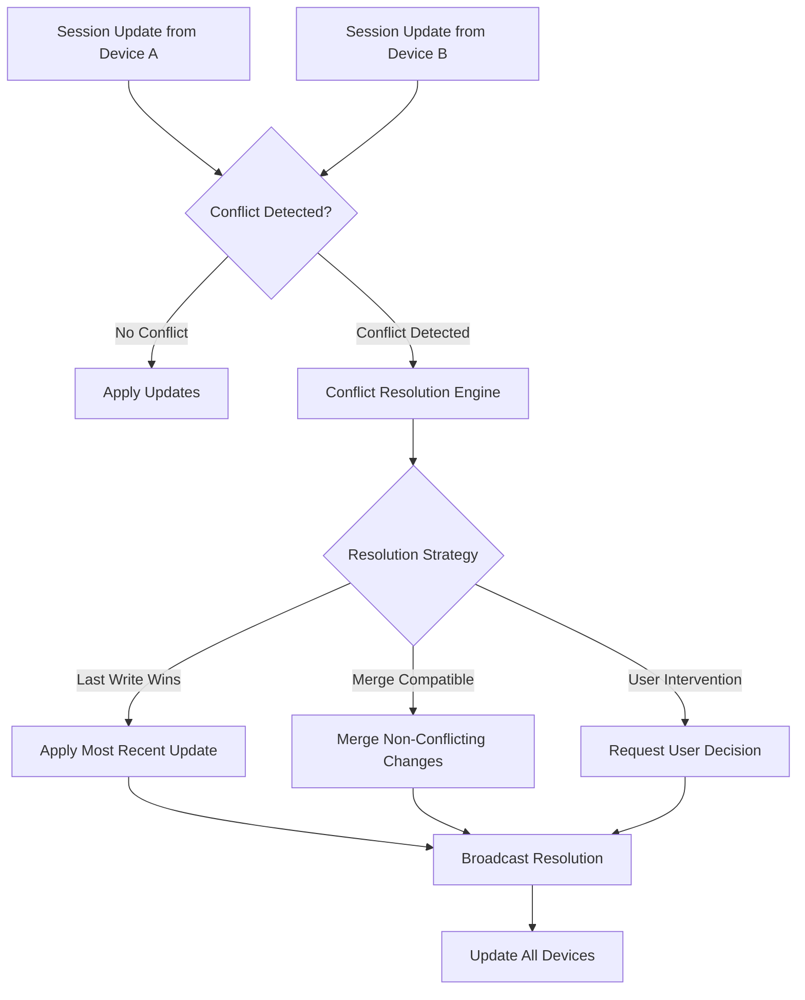

---

## 💾 **Data Storage Architecture**

### **Multi-Layer Caching Strategy**

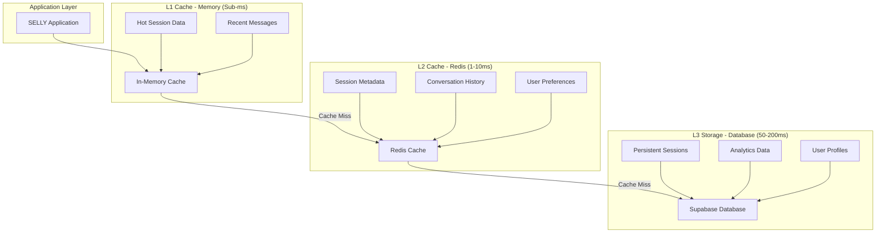

### **Redis Data Partitioning**

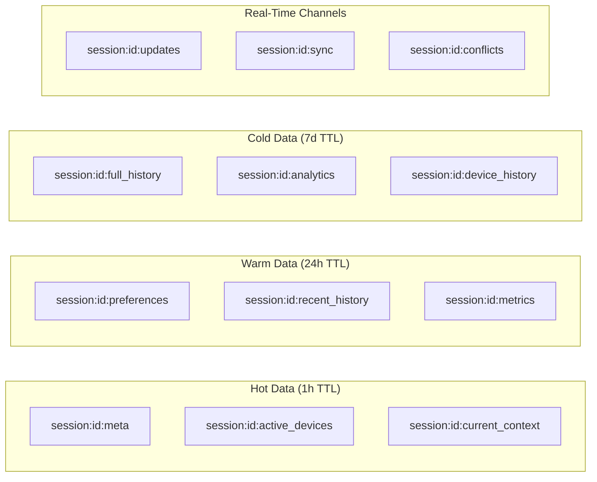

---

## 🔄 **Guest-to-Authenticated Conversion Flow**

### **Conversion Process Architecture**

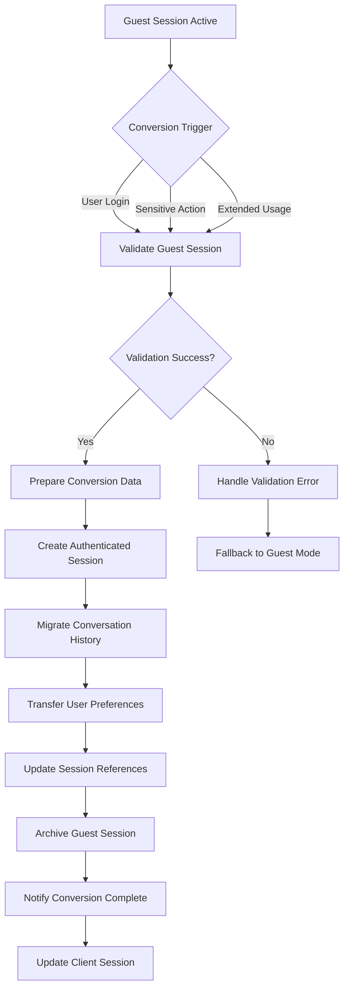

### **Data Migration Flow**

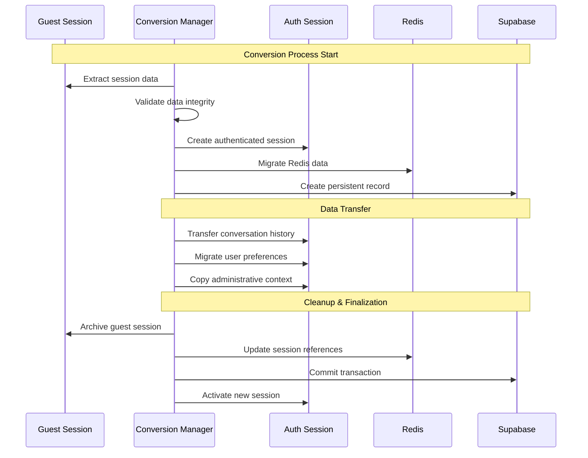

---

## 📊 **Analytics & Monitoring Architecture**

### **Real-Time Analytics Pipeline**

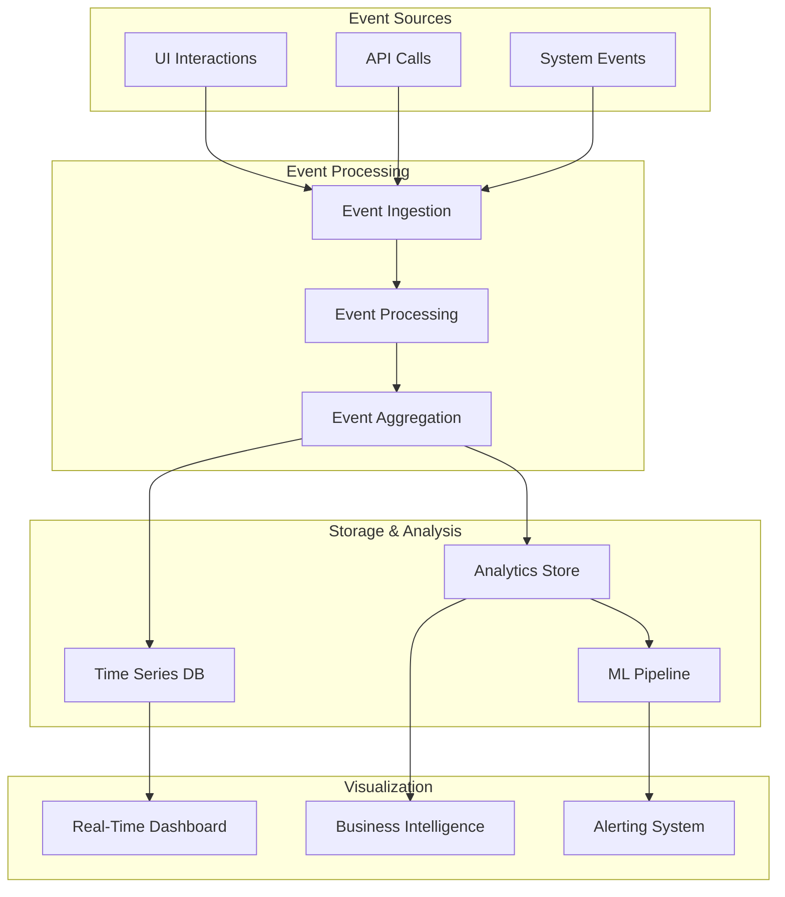

### **Performance Monitoring Flow**

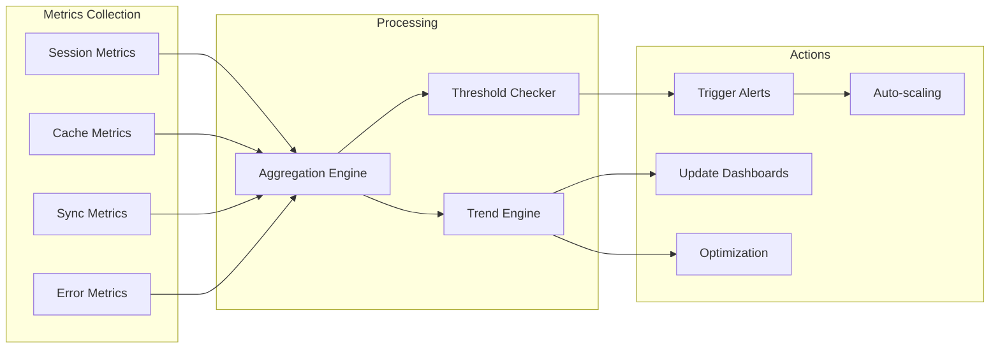

---

## 🔒 **Security Architecture**

### **Session Security Framework**

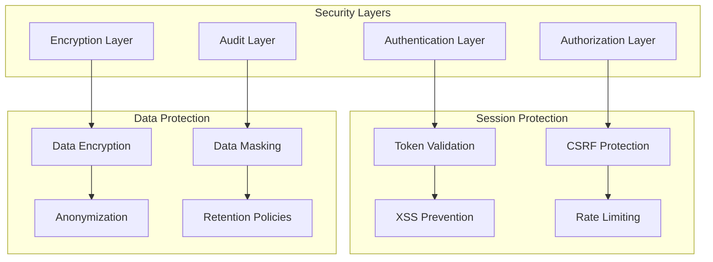

---

## 🚀 **Deployment Architecture**

### **Blue-Green Deployment Strategy**

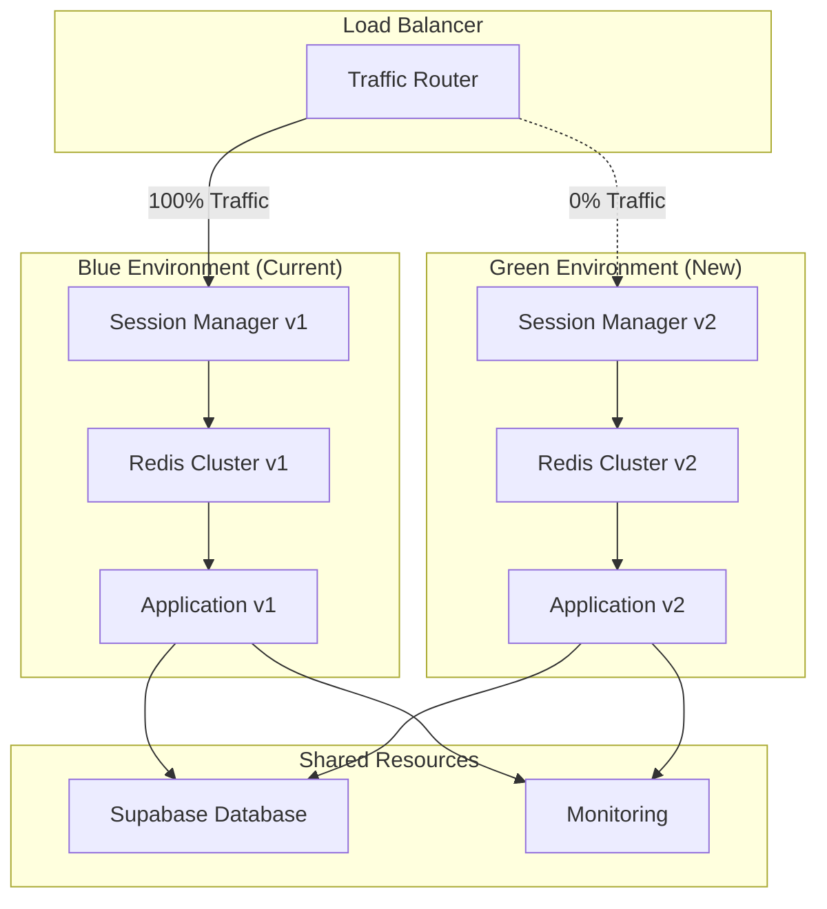

---

*These architectural diagrams provide visual representation of the enhanced SELLY session management system, illustrating the complex interactions between components and the flow of data through the system.*
