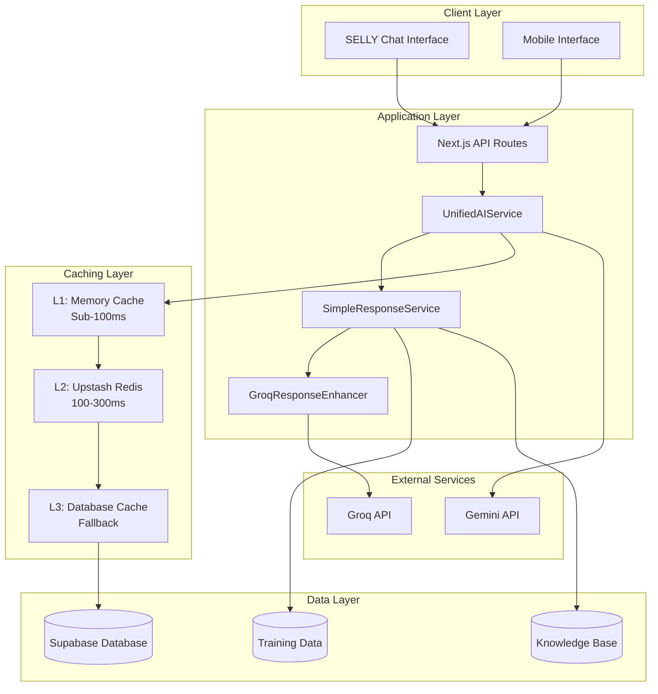

# Upstash Redis Architecture for SELLY AI

## System Architecture Overview

### High-Level Architecture



## Core Components Integration

### 1. Upstash Redis Client Integration

```typescript
// src/services/cache/upstashClient.ts
import { Redis } from '@upstash/redis';

export class UpstashClient {
  private static instance: UpstashClient;
  private redis: Redis;
  private healthStatus: boolean = false;
  private connectionRetries: number = 0;
  private readonly MAX_RETRIES = 3;

  private constructor() {
    this.redis = new Redis({
      url: process.env.UPSTASH_REDIS_REST_URL!,
      token: process.env.UPSTASH_REDIS_REST_TOKEN!,
      retry: {
        retries: this.MAX_RETRIES,
        retryDelayOnFailure: 1000,
      }
    });
  }

  public static getInstance(): UpstashClient {
    if (!UpstashClient.instance) {
      UpstashClient.instance = new UpstashClient();
    }
    return UpstashClient.instance;
  }

  async healthCheck(): Promise<boolean> {
    try {
      await this.redis.ping();
      this.healthStatus = true;
      this.connectionRetries = 0;
      return true;
    } catch (error) {
      this.healthStatus = false;
      this.connectionRetries++;
      console.error(`Upstash health check failed (attempt ${this.connectionRetries}):`, error);
      return false;
    }
  }

  async get(key: string): Promise<any> {
    try {
      return await this.redis.get(key);
    } catch (error) {
      console.error(`Upstash GET error for key ${key}:`, error);
      throw error;
    }
  }

  async set(key: string, value: any, ttl?: number): Promise<void> {
    try {
      if (ttl) {
        await this.redis.setex(key, ttl, JSON.stringify(value));
      } else {
        await this.redis.set(key, JSON.stringify(value));
      }
    } catch (error) {
      console.error(`Upstash SET error for key ${key}:`, error);
      throw error;
    }
  }
}
```

### 2. Multi-Level Cache Strategy

#### Level 1: Memory Cache (Sub-100ms)
- **Purpose**: Ultra-fast access for frequently used queries
- **Size**: 50MB maximum
- **TTL**: 5-15 minutes
- **Use Cases**: Recent queries, user session data

#### Level 2: Upstash Redis (100-300ms)
- **Purpose**: Distributed cache for shared responses
- **Size**: 1GB+ (configurable)
- **TTL**: 1-24 hours based on content type
- **Use Cases**: Administrative responses, training data, knowledge base

#### Level 3: Database Cache (Fallback)
- **Purpose**: Persistent storage and fallback
- **Size**: Unlimited
- **TTL**: Based on data freshness requirements
- **Use Cases**: Historical data, backup cache

### 3. Cache Key Strategy

```typescript
export class CacheKeyManager {
  // Administrative queries: admin:service:hash
  generateAdminKey(serviceType: string, query: string): string {
    const hash = this.hashQuery(query);
    return `admin:${serviceType}:${hash}`;
  }
  
  // Training data: training:type:version
  generateTrainingKey(type: string, version: string): string {
    return `training:${type}:${version}`;
  }
  
  // User sessions: session:userId:timestamp
  generateSessionKey(userId: string): string {
    const timestamp = Math.floor(Date.now() / 300000); // 5-minute buckets
    return `session:${userId}:${timestamp}`;
  }
  
  // Knowledge base: kb:category:hash
  generateKnowledgeKey(category: string, query: string): string {
    const hash = this.hashQuery(query);
    return `kb:${category}:${hash}`;
  }
}
```

## Integration Points

### 1. SimpleResponseService Integration

```typescript
// Enhanced SimpleResponseService with Upstash
export class SimpleResponseService {
  private upstashCache: UpstashCacheService;
  private memoryCache: Map<string, any>;
  
  async processQuery(query: string, context?: any): Promise<SimpleResponseResult> {
    const cacheKey = this.generateCacheKey(query, context);
    
    // L1: Check memory cache
    const memoryResult = this.memoryCache.get(cacheKey);
    if (memoryResult && !this.isExpired(memoryResult)) {
      return this.formatCachedResponse(memoryResult, 'memory');
    }
    
    // L2: Check Upstash Redis
    const redisResult = await this.upstashCache.get(cacheKey);
    if (redisResult) {
      // Promote to memory cache
      this.memoryCache.set(cacheKey, redisResult);
      return this.formatCachedResponse(redisResult, 'redis');
    }
    
    // L3: Process query and cache result
    const result = await this.processQueryInternal(query, context);
    
    // Cache in both levels
    await this.upstashCache.set(cacheKey, result, this.calculateTTL(result));
    this.memoryCache.set(cacheKey, result);
    
    return result;
  }
}
```

### 2. Training Data Integration

```typescript
export class TrainingDataCacheService {
  private upstash: UpstashClient;
  
  async cacheTrainingData(data: EnhancedTrainingDataEntry[]): Promise<void> {
    const pipeline = this.upstash.pipeline();
    
    for (const entry of data) {
      const key = `training:${entry.serviceType}:${entry.id}`;
      const ttl = 24 * 60 * 60; // 24 hours
      
      pipeline.setex(key, ttl, JSON.stringify(entry));
    }
    
    await pipeline.exec();
  }
  
  async getTrainingData(serviceType: string): Promise<EnhancedTrainingDataEntry[]> {
    const pattern = `training:${serviceType}:*`;
    const keys = await this.upstash.keys(pattern);
    
    if (keys.length === 0) return [];
    
    const pipeline = this.upstash.pipeline();
    keys.forEach(key => pipeline.get(key));
    
    const results = await pipeline.exec();
    return results
      .filter(result => result !== null)
      .map(result => JSON.parse(result as string));
  }
}
```

## Performance Optimization Strategies

### 1. Cache Warming
```typescript
export class CacheWarmingService {
  async warmAdministrativeCache(): Promise<void> {
    const commonQueries = [
      'persyaratan KTP',
      'cara membuat akta kelahiran',
      'dokumen nikah',
      'perpanjangan KK'
    ];
    
    for (const query of commonQueries) {
      await this.preloadQuery(query);
    }
  }
  
  private async preloadQuery(query: string): Promise<void> {
    const response = await this.simpleResponseService.processQuery(query);
    const cacheKey = this.generateCacheKey(query);
    await this.upstashCache.set(cacheKey, response, 3600); // 1 hour
  }
}
```

### 2. Intelligent TTL Management
```typescript
export class TTLManager {
  calculateTTL(content: any, contentType: string): number {
    const baseTTL = {
      'administrative': 24 * 60 * 60,    // 24 hours
      'procedural': 12 * 60 * 60,       // 12 hours
      'training': 7 * 24 * 60 * 60,     // 7 days
      'session': 30 * 60,               // 30 minutes
      'knowledge': 6 * 60 * 60          // 6 hours
    };
    
    const confidence = content.metadata?.confidence || 0.5;
    const multiplier = 0.5 + confidence; // 0.5 to 1.5
    
    return Math.floor(baseTTL[contentType] * multiplier);
  }
}
```

### 3. Memory Management
```typescript
export class MemoryManager {
  private readonly MAX_MEMORY_MB = 50;
  private memoryUsage = 0;
  
  checkMemoryUsage(): void {
    const usage = process.memoryUsage();
    this.memoryUsage = usage.heapUsed / 1024 / 1024; // MB
    
    if (this.memoryUsage > this.MAX_MEMORY_MB) {
      this.evictLRUEntries();
    }
  }
  
  private evictLRUEntries(): void {
    // Implement LRU eviction strategy
    const entries = Array.from(this.memoryCache.entries())
      .sort((a, b) => a[1].lastAccessed - b[1].lastAccessed);
    
    const toEvict = Math.floor(entries.length * 0.2); // Evict 20%
    for (let i = 0; i < toEvict; i++) {
      this.memoryCache.delete(entries[i][0]);
    }
  }
}
```

## Monitoring and Observability

### 1. Performance Metrics
```typescript
export interface CacheMetrics {
  hitRate: {
    memory: number;
    redis: number;
    overall: number;
  };
  responseTime: {
    memory: number;
    redis: number;
    database: number;
  };
  memoryUsage: {
    current: number;
    peak: number;
    limit: number;
  };
  errorRate: number;
  throughput: number;
}
```

### 2. Health Monitoring
```typescript
export class CacheHealthMonitor {
  async performHealthCheck(): Promise<HealthStatus> {
    const checks = await Promise.allSettled([
      this.checkMemoryCache(),
      this.checkRedisConnection(),
      this.checkDatabaseConnection()
    ]);
    
    return {
      overall: checks.every(check => check.status === 'fulfilled'),
      memory: checks[0].status === 'fulfilled',
      redis: checks[1].status === 'fulfilled',
      database: checks[2].status === 'fulfilled',
      timestamp: new Date().toISOString()
    };
  }
}
```

## Security Considerations

### 1. Data Encryption
- All cached data encrypted at rest in Upstash
- Sensitive data masked or excluded from cache
- Cache keys hashed to prevent information leakage

### 2. Access Control
- Environment-based Redis credentials
- Network-level security with Upstash
- Rate limiting on cache operations

### 3. Data Privacy
- PII data excluded from distributed cache
- Automatic expiration of sensitive data
- Compliance with Indonesian data protection laws

## Scalability Design

### 1. Horizontal Scaling
- Multiple Upstash Redis instances for different regions
- Load balancing across cache instances
- Automatic failover between regions

### 2. Vertical Scaling
- Dynamic memory allocation based on usage
- Configurable cache sizes per environment
- Automatic cleanup and optimization

---

**Next**: Review [Implementation Guide](./implementation.md) for step-by-step setup instructions.
