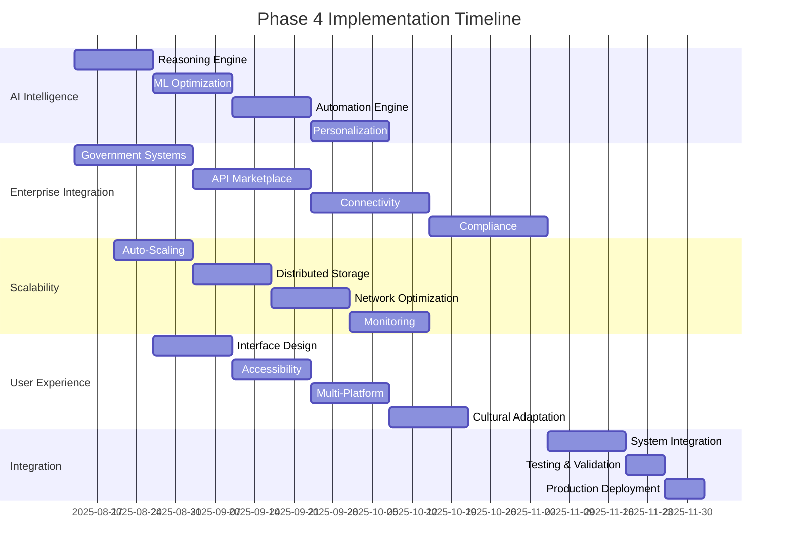

# Phase 4 Implementation Roadmap - SELLY Next-Generation Platform

**Document**: Master Implementation Roadmap  
**Version**: 1.0  
**Date**: August 13, 2025  
**Status**: 🚀 Ready for Implementation  
**Priority**: 🎯 Strategic Coordination  
**Total Duration**: 14 weeks (3.5 months)  

---

## 🎯 **Executive Summary**

The Phase 4 Implementation Roadmap coordinates four parallel enhancement initiatives to transform SELLY into a world-class, nationally-scalable AI-powered administrative platform. This roadmap ensures synchronized delivery of AI Intelligence, Enterprise Integration, Scalability Optimization, and User Experience Advancement.

### **Strategic Vision**
Transform SELLY from a completed session management platform into Indonesia's premier AI-powered government services platform, capable of serving 10M+ concurrent users with world-class user experience and enterprise-grade reliability.

---

## 🏗️ **Phase 4 Architecture Overview**

### **Integrated Enhancement Stack**
```typescript
// Phase 4 Integrated Architecture
interface Phase4IntegratedPlatform {
  // Foundation: Completed Session Management (Phase 1-3)
  foundation: CompletedSessionManagement;
  
  // Phase 4 Enhancements
  aiIntelligence: {
    reasoning: AdvancedReasoningEngine;
    learning: ContinuousLearningPipeline;
    automation: IntelligentWorkflowEngine;
    personalization: AdvancedUserModelingAI;
  };
  
  enterpriseIntegration: {
    governmentSystems: GovernmentSystemIntegration;
    apiMarketplace: APIMarketplaceEcosystem;
    connectivity: EnterpriseConnectivityInfrastructure;
    compliance: RegulatoryComplianceEngine;
  };
  
  scalabilityOptimization: {
    autoScaling: IntelligentAutoScalingEngine;
    distribution: GeographicDistributionNetwork;
    performance: NationalPerformanceOptimization;
    monitoring: PredictiveMonitoringSystem;
  };
  
  userExperience: {
    adaptiveDesign: NextGenerationInterface;
    accessibility: UniversalAccessibilityEngine;
    multiPlatform: CrossPlatformExcellence;
    culturalAdaptation: IndonesianCulturalPersonalization;
  };
}
```

---

## 📅 **Master Timeline and Dependencies**

### **Phase 4 Parallel Execution Plan**



---

## 📋 **Coordinated Implementation Phases**

### **Week 1-2: Foundation Establishment**

#### **Parallel Workstreams**
| Workstream | Focus | Deliverables |
|------------|-------|--------------|
| **AI Intelligence** | Advanced Reasoning Engine | Contextual reasoning, decision engine, problem solver |
| **Enterprise Integration** | Government Systems Foundation | Dukcapil, Kemendagri, BPN integration setup |
| **Scalability** | *Preparation Phase* | Architecture planning, infrastructure assessment |
| **User Experience** | *Preparation Phase* | Design research, cultural analysis, accessibility audit |

#### **Critical Dependencies**
- AI Intelligence foundation required for Enterprise Integration automation
- Scalability planning must consider AI workload requirements
- UX research informs all other workstreams

### **Week 3-4: Core Development**

#### **Parallel Workstreams**
| Workstream | Focus | Deliverables |
|------------|-------|--------------|
| **AI Intelligence** | ML Optimization & Learning | Continuous learning pipeline, adaptive models |
| **Enterprise Integration** | API Marketplace Development | Service registry, partner management, API gateway |
| **Scalability** | Auto-Scaling Infrastructure | Intelligent scaling, load balancing, orchestration |
| **User Experience** | Interface Design Foundation | Adaptive design engine, component library |

#### **Integration Points**
- AI learning pipeline feeds Enterprise Integration optimization
- Scalability auto-scaling considers AI workload patterns
- UX adaptive design integrates with AI personalization

### **Week 5-6: Advanced Features**

#### **Parallel Workstreams**
| Workstream | Focus | Deliverables |
|------------|-------|--------------|
| **AI Intelligence** | Intelligent Automation | Workflow automation, process optimization, task prediction |
| **Enterprise Integration** | Advanced Connectivity | Secure channels, data transformation, protocol adapters |
| **Scalability** | Distributed Storage & Caching | Database clusters, global cache, multi-region replication |
| **User Experience** | Universal Accessibility | Accessibility engine, assistive technology, cognitive support |

#### **Cross-Workstream Collaboration**
- AI automation integrates with Enterprise workflow systems
- Scalability distributed storage supports AI model serving
- UX accessibility requirements inform all system designs

### **Week 7-8: Optimization and Personalization**

#### **Parallel Workstreams**
| Workstream | Focus | Deliverables |
|------------|-------|--------------|
| **AI Intelligence** | Advanced Personalization | User modeling AI, preference engine, adaptive interface |
| **Enterprise Integration** | Compliance & Governance | Regulatory compliance, data governance, privacy protection |
| **Scalability** | Network & Performance | CDN management, edge computing, performance monitoring |
| **User Experience** | Multi-Platform Excellence | Responsive framework, native integration, cross-platform sync |

### **Week 9-10: Cultural Integration and Finalization**

#### **Parallel Workstreams**
| Workstream | Focus | Deliverables |
|------------|-------|--------------|
| **AI Intelligence** | Production Optimization | Performance tuning, model optimization, deployment preparation |
| **Enterprise Integration** | Government System Testing | End-to-end testing, security validation, compliance verification |
| **Scalability** | National-Scale Testing | Load testing, performance validation, monitoring deployment |
| **User Experience** | Cultural Adaptation | Indonesian cultural personalization, contextual adaptation |

### **Week 11-12: System Integration**

#### **Unified Integration Phase**
- **Cross-system integration testing** across all four workstreams
- **Performance optimization** for integrated system
- **Security validation** for complete platform
- **Compliance verification** for all components

### **Week 13-14: Production Deployment**

#### **Coordinated Deployment**
- **Staged rollout** with feature flags and monitoring
- **Performance validation** under production load
- **User acceptance testing** with Indonesian government users
- **Final optimization** and production stabilization

---

## 📊 **Success Criteria and Validation**

### **Integrated Platform Metrics**
| Category | Metric | Target | Validation Method |
|----------|--------|--------|-------------------|
| **AI Performance** | Reasoning Accuracy | >92% | Expert evaluation and user feedback |
| **Enterprise Integration** | Government API Response | <2 seconds | Real-time monitoring |
| **Scalability** | Concurrent Users | 10M+ | Load testing and production monitoring |
| **User Experience** | User Satisfaction | >95% | Regular user surveys and feedback |
| **Overall Platform** | System Availability | >99.99% | Comprehensive uptime monitoring |

### **Business Impact Metrics**
| Metric | Target | Validation Method |
|--------|--------|-------------------|
| Administrative Process Automation | >80% | Workflow analysis and tracking |
| User Task Completion Rate | >98% | User journey analytics |
| Government Service Efficiency | 10x improvement | Before/after comparison |
| Cost Reduction for Users | >50% | Cost analysis and user surveys |
| National Adoption Rate | >60% of eligible population | Usage analytics and government reports |

---

## 🔗 **Critical Integration Points**

### **AI ↔ Enterprise Integration**
- AI reasoning powers government workflow automation
- Enterprise data feeds AI learning and personalization
- Compliance requirements shape AI decision-making

### **AI ↔ Scalability**
- AI workloads drive scaling requirements
- Distributed infrastructure enables AI model serving
- Performance optimization considers AI processing needs

### **AI ↔ User Experience**
- AI personalization drives adaptive interface design
- User behavior data feeds AI learning systems
- Cultural adaptation informs AI reasoning patterns

### **Enterprise ↔ Scalability**
- Government system integration requires national-scale infrastructure
- API marketplace needs distributed, high-performance architecture
- Compliance requirements influence scalability design

### **Enterprise ↔ User Experience**
- Government workflows shape user interface design
- Administrative processes drive UX optimization
- Compliance requirements inform accessibility standards

### **Scalability ↔ User Experience**
- Performance optimization enables rich user experiences
- Geographic distribution supports localized UX
- Monitoring systems track user experience metrics

---

## ⚠️ **Risk Management and Mitigation**

### **Cross-Workstream Risks**
| Risk | Impact | Probability | Mitigation Strategy |
|------|--------|-------------|-------------------|
| Integration Complexity | High | Medium | Phased integration, comprehensive testing, expert consultation |
| Performance Degradation | High | Low | Performance monitoring, optimization, load testing |
| Security Vulnerabilities | Critical | Low | Security audits, penetration testing, compliance validation |
| Timeline Dependencies | Medium | Medium | Parallel development, flexible scheduling, contingency planning |

### **Resource and Coordination Risks**
| Risk | Impact | Probability | Mitigation Strategy |
|------|--------|-------------|-------------------|
| Resource Conflicts | Medium | Medium | Resource planning, cross-team coordination, priority management |
| Communication Gaps | Medium | Medium | Regular sync meetings, shared documentation, collaboration tools |
| Scope Creep | Medium | Medium | Clear requirements, change management, stakeholder alignment |

---

## 🎯 **Success Validation Framework**

### **Phase Gates and Milestones**
- **Week 2**: Foundation establishment validation
- **Week 4**: Core development milestone
- **Week 6**: Advanced features integration
- **Week 8**: Optimization and personalization completion
- **Week 10**: Cultural integration and finalization
- **Week 12**: System integration validation
- **Week 14**: Production deployment success

### **Quality Assurance**
- **Continuous integration** across all workstreams
- **Automated testing** for all components
- **Performance benchmarking** at each milestone
- **Security validation** throughout development
- **User acceptance testing** with Indonesian government stakeholders

---

## 🚀 **Expected Outcomes**

### **Platform Transformation**
By completion of Phase 4, SELLY will be transformed into:
- **World-class AI-powered platform** with advanced reasoning and automation
- **Comprehensive government services hub** with direct system integrations
- **Nationally-scalable infrastructure** supporting 10M+ concurrent users
- **Exceptional user experience** with universal accessibility and cultural adaptation

### **Business Impact**
- **10x improvement** in administrative process efficiency
- **>95% user satisfaction** across all demographics
- **National-scale adoption** capability for Indonesian government
- **Enterprise-grade reliability** with 99.99% uptime
- **Cultural leadership** in AI-powered government services

---

---

## 👥 **Team Structure and Responsibilities**

### **Cross-Functional Team Organization**
```typescript
// Phase 4 Team Structure
interface Phase4TeamStructure {
  leadership: {
    programManager: ProgramManager;
    technicalLead: TechnicalArchitect;
    productOwner: ProductOwner;
    qualityAssurance: QALead;
  };

  workstreams: {
    aiIntelligence: {
      lead: AITechnicalLead;
      mlEngineers: MLEngineer[];
      aiResearchers: AIResearcher[];
      dataScientists: DataScientist[];
    };

    enterpriseIntegration: {
      lead: IntegrationArchitect;
      backendEngineers: BackendEngineer[];
      securityEngineers: SecurityEngineer[];
      complianceSpecialists: ComplianceSpecialist[];
    };

    scalabilityOptimization: {
      lead: InfrastructureArchitect;
      devOpsEngineers: DevOpsEngineer[];
      performanceEngineers: PerformanceEngineer[];
      cloudArchitects: CloudArchitect[];
    };

    userExperience: {
      lead: UXDirector;
      uxDesigners: UXDesigner[];
      frontendEngineers: FrontendEngineer[];
      accessibilitySpecialists: AccessibilitySpecialist[];
      culturalConsultants: CulturalConsultant[];
    };
  };

  support: {
    qaEngineers: QAEngineer[];
    documentationSpecialists: DocumentationSpecialist[];
    projectCoordinators: ProjectCoordinator[];
  };
}
```

### **Communication and Coordination**
- **Daily standups** within each workstream
- **Weekly cross-workstream sync** meetings
- **Bi-weekly stakeholder updates** with Indonesian government partners
- **Monthly executive reviews** with leadership team

---

## 📈 **Resource Allocation and Budget Planning**

### **Resource Distribution**
| Workstream | Team Size | Duration | Resource Allocation |
|------------|-----------|----------|-------------------|
| AI Intelligence | 8-10 engineers | 8 weeks | 35% of technical resources |
| Enterprise Integration | 6-8 engineers | 12 weeks | 30% of technical resources |
| Scalability Optimization | 6-8 engineers | 8 weeks | 20% of technical resources |
| User Experience | 8-10 specialists | 10 weeks | 15% of technical resources |

### **Infrastructure and Tooling**
- **Cloud infrastructure** scaling for development and testing
- **AI/ML development platforms** for model training and deployment
- **Government system sandbox** environments for integration testing
- **Performance testing infrastructure** for national-scale validation

---

## 🔄 **Change Management and Adaptation**

### **Agile Adaptation Framework**
- **Sprint-based development** with 2-week iterations
- **Regular retrospectives** for continuous improvement
- **Flexible scope management** with priority-based feature delivery
- **Risk-driven decision making** with regular risk assessments

### **Stakeholder Engagement**
- **Government liaison program** for continuous feedback
- **User community engagement** for real-world validation
- **Partner ecosystem coordination** for third-party integrations
- **Expert advisory board** for technical and cultural guidance

---

## 📚 **Knowledge Management and Documentation**

### **Documentation Strategy**
- **Technical documentation** for all system components
- **Integration guides** for government system connections
- **User manuals** in Indonesian with cultural adaptations
- **Operational runbooks** for production support

### **Knowledge Transfer**
- **Cross-training programs** between workstreams
- **Technical workshops** for knowledge sharing
- **Best practices documentation** for future phases
- **Lessons learned** capture and dissemination

---

**Implementation Team**: Cross-functional teams across AI, Enterprise, Scalability, and UX
**Stakeholders**: Indonesian Government, SELLY Users, Technology Partners
**Success Criteria**: Successful deployment of integrated Phase 4 platform with all success metrics achieved
**Next Phase**: Phase 5 - Advanced AI Capabilities and Regional Expansion (Q2 2026)
