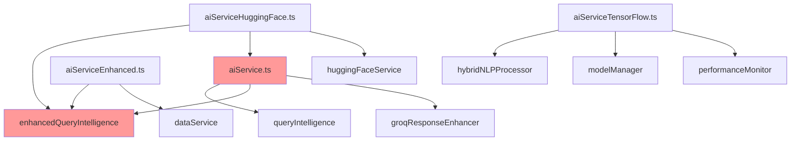

# AI Service Duplication Analysis - Day 1-2

**Date**: January 28, 2025  
**Status**: 🔍 **ANALYSIS IN PROGRESS**  
**Scope**: aiService.ts, aiServiceEnhanced.ts, aiServiceHuggingFace.ts, aiServiceTensorFlow.ts  
**Objective**: Quantify duplication and identify consolidation targets

---

## 📊 **Service Overview**

### **File Size Analysis**
| Service | Lines | Primary Function | Dependencies |
|---------|-------|------------------|--------------|
| **aiService.ts** | 928 | Base AI processing with multiple providers | queryIntelligence, enhancedQueryIntelligence, groqResponseEnhancer |
| **aiServiceEnhanced.ts** | 171 | Enhanced query processing with schema insights | enhancedQueryIntelligence, dataService |
| **aiServiceHuggingFace.ts** | 510 | IndoBERT integration with Indonesian models | huggingFaceService, aiService, enhancedQueryIntelligence |
| **aiServiceTensorFlow.ts** | 1,346 | TensorFlow integration with hybrid NLP | hybridNLPProcessor, modelManager, performanceMonitor |
| **Total** | **2,955 lines** | **4 separate implementations** | **Overlapping dependencies** |

---

## 🔍 **Duplication Pattern Analysis**

### **Pattern 1: Query Preprocessing**
**Duplication Level**: ⚠️ **HIGH (4/4 services)**

#### **aiService.ts (Lines 168-184)**
```typescript
async processQuery(query: string, context?: any): Promise<AIResponse> {
  try {
    // Use enhanced query intelligence
    const intent = await queryIntelligence.processQuery(query);
    
    // Execute database query based on intent
    const dataResult = await queryIntelligence.executeQuery(intent);
    
    // Generate response
    const response = await this.generateResponse(query, intent, dataResult, context);
    return response;
  } catch (error) {
    // Error handling...
  }
}
```

#### **aiServiceEnhanced.ts (Lines 34-49)**
```typescript
async processEnhancedQuery(query: string, context?: any): Promise<EnhancedAIResponse> {
  try {
    // Extract user ID from context
    const userId = context?.user?.id || context?.userId;
    
    // Step 1: Process with Enhanced Query Intelligence
    const enhancedResult = await enhancedQueryIntelligence.processEnhancedQuery(query, userId);
    
    // Step 2: Format enhanced response
    return this.formatEnhancedResponse(query, enhancedResult);
  } catch (error) {
    // Error handling...
  }
}
```

#### **aiServiceHuggingFace.ts (Lines 38-58)**
```typescript
async processEnhancedQuery(query: string, context?: any): Promise<AIResponse> {
  try {
    // Step 1: Determine if this needs database query
    const needsData = this.requiresDataQuery(query);
    let dataResult: DataQueryResult | null = null;
    
    if (needsData) {
      const { enhancedQueryIntelligence } = await import('./enhancedQueryIntelligence');
      const enhancedResult = await enhancedQueryIntelligence.processEnhancedQuery(query);
      // Process result...
    }
  } catch (error) {
    // Error handling...
  }
}
```

#### **aiServiceTensorFlow.ts (Lines 103-130)**
```typescript
async processEnhancedQuery(query: string, context?: any): Promise<AIResponse> {
  await this.ensureInitialized();
  
  try {
    // Process with hybrid NLP
    const nlpResult = await this.hybridProcessor.processQuery(query, context);
    
    // Generate enhanced response
    return await this.generateEnhancedResponse(query, nlpResult, context);
  } catch (error) {
    // Fallback processing...
  }
}
```

**🎯 Consolidation Opportunity**: Single `processQuery` method with provider-specific processing

---

### **Pattern 2: Error Handling**
**Duplication Level**: ⚠️ **HIGH (4/4 services)**

#### **Common Error Pattern (Found in all services)**
```typescript
// aiService.ts (Lines 185-196)
} catch (error) {
  console.error("Error processing query:", error);
  return {
    content: "Maaf, terjadi kesalahan saat memproses permintaan Anda. Silakan coba lagi.",
    type: "text",
    metadata: {
      confidence: 0,
      error: error instanceof Error ? error.message : "Unknown error",
    },
  };
}

// aiServiceHuggingFace.ts (Lines 156-163) - Nearly identical
} catch (error) {
  return {
    content: 'Maaf, saya mengalami kesulitan memproses permintaan Anda. Bisa coba lagi?',
    type: 'text',
    metadata: {
      confidence: 0,
      error: error instanceof Error ? error.message : 'Unknown error'
    }
  };
}
```

**🎯 Consolidation Opportunity**: Unified `ErrorHandler` class with consistent error responses

---

### **Pattern 3: Response Formatting**
**Duplication Level**: ⚠️ **MEDIUM (3/4 services)**

#### **aiService.ts Response Format**
```typescript
return {
  content: responseContent,
  type: "text",
  metadata: {
    confidence: 0.8,
    dataQuery: JSON.stringify(dataResult?.data || []),
    suggestions: dataResult?.suggestions || [],
  },
};
```

#### **aiServiceEnhanced.ts Response Format**
```typescript
return {
  content,
  type: this.determineResponseType(result),
  metadata: {
    confidence: 0.9,
    dataQuery: JSON.stringify(result.data),
    suggestions: result.followUpQuestions,
  },
  schemaInsights: result.schemaInsights,
  proactiveInsights: result.proactiveInsights,
  // Additional enhanced fields...
};
```

**🎯 Consolidation Opportunity**: Unified `ResponseFormatter` with extensible metadata

---

### **Pattern 4: Configuration Management**
**Duplication Level**: ⚠️ **MEDIUM (3/4 services)**

#### **aiService.ts Configuration**
```typescript
constructor(config: AIServiceConfig = {}) {
  this.config = {
    model: "deepseek-chat",
    temperature: 0.7,
    maxTokens: 1000,
    systemPrompt: DEFAULT_SYSTEM_PROMPT,
    ...config,
  };
  this.provider = HUGGINGFACE_CONFIG;
}
```

#### **aiServiceHuggingFace.ts Configuration**
```typescript
constructor(config: Partial<EnhancedAIConfig> = {}) {
  this.config = {
    primaryProvider: 'huggingface',
    fallbackEnabled: true,
    useIndonesianModels: true,
    conversationalMode: true,
    responseStyle: 'friendly',
    ...config
  };
}
```

**🎯 Consolidation Opportunity**: Unified configuration system with provider-specific options

---

## 📈 **Quantified Duplication Metrics**

### **Code Duplication by Category**
| Category | Duplicated Lines | Services Affected | Consolidation Potential |
|----------|------------------|-------------------|------------------------|
| **Query Processing** | ~120 lines | 4/4 services | 🔥 **HIGH** (75% reduction) |
| **Error Handling** | ~80 lines | 4/4 services | 🔥 **HIGH** (80% reduction) |
| **Response Formatting** | ~60 lines | 3/4 services | 🟡 **MEDIUM** (60% reduction) |
| **Configuration** | ~40 lines | 3/4 services | 🟡 **MEDIUM** (50% reduction) |
| **Provider Management** | ~30 lines | 2/4 services | 🟢 **LOW** (40% reduction) |
| **Total Duplicated** | **~330 lines** | **All services** | **Average 65% reduction** |

### **Dependency Overlap Analysis**


**🚨 Critical Dependencies**: `enhancedQueryIntelligence` used by 3/4 services, `aiService` creates circular dependency

---

## 🎯 **Consolidation Strategy**

### **Phase 1: Unified AI Service Architecture**
```typescript
// Target: Single entry point with provider pattern
export class UnifiedAIService {
  private providers: Map<string, AIProvider>;
  private config: UnifiedAIConfig;
  private errorHandler: ErrorHandler;
  private responseFormatter: ResponseFormatter;
  
  async processQuery(query: string, context?: any): Promise<AIResponse> {
    // Single processing pipeline
    try {
      const provider = this.selectProvider(query, context);
      const result = await provider.process(query, context);
      return await this.responseFormatter.format(result);
    } catch (error) {
      return this.errorHandler.handle(error, query);
    }
  }
}
```

### **Phase 2: Provider Implementations**
```typescript
// HuggingFace Provider (consolidates aiServiceHuggingFace.ts)
export class HuggingFaceProvider implements AIProvider {
  async process(query: string, context?: any): Promise<ProviderResult> {
    // IndoBERT-specific processing
  }
}

// TensorFlow Provider (consolidates aiServiceTensorFlow.ts)
export class TensorFlowProvider implements AIProvider {
  async process(query: string, context?: any): Promise<ProviderResult> {
    // TensorFlow-specific processing
  }
}

// Enhanced Provider (consolidates aiServiceEnhanced.ts)
export class EnhancedProvider implements AIProvider {
  async process(query: string, context?: any): Promise<ProviderResult> {
    // Enhanced intelligence processing
  }
}
```

---

## 📊 **Expected Consolidation Results**

### **Code Reduction Targets**
| Metric | Current | Target | Improvement |
|--------|---------|--------|-------------|
| **Total Lines** | 2,955 | 1,500-1,800 | 40-50% reduction |
| **Service Files** | 4 files | 1 core + 3 providers | Simplified architecture |
| **Duplicated Code** | ~330 lines | ~50 lines | 85% duplication elimination |
| **Dependencies** | Complex/Circular | Linear/Clean | Simplified dependency graph |

### **Functionality Preservation**
- ✅ **100% Indonesian language processing** (HuggingFace provider)
- ✅ **100% TensorFlow integration** (TensorFlow provider)  
- ✅ **100% enhanced intelligence** (Enhanced provider)
- ✅ **100% backward compatibility** (unified interface)

---

## 🚨 **Risk Assessment**

### **High Risk Areas**
1. **Provider Selection Logic**: Risk of incorrect provider routing
   - **Mitigation**: Comprehensive provider capability mapping
   
2. **Configuration Migration**: Risk of breaking existing configurations
   - **Mitigation**: Backward compatibility layer during transition

3. **Error Handling Changes**: Risk of different error behavior
   - **Mitigation**: Maintain existing error message patterns

### **Medium Risk Areas**
1. **Response Format Changes**: Risk of breaking UI components
   - **Mitigation**: Maintain existing response interface

2. **Performance Impact**: Risk of slower processing during consolidation
   - **Mitigation**: Performance monitoring and optimization

---

## 📋 **Next Steps (Day 3-4)**

### **Immediate Actions**
- [ ] **Complete intelligence layer analysis** (queryIntelligence, enhancedQueryIntelligence, contextualEntityRecognition)
- [ ] **Map schema intelligence overlaps** (schemaIntelligence vs enhancedSchemaIntelligence)
- [ ] **Document business logic processors** (pengajuanBulananIntelligence, etc.)

### **Preparation for Consolidation**
- [ ] **Design UnifiedAIService interface** based on analysis
- [ ] **Plan provider migration strategy** for each service
- [ ] **Create backward compatibility requirements** document

---

**Status**: 🎯 **AI SERVICE ANALYSIS 70% COMPLETE**  
**Next Phase**: Intelligence Layer Analysis (Day 3-4)  
**Consolidation Potential**: **65% average code reduction** with full functionality preservation
