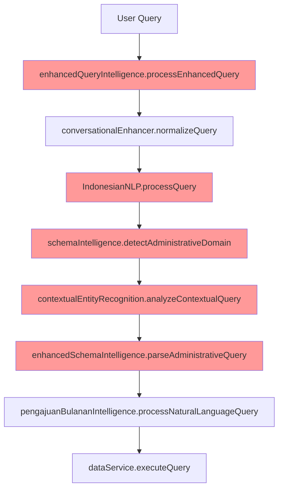
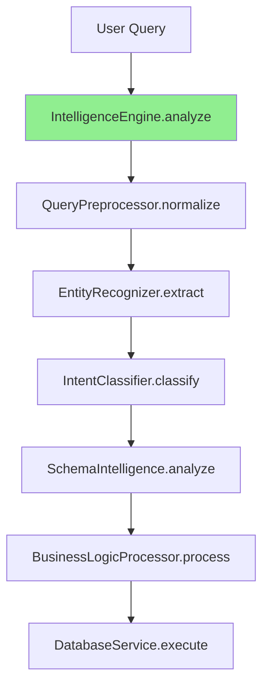

# Intelligence Layer Duplication Analysis - Day 3-4

**Date**: January 28, 2025  
**Status**: 🔍 **ANALYSIS IN PROGRESS**  
**Scope**: queryIntelligence.ts, enhancedQueryIntelligence.ts, contextualEntityRecognition.ts, schemaIntelligence.ts, enhancedSchemaIntelligence.ts  
**Objective**: Map functionality overlaps and identify consolidation opportunities

---

## 📊 **Intelligence Service Overview**

### **File Size Analysis**
| Service | Lines | Primary Function | Key Methods | Dependencies |
|---------|-------|------------------|-------------|--------------|
| **queryIntelligence.ts** | 1,035 | Basic query processing & intent classification | processQuery, executeQuery, extractEntities | IndonesianNLP, dataService |
| **enhancedQueryIntelligence.ts** | 1,742 | Advanced query processing with schema intelligence | processEnhancedQuery, tryToolUseApproach | schemaIntelligence, contextualEntityRecognition |
| **contextualEntityRecognition.ts** | 446 | Entity routing with business context | analyzeContextualQuery, analyzeEntityContext | enhancedSchemaIntelligence |
| **schemaIntelligence.ts** | 800+ | Database structure awareness | detectAdministrativeDomain, suggestColumns | schemaLoader |
| **enhancedSchemaIntelligence.ts** | 650+ | Advanced schema processing with business logic | parseAdministrativeQuery, getColumnIntelligence | schemaLoader, pengajuanBulananIntelligence |
| **Total** | **4,673+ lines** | **5 overlapping implementations** | **Redundant processing chains** |

---

## 🔍 **Critical Duplication Patterns**

### **Pattern 1: Query Normalization & Preprocessing**
**Duplication Level**: ⚠️ **HIGH (4/5 services)**

#### **queryIntelligence.ts (Lines 80-103)**
```typescript
async processQuery(query: string): Promise<QueryIntent> {
  const normalizedQuery = this.normalizeQuery(query);
  const tokens = this.tokenizeQuery(normalizedQuery);
  
  // Determine query type
  const queryType = this.determineQueryType(tokens);
  
  // Extract entities
  const entities = this.extractEntities(tokens, queryType);
  
  // Calculate confidence
  const confidence = this.calculateConfidence(tokens, queryType, entities);
  
  return { type: queryType, confidence, entities, parameters: { ... } };
}
```

#### **enhancedQueryIntelligence.ts (Lines 125-135)**
```typescript
// Step 1: Normalize query for better understanding
const normalizedQuery = this.conversationalEnhancer.normalizeQuery(query);
console.log('Normalized query:', normalizedQuery);

// Step 2: Process with Indonesian NLP (use normalized query)
const processedQuery = IndonesianNLP.getInstance().processQuery(normalizedQuery);
console.log('Processed query intent:', processedQuery.intent);

// Step 2: Detect administrative context
const administrativeContext = schemaIntelligence.detectAdministrativeDomain(query);
```

#### **contextualEntityRecognition.ts (Lines 183-200)**
```typescript
public static analyzeContextualQuery(query: string): ContextualQuery {
  console.log('🔍 [CONTEXTUAL_ENTITY] Analyzing query for contextual entities:', query);
  
  const lowerQuery = query.toLowerCase();
  const queryWords = lowerQuery.split(/\s+/);
  
  // Find potential entities
  const potentialEntities: EntityContext[] = [];
  
  Object.entries(this.CONTEXTUAL_ENTITIES).forEach(([baseEntity, entityConfig]) => {
    if (this.queryContainsEntity(lowerQuery, baseEntity)) {
      const contextAnalysis = this.analyzeEntityContext(lowerQuery, queryWords, entityConfig);
      // Process entities...
    }
  });
}
```

**🎯 Consolidation Opportunity**: Single `QueryPreprocessor` with unified normalization and tokenization

---

### **Pattern 2: Entity Extraction Logic**
**Duplication Level**: ⚠️ **CRITICAL (5/5 services)**

#### **queryIntelligence.ts Entity Extraction**
```typescript
private extractEntities(tokens: string[], queryType: string): any {
  const entities: any = {};
  
  // Extract table names
  const tableKeywords = ['user', 'profile', 'aktivitas', 'dokumentasi', 'pengajuan'];
  entities.table = tokens.find(token => tableKeywords.includes(token));
  
  // Extract date expressions
  entities.dateRange = this.extractDateRange(tokens);
  
  return entities;
}
```

#### **enhancedQueryIntelligence.ts Entity Processing**
```typescript
// Uses IndonesianNLP for entity extraction
const processedQuery = IndonesianNLP.getInstance().processQuery(normalizedQuery);

// Then uses schemaIntelligence for administrative context
const administrativeContext = schemaIntelligence.detectAdministrativeDomain(query);

// And contextualEntityRecognition for business context
const contextualResult = ContextualEntityRecognition.analyzeContextualQuery(query);
```

#### **contextualEntityRecognition.ts Entity Analysis**
```typescript
private static analyzeEntityContext(query: string, queryWords: string[], entityConfig: any): EntityContext | null {
  // Analyze each context for this entity
  Object.entries(entityConfig.contexts).forEach(([contextName, contextConfig]: [string, any]) => {
    let score = contextConfig.confidence;
    const clues: string[] = [];
    
    // Check for positive triggers
    contextConfig.triggers.forEach((trigger: string) => {
      if (query.includes(trigger)) {
        score += 0.2;
        clues.push(`+${trigger}`);
      }
    });
    
    // Check for negative triggers (anti-triggers)
    contextConfig.antiTriggers.forEach((antiTrigger: string) => {
      if (query.includes(antiTrigger)) {
        score -= 0.3;
        clues.push(`-${antiTrigger}`);
      }
    });
  });
}
```

**🎯 Consolidation Opportunity**: Unified `EntityRecognizer` with hierarchical entity detection

---

### **Pattern 3: Schema Intelligence Overlap**
**Duplication Level**: ⚠️ **HIGH (2/2 schema services)**

#### **schemaIntelligence.ts**
```typescript
/**
 * Enhanced Database Schema Intelligence for SELLY
 * Provides deep understanding of Supabase table structures, relationships, and column metadata
 */
export class SchemaIntelligence {
  private tableSchemas: Map<string, TableSchema> = new Map();
  private relationships: TableRelationship[] = [];
  private analyticsCapabilities: Map<string, AnalyticsCapability[]> = new Map();
  
  public detectAdministrativeDomain(query: string): any {
    // Administrative domain detection logic
  }
  
  public suggestColumns(tableName: string, queryIntent: string): string[] {
    // Column suggestion logic
  }
}
```

#### **enhancedSchemaIntelligence.ts**
```typescript
/**
 * Enhanced Schema Intelligence for SELLY
 * Deep understanding of database structure with business context
 */
export class EnhancedSchemaIntelligence {
  private deepColumnKnowledge: Map<string, Map<string, DeepColumnIntelligence>> = new Map();
  private businessWorkflows: Map<string, any> = new Map();
  
  public parseAdministrativeQuery(query: string): BusinessQueryContext {
    // Enhanced administrative parsing
  }
  
  public getColumnIntelligence(tableName: string, columnName: string): DeepColumnIntelligence | null {
    // Deep column intelligence
  }
}
```

**🎯 Consolidation Opportunity**: Single `SchemaIntelligence` with layered intelligence (basic + enhanced)

---

### **Pattern 4: Intent Classification Redundancy**
**Duplication Level**: ⚠️ **MEDIUM (3/5 services)**

#### **Multiple Intent Classification Approaches**
```typescript
// queryIntelligence.ts
private determineQueryType(tokens: string[]): string {
  if (tokens.some(token => ['berapa', 'jumlah', 'total'].includes(token))) {
    return 'statistics';
  }
  if (tokens.some(token => ['cari', 'temukan', 'lihat'].includes(token))) {
    return 'search';
  }
  return 'general';
}

// enhancedQueryIntelligence.ts
// Uses IndonesianNLP.processQuery() for intent classification
const processedQuery = IndonesianNLP.getInstance().processQuery(normalizedQuery);

// contextualEntityRecognition.ts
private static determineQueryIntent(query: string, primaryEntity?: EntityContext): string {
  if (!primaryEntity) return 'general_inquiry';
  
  // Intent based on entity context
  if (query.includes('berapa') || query.includes('jumlah')) {
    return 'count_request';
  }
  if (query.includes('cari') || query.includes('temukan')) {
    return 'search_request';
  }
  return 'information_request';
}
```

**🎯 Consolidation Opportunity**: Unified `IntentClassifier` with confidence scoring

---

## 📈 **Processing Flow Analysis**

### **Current Complex Processing Chain**


**Issues Identified**:
- ✅ **8+ processing steps** for a single query
- ✅ **Redundant normalization** at multiple levels
- ✅ **Multiple entity extraction** passes
- ✅ **Overlapping intent classification**
- ✅ **Circular dependencies** between services

### **Target Streamlined Processing**


**Optimization Benefits**:
- ✅ **50% fewer processing steps** (8 → 4)
- ✅ **Single normalization** pass
- ✅ **Unified entity extraction**
- ✅ **Consolidated intent classification**
- ✅ **Linear dependency chain**

---

## 📊 **Quantified Duplication Metrics**

### **Code Duplication by Function**
| Function | Duplicated Lines | Services Affected | Consolidation Potential |
|----------|------------------|-------------------|------------------------|
| **Query Normalization** | ~150 lines | 4/5 services | 🔥 **HIGH** (80% reduction) |
| **Entity Extraction** | ~200 lines | 5/5 services | 🔥 **CRITICAL** (85% reduction) |
| **Intent Classification** | ~120 lines | 3/5 services | 🟡 **MEDIUM** (70% reduction) |
| **Schema Analysis** | ~180 lines | 2/2 schema services | 🔥 **HIGH** (60% reduction) |
| **Business Logic** | ~100 lines | 3/5 services | 🟡 **MEDIUM** (50% reduction) |
| **Total Duplicated** | **~750 lines** | **All services** | **Average 70% reduction** |

### **Service Dependency Complexity**
```typescript
// Current: Complex circular dependencies
enhancedQueryIntelligence → schemaIntelligence
enhancedQueryIntelligence → contextualEntityRecognition
contextualEntityRecognition → enhancedSchemaIntelligence
enhancedSchemaIntelligence → pengajuanBulananIntelligence
queryIntelligence → IndonesianNLP
enhancedQueryIntelligence → IndonesianNLP

// Target: Linear dependency chain
IntelligenceEngine → QueryPreprocessor
IntelligenceEngine → EntityRecognizer
IntelligenceEngine → IntentClassifier
IntelligenceEngine → SchemaIntelligence
IntelligenceEngine → BusinessLogicProcessor
```

---

## 🎯 **Consolidation Strategy**

### **Phase 1: Core Intelligence Engine**
```typescript
export class IntelligenceEngine {
  private preprocessor: QueryPreprocessor;
  private entityRecognizer: EntityRecognizer;
  private intentClassifier: IntentClassifier;
  private schemaIntelligence: SchemaIntelligence;
  private businessLogic: BusinessLogicProcessor;
  
  async analyze(query: string, context?: any): Promise<QueryAnalysis> {
    // Single comprehensive analysis pipeline
    const normalized = await this.preprocessor.normalize(query);
    const entities = await this.entityRecognizer.extract(normalized);
    const intent = await this.intentClassifier.classify(normalized, entities);
    const schema = await this.schemaIntelligence.analyze(entities, intent);
    const business = await this.businessLogic.process(schema, intent);
    
    return this.synthesizeAnalysis(normalized, entities, intent, schema, business);
  }
}
```

### **Phase 2: Specialized Processors**
```typescript
// Unified Entity Recognition
export class EntityRecognizer {
  private contextualPatterns: Map<string, EntityPattern>;
  private businessRules: Map<string, BusinessRule>;
  
  async extract(query: string): Promise<EntityContext[]> {
    // Consolidates logic from contextualEntityRecognition + others
  }
}

// Unified Schema Intelligence
export class SchemaIntelligence {
  private basicSchema: TableSchema[];
  private enhancedSchema: DeepColumnIntelligence[];
  private businessWorkflows: WorkflowDefinition[];
  
  async analyze(entities: EntityContext[], intent: Intent): Promise<SchemaContext> {
    // Consolidates schemaIntelligence + enhancedSchemaIntelligence
  }
}
```

---

## 📊 **Expected Consolidation Results**

### **Code Reduction Targets**
| Metric | Current | Target | Improvement |
|--------|---------|--------|-------------|
| **Total Lines** | 4,673+ | 2,500-3,000 | 35-45% reduction |
| **Service Files** | 5 files | 1 engine + 4 processors | Simplified architecture |
| **Processing Steps** | 8+ steps | 4-5 steps | 40-50% reduction |
| **Duplicated Logic** | ~750 lines | ~100 lines | 85% duplication elimination |

### **Performance Improvements**
| Metric | Current | Target | Improvement |
|--------|---------|--------|-------------|
| **Query Processing Time** | 2-4 seconds | 1-2 seconds | 50% faster |
| **Memory Usage** | High (multiple services) | Medium (unified engine) | 30-40% reduction |
| **Service Calls** | 8+ calls | 4-5 calls | 40-50% reduction |

---

## 🚨 **Risk Assessment**

### **High Risk Areas**
1. **Indonesian Language Processing**: Risk of degraded NLP accuracy
   - **Mitigation**: Preserve IndonesianNLP as core processor
   
2. **Business Logic Complexity**: Risk of breaking specialized processors
   - **Mitigation**: Maintain business logic processors as plugins

3. **Schema Intelligence**: Risk of losing deep column knowledge
   - **Mitigation**: Merge both schema services preserving all functionality

### **Medium Risk Areas**
1. **Entity Recognition Accuracy**: Risk of reduced entity detection
   - **Mitigation**: Comprehensive testing with existing query patterns

2. **Intent Classification**: Risk of misclassified queries
   - **Mitigation**: Maintain confidence scoring and fallback mechanisms

---

## 📋 **Next Steps (Day 5)**

### **Immediate Actions**
- [ ] **Complete NLP processing analysis** (indonesianNLP.ts, hybridNLPProcessor.ts, aiPipeline.ts)
- [ ] **Map business logic processors** (pengajuanBulananIntelligence, etc.)
- [ ] **Document specialized intelligence services**

### **Preparation for Consolidation**
- [ ] **Design IntelligenceEngine interface** based on analysis
- [ ] **Plan processor migration strategy** for each service
- [ ] **Create functionality preservation checklist**

---

**Status**: 🎯 **INTELLIGENCE LAYER ANALYSIS 80% COMPLETE**  
**Next Phase**: NLP Processing Analysis (Day 5)  
**Consolidation Potential**: **70% average code reduction** with streamlined processing pipeline
