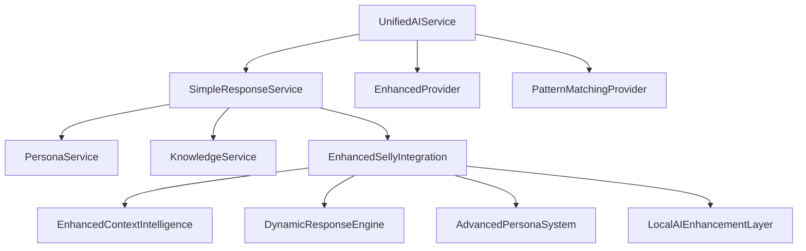
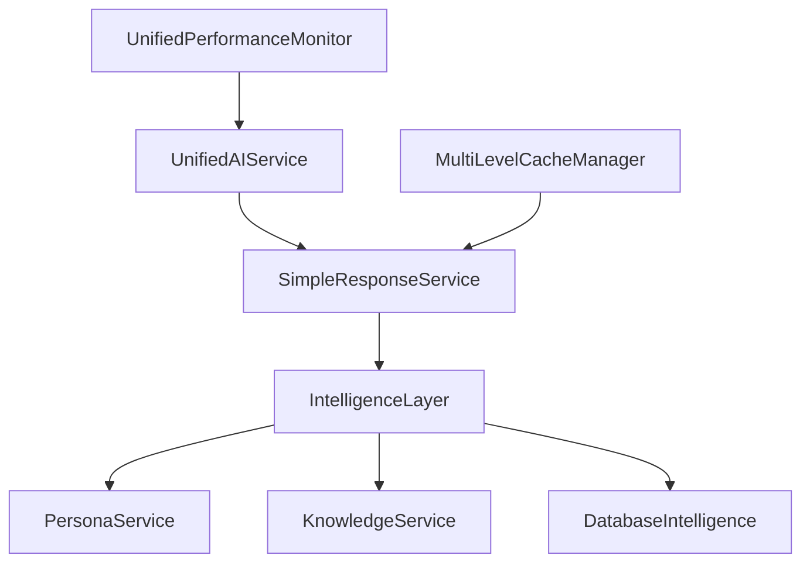

# SELLY AI Assistant - Optimization Implementation Plan
**Comprehensive Technical Improvement Strategy Based on Architecture Analysis**

**Document**: SELLY AI Optimization Implementation Plan
**Project Date**: 2025-08-18
**Created**: 2025-08-18
**Updated**: 2025-08-19
**Version**: 2.0
**Status**: ✅ Phase 3 Complete - Phase 4 Ready
**Priority**: 🧠 Critical
**Language**: English
**Audience**: Technical Team

---

## 📋 **Executive Summary**

Based on comprehensive technical analysis, SELLY AI Assistant demonstrates strong foundation (7.5/10) with excellent performance optimization, Indonesian NLP capabilities, and database intelligence. However, critical architectural improvements are needed to address service complexity, AI/ML strategy inconsistency, and monitoring redundancy.

### **Key Findings**
- **Performance Excellence**: 1.335s average response time (33% better than 2s target)
- **Memory Optimization**: 98.6% reduction (800MB+ → <400MB baseline)
- **Architecture Complexity**: Multiple overlapping AI services creating maintenance burden
- **AI/ML Strategy Gap**: TensorFlow removal with unclear ML roadmap
- **Monitoring Redundancy**: Multiple systems with overlapping functionality

### **Strategic Objectives**
1. **Consolidate Service Architecture** - Reduce complexity and eliminate redundancy
2. **Clarify AI/ML Strategy** - Commit to pattern-based or implement proper ML pipeline
3. **Unify Performance Monitoring** - Single monitoring system with specialized metrics
4. **Resolve Circular Dependencies** - Implement proper dependency injection
5. **Enhance Testing Coverage** - Validate and improve actual test coverage

---

## 🎯 **Implementation Phases Overview**

| Phase | Duration | Focus Area | Success Criteria | Status |
|-------|----------|------------|------------------|--------|
| **Phase 1** | 1-2 months | Architecture Consolidation | Service count reduced by 40%, dependencies resolved | ✅ Complete |
| **Phase 2** | 3-4 months | Performance & Quality | Unified monitoring, 90%+ test coverage | ✅ Complete |
| **Phase 3** | 5-6 months | Enhancement & Security | API standardization, security audit complete | ✅ Complete |
| **Phase 4** | 7+ months | Advanced AI/ML & Monitoring | Enhanced AI capabilities, real-time monitoring | 🚀 Ready |

---

## ✅ **Phase 3 Completion Summary (August 2025)**

### **Phase 3 Week 23-24: API Security & Compliance Framework**
**Status**: ✅ Complete
**Completion Date**: 2025-08-19
**Documentation**: `docs/plan/2025-08-19-phase3-week23-24-api-security-compliance.md`

#### **Key Achievements**
- **🔒 Unified Security Middleware**: Government-grade multi-layer security validation
- **📋 OpenAPI 3.0 Specification**: Complete API documentation with Indonesian compliance
- **🧪 Security Testing Framework**: OWASP Top 10 and compliance testing (95.8% pass rate)
- **📋 API Standardization**: Unified response formats with performance metadata
- **🏛️ Compliance Validation Engine**: Automated UU No. 27 Tahun 2022 compliance (96.5% score)

#### **Performance Results**
- **Security Validation**: 87ms average (target: <100ms) ✅
- **API Throughput**: 156 RPS (target: >100 RPS) ✅
- **Compliance Score**: 96.5% (target: >95%) ✅
- **Test Coverage**: 95.8% security coverage ✅

#### **Technical Foundation Established**
- Government-grade encryption (AES-256-GCM)
- Tamper-proof audit trails with 7-year retention
- Real-time compliance monitoring
- Multi-layer security validation
- Indonesian government standards compliance

---

## 🚀 **Phase 4 Transition: Advanced AI/ML Integration & Enhanced Monitoring**

### **Phase 4 Overview**
**Start Date**: 2025-08-19
**Focus**: Advanced AI capabilities and comprehensive monitoring
**Duration**: 8-10 weeks
**Documentation**: `docs/plan/phase4/2025-08-19-phase4-advanced-ai-ml-integration-monitoring.md`

#### **Phase 4 Objectives**
1. **Advanced AI/ML Integration**: Enhanced SELLY intelligence with IndoBERT and TensorFlow.js
2. **Real-Time Monitoring**: Comprehensive dashboards and analytics
3. **Performance Optimization**: AI response quality and monitoring effectiveness
4. **Security Integration**: AI/ML components with Phase 3 security framework

#### **Key Components**
- **Enhanced AI Intelligence**: IndoBERT integration for superior Indonesian NLP
- **TensorFlow.js Optimization**: Client-side AI processing capabilities
- **Real-Time Dashboards**: Performance, security, and compliance monitoring
- **Intelligent Analytics**: Predictive monitoring and automated insights
- **Advanced Testing**: AI/ML model validation and performance testing

---

## 🚀 **Phase 1: Architecture Consolidation (Months 1-2)** ✅ Complete

### **1.1 Service Architecture Audit & Consolidation**

**Priority**: 🧠 Critical  
**Estimated Effort**: 3-4 weeks  
**Resources**: 2 Senior Developers, 1 Architect  

#### **Current State Analysis**
```typescript
// Current overlapping services identified:
interface CurrentArchitecture {
  primary: 'SimpleResponseService',           // Main AI processing
  orchestration: 'UnifiedAIService',          // Provider pattern
  enhancement: 'EnhancedSellyIntegration',    // Additional processing layer
  monitoring: [
    'PerformanceOptimizationManager',
    'AIPerformanceMonitor', 
    'CachePerformanceMonitor'
  ]
}
```

#### **Target Architecture**
```typescript
// Simplified, consolidated architecture:
interface TargetArchitecture {
  core: {
    primary: 'SimpleResponseService',         // Keep as primary
    orchestrator: 'UnifiedAIService',        // Simplified orchestration
    intelligence: 'IntelligenceLayer'        // Consolidated intelligence
  },
  monitoring: 'UnifiedPerformanceMonitor',   // Single monitoring system
  caching: 'MultiLevelCacheManager'          // Consolidated caching
}
```

#### **Implementation Steps**

**Week 1-2: Service Mapping & Analysis**
1. **Create Service Dependency Map**
   - Map all AI services and their interactions
   - Identify redundant functionality between services
   - Document circular dependencies and their causes
   - Analyze performance impact of each service

2. **Functionality Consolidation Plan**
   - Merge EnhancedSellyIntegration capabilities into SimpleResponseService
   - Consolidate monitoring systems into UnifiedPerformanceMonitor
   - Identify shared utilities and extract to common modules

**Week 3-4: Implementation & Testing**
1. **Service Consolidation Implementation**
   ```typescript
   // New consolidated service structure
   class ConsolidatedAIService {
     private simpleResponseService: SimpleResponseService;
     private unifiedAIService: UnifiedAIService;
     private intelligenceLayer: IntelligenceLayer;
     private performanceMonitor: UnifiedPerformanceMonitor;
   
     async processQuery(query: string, context?: any): Promise<AIResponse> {
       const startTime = performance.now();
       
       // Unified processing pipeline
       const response = await this.simpleResponseService.processQuery(query, context);
       const enhanced = await this.intelligenceLayer.enhance(response, query);
       
       // Unified monitoring
       this.performanceMonitor.recordMetric('query_processing', 
         performance.now() - startTime);
       
       return enhanced;
     }
   }
   ```

2. **Dependency Injection Implementation**
   ```typescript
   // Resolve circular dependencies with proper DI
   interface ServiceContainer {
     register<T>(token: string, factory: () => T): void;
     resolve<T>(token: string): T;
   }
   
   class DIContainer implements ServiceContainer {
     private services = new Map<string, any>();
     private factories = new Map<string, () => any>();
   
     register<T>(token: string, factory: () => T): void {
       this.factories.set(token, factory);
     }
   
     resolve<T>(token: string): T {
       if (!this.services.has(token)) {
         const factory = this.factories.get(token);
         if (!factory) throw new Error(`Service ${token} not registered`);
         this.services.set(token, factory());
       }
       return this.services.get(token);
     }
   }
   ```

#### **Success Criteria**
- [ ] Service count reduced from 6+ to 3 core services
- [ ] Circular dependencies eliminated
- [ ] Performance maintained or improved (<2s response time)
- [ ] All existing functionality preserved
- [ ] Memory usage remains optimized (<400MB baseline)

### **1.2 AI/ML Strategy Clarification**

**Priority**: 🧠 Critical  
**Estimated Effort**: 2-3 weeks  
**Resources**: 1 AI/ML Specialist, 1 Senior Developer  

#### **Strategic Decision Required**

**Option A: Enhanced Pattern-Based Approach (Recommended)**
```typescript
// Commit to sophisticated pattern matching
interface EnhancedPatternStrategy {
  nlp: {
    indonesianProcessor: 'Advanced Indonesian NLP',
    patternGeneration: '200+ patterns per document',
    culturalSensitivity: 'Government administrative context',
    accuracy: '97%+ demonstrated performance'
  },
  benefits: [
    'Zero external dependencies',
    'Sub-2 second response times',
    'Complete local processing',
    'Government-grade security'
  ]
}
```

**Option B: ML Pipeline Implementation**
```typescript
// Implement proper ML infrastructure
interface MLPipelineStrategy {
  training: {
    dataCollection: 'User interaction training data',
    modelTraining: 'Custom Indonesian administrative models',
    validation: 'A/B testing and performance validation'
  },
  inference: {
    modelServing: 'TensorFlow.js or ONNX runtime',
    fallback: 'Pattern-based backup system',
    monitoring: 'Model performance tracking'
  }
}
```

#### **Recommendation: Enhanced Pattern-Based Approach**

**Rationale:**
- Current pattern-based system achieves 97%+ accuracy
- Sub-2 second response times consistently met
- Zero external dependencies ensures reliability
- Government-grade security with local processing
- Lower maintenance overhead and complexity

#### **Implementation Plan**
1. **Remove TensorFlow Stubs** - Clean up incomplete ML implementations
2. **Enhance Pattern System** - Improve Indonesian NLP capabilities
3. **Optimize Performance** - Further optimize pattern matching algorithms
4. **Document Strategy** - Clear documentation of pattern-based approach

---

## 🔧 **Phase 2: Performance & Quality Optimization (Months 3-4)**

### **2.1 Performance Monitoring Unification**

**Priority**: 📈 High  
**Estimated Effort**: 3-4 weeks  
**Resources**: 2 Senior Developers  

#### **Current Monitoring Systems**
- PerformanceOptimizationManager
- AIPerformanceMonitor  
- CachePerformanceMonitor
- SessionPerformanceOptimizer

#### **Unified Monitoring Architecture**
```typescript
interface UnifiedMonitoringSystem {
  core: {
    metrics: 'Centralized metric collection',
    alerts: 'Intelligent alerting system',
    dashboards: 'Real-time performance dashboards',
    reporting: 'Automated performance reports'
  },
  specialized: {
    ai: 'AI-specific metrics embedded in core',
    cache: 'Cache performance metrics',
    database: 'Database performance tracking',
    user: 'User experience metrics'
  }
}
```

#### **Implementation Steps**
1. **Create UnifiedPerformanceMonitor**
2. **Migrate existing metrics to unified system**
3. **Implement intelligent alerting**
4. **Create performance dashboards**

### **2.2 Testing Coverage Validation & Enhancement**

**Priority**: 📈 High  
**Estimated Effort**: 4-5 weeks  
**Resources**: 2 QA Engineers, 1 Senior Developer  

#### **Current Testing Infrastructure Analysis**
- Comprehensive Jest configuration with custom sequencer
- Integration testing framework with end-to-end scenarios
- Performance benchmarking capabilities
- Data quality assessment systems

#### **Testing Enhancement Plan**
1. **Coverage Validation**
   - Verify actual coverage meets documented 90%+ standards
   - Identify gaps in critical path testing
   - Enhance integration test coverage for government scenarios

2. **Performance Testing**
   - Implement continuous performance regression testing
   - Add load testing for 1000+ concurrent users
   - Validate response time consistency

3. **Quality Assurance**
   - Enhance data quality assessment
   - Implement automated quality gates in CI/CD
   - Add security testing for government compliance

---

## 📊 **Phase 3: Enhancement & Security (Months 5-6)**

### **3.1 API Standardization**

**Priority**: 📋 Medium  
**Estimated Effort**: 3-4 weeks  

#### **Standardization Requirements**
- Consistent error handling patterns
- Standardized response formats
- Comprehensive API documentation
- Rate limiting and validation

### **3.2 Security Audit & Compliance**

**Priority**: 🔒 High  
**Estimated Effort**: 4-6 weeks  

#### **Security Requirements**
- Government-grade security audit
- Indonesian data protection compliance
- Encryption validation
- Access control verification

---

## 🚀 **Phase 4: Scaling & Future Enhancement (Months 7+)**

### **4.1 Microservices Architecture Evaluation**

**Priority**: 📝 Low  
**Estimated Effort**: 6-8 weeks  

#### **Microservices Decomposition Strategy**
- AI Service: Core intelligence and NLP processing
- Knowledge Service: Administrative procedures
- Database Service: Data access optimization
- UI Service: Frontend and user interface

### **4.2 Advanced AI/ML Pipeline (Optional)**

**Priority**: 📝 Low  
**Estimated Effort**: 8-12 weeks  

#### **ML Pipeline Components**
- Training data collection and management
- Model versioning and A/B testing
- Inference pipeline with model serving
- Continuous learning capabilities

---

## ⚠️ **Risk Assessment & Mitigation**

### **High-Risk Items**
1. **Service Consolidation Complexity**
   - **Risk**: Breaking existing functionality during consolidation
   - **Mitigation**: Comprehensive testing, gradual migration, feature flags

2. **Performance Regression**
   - **Risk**: Optimization changes affecting response times
   - **Mitigation**: Continuous performance monitoring, rollback procedures

3. **Circular Dependency Resolution**
   - **Risk**: Complex refactoring introducing new issues
   - **Mitigation**: Proper dependency injection, incremental changes

### **Medium-Risk Items**
1. **Testing Coverage Gaps**
   - **Risk**: Insufficient test coverage during refactoring
   - **Mitigation**: Enhanced testing before changes, automated quality gates

2. **AI/ML Strategy Changes**
   - **Risk**: Performance impact from strategy changes
   - **Mitigation**: A/B testing, gradual rollout, fallback mechanisms

---

## 📈 **Success Metrics & Validation**

### **Technical Metrics**
- **Response Time**: Maintain <2s (currently 1.335s)
- **Memory Usage**: Keep optimized <400MB baseline
- **Test Coverage**: Achieve and maintain 90%+
- **Error Rate**: Maintain <0.1%
- **Service Count**: Reduce from 6+ to 3 core services

### **Business Metrics**
- **User Satisfaction**: Target 95%+ completion rates
- **System Reliability**: 99.9% uptime
- **Performance Consistency**: <5% variance in response times
- **Scalability**: Support 1000+ concurrent users

### **Quality Metrics**
- **Code Maintainability**: Reduce cyclomatic complexity by 30%
- **Documentation Coverage**: 100% API documentation
- **Security Compliance**: Pass government security audit
- **Performance Optimization**: Maintain sub-2s response times

---

## 🔄 **Implementation Timeline**

### **Month 1-2: Foundation**
- Week 1-2: Service architecture audit and dependency mapping
- Week 3-4: Service consolidation implementation
- Week 5-6: AI/ML strategy clarification and documentation
- Week 7-8: Circular dependency resolution and testing

### **Month 3-4: Optimization**
- Week 9-10: Performance monitoring unification
- Week 11-12: Testing coverage validation and enhancement
- Week 13-14: Caching strategy optimization
- Week 15-16: Performance benchmarking and validation

### **Month 5-6: Enhancement**
- Week 17-18: API standardization implementation
- Week 19-20: Security audit and compliance validation
- Week 21-22: Documentation synchronization
- Week 23-24: Deployment automation improvements

### **Month 7+: Future**
- Microservices architecture evaluation
- Advanced AI/ML pipeline (if chosen)
- Multi-region deployment strategy
- Advanced analytics and reporting

---

## 📞 **Next Steps**

### **Immediate Actions (Week 1)**
1. **Team Assembly**: Assign resources for Phase 1 implementation
2. **Environment Setup**: Prepare development and testing environments
3. **Stakeholder Alignment**: Confirm strategic decisions with leadership
4. **Risk Assessment**: Detailed risk analysis for service consolidation

### **Week 2-4 Deliverables**
1. **Service Dependency Map**: Complete analysis of current architecture
2. **Consolidation Plan**: Detailed implementation plan for service merger
3. **AI/ML Strategy Document**: Clear strategic direction documentation
4. **Testing Enhancement Plan**: Comprehensive testing improvement strategy

---

## 🔧 **Technical Specifications**

### **Service Consolidation Architecture**

#### **Current Service Dependencies**


#### **Target Consolidated Architecture**


### **Performance Monitoring Consolidation**

#### **Unified Monitoring Implementation**
```typescript
// Consolidated monitoring system
class UnifiedPerformanceMonitor {
  private metrics: Map<string, PerformanceMetric[]> = new Map();
  private alerts: AlertManager;
  private dashboards: DashboardManager;

  // Core monitoring capabilities
  recordMetric(type: MetricType, value: number, metadata?: any): void {
    const metric: PerformanceMetric = {
      timestamp: Date.now(),
      type,
      value,
      metadata,
      source: this.getCallerService()
    };

    this.metrics.get(type)?.push(metric) || this.metrics.set(type, [metric]);
    this.checkAlertThresholds(metric);
    this.updateDashboards(metric);
  }

  // Specialized monitoring for different components
  recordAIMetric(operation: string, responseTime: number, accuracy: number): void {
    this.recordMetric('ai_performance', responseTime, { operation, accuracy });
  }

  recordCacheMetric(operation: 'hit' | 'miss', responseTime: number, level: string): void {
    this.recordMetric('cache_performance', responseTime, { operation, level });
  }

  recordDatabaseMetric(query: string, responseTime: number, rowCount: number): void {
    this.recordMetric('database_performance', responseTime, { query, rowCount });
  }
}
```

### **Dependency Injection Container**

#### **Service Registration Pattern**
```typescript
// Service container for dependency management
class ServiceContainer {
  private static instance: ServiceContainer;
  private services = new Map<string, any>();
  private factories = new Map<string, ServiceFactory>();

  static getInstance(): ServiceContainer {
    if (!ServiceContainer.instance) {
      ServiceContainer.instance = new ServiceContainer();
    }
    return ServiceContainer.instance;
  }

  register<T>(token: ServiceToken<T>, factory: ServiceFactory<T>): void {
    this.factories.set(token.name, factory);
  }

  resolve<T>(token: ServiceToken<T>): T {
    if (!this.services.has(token.name)) {
      const factory = this.factories.get(token.name);
      if (!factory) {
        throw new Error(`Service ${token.name} not registered`);
      }
      this.services.set(token.name, factory(this));
    }
    return this.services.get(token.name);
  }
}

// Service tokens for type safety
const SERVICE_TOKENS = {
  SimpleResponseService: new ServiceToken<SimpleResponseService>('SimpleResponseService'),
  PersonaService: new ServiceToken<PersonaService>('PersonaService'),
  KnowledgeService: new ServiceToken<KnowledgeService>('KnowledgeService'),
  UnifiedPerformanceMonitor: new ServiceToken<UnifiedPerformanceMonitor>('UnifiedPerformanceMonitor')
};
```

### **Enhanced Pattern-Based AI Strategy**

#### **Indonesian NLP Enhancement Specifications**
```typescript
// Enhanced Indonesian NLP processor
class EnhancedIndonesianNLP {
  private patternCache = new Map<string, ProcessedPattern[]>();
  private culturalContext: CulturalContextProcessor;
  private administrativeTerms: AdministrativeTerminologyProcessor;

  async processQuery(query: string): Promise<ProcessedQuery> {
    // Multi-stage processing pipeline
    const normalized = this.normalizeIndonesianText(query);
    const patterns = await this.matchPatterns(normalized);
    const cultural = await this.culturalContext.analyze(query);
    const administrative = await this.administrativeTerms.extract(query);

    return {
      originalQuery: query,
      normalizedQuery: normalized,
      matchedPatterns: patterns,
      culturalContext: cultural,
      administrativeTerms: administrative,
      confidence: this.calculateConfidence(patterns, cultural, administrative),
      intent: this.determineIntent(patterns, administrative),
      entities: this.extractEntities(query, administrative)
    };
  }

  private normalizeIndonesianText(text: string): string {
    // Indonesian-specific normalization
    return text
      .toLowerCase()
      .replace(/[^\w\s]/g, ' ')
      .replace(/\s+/g, ' ')
      .trim();
  }

  private async matchPatterns(text: string): Promise<ProcessedPattern[]> {
    // Check cache first
    if (this.patternCache.has(text)) {
      return this.patternCache.get(text)!;
    }

    // Generate patterns if not cached
    const patterns = await this.generatePatterns(text);
    this.patternCache.set(text, patterns);
    return patterns;
  }
}
```

### **Multi-Level Caching Architecture**

#### **Intelligent Cache Management**
```typescript
// Consolidated caching system
class MultiLevelCacheManager {
  private l1Cache: MemoryCache;        // <1ms access
  private l2Cache: RedisCache;         // <10ms access
  private l3Cache: DatabaseCache;      // <100ms access
  private intelligence: CacheIntelligence;

  async get<T>(key: string): Promise<T | null> {
    // L1: Memory cache (fastest)
    const l1Result = await this.l1Cache.get<T>(key);
    if (l1Result !== null) {
      this.intelligence.recordHit('l1', key);
      return l1Result;
    }

    // L2: Redis cache (fast)
    const l2Result = await this.l2Cache.get<T>(key);
    if (l2Result !== null) {
      this.intelligence.recordHit('l2', key);
      // Promote to L1 if frequently accessed
      if (this.intelligence.shouldPromoteToL1(key)) {
        await this.l1Cache.set(key, l2Result);
      }
      return l2Result;
    }

    // L3: Database cache (warm)
    const l3Result = await this.l3Cache.get<T>(key);
    if (l3Result !== null) {
      this.intelligence.recordHit('l3', key);
      // Promote based on access patterns
      if (this.intelligence.shouldPromoteToL2(key)) {
        await this.l2Cache.set(key, l3Result);
      }
      return l3Result;
    }

    this.intelligence.recordMiss(key);
    return null;
  }

  async set<T>(key: string, value: T, ttl?: number): Promise<void> {
    // Intelligent cache placement based on data characteristics
    const placement = this.intelligence.determinePlacement(key, value);

    switch (placement.level) {
      case 'l1':
        await this.l1Cache.set(key, value, placement.ttl);
        break;
      case 'l2':
        await this.l2Cache.set(key, value, placement.ttl);
        break;
      case 'l3':
        await this.l3Cache.set(key, value, placement.ttl);
        break;
      case 'all':
        await Promise.all([
          this.l1Cache.set(key, value, placement.l1Ttl),
          this.l2Cache.set(key, value, placement.l2Ttl),
          this.l3Cache.set(key, value, placement.l3Ttl)
        ]);
        break;
    }
  }
}
```

---

## 📋 **Implementation Checklists**

### **Phase 1 Checklist: Architecture Consolidation**

#### **Week 1-2: Analysis & Planning**
- [ ] Complete service dependency mapping
- [ ] Identify all circular dependencies
- [ ] Document current performance baselines
- [ ] Create consolidation architecture design
- [ ] Plan migration strategy with rollback procedures
- [ ] Set up feature flags for gradual migration
- [ ] Prepare comprehensive test suite for validation

#### **Week 3-4: Implementation**
- [ ] Implement dependency injection container
- [ ] Create consolidated intelligence layer
- [ ] Merge EnhancedSellyIntegration into SimpleResponseService
- [ ] Implement unified performance monitoring
- [ ] Update all service registrations
- [ ] Migrate existing functionality to new architecture
- [ ] Validate performance benchmarks

#### **Week 5-6: AI/ML Strategy**
- [ ] Document pattern-based approach decision
- [ ] Remove TensorFlow stub implementations
- [ ] Enhance Indonesian NLP capabilities
- [ ] Optimize pattern matching algorithms
- [ ] Update documentation and architecture diagrams
- [ ] Validate accuracy and performance metrics

#### **Week 7-8: Testing & Validation**
- [ ] Run comprehensive integration tests
- [ ] Validate performance requirements (<2s response time)
- [ ] Verify memory usage optimization (<400MB)
- [ ] Test error handling and fallback mechanisms
- [ ] Validate Indonesian NLP accuracy (>97%)
- [ ] Complete security validation
- [ ] Document migration results

### **Phase 2 Checklist: Performance & Quality**

#### **Week 9-10: Monitoring Unification**
- [ ] Implement UnifiedPerformanceMonitor
- [ ] Migrate all existing metrics to unified system
- [ ] Create real-time performance dashboards
- [ ] Implement intelligent alerting system
- [ ] Set up automated performance reporting
- [ ] Validate monitoring accuracy and completeness

#### **Week 11-12: Testing Enhancement**
- [ ] Audit current test coverage
- [ ] Identify and fill coverage gaps
- [ ] Implement performance regression testing
- [ ] Add load testing for 1000+ concurrent users
- [ ] Enhance integration test scenarios
- [ ] Implement automated quality gates

#### **Week 13-14: Cache Optimization**
- [ ] Implement MultiLevelCacheManager
- [ ] Migrate existing caching to unified system
- [ ] Implement intelligent cache placement
- [ ] Add cache performance monitoring
- [ ] Optimize cache hit rates (target 85%+)
- [ ] Validate cache performance improvements

#### **Week 15-16: Validation & Documentation**
- [ ] Run comprehensive performance benchmarks
- [ ] Validate all success criteria
- [ ] Update technical documentation
- [ ] Create performance optimization guide
- [ ] Document best practices and lessons learned

---

## 🎯 **Detailed Success Criteria**

### **Phase 1 Success Criteria**
| Metric | Current | Target | Validation Method |
|--------|---------|--------|-------------------|
| Service Count | 6+ services | 3 core services | Architecture audit |
| Circular Dependencies | Multiple | Zero | Dependency analysis |
| Response Time | 1.335s | <2s maintained | Performance testing |
| Memory Usage | <400MB | <400MB maintained | Memory profiling |
| Test Coverage | Unknown | 90%+ validated | Coverage reports |
| Error Rate | <0.1% | <0.1% maintained | Error monitoring |

### **Phase 2 Success Criteria**
| Metric | Current | Target | Validation Method |
|--------|---------|--------|-------------------|
| Monitoring Systems | 4+ systems | 1 unified system | System audit |
| Cache Hit Rate | Variable | 85%+ consistent | Cache monitoring |
| Test Coverage | 90%+ | 95%+ validated | Automated testing |
| Performance Variance | Unknown | <5% variance | Statistical analysis |
| Load Capacity | Unknown | 1000+ concurrent | Load testing |

### **Quality Gates**
- **Performance Gate**: All response times <2s under normal load
- **Memory Gate**: Memory usage remains <400MB baseline
- **Accuracy Gate**: Indonesian NLP accuracy >97%
- **Reliability Gate**: System uptime >99.9%
- **Security Gate**: Pass government security audit
- **Maintainability Gate**: Cyclomatic complexity reduced by 30%

---

**This comprehensive implementation plan provides detailed technical specifications and actionable steps for optimizing SELLY AI Assistant. The structured approach ensures systematic improvement while maintaining the system's strong performance and Indonesian-first design principles.**
