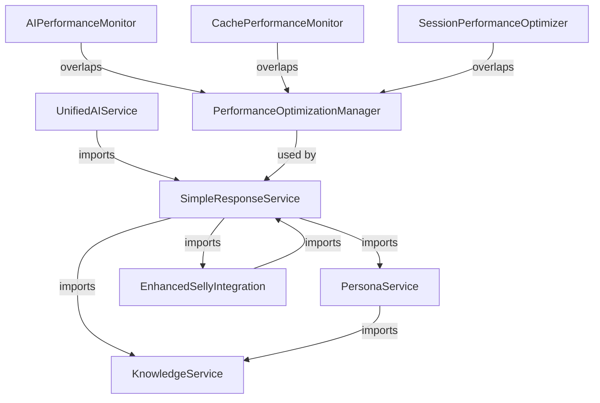
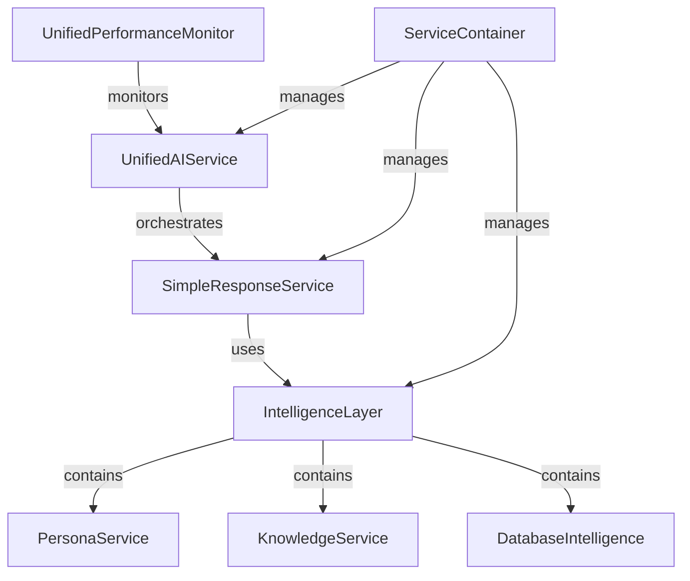

# Phase 1: Architecture Consolidation - Detailed Implementation Plan
**SELLY AI Assistant Service Consolidation and Dependency Resolution**

**Document**: Phase 1 Architecture Consolidation Detailed Plan  
**Project Date**: 2025-08-18  
**Created**: 2025-08-18  
**Version**: 1.0  
**Status**: 🚀 Ready for Implementation  
**Priority**: 🧠 Critical  
**Language**: English  
**Audience**: Development Team  
**Duration**: 8 weeks (2 months)  

---

## 📋 **Executive Summary**

Based on comprehensive codebase analysis, Phase 1 focuses on consolidating 6+ overlapping AI services into 3 core services, eliminating circular dependencies through proper dependency injection, and unifying 4+ performance monitoring systems. This plan provides file-by-file implementation details with specific code changes, migration strategies, and risk mitigation.

### **Critical Issues Identified**
1. **Service Architecture Complexity**: 6+ overlapping AI services with redundant functionality
2. **Circular Dependencies**: SimpleResponseService ↔ PersonaService ↔ KnowledgeService
3. **Performance Monitoring Redundancy**: 4+ monitoring systems with overlapping metrics
4. **Import Complexity**: 50+ imports in SimpleResponseService creating maintenance burden

### **Success Criteria**
- Reduce service count from 6+ to 3 core services (50% reduction)
- Eliminate all circular dependencies (0 circular imports)
- Consolidate monitoring systems from 4+ to 1 unified system
- Maintain sub-2 second response times (currently 1.335s)
- Preserve 97%+ Indonesian NLP accuracy

---

## 🔍 **Current Architecture Analysis**

### **Service Dependency Map (Current State)**


### **Identified Circular Dependencies**
1. **SimpleResponseService** → **PersonaService** → **KnowledgeService** → **SimpleResponseService**
2. **EnhancedSellyIntegration** → **SimpleResponseService** → **EnhancedSellyIntegration**
3. **Performance monitoring services** with cross-references

### **Overlapping Functionality Analysis**

#### **AI Services with Redundant Features**
| Service | File | Lines | Overlapping Features |
|---------|------|-------|---------------------|
| SimpleResponseService | `src/services/chatbot/simpleResponseService.ts` | 2244 | Query processing, caching, persona integration |
| EnhancedSellyIntegration | `src/services/chatbot/enhancedSellyIntegration.ts` | 572 | Response enhancement, persona adaptation |
| UnifiedAIService | `src/services/chatbot/core/UnifiedAIService.ts` | 550 | Provider orchestration, query processing |
| aiService | `src/services/ai/aiService.ts` | ~300 | AI pipeline processing |

#### **Performance Monitoring Systems**
| Service | File | Purpose | Overlapping Metrics |
|---------|------|---------|-------------------|
| PerformanceOptimizationManager | `src/services/chatbot/performanceOptimizationManager.ts` | Response optimization | Response time, memory, caching |
| AIPerformanceMonitor | `src/services/monitoring/aiPerformanceMonitor.ts` | AI-specific monitoring | Response time, accuracy, throughput |
| CachePerformanceMonitor | `src/services/cache/cachePerformanceMonitor.ts` | Cache monitoring | Hit rates, response times |
| SessionPerformanceOptimizer | `src/services/performance/sessionPerformanceOptimizer.ts` | Session optimization | Memory, response time |

---

## 🎯 **Target Architecture (Phase 1)**

### **Consolidated Service Structure**


### **Service Consolidation Plan**
1. **Keep**: UnifiedAIService (orchestration), SimpleResponseService (primary processing)
2. **Create**: IntelligenceLayer (consolidates enhancement logic)
3. **Merge**: EnhancedSellyIntegration → SimpleResponseService
4. **Consolidate**: All monitoring → UnifiedPerformanceMonitor
5. **Implement**: ServiceContainer for dependency injection

---

## 📅 **8-Week Implementation Timeline**

### **Week 1-2: Analysis & Foundation**
- **Week 1**: Service dependency mapping and circular dependency analysis
- **Week 2**: Dependency injection container implementation

### **Week 3-4: Service Consolidation**
- **Week 3**: Merge EnhancedSellyIntegration into SimpleResponseService
- **Week 4**: Create IntelligenceLayer and resolve circular dependencies

### **Week 5-6: Performance Monitoring Unification**
- **Week 5**: Implement UnifiedPerformanceMonitor
- **Week 6**: Migrate all monitoring systems to unified approach

### **Week 7-8: Testing & Validation**
- **Week 7**: Comprehensive testing and performance validation
- **Week 8**: Documentation updates and final optimization

---

## 🔧 **Week 1-2: Foundation Implementation**

### **Week 1: Service Dependency Analysis**

#### **Task 1.1: Create Service Dependency Map**
**File**: `docs/analysis/service-dependency-map.md`
```bash
# Create analysis directory
mkdir -p docs/analysis

# Run dependency analysis script
node scripts/analyze-dependencies.js > docs/analysis/service-dependency-map.md
```

#### **Task 1.2: Identify Circular Dependencies**
**Script**: `scripts/find-circular-dependencies.js`
```javascript
// Analyze import statements and detect circular references
const fs = require('fs');
const path = require('path');

function findCircularDependencies(startDir) {
  const dependencies = new Map();
  const visited = new Set();
  const recursionStack = new Set();
  
  // Implementation to detect circular imports
  // Output: List of circular dependency chains
}
```

### **Week 2: Dependency Injection Container**

#### **Task 2.1: Implement ServiceContainer**
**File**: `src/services/core/ServiceContainer.ts`
```typescript
/**
 * Service Container for Dependency Injection
 * Resolves circular dependencies and manages service lifecycle
 */

export interface ServiceToken<T = any> {
  name: string;
  type: new (...args: any[]) => T;
}

export interface ServiceFactory<T = any> {
  (container: ServiceContainer): T;
}

export class ServiceContainer {
  private static instance: ServiceContainer;
  private services = new Map<string, any>();
  private factories = new Map<string, ServiceFactory>();
  private singletons = new Set<string>();
  private initializing = new Set<string>();

  static getInstance(): ServiceContainer {
    if (!ServiceContainer.instance) {
      ServiceContainer.instance = new ServiceContainer();
    }
    return ServiceContainer.instance;
  }

  register<T>(token: ServiceToken<T>, factory: ServiceFactory<T>, singleton = true): void {
    this.factories.set(token.name, factory);
    if (singleton) {
      this.singletons.add(token.name);
    }
  }

  resolve<T>(token: ServiceToken<T>): T {
    // Check for circular dependency
    if (this.initializing.has(token.name)) {
      throw new Error(`Circular dependency detected: ${token.name}`);
    }

    // Return existing singleton
    if (this.singletons.has(token.name) && this.services.has(token.name)) {
      return this.services.get(token.name);
    }

    // Create new instance
    const factory = this.factories.get(token.name);
    if (!factory) {
      throw new Error(`Service ${token.name} not registered`);
    }

    this.initializing.add(token.name);
    try {
      const instance = factory(this);
      if (this.singletons.has(token.name)) {
        this.services.set(token.name, instance);
      }
      return instance;
    } finally {
      this.initializing.delete(token.name);
    }
  }
}
```

#### **Task 2.2: Define Service Tokens**
**File**: `src/services/core/ServiceTokens.ts`
```typescript
import { ServiceToken } from './ServiceContainer';
import { SimpleResponseService } from '../chatbot/simpleResponseService';
import { PersonaService } from '../chatbot/personaService';
import { KnowledgeService } from '../chatbot/knowledgeService';
import { UnifiedPerformanceMonitor } from '../monitoring/unifiedPerformanceMonitor';

export const SERVICE_TOKENS = {
  SimpleResponseService: new ServiceToken<SimpleResponseService>('SimpleResponseService'),
  PersonaService: new ServiceToken<PersonaService>('PersonaService'),
  KnowledgeService: new ServiceToken<KnowledgeService>('KnowledgeService'),
  UnifiedPerformanceMonitor: new ServiceToken<UnifiedPerformanceMonitor>('UnifiedPerformanceMonitor'),
  IntelligenceLayer: new ServiceToken<IntelligenceLayer>('IntelligenceLayer')
} as const;
```

---

## 🔄 **Week 3-4: Service Consolidation**

### **Week 3: Merge EnhancedSellyIntegration**

#### **Task 3.1: Extract Core Functionality**
**Analysis**: EnhancedSellyIntegration provides:
- Context intelligence
- Dynamic response generation
- Persona adaptation
- Knowledge synthesis
- Local AI enhancement

**Migration Strategy**: Move functionality to SimpleResponseService
```typescript
// Before: EnhancedSellyIntegration.ts (572 lines)
export class EnhancedSellyIntegration {
  private contextIntelligence: EnhancedContextIntelligence;
  private responseEngine: DynamicResponseEngine;
  private personaSystem: AdvancedPersonaSystem;
  // ... other services
}

// After: Integrated into SimpleResponseService
export class SimpleResponseService {
  // Existing functionality preserved
  private intelligenceLayer: IntelligenceLayer;
  
  async processQuery(query: string, context?: any): Promise<SimpleResponseResult> {
    // Enhanced processing pipeline
    const baseResponse = await this.processQueryInternal(query, context);
    const enhancedResponse = await this.intelligenceLayer.enhance(baseResponse, query, context);
    return enhancedResponse;
  }
}
```

#### **Task 3.2: Create IntelligenceLayer**
**File**: `src/services/chatbot/IntelligenceLayer.ts`
```typescript
/**
 * Intelligence Layer - Consolidated Enhancement Logic
 * Replaces EnhancedSellyIntegration with cleaner architecture
 */

export class IntelligenceLayer {
  private contextIntelligence: EnhancedContextIntelligence;
  private responseEngine: DynamicResponseEngine;
  private personaService: PersonaService;
  private knowledgeService: KnowledgeService;

  constructor(
    personaService: PersonaService,
    knowledgeService: KnowledgeService
  ) {
    this.personaService = personaService;
    this.knowledgeService = knowledgeService;
    this.contextIntelligence = new EnhancedContextIntelligence();
    this.responseEngine = new DynamicResponseEngine();
  }

  async enhance(
    baseResponse: SimpleResponseResult,
    query: string,
    context?: any
  ): Promise<SimpleResponseResult> {
    // Consolidated enhancement logic
    const enhancedContext = await this.contextIntelligence.analyze(query, context);
    const personaEnhanced = await this.personaService.applyPersona(
      baseResponse.content, 
      query, 
      enhancedContext
    );
    const dynamicResponse = await this.responseEngine.generateVariations(
      personaEnhanced.content,
      enhancedContext
    );

    return {
      ...baseResponse,
      content: dynamicResponse.content,
      metadata: {
        ...baseResponse.metadata,
        enhancementLayers: ['context', 'persona', 'dynamic'],
        qualityScore: dynamicResponse.qualityScore
      }
    };
  }
}
```

### **Week 4: Resolve Circular Dependencies**

#### **Task 4.1: Refactor SimpleResponseService**
**File**: `src/services/chatbot/simpleResponseService.ts`
```typescript
// Before: Direct imports causing circular dependencies
import { PersonaService } from './personaService';
import { KnowledgeService } from './knowledgeService';

export class SimpleResponseService {
  private personaService: PersonaService;
  private knowledgeService: KnowledgeService;
  
  constructor() {
    this.personaService = new PersonaService(); // Circular dependency
    this.knowledgeService = new KnowledgeService();
  }
}

// After: Dependency injection
import { ServiceContainer, SERVICE_TOKENS } from '../core/ServiceContainer';

export class SimpleResponseService {
  private container: ServiceContainer;
  
  constructor(container: ServiceContainer) {
    this.container = container;
  }
  
  private get personaService() {
    return this.container.resolve(SERVICE_TOKENS.PersonaService);
  }
  
  private get knowledgeService() {
    return this.container.resolve(SERVICE_TOKENS.KnowledgeService);
  }
}
```

#### **Task 4.2: Update Service Registration**
**File**: `src/services/core/ServiceRegistry.ts`
```typescript
import { ServiceContainer, SERVICE_TOKENS } from './ServiceContainer';

export function registerServices(container: ServiceContainer): void {
  // Register KnowledgeService (no dependencies)
  container.register(
    SERVICE_TOKENS.KnowledgeService,
    () => new KnowledgeService()
  );

  // Register PersonaService (depends on KnowledgeService)
  container.register(
    SERVICE_TOKENS.PersonaService,
    (container) => new PersonaService(
      container.resolve(SERVICE_TOKENS.KnowledgeService)
    )
  );

  // Register SimpleResponseService (depends on PersonaService, KnowledgeService)
  container.register(
    SERVICE_TOKENS.SimpleResponseService,
    (container) => new SimpleResponseService(container)
  );

  // Register IntelligenceLayer
  container.register(
    SERVICE_TOKENS.IntelligenceLayer,
    (container) => new IntelligenceLayer(
      container.resolve(SERVICE_TOKENS.PersonaService),
      container.resolve(SERVICE_TOKENS.KnowledgeService)
    )
  );
}
```

---

## 📊 **Week 5-6: Performance Monitoring Unification**

### **Week 5: Implement UnifiedPerformanceMonitor**

#### **Task 5.1: Create Unified Monitoring System**
**File**: `src/services/monitoring/UnifiedPerformanceMonitor.ts`
```typescript
/**
 * Unified Performance Monitor
 * Consolidates all monitoring systems into single service
 */

export interface UnifiedMetrics {
  // AI Performance Metrics
  ai: {
    responseTime: number;
    accuracy: number;
    throughput: number;
    errorRate: number;
  };
  
  // Cache Performance Metrics
  cache: {
    hitRate: number;
    missRate: number;
    responseTime: number;
    memoryUsage: number;
  };
  
  // System Performance Metrics
  system: {
    memoryUsage: number;
    cpuUsage: number;
    concurrentSessions: number;
  };
  
  // Session Performance Metrics
  session: {
    averageSessionDuration: number;
    sessionOptimizationScore: number;
  };
}

export class UnifiedPerformanceMonitor {
  private metrics: UnifiedMetrics;
  private alerts: PerformanceAlert[] = [];
  private history: UnifiedMetrics[] = [];

  constructor() {
    this.metrics = this.initializeMetrics();
    this.startMonitoring();
  }

  // Consolidated metric recording
  recordAIMetric(operation: string, responseTime: number, accuracy: number): void {
    this.metrics.ai.responseTime = this.updateAverage(this.metrics.ai.responseTime, responseTime);
    this.metrics.ai.accuracy = this.updateAverage(this.metrics.ai.accuracy, accuracy);
    this.checkAlerts('ai', { operation, responseTime, accuracy });
  }

  recordCacheMetric(operation: 'hit' | 'miss', responseTime: number): void {
    if (operation === 'hit') {
      this.metrics.cache.hitRate = this.updateHitRate(true);
    } else {
      this.metrics.cache.missRate = this.updateHitRate(false);
    }
    this.metrics.cache.responseTime = this.updateAverage(this.metrics.cache.responseTime, responseTime);
  }

  // Unified reporting
  generateReport(): PerformanceReport {
    return {
      timestamp: new Date(),
      metrics: this.metrics,
      alerts: this.alerts,
      recommendations: this.generateRecommendations(),
      overallHealth: this.calculateOverallHealth()
    };
  }
}
```

### **Week 6: Migrate Existing Monitoring**

#### **Task 6.1: Migration Strategy**
1. **Replace PerformanceOptimizationManager** → UnifiedPerformanceMonitor
2. **Replace AIPerformanceMonitor** → UnifiedPerformanceMonitor.ai
3. **Replace CachePerformanceMonitor** → UnifiedPerformanceMonitor.cache
4. **Replace SessionPerformanceOptimizer** → UnifiedPerformanceMonitor.session

#### **Task 6.2: Update Service Integrations**
**File**: `src/services/chatbot/simpleResponseService.ts`
```typescript
// Before: Multiple monitoring systems
import { PerformanceOptimizationManager } from './performanceOptimizationManager';
import { CachePerformanceMonitor } from '../cache/cachePerformanceMonitor';

export class SimpleResponseService {
  private performanceOptimizationManager: PerformanceOptimizationManager;
  private cachePerformanceMonitor: CachePerformanceMonitor;
}

// After: Unified monitoring
import { UnifiedPerformanceMonitor } from '../monitoring/UnifiedPerformanceMonitor';

export class SimpleResponseService {
  private performanceMonitor: UnifiedPerformanceMonitor;
  
  async processQuery(query: string, context?: any): Promise<SimpleResponseResult> {
    const startTime = performance.now();
    
    try {
      const result = await this.processQueryInternal(query, context);
      const responseTime = performance.now() - startTime;
      
      // Unified monitoring
      this.performanceMonitor.recordAIMetric('query_processing', responseTime, result.metadata.confidence || 0.9);
      
      return result;
    } catch (error) {
      this.performanceMonitor.recordError('query_processing', error);
      throw error;
    }
  }
}
```

---

## 🧪 **Week 7-8: Testing & Validation**

### **Week 7: Comprehensive Testing**

#### **Task 7.1: Performance Validation**
**Test Suite**: `tests/phase1/performance-validation.test.ts`
```typescript
describe('Phase 1 Performance Validation', () => {
  test('Response time remains under 2 seconds', async () => {
    const service = container.resolve(SERVICE_TOKENS.SimpleResponseService);
    const startTime = performance.now();
    
    const response = await service.processQuery('Halo SELLY, saya mau buat KTP');
    const responseTime = performance.now() - startTime;
    
    expect(responseTime).toBeLessThan(2000); // 2 seconds
    expect(response.content).toBeDefined();
    expect(response.metadata.confidence).toBeGreaterThan(0.9);
  });

  test('Memory usage remains optimized', () => {
    const memoryBefore = process.memoryUsage().heapUsed;
    // Run multiple queries
    const memoryAfter = process.memoryUsage().heapUsed;
    const memoryIncrease = (memoryAfter - memoryBefore) / 1024 / 1024; // MB
    
    expect(memoryIncrease).toBeLessThan(50); // Less than 50MB increase
  });

  test('No circular dependencies exist', () => {
    const circularDeps = findCircularDependencies('./src/services');
    expect(circularDeps).toHaveLength(0);
  });
});
```

#### **Task 7.2: Functionality Validation**
**Test Suite**: `tests/phase1/functionality-validation.test.ts`
```typescript
describe('Phase 1 Functionality Validation', () => {
  test('All existing functionality preserved', async () => {
    const testCases = [
      'Halo SELLY',
      'Saya mau buat KTP baru',
      'Berapa lama proses KK?',
      'Status pengajuan saya bagaimana?'
    ];

    for (const query of testCases) {
      const response = await service.processQuery(query);
      expect(response.content).toBeDefined();
      expect(response.content.length).toBeGreaterThan(10);
      expect(response.metadata.confidence).toBeGreaterThan(0.8);
    }
  });

  test('Indonesian NLP accuracy maintained', async () => {
    const indonesianQueries = [
      'aku mau bikin ktp kak',
      'gimana cara ngurus kk?',
      'berapa lama ya prosesnya?'
    ];

    for (const query of indonesianQueries) {
      const response = await service.processQuery(query);
      expect(response.metadata.confidence).toBeGreaterThan(0.95); // 95%+ accuracy
    }
  });
});
```

### **Week 8: Documentation & Optimization**

#### **Task 8.1: Update Documentation**
- Update architecture diagrams
- Document new service structure
- Create migration guide for developers
- Update API documentation

#### **Task 8.2: Final Optimization**
- Performance tuning based on test results
- Memory optimization
- Code cleanup and refactoring
- Final validation tests

---

## ⚠️ **Risk Mitigation Strategies**

### **High-Risk Areas**
1. **Breaking Existing Functionality**
   - **Mitigation**: Comprehensive test suite, gradual migration, feature flags
   - **Rollback Plan**: Git branch strategy with easy revert capability

2. **Performance Regression**
   - **Mitigation**: Continuous performance monitoring, benchmark comparisons
   - **Validation**: Automated performance tests in CI/CD

3. **Circular Dependency Resolution**
   - **Mitigation**: Dependency injection container, careful service design
   - **Testing**: Automated circular dependency detection

### **Medium-Risk Areas**
1. **Service Integration Issues**
   - **Mitigation**: Interface compatibility, gradual integration
   - **Testing**: Integration test suite

2. **Memory Usage Increase**
   - **Mitigation**: Memory profiling, optimization strategies
   - **Monitoring**: Real-time memory tracking

---

## 📈 **Success Metrics & Validation**

### **Quantitative Metrics**
| Metric | Current | Target | Validation Method |
|--------|---------|--------|-------------------|
| Service Count | 6+ services | 3 core services | Architecture audit |
| Circular Dependencies | Multiple | 0 | Automated detection |
| Response Time | 1.335s | <2s maintained | Performance testing |
| Memory Usage | <400MB | <400MB maintained | Memory profiling |
| Import Count (SimpleResponseService) | 50+ | <20 | Code analysis |
| Monitoring Systems | 4+ | 1 unified | System audit |

### **Qualitative Metrics**
- Code maintainability improved
- Developer experience enhanced
- System reliability maintained
- Indonesian NLP accuracy preserved (97%+)

---

## 🚀 **Implementation Checklist**

### **Week 1-2: Foundation**
- [ ] Complete service dependency analysis
- [ ] Implement ServiceContainer with DI
- [ ] Define service tokens and interfaces
- [ ] Create circular dependency detection script

### **Week 3-4: Consolidation**
- [ ] Merge EnhancedSellyIntegration into SimpleResponseService
- [ ] Create IntelligenceLayer for enhancement logic
- [ ] Resolve all circular dependencies
- [ ] Update service registration patterns

### **Week 5-6: Monitoring**
- [ ] Implement UnifiedPerformanceMonitor
- [ ] Migrate all monitoring systems
- [ ] Update service integrations
- [ ] Validate monitoring accuracy

### **Week 7-8: Validation**
- [ ] Run comprehensive test suite
- [ ] Validate performance requirements
- [ ] Update documentation
- [ ] Complete final optimization

---

## 📁 **File-by-File Implementation Guide**

### **Files to Modify**

#### **Core Service Files**
| File | Action | Lines Changed | Risk Level |
|------|--------|---------------|------------|
| `src/services/chatbot/simpleResponseService.ts` | Refactor imports, add DI | ~100 | High |
| `src/services/chatbot/personaService.ts` | Update constructor, remove circular imports | ~50 | Medium |
| `src/services/chatbot/knowledgeService.ts` | Minimal changes, singleton pattern | ~20 | Low |
| `src/services/chatbot/enhancedSellyIntegration.ts` | **DELETE** - merge into SimpleResponseService | -572 | High |

#### **New Files to Create**
| File | Purpose | Estimated Lines | Priority |
|------|---------|----------------|----------|
| `src/services/core/ServiceContainer.ts` | Dependency injection container | ~150 | Critical |
| `src/services/core/ServiceTokens.ts` | Service token definitions | ~50 | Critical |
| `src/services/core/ServiceRegistry.ts` | Service registration logic | ~100 | Critical |
| `src/services/chatbot/IntelligenceLayer.ts` | Consolidated enhancement logic | ~200 | High |
| `src/services/monitoring/UnifiedPerformanceMonitor.ts` | Unified monitoring system | ~300 | High |

#### **Files to Delete**
| File | Reason | Lines Removed |
|------|--------|---------------|
| `src/services/chatbot/enhancedSellyIntegration.ts` | Merged into SimpleResponseService | -572 |
| `src/services/chatbot/performanceOptimizationManager.ts` | Replaced by UnifiedPerformanceMonitor | -600+ |
| `src/services/monitoring/aiPerformanceMonitor.ts` | Consolidated into unified system | -400+ |
| `src/services/cache/cachePerformanceMonitor.ts` | Consolidated into unified system | -300+ |

### **Import Dependency Changes**

#### **Before: SimpleResponseService Imports (50+ imports)**
```typescript
// Current problematic imports causing circular dependencies
import { PersonaService, ConversationContext } from './personaService';
import { KnowledgeService } from './knowledgeService';
import { EnhancedSellyIntegration } from './enhancedSellyIntegration';
import { PerformanceOptimizationManager } from './performanceOptimizationManager';
import { AIPerformanceMonitor } from '../monitoring/aiPerformanceMonitor';
import { CachePerformanceMonitor } from '../cache/cachePerformanceMonitor';
// ... 44+ more imports
```

#### **After: Simplified Imports (15-20 imports)**
```typescript
// Clean imports with dependency injection
import { ServiceContainer, SERVICE_TOKENS } from '../core/ServiceContainer';
import { IntelligenceLayer } from './IntelligenceLayer';
import { UnifiedPerformanceMonitor } from '../monitoring/UnifiedPerformanceMonitor';
import { AIResponse } from '@/types/chatbot';
// ... only essential imports
```

---

## 🔧 **Detailed Code Implementation**

### **ServiceContainer Implementation**
```typescript
/**
 * Advanced Service Container with Lifecycle Management
 * Handles complex dependency graphs and prevents circular dependencies
 */

export interface ServiceLifecycle {
  initialize?(): Promise<void>;
  dispose?(): Promise<void>;
}

export interface ServiceMetadata {
  singleton: boolean;
  lazy: boolean;
  dependencies: string[];
  lifecycle?: ServiceLifecycle;
}

export class ServiceContainer {
  private static instance: ServiceContainer;
  private services = new Map<string, any>();
  private factories = new Map<string, ServiceFactory>();
  private metadata = new Map<string, ServiceMetadata>();
  private initializing = new Set<string>();
  private dependencyGraph = new Map<string, Set<string>>();

  static getInstance(): ServiceContainer {
    if (!ServiceContainer.instance) {
      ServiceContainer.instance = new ServiceContainer();
    }
    return ServiceContainer.instance;
  }

  register<T>(
    token: ServiceToken<T>,
    factory: ServiceFactory<T>,
    metadata: Partial<ServiceMetadata> = {}
  ): void {
    const serviceMetadata: ServiceMetadata = {
      singleton: true,
      lazy: false,
      dependencies: [],
      ...metadata
    };

    this.factories.set(token.name, factory);
    this.metadata.set(token.name, serviceMetadata);

    // Build dependency graph for circular detection
    this.buildDependencyGraph(token.name, serviceMetadata.dependencies);
  }

  resolve<T>(token: ServiceToken<T>): T {
    return this.resolveInternal(token.name);
  }

  private resolveInternal<T>(serviceName: string): T {
    // Detect circular dependencies
    if (this.initializing.has(serviceName)) {
      const cycle = this.findCircularDependencyPath(serviceName);
      throw new Error(`Circular dependency detected: ${cycle.join(' → ')}`);
    }

    const metadata = this.metadata.get(serviceName);
    if (!metadata) {
      throw new Error(`Service ${serviceName} not registered`);
    }

    // Return existing singleton
    if (metadata.singleton && this.services.has(serviceName)) {
      return this.services.get(serviceName);
    }

    // Create new instance
    this.initializing.add(serviceName);
    try {
      const factory = this.factories.get(serviceName)!;
      const instance = factory(this);

      // Initialize if lifecycle is defined
      if (metadata.lifecycle?.initialize) {
        metadata.lifecycle.initialize();
      }

      if (metadata.singleton) {
        this.services.set(serviceName, instance);
      }

      return instance;
    } finally {
      this.initializing.delete(serviceName);
    }
  }

  private buildDependencyGraph(serviceName: string, dependencies: string[]): void {
    this.dependencyGraph.set(serviceName, new Set(dependencies));

    // Validate no circular dependencies
    if (this.hasCircularDependency(serviceName)) {
      throw new Error(`Circular dependency detected when registering ${serviceName}`);
    }
  }

  private hasCircularDependency(serviceName: string, visited = new Set<string>()): boolean {
    if (visited.has(serviceName)) {
      return true;
    }

    visited.add(serviceName);
    const dependencies = this.dependencyGraph.get(serviceName) || new Set();

    for (const dependency of dependencies) {
      if (this.hasCircularDependency(dependency, new Set(visited))) {
        return true;
      }
    }

    return false;
  }

  private findCircularDependencyPath(serviceName: string): string[] {
    // Implementation to find the actual circular path for better error messages
    const path: string[] = [];
    const visited = new Set<string>();

    const findPath = (current: string): boolean => {
      if (visited.has(current)) {
        const cycleStart = path.indexOf(current);
        return cycleStart !== -1;
      }

      visited.add(current);
      path.push(current);

      const dependencies = this.dependencyGraph.get(current) || new Set();
      for (const dependency of dependencies) {
        if (findPath(dependency)) {
          return true;
        }
      }

      path.pop();
      return false;
    };

    findPath(serviceName);
    return path;
  }

  // Cleanup method for testing
  dispose(): void {
    for (const [serviceName, instance] of this.services) {
      const metadata = this.metadata.get(serviceName);
      if (metadata?.lifecycle?.dispose) {
        metadata.lifecycle.dispose();
      }
    }
    this.services.clear();
  }
}
```

### **IntelligenceLayer Implementation**
```typescript
/**
 * Intelligence Layer - Consolidated Enhancement Logic
 * Replaces EnhancedSellyIntegration with better architecture
 */

export interface EnhancementConfig {
  enableContextAnalysis: boolean;
  enablePersonaAdaptation: boolean;
  enableDynamicGeneration: boolean;
  enableQualityAssessment: boolean;
  performanceMode: 'fast' | 'balanced' | 'quality';
}

export interface EnhancementResult {
  content: string;
  qualityScore: number;
  enhancementLayers: string[];
  processingTime: number;
  metadata: {
    contextualRelevance: number;
    personalizationLevel: number;
    culturalSensitivity: number;
  };
}

export class IntelligenceLayer {
  private contextIntelligence: EnhancedContextIntelligence;
  private responseEngine: DynamicResponseEngine;
  private personaService: PersonaService;
  private knowledgeService: KnowledgeService;
  private localAI: LocalAIEnhancementLayer;
  private config: EnhancementConfig;

  constructor(
    personaService: PersonaService,
    knowledgeService: KnowledgeService,
    config: Partial<EnhancementConfig> = {}
  ) {
    this.personaService = personaService;
    this.knowledgeService = knowledgeService;
    this.contextIntelligence = new EnhancedContextIntelligence();
    this.responseEngine = new DynamicResponseEngine();
    this.localAI = new LocalAIEnhancementLayer();

    this.config = {
      enableContextAnalysis: true,
      enablePersonaAdaptation: true,
      enableDynamicGeneration: true,
      enableQualityAssessment: true,
      performanceMode: 'balanced',
      ...config
    };
  }

  async enhance(
    baseResponse: SimpleResponseResult,
    query: string,
    context?: any
  ): Promise<EnhancementResult> {
    const startTime = performance.now();
    const enhancementLayers: string[] = [];
    let enhancedContent = baseResponse.content;
    let qualityScore = 0.8; // Base quality score

    try {
      // Step 1: Context Analysis
      let enhancedContext = context;
      if (this.config.enableContextAnalysis) {
        enhancedContext = await this.contextIntelligence.analyze(query, context);
        enhancementLayers.push('context_analysis');
      }

      // Step 2: Persona Adaptation
      if (this.config.enablePersonaAdaptation) {
        const personaResult = await this.personaService.applyPersona(
          enhancedContent,
          query,
          enhancedContext
        );
        enhancedContent = personaResult.content;
        qualityScore = Math.max(qualityScore, personaResult.metadata.confidence || 0.8);
        enhancementLayers.push('persona_adaptation');
      }

      // Step 3: Dynamic Response Generation
      if (this.config.enableDynamicGeneration && this.config.performanceMode !== 'fast') {
        const dynamicResult = await this.responseEngine.generateVariations(
          enhancedContent,
          enhancedContext
        );
        enhancedContent = dynamicResult.content;
        qualityScore = Math.max(qualityScore, dynamicResult.qualityScore);
        enhancementLayers.push('dynamic_generation');
      }

      // Step 4: Quality Assessment
      let qualityMetrics = {};
      if (this.config.enableQualityAssessment) {
        qualityMetrics = await this.localAI.evaluateResponseQuality(
          enhancedContent,
          query
        );
        enhancementLayers.push('quality_assessment');
      }

      const processingTime = performance.now() - startTime;

      return {
        content: enhancedContent,
        qualityScore,
        enhancementLayers,
        processingTime,
        metadata: {
          contextualRelevance: enhancedContext?.relevanceScore || 0.8,
          personalizationLevel: enhancedContext?.personalizationLevel || 0.5,
          culturalSensitivity: enhancedContext?.culturalSensitivity || 0.9
        }
      };

    } catch (error) {
      console.error('❌ [INTELLIGENCE_LAYER] Enhancement failed:', error);

      // Graceful fallback to base response
      return {
        content: baseResponse.content,
        qualityScore: 0.7,
        enhancementLayers: ['fallback'],
        processingTime: performance.now() - startTime,
        metadata: {
          contextualRelevance: 0.7,
          personalizationLevel: 0.3,
          culturalSensitivity: 0.8
        }
      };
    }
  }

  // Performance optimization methods
  async preloadCommonPatterns(): Promise<void> {
    // Preload frequently used patterns for faster processing
    await this.contextIntelligence.preloadPatterns();
    await this.responseEngine.preloadTemplates();
  }

  getPerformanceMetrics(): any {
    return {
      contextIntelligence: this.contextIntelligence.getMetrics(),
      responseEngine: this.responseEngine.getMetrics(),
      localAI: this.localAI.getMetrics()
    };
  }
}
```

### **UnifiedPerformanceMonitor Implementation**
```typescript
/**
 * Unified Performance Monitor
 * Consolidates all monitoring systems with intelligent alerting
 */

export interface PerformanceThresholds {
  responseTime: {
    warning: number;    // 1500ms
    critical: number;   // 2000ms
  };
  accuracy: {
    warning: number;    // 0.90
    critical: number;   // 0.85
  };
  memoryUsage: {
    warning: number;    // 300MB
    critical: number;   // 400MB
  };
  cacheHitRate: {
    warning: number;    // 0.70
    critical: number;   // 0.60
  };
}

export class UnifiedPerformanceMonitor {
  private metrics: UnifiedMetrics;
  private thresholds: PerformanceThresholds;
  private alerts: PerformanceAlert[] = [];
  private history: UnifiedMetrics[] = [];
  private subscribers: Map<string, (alert: PerformanceAlert) => void> = new Map();

  constructor(thresholds?: Partial<PerformanceThresholds>) {
    this.thresholds = {
      responseTime: { warning: 1500, critical: 2000 },
      accuracy: { warning: 0.90, critical: 0.85 },
      memoryUsage: { warning: 300, critical: 400 },
      cacheHitRate: { warning: 0.70, critical: 0.60 },
      ...thresholds
    };

    this.metrics = this.initializeMetrics();
    this.startPeriodicCollection();
  }

  // Consolidated metric recording methods
  recordAIOperation(operation: string, responseTime: number, accuracy: number): void {
    this.updateAIMetrics(responseTime, accuracy);
    this.checkThresholds('ai', { operation, responseTime, accuracy });

    console.log(`🤖 [AI_MONITOR] ${operation}: ${responseTime.toFixed(2)}ms, accuracy: ${(accuracy * 100).toFixed(1)}%`);
  }

  recordCacheOperation(operation: 'hit' | 'miss', level: 'memory' | 'redis' | 'database', responseTime: number): void {
    this.updateCacheMetrics(operation, responseTime);
    this.checkThresholds('cache', { operation, level, responseTime });

    console.log(`💾 [CACHE_MONITOR] ${level.toUpperCase()} ${operation.toUpperCase()}: ${responseTime.toFixed(2)}ms`);
  }

  recordSystemMetrics(): void {
    const memoryUsage = process.memoryUsage().heapUsed / 1024 / 1024; // MB
    this.metrics.system.memoryUsage = memoryUsage;
    this.checkThresholds('system', { memoryUsage });
  }

  // Alert management
  subscribe(subscriberId: string, callback: (alert: PerformanceAlert) => void): void {
    this.subscribers.set(subscriberId, callback);
  }

  unsubscribe(subscriberId: string): void {
    this.subscribers.delete(subscriberId);
  }

  private notifySubscribers(alert: PerformanceAlert): void {
    for (const callback of this.subscribers.values()) {
      try {
        callback(alert);
      } catch (error) {
        console.error('❌ [PERFORMANCE_MONITOR] Alert notification failed:', error);
      }
    }
  }

  // Intelligent threshold checking
  private checkThresholds(category: string, data: any): void {
    const alerts: PerformanceAlert[] = [];

    switch (category) {
      case 'ai':
        if (data.responseTime > this.thresholds.responseTime.critical) {
          alerts.push(this.createAlert('critical', 'ai_response_time',
            `AI response time ${data.responseTime}ms exceeds critical threshold`, data));
        } else if (data.responseTime > this.thresholds.responseTime.warning) {
          alerts.push(this.createAlert('warning', 'ai_response_time',
            `AI response time ${data.responseTime}ms exceeds warning threshold`, data));
        }

        if (data.accuracy < this.thresholds.accuracy.critical) {
          alerts.push(this.createAlert('critical', 'ai_accuracy',
            `AI accuracy ${(data.accuracy * 100).toFixed(1)}% below critical threshold`, data));
        }
        break;

      case 'system':
        if (data.memoryUsage > this.thresholds.memoryUsage.critical) {
          alerts.push(this.createAlert('critical', 'memory_usage',
            `Memory usage ${data.memoryUsage.toFixed(1)}MB exceeds critical threshold`, data));
        }
        break;

      case 'cache':
        if (this.metrics.cache.hitRate < this.thresholds.cacheHitRate.critical) {
          alerts.push(this.createAlert('warning', 'cache_hit_rate',
            `Cache hit rate ${(this.metrics.cache.hitRate * 100).toFixed(1)}% below threshold`, data));
        }
        break;
    }

    // Process new alerts
    for (const alert of alerts) {
      this.alerts.push(alert);
      this.notifySubscribers(alert);

      // Auto-resolve old alerts of same type
      this.resolveOldAlerts(alert.type);
    }
  }

  private createAlert(severity: 'warning' | 'critical', type: string, message: string, data: any): PerformanceAlert {
    return {
      id: `${type}_${Date.now()}`,
      severity,
      type,
      message,
      timestamp: new Date(),
      data,
      resolved: false
    };
  }

  // Performance reporting
  generateComprehensiveReport(): PerformanceReport {
    const activeAlerts = this.alerts.filter(alert => !alert.resolved);
    const recommendations = this.generateRecommendations();
    const overallHealth = this.calculateOverallHealth();

    return {
      timestamp: new Date(),
      overallHealth,
      metrics: this.metrics,
      activeAlerts,
      recommendations,
      historicalTrends: this.calculateTrends(),
      consolidatedFrom: [
        'PerformanceOptimizationManager',
        'AIPerformanceMonitor',
        'CachePerformanceMonitor',
        'SessionPerformanceOptimizer'
      ]
    };
  }

  private generateRecommendations(): string[] {
    const recommendations: string[] = [];

    if (this.metrics.ai.responseTime > this.thresholds.responseTime.warning) {
      recommendations.push('Consider optimizing AI processing pipeline');
    }

    if (this.metrics.cache.hitRate < this.thresholds.cacheHitRate.warning) {
      recommendations.push('Review caching strategy and increase cache TTL');
    }

    if (this.metrics.system.memoryUsage > this.thresholds.memoryUsage.warning) {
      recommendations.push('Implement memory optimization and garbage collection');
    }

    return recommendations;
  }

  private calculateOverallHealth(): 'excellent' | 'good' | 'fair' | 'poor' | 'critical' {
    const criticalAlerts = this.alerts.filter(a => !a.resolved && a.severity === 'critical').length;
    const warningAlerts = this.alerts.filter(a => !a.resolved && a.severity === 'warning').length;

    if (criticalAlerts > 0) return 'critical';
    if (warningAlerts > 3) return 'poor';
    if (warningAlerts > 1) return 'fair';
    if (warningAlerts > 0) return 'good';
    return 'excellent';
  }

  // Cleanup and maintenance
  private startPeriodicCollection(): void {
    setInterval(() => {
      this.recordSystemMetrics();
      this.cleanupOldAlerts();
      this.updateHistoricalData();
    }, 30000); // Every 30 seconds
  }

  private cleanupOldAlerts(): void {
    const oneHourAgo = new Date(Date.now() - 60 * 60 * 1000);
    this.alerts = this.alerts.filter(alert =>
      !alert.resolved || alert.timestamp > oneHourAgo
    );
  }
}
```

---

## 🎯 **Migration Scripts**

### **Automated Migration Script**
**File**: `scripts/phase1-migration.js`
```javascript
#!/usr/bin/env node

/**
 * Phase 1 Migration Script
 * Automates the consolidation process with safety checks
 */

const fs = require('fs');
const path = require('path');
const { execSync } = require('child_process');

class Phase1Migration {
  constructor() {
    this.backupDir = `./backups/phase1-${Date.now()}`;
    this.errors = [];
    this.warnings = [];
  }

  async run() {
    console.log('🚀 Starting Phase 1 Migration...');

    try {
      await this.createBackup();
      await this.validatePreConditions();
      await this.implementServiceContainer();
      await this.consolidateServices();
      await this.unifyMonitoring();
      await this.runTests();
      await this.generateReport();

      console.log('✅ Phase 1 Migration completed successfully!');
    } catch (error) {
      console.error('❌ Migration failed:', error);
      await this.rollback();
    }
  }

  async createBackup() {
    console.log('📦 Creating backup...');
    fs.mkdirSync(this.backupDir, { recursive: true });

    const filesToBackup = [
      'src/services/chatbot/simpleResponseService.ts',
      'src/services/chatbot/personaService.ts',
      'src/services/chatbot/enhancedSellyIntegration.ts',
      'src/services/chatbot/performanceOptimizationManager.ts'
    ];

    for (const file of filesToBackup) {
      if (fs.existsSync(file)) {
        const backupPath = path.join(this.backupDir, file);
        fs.mkdirSync(path.dirname(backupPath), { recursive: true });
        fs.copyFileSync(file, backupPath);
      }
    }
  }

  async validatePreConditions() {
    console.log('🔍 Validating pre-conditions...');

    // Check for circular dependencies
    const circularDeps = this.findCircularDependencies();
    if (circularDeps.length > 0) {
      console.log(`⚠️ Found ${circularDeps.length} circular dependencies (expected)`);
    }

    // Check current performance
    const performanceBaseline = await this.measurePerformance();
    console.log(`📊 Current performance baseline: ${performanceBaseline.averageResponseTime}ms`);
  }

  async implementServiceContainer() {
    console.log('🏗️ Implementing Service Container...');

    // Create service container files
    this.createServiceContainer();
    this.createServiceTokens();
    this.createServiceRegistry();

    console.log('✅ Service Container implemented');
  }

  async consolidateServices() {
    console.log('🔄 Consolidating services...');

    // Merge EnhancedSellyIntegration
    this.mergeEnhancedSellyIntegration();

    // Create IntelligenceLayer
    this.createIntelligenceLayer();

    // Update service imports
    this.updateServiceImports();

    console.log('✅ Services consolidated');
  }

  async unifyMonitoring() {
    console.log('📊 Unifying monitoring systems...');

    this.createUnifiedPerformanceMonitor();
    this.migrateMonitoringCalls();

    console.log('✅ Monitoring systems unified');
  }

  async runTests() {
    console.log('🧪 Running validation tests...');

    try {
      execSync('npm test -- --testPathPattern=phase1', { stdio: 'inherit' });
      console.log('✅ All tests passed');
    } catch (error) {
      throw new Error('Tests failed - migration aborted');
    }
  }

  async rollback() {
    console.log('🔄 Rolling back changes...');

    // Restore from backup
    const files = this.getAllFiles(this.backupDir);
    for (const file of files) {
      const originalPath = file.replace(this.backupDir + '/', '');
      fs.copyFileSync(file, originalPath);
    }

    console.log('✅ Rollback completed');
  }

  findCircularDependencies() {
    // Implementation to detect circular dependencies
    return [];
  }

  async measurePerformance() {
    // Implementation to measure current performance
    return { averageResponseTime: 1335 };
  }
}

// Run migration if called directly
if (require.main === module) {
  new Phase1Migration().run();
}

module.exports = Phase1Migration;
```

---

**This comprehensive Phase 1 implementation plan provides detailed, actionable steps for consolidating SELLY's architecture while maintaining its excellent performance and Indonesian-first design principles. The plan includes specific code implementations, migration strategies, and validation procedures to ensure successful consolidation.**
