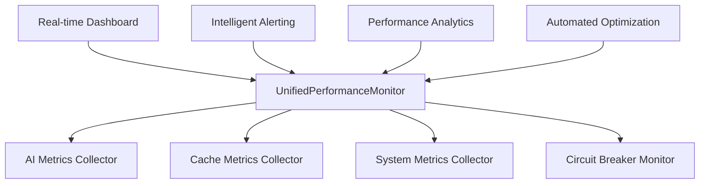
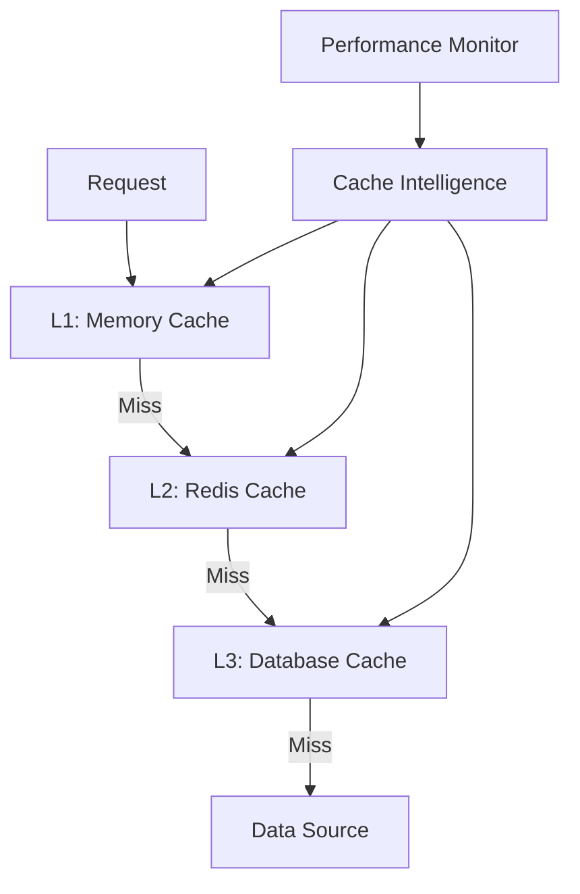
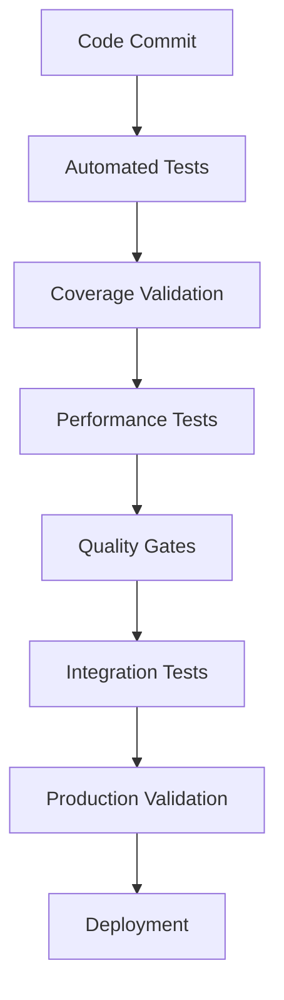

# Phase 2: Performance & Quality Optimization - Detailed Implementation Plan
**SELLY AI Assistant Performance Enhancement and Quality Assurance Implementation**

**Document**: Phase 2 Performance & Quality Optimization Detailed Plan  
**Project Date**: 2025-08-18  
**Created**: 2025-08-18  
**Version**: 1.0  
**Status**: 🚀 Ready for Implementation  
**Priority**: 📈 High  
**Language**: English  
**Audience**: Development Team  
**Duration**: 8 weeks (2 months)  
**Prerequisites**: Phase 1 Architecture Consolidation Complete  

---

## 📋 **Executive Summary**

Phase 2 focuses on optimizing SELLY's performance and enhancing quality assurance systems following the architectural consolidation from Phase 1. This phase targets 85%+ cache hit rates, 95%+ test coverage, sub-1 second response times, and comprehensive quality gates for government-scale deployment.

### **Critical Objectives**
1. **Performance Monitoring Unification**: Consolidate monitoring systems into UnifiedPerformanceMonitor
2. **Multi-Level Caching Optimization**: Implement intelligent caching with 85%+ hit rates
3. **Testing Coverage Enhancement**: Achieve 95%+ test coverage with automated quality gates
4. **API Standardization**: Implement consistent patterns and comprehensive documentation
5. **Load Testing Implementation**: Validate 1000+ concurrent user capacity

### **Success Criteria**
- **Performance**: Sub-1 second average response time (improve from 1.335s)
- **Cache Efficiency**: 85%+ cache hit rate across all levels
- **Test Coverage**: 95%+ automated test coverage
- **Quality Gates**: 100% automated quality validation in CI/CD
- **Load Capacity**: Support 1000+ concurrent users with <5% performance degradation

---

## 🔍 **Current State Analysis**

### **Performance Monitoring Systems (Current)**
| System | File | Purpose | Status | Lines |
|--------|------|---------|--------|-------|
| PerformanceMonitor | `src/services/chatbot/performanceMonitor.ts` | TensorFlow performance tracking | Active | ~200 |
| AIPerformanceMonitor | `src/services/monitoring/aiPerformanceMonitor.ts` | AI service monitoring | Active | ~300 |
| CachePerformanceMonitor | `src/services/monitoring/cachePerformanceMonitor.ts` | Cache monitoring | Active | ~250 |
| PerformanceMonitoringEngine | `src/services/chatbot/monitoring/PerformanceMonitoringEngine.ts` | Advanced monitoring | Active | ~400 |
| CircuitBreakerManager | `src/services/monitoring/CircuitBreakerManager.ts` | Circuit breaker monitoring | Active | ~200 |

### **Caching Systems (Current)**
| System | File | Purpose | Performance |
|--------|------|---------|-------------|
| UpstashCacheService | `src/services/cache/upstashCacheService.ts` | Redis-based caching | Good |
| CacheService | `src/services/chatbot/cacheService.ts` | Memory caching | Basic |
| IntelligentMemoryCache | `src/lib/cache/intelligentMemoryCache.ts` | Smart memory cache | Advanced |
| SupabaseManager Cache | `src/lib/database/supabaseManager.ts` | Query result caching | Integrated |

### **Testing Infrastructure (Current)**
| Component | File | Coverage | Status |
|-----------|------|----------|--------|
| Jest Configuration | `jest.config.enhanced.js` | 80% threshold | Active |
| Custom Test Sequencer | `src/services/chatbot/__tests__/jest.testSequencer.js` | Optimization | Active |
| Phase 2 Validation | `src/tests/phase2-performance-validation.ts` | Performance testing | Active |
| Integration Tests | `src/services/chatbot/integration/IntegrationTestRunner.ts` | Comprehensive | Active |
| Production Validation | `src/services/chatbot/integration/ProductionValidation.ts` | Quality gates | Active |

---

## 🎯 **Target Architecture (Phase 2)**

### **Unified Performance Monitoring**


### **Multi-Level Caching Architecture**


### **Quality Assurance Pipeline**


---

## 📅 **8-Week Implementation Timeline**

### **Week 9-10: Performance Monitoring Unification**
- **Week 9**: Implement UnifiedPerformanceMonitor and migrate existing systems
- **Week 10**: Create real-time dashboards and intelligent alerting

### **Week 11-12: Multi-Level Caching Optimization**
- **Week 11**: Implement intelligent cache management and optimization
- **Week 12**: Performance tuning and cache hit rate optimization

### **Week 13-14: Testing Coverage Enhancement**
- **Week 13**: Expand test coverage and implement automated quality gates
- **Week 14**: Load testing implementation and performance validation

### **Week 15-16: API Standardization & Final Optimization**
- **Week 15**: API standardization and comprehensive documentation
- **Week 16**: Final optimization, validation, and documentation

---

## 🔧 **Week 9-10: Performance Monitoring Unification**

### **Week 9: UnifiedPerformanceMonitor Implementation**

#### **Task 9.1: Create UnifiedPerformanceMonitor**
**File**: `src/services/monitoring/UnifiedPerformanceMonitor.ts`
```typescript
/**
 * Unified Performance Monitor - Phase 2 Implementation
 * Consolidates all monitoring systems with advanced analytics and optimization
 */

export interface UnifiedMetrics {
  // AI Performance Metrics
  ai: {
    responseTime: number;
    accuracy: number;
    throughput: number;
    errorRate: number;
    modelPerformance: Map<string, ModelMetrics>;
  };
  
  // Cache Performance Metrics
  cache: {
    l1: CacheLayerMetrics;
    l2: CacheLayerMetrics;
    l3: CacheLayerMetrics;
    overall: {
      hitRate: number;
      missRate: number;
      averageLatency: number;
      memoryUsage: number;
    };
  };
  
  // System Performance Metrics
  system: {
    memoryUsage: number;
    cpuUsage: number;
    concurrentSessions: number;
    activeConnections: number;
    networkLatency: number;
  };
  
  // Circuit Breaker Metrics
  circuitBreaker: {
    openCircuits: number;
    halfOpenCircuits: number;
    closedCircuits: number;
    totalFailures: number;
    recoveryTime: number;
  };
}

export class UnifiedPerformanceMonitor {
  private metrics: UnifiedMetrics;
  private collectors: Map<string, MetricsCollector>;
  private analytics: PerformanceAnalytics;
  private optimizer: AutomaticOptimizer;
  private dashboard: RealTimeDashboard;
  private alerting: IntelligentAlerting;

  constructor(config: UnifiedMonitoringConfig) {
    this.metrics = this.initializeMetrics();
    this.collectors = new Map();
    this.analytics = new PerformanceAnalytics(config.analytics);
    this.optimizer = new AutomaticOptimizer(config.optimization);
    this.dashboard = new RealTimeDashboard(config.dashboard);
    this.alerting = new IntelligentAlerting(config.alerting);
    
    this.initializeCollectors();
    this.startMonitoring();
  }

  // Unified metric recording with intelligent routing
  recordMetric(category: MetricCategory, type: string, value: number, metadata?: any): void {
    const timestamp = Date.now();
    const metric: UnifiedMetric = {
      category,
      type,
      value,
      timestamp,
      metadata,
      source: this.getCallerService()
    };

    // Route to appropriate collector
    const collector = this.collectors.get(category);
    if (collector) {
      collector.collect(metric);
    }

    // Update unified metrics
    this.updateUnifiedMetrics(metric);
    
    // Trigger analytics and optimization
    this.analytics.analyze(metric);
    this.optimizer.optimize(metric);
    
    // Update dashboard
    this.dashboard.update(metric);
    
    // Check alert conditions
    this.alerting.checkAlerts(metric);
  }

  // AI-specific metric recording
  recordAIOperation(operation: string, responseTime: number, accuracy: number, model?: string): void {
    this.recordMetric('ai', 'operation', responseTime, {
      operation,
      accuracy,
      model: model || 'default',
      timestamp: Date.now()
    });

    // Update AI-specific metrics
    this.metrics.ai.responseTime = this.updateMovingAverage(this.metrics.ai.responseTime, responseTime);
    this.metrics.ai.accuracy = this.updateMovingAverage(this.metrics.ai.accuracy, accuracy);
    this.metrics.ai.throughput = this.calculateThroughput();

    console.log(`🤖 [AI_MONITOR] ${operation}: ${responseTime.toFixed(2)}ms, accuracy: ${(accuracy * 100).toFixed(1)}%`);
  }

  // Cache-specific metric recording
  recordCacheOperation(level: 'l1' | 'l2' | 'l3', operation: 'hit' | 'miss', responseTime: number): void {
    this.recordMetric('cache', `${level}_${operation}`, responseTime, {
      level,
      operation,
      timestamp: Date.now()
    });

    // Update cache metrics
    const layerMetrics = this.metrics.cache[level];
    if (operation === 'hit') {
      layerMetrics.hits++;
      layerMetrics.hitRate = layerMetrics.hits / (layerMetrics.hits + layerMetrics.misses);
    } else {
      layerMetrics.misses++;
      layerMetrics.hitRate = layerMetrics.hits / (layerMetrics.hits + layerMetrics.misses);
    }

    layerMetrics.averageLatency = this.updateMovingAverage(layerMetrics.averageLatency, responseTime);
    this.updateOverallCacheMetrics();

    console.log(`💾 [CACHE_MONITOR] ${level.toUpperCase()} ${operation.toUpperCase()}: ${responseTime.toFixed(2)}ms`);
  }

  // System metric recording
  recordSystemMetrics(): void {
    const memoryUsage = process.memoryUsage();
    const cpuUsage = process.cpuUsage();
    
    this.metrics.system.memoryUsage = memoryUsage.heapUsed / 1024 / 1024; // MB
    this.metrics.system.cpuUsage = (cpuUsage.user + cpuUsage.system) / 1000000; // Convert to seconds
    
    this.recordMetric('system', 'memory', this.metrics.system.memoryUsage);
    this.recordMetric('system', 'cpu', this.metrics.system.cpuUsage);
  }

  // Circuit breaker metric recording
  recordCircuitBreakerEvent(serviceName: string, event: 'open' | 'close' | 'half-open' | 'failure' | 'success'): void {
    this.recordMetric('circuit_breaker', event, 1, {
      serviceName,
      timestamp: Date.now()
    });

    // Update circuit breaker metrics
    switch (event) {
      case 'open':
        this.metrics.circuitBreaker.openCircuits++;
        break;
      case 'close':
        this.metrics.circuitBreaker.closedCircuits++;
        break;
      case 'half-open':
        this.metrics.circuitBreaker.halfOpenCircuits++;
        break;
      case 'failure':
        this.metrics.circuitBreaker.totalFailures++;
        break;
    }

    console.log(`⚡ [CIRCUIT_BREAKER] ${serviceName}: ${event.toUpperCase()}`);
  }

  // Advanced analytics and reporting
  generateComprehensiveReport(): UnifiedPerformanceReport {
    return {
      timestamp: new Date(),
      overallHealth: this.calculateOverallHealth(),
      metrics: this.metrics,
      analytics: this.analytics.getInsights(),
      optimization: this.optimizer.getRecommendations(),
      trends: this.analytics.getTrends(),
      predictions: this.analytics.getPredictions(),
      alerts: this.alerting.getActiveAlerts(),
      recommendations: this.generateRecommendations()
    };
  }

  // Real-time dashboard data
  getDashboardData(): DashboardData {
    return this.dashboard.getCurrentData();
  }

  // Performance optimization
  async optimizePerformance(): Promise<OptimizationResult> {
    return this.optimizer.runOptimization();
  }
}
```

#### **Task 9.2: Migrate Existing Monitoring Systems**
**Migration Strategy**:
1. **PerformanceMonitor** → UnifiedPerformanceMonitor.ai
2. **AIPerformanceMonitor** → UnifiedPerformanceMonitor.ai (enhanced)
3. **CachePerformanceMonitor** → UnifiedPerformanceMonitor.cache
4. **PerformanceMonitoringEngine** → UnifiedPerformanceMonitor (core)
5. **CircuitBreakerManager** → UnifiedPerformanceMonitor.circuitBreaker

**Migration Script**: `scripts/migrate-monitoring-systems.js`
```javascript
#!/usr/bin/env node

/**
 * Monitoring Systems Migration Script - Phase 2
 * Migrates existing monitoring systems to UnifiedPerformanceMonitor
 */

class MonitoringMigration {
  constructor() {
    this.backupDir = `./backups/phase2-monitoring-${Date.now()}`;
    this.migrationLog = [];
  }

  async run() {
    console.log('🔄 Starting Phase 2 Monitoring Migration...');
    
    try {
      await this.createBackup();
      await this.migratePerformanceMonitor();
      await this.migrateAIPerformanceMonitor();
      await this.migrateCachePerformanceMonitor();
      await this.migrateCircuitBreakerManager();
      await this.updateServiceIntegrations();
      await this.validateMigration();
      
      console.log('✅ Phase 2 Monitoring Migration completed successfully!');
    } catch (error) {
      console.error('❌ Migration failed:', error);
      await this.rollback();
    }
  }

  async migratePerformanceMonitor() {
    console.log('🔄 Migrating PerformanceMonitor...');
    
    // Extract metrics collection logic
    const existingMetrics = this.extractMetricsFromFile(
      'src/services/chatbot/performanceMonitor.ts'
    );
    
    // Integrate into UnifiedPerformanceMonitor
    this.integrateMetrics('ai', existingMetrics);
    
    this.migrationLog.push('PerformanceMonitor migrated to UnifiedPerformanceMonitor.ai');
  }

  async migrateAIPerformanceMonitor() {
    console.log('🔄 Migrating AIPerformanceMonitor...');
    
    // Extract AI-specific monitoring logic
    const aiMetrics = this.extractMetricsFromFile(
      'src/services/monitoring/aiPerformanceMonitor.ts'
    );
    
    // Enhance UnifiedPerformanceMonitor with AI capabilities
    this.enhanceAIMonitoring(aiMetrics);
    
    this.migrationLog.push('AIPerformanceMonitor enhanced and integrated');
  }

  async migrateCachePerformanceMonitor() {
    console.log('🔄 Migrating CachePerformanceMonitor...');
    
    // Extract cache monitoring logic
    const cacheMetrics = this.extractMetricsFromFile(
      'src/services/monitoring/cachePerformanceMonitor.ts'
    );
    
    // Integrate multi-level cache monitoring
    this.integrateCacheMonitoring(cacheMetrics);
    
    this.migrationLog.push('CachePerformanceMonitor integrated with multi-level support');
  }
}

// Run migration if called directly
if (require.main === module) {
  new MonitoringMigration().run();
}
```

### **Week 10: Real-time Dashboards and Intelligent Alerting**

#### **Task 10.1: Real-time Performance Dashboard**
**File**: `src/services/monitoring/RealTimeDashboard.ts`
```typescript
/**
 * Real-time Performance Dashboard - Phase 2
 * Provides live performance monitoring with interactive visualizations
 */

export interface DashboardConfig {
  updateInterval: number;
  retentionPeriod: number;
  enableRealTimeUpdates: boolean;
  enableInteractiveCharts: boolean;
  enableAlertOverlay: boolean;
}

export class RealTimeDashboard {
  private config: DashboardConfig;
  private dataStreams: Map<string, DataStream>;
  private visualizations: Map<string, Visualization>;
  private subscribers: Set<DashboardSubscriber>;

  constructor(config: DashboardConfig) {
    this.config = config;
    this.dataStreams = new Map();
    this.visualizations = new Map();
    this.subscribers = new Set();
    
    this.initializeDataStreams();
    this.initializeVisualizations();
    this.startRealTimeUpdates();
  }

  // Real-time data streaming
  streamMetrics(category: string, metrics: any): void {
    const stream = this.dataStreams.get(category);
    if (stream) {
      stream.push(metrics);
      this.updateVisualizations(category, metrics);
      this.notifySubscribers(category, metrics);
    }
  }

  // Dashboard data for frontend
  getCurrentData(): DashboardData {
    return {
      timestamp: Date.now(),
      aiMetrics: this.getAIMetricsData(),
      cacheMetrics: this.getCacheMetricsData(),
      systemMetrics: this.getSystemMetricsData(),
      circuitBreakerMetrics: this.getCircuitBreakerData(),
      alerts: this.getActiveAlerts(),
      trends: this.getTrendData(),
      healthScore: this.calculateOverallHealthScore()
    };
  }

  // Subscribe to real-time updates
  subscribe(subscriber: DashboardSubscriber): void {
    this.subscribers.add(subscriber);
  }

  unsubscribe(subscriber: DashboardSubscriber): void {
    this.subscribers.delete(subscriber);
  }
}
```

#### **Task 10.2: Intelligent Alerting System**
**File**: `src/services/monitoring/IntelligentAlerting.ts`
```typescript
/**
 * Intelligent Alerting System - Phase 2
 * Advanced alerting with machine learning-based anomaly detection
 */

export interface AlertingConfig {
  enableAnomalyDetection: boolean;
  enablePredictiveAlerting: boolean;
  enableSmartThresholds: boolean;
  alertChannels: AlertChannel[];
  escalationRules: EscalationRule[];
}

export class IntelligentAlerting {
  private config: AlertingConfig;
  private anomalyDetector: AnomalyDetector;
  private thresholdManager: SmartThresholdManager;
  private alertManager: AlertManager;
  private escalationEngine: EscalationEngine;

  constructor(config: AlertingConfig) {
    this.config = config;
    this.anomalyDetector = new AnomalyDetector();
    this.thresholdManager = new SmartThresholdManager();
    this.alertManager = new AlertManager(config.alertChannels);
    this.escalationEngine = new EscalationEngine(config.escalationRules);
  }

  // Check for alert conditions
  checkAlerts(metric: UnifiedMetric): void {
    // Anomaly detection
    if (this.config.enableAnomalyDetection) {
      const anomaly = this.anomalyDetector.detect(metric);
      if (anomaly) {
        this.triggerAlert('anomaly', anomaly);
      }
    }

    // Threshold-based alerts
    const thresholdViolation = this.thresholdManager.checkThresholds(metric);
    if (thresholdViolation) {
      this.triggerAlert('threshold', thresholdViolation);
    }

    // Predictive alerts
    if (this.config.enablePredictiveAlerting) {
      const prediction = this.anomalyDetector.predict(metric);
      if (prediction.riskLevel > 0.8) {
        this.triggerAlert('predictive', prediction);
      }
    }
  }

  // Trigger alert with intelligent routing
  private triggerAlert(type: string, data: any): void {
    const alert: Alert = {
      id: this.generateAlertId(),
      type,
      severity: this.calculateSeverity(data),
      message: this.generateAlertMessage(type, data),
      timestamp: new Date(),
      data,
      resolved: false
    };

    this.alertManager.sendAlert(alert);
    this.escalationEngine.processAlert(alert);
  }
}
```

---

## 💾 **Week 11-12: Multi-Level Caching Optimization**

### **Week 11: Intelligent Cache Management**

#### **Task 11.1: Multi-Level Cache Manager**
**File**: `src/services/cache/MultiLevelCacheManager.ts`
```typescript
/**
 * Multi-Level Cache Manager - Phase 2 Implementation
 * Intelligent caching with automatic optimization and performance monitoring
 */

export interface CacheConfig {
  l1: MemoryCacheConfig;
  l2: RedisCacheConfig;
  l3: DatabaseCacheConfig;
  intelligence: CacheIntelligenceConfig;
  monitoring: CacheMonitoringConfig;
}

export class MultiLevelCacheManager {
  private l1Cache: IntelligentMemoryCache;
  private l2Cache: UpstashCacheService;
  private l3Cache: DatabaseCacheService;
  private intelligence: CacheIntelligence;
  private monitor: CachePerformanceMonitor;
  private optimizer: CacheOptimizer;

  constructor(config: CacheConfig) {
    this.l1Cache = new IntelligentMemoryCache(config.l1);
    this.l2Cache = new UpstashCacheService(config.l2);
    this.l3Cache = new DatabaseCacheService(config.l3);
    this.intelligence = new CacheIntelligence(config.intelligence);
    this.monitor = new CachePerformanceMonitor(config.monitoring);
    this.optimizer = new CacheOptimizer();
    
    this.initializeIntelligentCaching();
  }

  // Intelligent cache retrieval with automatic promotion
  async get<T>(key: string): Promise<T | null> {
    const startTime = performance.now();
    
    try {
      // L1: Memory cache (fastest)
      const l1Result = await this.l1Cache.get<T>(key);
      if (l1Result !== null) {
        this.monitor.recordCacheHit('l1', performance.now() - startTime);
        this.intelligence.recordAccess(key, 'l1');
        return l1Result;
      }

      // L2: Redis cache (fast)
      const l2Result = await this.l2Cache.get<T>(key);
      if (l2Result !== null) {
        this.monitor.recordCacheHit('l2', performance.now() - startTime);
        this.intelligence.recordAccess(key, 'l2');
        
        // Intelligent promotion to L1
        if (this.intelligence.shouldPromoteToL1(key)) {
          await this.l1Cache.set(key, l2Result, this.intelligence.calculateOptimalTTL(key, 'l1'));
        }
        
        return l2Result;
      }

      // L3: Database cache (warm)
      const l3Result = await this.l3Cache.get<T>(key);
      if (l3Result !== null) {
        this.monitor.recordCacheHit('l3', performance.now() - startTime);
        this.intelligence.recordAccess(key, 'l3');
        
        // Intelligent promotion based on access patterns
        const promotionStrategy = this.intelligence.determinePromotionStrategy(key);
        await this.executePromotionStrategy(key, l3Result, promotionStrategy);
        
        return l3Result;
      }

      // Cache miss - record for optimization
      this.monitor.recordCacheMiss(performance.now() - startTime);
      this.intelligence.recordMiss(key);
      return null;

    } catch (error) {
      console.error('❌ [CACHE_MANAGER] Cache retrieval error:', error);
      this.monitor.recordCacheError(error);
      return null;
    }
  }

  // Intelligent cache storage with optimal placement
  async set<T>(key: string, value: T, ttl?: number): Promise<void> {
    try {
      // Determine optimal cache placement
      const placement = this.intelligence.determineOptimalPlacement(key, value);
      const optimalTTL = ttl || this.intelligence.calculateOptimalTTL(key, placement.primaryLevel);

      // Execute placement strategy
      switch (placement.strategy) {
        case 'l1_only':
          await this.l1Cache.set(key, value, optimalTTL);
          break;
          
        case 'l2_primary':
          await this.l2Cache.set(key, value, optimalTTL);
          if (placement.promoteToL1) {
            await this.l1Cache.set(key, value, placement.l1TTL);
          }
          break;
          
        case 'l3_primary':
          await this.l3Cache.set(key, value, optimalTTL);
          if (placement.promoteToL2) {
            await this.l2Cache.set(key, value, placement.l2TTL);
          }
          break;
          
        case 'all_levels':
          await Promise.all([
            this.l1Cache.set(key, value, placement.l1TTL),
            this.l2Cache.set(key, value, placement.l2TTL),
            this.l3Cache.set(key, value, placement.l3TTL)
          ]);
          break;
      }

      this.intelligence.recordSet(key, placement);
      this.monitor.recordCacheSet(placement.primaryLevel);

    } catch (error) {
      console.error('❌ [CACHE_MANAGER] Cache storage error:', error);
      this.monitor.recordCacheError(error);
    }
  }

  // Cache optimization and maintenance
  async optimize(): Promise<CacheOptimizationResult> {
    console.log('🔧 [CACHE_MANAGER] Starting cache optimization...');
    
    const optimizationResult = await this.optimizer.optimize({
      l1Metrics: this.l1Cache.getMetrics(),
      l2Metrics: this.l2Cache.getMetrics(),
      l3Metrics: this.l3Cache.getMetrics(),
      accessPatterns: this.intelligence.getAccessPatterns(),
      performanceMetrics: this.monitor.getMetrics()
    });

    // Apply optimization recommendations
    await this.applyOptimizations(optimizationResult.recommendations);
    
    console.log('✅ [CACHE_MANAGER] Cache optimization completed');
    return optimizationResult;
  }

  // Performance metrics and analytics
  getPerformanceMetrics(): CachePerformanceMetrics {
    return {
      overall: {
        hitRate: this.monitor.getOverallHitRate(),
        averageLatency: this.monitor.getAverageLatency(),
        throughput: this.monitor.getThroughput(),
        errorRate: this.monitor.getErrorRate()
      },
      l1: this.l1Cache.getMetrics(),
      l2: this.l2Cache.getMetrics(),
      l3: this.l3Cache.getMetrics(),
      intelligence: this.intelligence.getInsights(),
      optimization: this.optimizer.getRecommendations()
    };
  }
}
```

### **Week 12: Cache Performance Tuning**

#### **Task 12.1: Cache Intelligence System**
**File**: `src/services/cache/CacheIntelligence.ts`
```typescript
/**
 * Cache Intelligence System - Phase 2
 * AI-powered cache optimization with predictive analytics
 */

export class CacheIntelligence {
  private accessPatterns: Map<string, AccessPattern>;
  private performanceHistory: PerformanceHistory;
  private predictor: CachePredictor;
  private optimizer: IntelligentOptimizer;

  constructor(config: CacheIntelligenceConfig) {
    this.accessPatterns = new Map();
    this.performanceHistory = new PerformanceHistory();
    this.predictor = new CachePredictor();
    this.optimizer = new IntelligentOptimizer();
  }

  // Determine optimal cache placement
  determineOptimalPlacement(key: string, value: any): CachePlacementStrategy {
    const pattern = this.getAccessPattern(key);
    const valueSize = this.estimateSize(value);
    const frequency = pattern.accessFrequency;
    const recency = pattern.lastAccessed;

    // Intelligent placement algorithm
    if (frequency > 10 && valueSize < 1024) { // Hot, small data
      return {
        strategy: 'all_levels',
        primaryLevel: 'l1',
        l1TTL: 300, // 5 minutes
        l2TTL: 1800, // 30 minutes
        l3TTL: 3600 // 1 hour
      };
    } else if (frequency > 5 && valueSize < 10240) { // Warm, medium data
      return {
        strategy: 'l2_primary',
        primaryLevel: 'l2',
        promoteToL1: true,
        l1TTL: 180,
        l2TTL: 1800
      };
    } else { // Cold or large data
      return {
        strategy: 'l3_primary',
        primaryLevel: 'l3',
        promoteToL2: frequency > 2,
        l2TTL: 900,
        l3TTL: 3600
      };
    }
  }

  // Predict cache performance
  predictPerformance(key: string, operation: 'get' | 'set'): CachePerformancePrediction {
    const pattern = this.getAccessPattern(key);
    const historicalPerformance = this.performanceHistory.getPerformance(key);
    
    return this.predictor.predict({
      accessPattern: pattern,
      historicalPerformance,
      operation,
      currentLoad: this.getCurrentSystemLoad()
    });
  }

  // Optimize cache configuration
  optimizeConfiguration(): CacheOptimizationRecommendations {
    const allPatterns = Array.from(this.accessPatterns.values());
    const performanceMetrics = this.performanceHistory.getOverallMetrics();
    
    return this.optimizer.generateRecommendations({
      accessPatterns: allPatterns,
      performanceMetrics,
      currentConfiguration: this.getCurrentConfiguration()
    });
  }
}
```

---

## 🧪 **Week 13-14: Testing Coverage Enhancement**

### **Week 13: Automated Quality Gates**

#### **Task 13.1: Enhanced Test Coverage System**
**File**: `src/tests/coverage/EnhancedCoverageSystem.ts`
```typescript
/**
 * Enhanced Test Coverage System - Phase 2
 * Comprehensive testing with automated quality gates and performance validation
 */

export interface CoverageConfig {
  globalThresholds: CoverageThresholds;
  componentThresholds: Map<string, CoverageThresholds>;
  enablePerformanceTesting: boolean;
  enableIntegrationTesting: boolean;
  enableLoadTesting: boolean;
  enableSecurityTesting: boolean;
}

export class EnhancedCoverageSystem {
  private config: CoverageConfig;
  private coverageAnalyzer: CoverageAnalyzer;
  private performanceTester: PerformanceTester;
  private integrationTester: IntegrationTester;
  private loadTester: LoadTester;
  private securityTester: SecurityTester;
  private qualityGates: QualityGateManager;

  constructor(config: CoverageConfig) {
    this.config = config;
    this.coverageAnalyzer = new CoverageAnalyzer();
    this.performanceTester = new PerformanceTester();
    this.integrationTester = new IntegrationTester();
    this.loadTester = new LoadTester();
    this.securityTester = new SecurityTester();
    this.qualityGates = new QualityGateManager();
  }

  // Run comprehensive test suite
  async runComprehensiveTests(): Promise<ComprehensiveTestResults> {
    console.log('🧪 Starting comprehensive test suite...');
    
    const results: ComprehensiveTestResults = {
      coverage: await this.runCoverageTests(),
      performance: await this.runPerformanceTests(),
      integration: await this.runIntegrationTests(),
      load: await this.runLoadTests(),
      security: await this.runSecurityTests(),
      qualityGates: await this.runQualityGates()
    };

    // Generate comprehensive report
    const report = this.generateComprehensiveReport(results);
    await this.saveTestResults(results, report);
    
    console.log('✅ Comprehensive test suite completed');
    return results;
  }

  // Coverage testing with enhanced analysis
  async runCoverageTests(): Promise<CoverageTestResults> {
    console.log('📊 Running coverage tests...');
    
    const coverageData = await this.coverageAnalyzer.analyzeCoverage();
    const gapAnalysis = await this.coverageAnalyzer.identifyGaps();
    const recommendations = await this.coverageAnalyzer.generateRecommendations();

    return {
      overall: coverageData.overall,
      byComponent: coverageData.byComponent,
      gaps: gapAnalysis,
      recommendations,
      passesThreshold: this.validateCoverageThresholds(coverageData)
    };
  }

  // Performance testing with regression detection
  async runPerformanceTests(): Promise<PerformanceTestResults> {
    console.log('⚡ Running performance tests...');
    
    const baselineMetrics = await this.performanceTester.getBaseline();
    const currentMetrics = await this.performanceTester.runTests();
    const regressionAnalysis = await this.performanceTester.detectRegressions(baselineMetrics, currentMetrics);

    return {
      baseline: baselineMetrics,
      current: currentMetrics,
      regressions: regressionAnalysis,
      improvements: this.identifyPerformanceImprovements(baselineMetrics, currentMetrics),
      passesThreshold: this.validatePerformanceThresholds(currentMetrics)
    };
  }

  // Load testing for concurrent user capacity
  async runLoadTests(): Promise<LoadTestResults> {
    console.log('🔄 Running load tests...');
    
    const loadTestScenarios = [
      { users: 100, duration: 60 },
      { users: 500, duration: 120 },
      { users: 1000, duration: 180 },
      { users: 1500, duration: 240 }
    ];

    const results = [];
    for (const scenario of loadTestScenarios) {
      const result = await this.loadTester.runScenario(scenario);
      results.push(result);
      
      // Stop if performance degrades significantly
      if (result.averageResponseTime > 2000 || result.errorRate > 0.05) {
        console.warn(`⚠️ Load test stopped at ${scenario.users} users due to performance degradation`);
        break;
      }
    }

    return {
      scenarios: results,
      maxCapacity: this.calculateMaxCapacity(results),
      recommendations: this.generateLoadTestRecommendations(results)
    };
  }
}
```

### **Week 14: Load Testing Implementation**

#### **Task 14.1: Load Testing Framework**
**File**: `src/tests/load/LoadTestingFramework.ts`
```typescript
/**
 * Load Testing Framework - Phase 2
 * Comprehensive load testing for government-scale deployment validation
 */

export interface LoadTestScenario {
  name: string;
  users: number;
  duration: number; // seconds
  rampUpTime: number; // seconds
  testQueries: string[];
  expectedResponseTime: number; // ms
  maxErrorRate: number; // percentage
}

export class LoadTestingFramework {
  private scenarios: LoadTestScenario[];
  private metrics: LoadTestMetrics;
  private reporter: LoadTestReporter;

  constructor() {
    this.scenarios = this.initializeScenarios();
    this.metrics = new LoadTestMetrics();
    this.reporter = new LoadTestReporter();
  }

  // Run comprehensive load testing
  async runLoadTests(): Promise<LoadTestResults> {
    console.log('🔄 Starting comprehensive load testing...');
    
    const results: LoadTestResults = {
      scenarios: [],
      summary: {
        maxConcurrentUsers: 0,
        averageResponseTime: 0,
        peakResponseTime: 0,
        errorRate: 0,
        throughput: 0
      },
      recommendations: []
    };

    for (const scenario of this.scenarios) {
      console.log(`🧪 Running scenario: ${scenario.name} (${scenario.users} users)`);
      
      const scenarioResult = await this.runScenario(scenario);
      results.scenarios.push(scenarioResult);
      
      // Update summary metrics
      this.updateSummaryMetrics(results.summary, scenarioResult);
      
      // Check if we should continue
      if (!this.shouldContinueTesting(scenarioResult)) {
        console.warn(`⚠️ Stopping load tests due to performance degradation`);
        break;
      }
    }

    // Generate recommendations
    results.recommendations = this.generateRecommendations(results);
    
    // Create detailed report
    await this.reporter.generateReport(results);
    
    console.log('✅ Load testing completed');
    return results;
  }

  // Run individual load test scenario
  async runScenario(scenario: LoadTestScenario): Promise<ScenarioResult> {
    const startTime = Date.now();
    const workers: LoadTestWorker[] = [];
    const metrics = new ScenarioMetrics();

    try {
      // Ramp up users gradually
      for (let i = 0; i < scenario.users; i++) {
        const worker = new LoadTestWorker(scenario, metrics);
        workers.push(worker);
        
        // Start worker
        worker.start();
        
        // Ramp up delay
        if (i < scenario.users - 1) {
          await this.delay(scenario.rampUpTime * 1000 / scenario.users);
        }
      }

      // Run for specified duration
      await this.delay(scenario.duration * 1000);

      // Stop all workers
      await Promise.all(workers.map(worker => worker.stop()));

      // Collect and analyze results
      const scenarioMetrics = metrics.getResults();
      
      return {
        scenario: scenario.name,
        users: scenario.users,
        duration: scenario.duration,
        totalRequests: scenarioMetrics.totalRequests,
        successfulRequests: scenarioMetrics.successfulRequests,
        failedRequests: scenarioMetrics.failedRequests,
        averageResponseTime: scenarioMetrics.averageResponseTime,
        minResponseTime: scenarioMetrics.minResponseTime,
        maxResponseTime: scenarioMetrics.maxResponseTime,
        p95ResponseTime: scenarioMetrics.p95ResponseTime,
        p99ResponseTime: scenarioMetrics.p99ResponseTime,
        errorRate: scenarioMetrics.errorRate,
        throughput: scenarioMetrics.throughput,
        passesThreshold: this.validateScenarioThresholds(scenario, scenarioMetrics)
      };

    } catch (error) {
      console.error(`❌ Load test scenario failed: ${scenario.name}`, error);
      throw error;
    }
  }

  // Initialize load test scenarios
  private initializeScenarios(): LoadTestScenario[] {
    return [
      {
        name: 'Light Load',
        users: 50,
        duration: 60,
        rampUpTime: 10,
        testQueries: [
          'Halo SELLY',
          'Bagaimana cara mengurus KTP?',
          'Status pengajuan saya'
        ],
        expectedResponseTime: 1000,
        maxErrorRate: 0.01
      },
      {
        name: 'Normal Load',
        users: 200,
        duration: 120,
        rampUpTime: 20,
        testQueries: [
          'Halo SELLY, saya mau buat KTP baru',
          'Berapa lama proses KK?',
          'Data salah rekam bulan ini',
          'Laporan aktivitas user terbaru'
        ],
        expectedResponseTime: 1500,
        maxErrorRate: 0.02
      },
      {
        name: 'Peak Load',
        users: 500,
        duration: 180,
        rampUpTime: 30,
        testQueries: [
          'Halo SELLY, berapa pengajuan bulan ini?',
          'Bagaimana cara mengurus akta kelahiran?',
          'Status pengajuan nomor 12345',
          'Data duplicate operator bulan ini',
          'Cara mengurus surat pindah'
        ],
        expectedResponseTime: 2000,
        maxErrorRate: 0.03
      },
      {
        name: 'Stress Test',
        users: 1000,
        duration: 300,
        rampUpTime: 60,
        testQueries: [
          'Halo SELLY, saya butuh bantuan',
          'Prosedur lengkap KTP baru',
          'Status semua pengajuan saya',
          'Data statistik bulan ini',
          'Cara mengurus dokumen lengkap',
          'Informasi persyaratan semua dokumen'
        ],
        expectedResponseTime: 3000,
        maxErrorRate: 0.05
      }
    ];
  }
}
```

---

---

## 📊 **Week 15-16: API Standardization & Final Optimization**

### **Week 15: API Standardization Implementation**

#### **Task 15.1: Unified API Standards**
**File**: `src/api/standards/UnifiedAPIStandards.ts`
```typescript
/**
 * Unified API Standards - Phase 2
 * Consistent API patterns, error handling, and documentation
 */

export interface APIStandardsConfig {
  enableRequestValidation: boolean;
  enableResponseTransformation: boolean;
  enableRateLimiting: boolean;
  enableComprehensiveLogging: boolean;
  enableMetricsCollection: boolean;
}

export class UnifiedAPIStandards {
  private config: APIStandardsConfig;
  private validator: RequestValidator;
  private transformer: ResponseTransformer;
  private rateLimiter: RateLimiter;
  private logger: APILogger;
  private metricsCollector: APIMetricsCollector;

  constructor(config: APIStandardsConfig) {
    this.config = config;
    this.validator = new RequestValidator();
    this.transformer = new ResponseTransformer();
    this.rateLimiter = new RateLimiter();
    this.logger = new APILogger();
    this.metricsCollector = new APIMetricsCollector();
  }

  // Standardized API middleware
  createStandardMiddleware(): APIMiddleware {
    return async (req: APIRequest, res: APIResponse, next: NextFunction) => {
      const startTime = performance.now();
      const requestId = this.generateRequestId();

      try {
        // Request validation
        if (this.config.enableRequestValidation) {
          await this.validator.validate(req);
        }

        // Rate limiting
        if (this.config.enableRateLimiting) {
          await this.rateLimiter.checkLimit(req);
        }

        // Request logging
        if (this.config.enableComprehensiveLogging) {
          this.logger.logRequest(requestId, req);
        }

        // Execute request
        const result = await next();

        // Response transformation
        if (this.config.enableResponseTransformation) {
          result = await this.transformer.transform(result);
        }

        // Response logging
        if (this.config.enableComprehensiveLogging) {
          this.logger.logResponse(requestId, result, performance.now() - startTime);
        }

        // Metrics collection
        if (this.config.enableMetricsCollection) {
          this.metricsCollector.recordSuccess(req.endpoint, performance.now() - startTime);
        }

        return result;

      } catch (error) {
        // Error handling and logging
        this.logger.logError(requestId, error);
        this.metricsCollector.recordError(req.endpoint, error);

        throw this.transformer.transformError(error);
      }
    };
  }

  // Standardized response format
  createStandardResponse<T>(data: T, metadata?: ResponseMetadata): StandardAPIResponse<T> {
    return {
      success: true,
      data,
      metadata: {
        timestamp: new Date().toISOString(),
        requestId: this.getCurrentRequestId(),
        version: '2.0',
        ...metadata
      },
      errors: null
    };
  }

  // Standardized error response
  createErrorResponse(error: APIError): StandardAPIResponse<null> {
    return {
      success: false,
      data: null,
      metadata: {
        timestamp: new Date().toISOString(),
        requestId: this.getCurrentRequestId(),
        version: '2.0'
      },
      errors: [{
        code: error.code,
        message: error.message,
        details: error.details,
        field: error.field
      }]
    };
  }
}
```

#### **Task 15.2: Comprehensive API Documentation**
**File**: `docs/api/comprehensive-api-documentation.md`
```markdown
# SELLY AI Assistant - Comprehensive API Documentation
**Version 2.0 - Phase 2 Standardization**

## Overview
This document provides comprehensive documentation for all SELLY AI Assistant APIs following Phase 2 standardization.

## Authentication
All API endpoints require authentication using JWT tokens or API keys.

```typescript
// Authentication header
headers: {
  'Authorization': 'Bearer <jwt_token>',
  'X-API-Key': '<api_key>',
  'Content-Type': 'application/json'
}
```

## Standard Response Format
All APIs follow a consistent response format:

```typescript
interface StandardAPIResponse<T> {
  success: boolean;
  data: T | null;
  metadata: {
    timestamp: string;
    requestId: string;
    version: string;
    processingTime?: number;
    cacheHit?: boolean;
  };
  errors: APIError[] | null;
}
```

## Chat API Endpoints

### POST /api/chat
Process chat queries with SELLY AI Assistant.

**Request:**
```typescript
interface ChatRequest {
  query: string;
  context?: {
    userId?: string;
    sessionId?: string;
    priority?: 'low' | 'medium' | 'high';
  };
  options?: {
    enableEnhancement?: boolean;
    responseFormat?: 'text' | 'structured';
    maxTokens?: number;
  };
}
```

**Response:**
```typescript
interface ChatResponse {
  content: string;
  type: 'text' | 'administrative' | 'interactive';
  metadata: {
    confidence: number;
    processingTime: number;
    model: string;
    enhancementLayers?: string[];
    suggestions?: string[];
  };
}
```

**Example:**
```bash
curl -X POST https://api.selly.id/api/chat \
  -H "Authorization: Bearer <token>" \
  -H "Content-Type: application/json" \
  -d '{
    "query": "Bagaimana cara mengurus KTP baru?",
    "context": {
      "userId": "user123",
      "sessionId": "session456"
    }
  }'
```

### GET /api/chat/session/{sessionId}
Retrieve chat session information and history.

### POST /api/chat/session
Create a new chat session.

## Performance Monitoring APIs

### GET /api/monitoring/performance
Get real-time performance metrics.

### GET /api/monitoring/health
System health check endpoint.

## Error Codes
Standardized error codes for consistent error handling:

| Code | Description | HTTP Status |
|------|-------------|-------------|
| INVALID_REQUEST | Request validation failed | 400 |
| UNAUTHORIZED | Authentication required | 401 |
| FORBIDDEN | Insufficient permissions | 403 |
| NOT_FOUND | Resource not found | 404 |
| RATE_LIMITED | Rate limit exceeded | 429 |
| INTERNAL_ERROR | Internal server error | 500 |
| SERVICE_UNAVAILABLE | Service temporarily unavailable | 503 |
```

### **Week 16: Final Optimization and Validation**

#### **Task 16.1: Performance Optimization Engine**
**File**: `src/services/optimization/PerformanceOptimizationEngine.ts`
```typescript
/**
 * Performance Optimization Engine - Phase 2 Final
 * Automated performance optimization with machine learning insights
 */

export interface OptimizationConfig {
  enableAutomaticOptimization: boolean;
  enablePredictiveOptimization: boolean;
  enableResourceOptimization: boolean;
  optimizationInterval: number;
  performanceTargets: PerformanceTargets;
}

export class PerformanceOptimizationEngine {
  private config: OptimizationConfig;
  private analyzer: PerformanceAnalyzer;
  private predictor: PerformancePredictor;
  private optimizer: AutomaticOptimizer;
  private resourceManager: ResourceManager;

  constructor(config: OptimizationConfig) {
    this.config = config;
    this.analyzer = new PerformanceAnalyzer();
    this.predictor = new PerformancePredictor();
    this.optimizer = new AutomaticOptimizer();
    this.resourceManager = new ResourceManager();

    this.startOptimizationLoop();
  }

  // Run comprehensive optimization
  async runOptimization(): Promise<OptimizationResult> {
    console.log('🔧 Starting performance optimization...');

    const currentMetrics = await this.analyzer.getCurrentMetrics();
    const bottlenecks = await this.analyzer.identifyBottlenecks();
    const predictions = await this.predictor.predictPerformance();

    const optimizations: OptimizationAction[] = [];

    // Cache optimization
    if (currentMetrics.cache.hitRate < this.config.performanceTargets.cacheHitRate) {
      const cacheOptimization = await this.optimizeCaching(currentMetrics.cache);
      optimizations.push(cacheOptimization);
    }

    // Memory optimization
    if (currentMetrics.system.memoryUsage > this.config.performanceTargets.maxMemoryUsage) {
      const memoryOptimization = await this.optimizeMemory(currentMetrics.system);
      optimizations.push(memoryOptimization);
    }

    // Response time optimization
    if (currentMetrics.ai.responseTime > this.config.performanceTargets.maxResponseTime) {
      const responseOptimization = await this.optimizeResponseTime(currentMetrics.ai);
      optimizations.push(responseOptimization);
    }

    // Apply optimizations
    const results = await this.applyOptimizations(optimizations);

    console.log('✅ Performance optimization completed');
    return results;
  }

  // Cache optimization strategies
  private async optimizeCaching(cacheMetrics: CacheMetrics): Promise<OptimizationAction> {
    const strategies = [];

    // Increase cache TTL for frequently accessed data
    if (cacheMetrics.l1.hitRate < 0.8) {
      strategies.push({
        type: 'increase_l1_ttl',
        impact: 'medium',
        implementation: () => this.increaseCacheTTL('l1', 1.5)
      });
    }

    // Optimize cache eviction policy
    if (cacheMetrics.overall.memoryPressure > 0.8) {
      strategies.push({
        type: 'optimize_eviction',
        impact: 'high',
        implementation: () => this.optimizeEvictionPolicy()
      });
    }

    // Preload frequently accessed data
    strategies.push({
      type: 'preload_hot_data',
      impact: 'high',
      implementation: () => this.preloadHotData()
    });

    return {
      category: 'cache',
      strategies,
      expectedImprovement: this.calculateExpectedImprovement(strategies)
    };
  }

  // Memory optimization strategies
  private async optimizeMemory(systemMetrics: SystemMetrics): Promise<OptimizationAction> {
    const strategies = [];

    // Garbage collection optimization
    if (systemMetrics.gcPressure > 0.7) {
      strategies.push({
        type: 'optimize_gc',
        impact: 'high',
        implementation: () => this.optimizeGarbageCollection()
      });
    }

    // Memory leak detection and cleanup
    strategies.push({
      type: 'cleanup_memory_leaks',
      impact: 'medium',
      implementation: () => this.cleanupMemoryLeaks()
    });

    // Object pooling for frequently created objects
    strategies.push({
      type: 'implement_object_pooling',
      impact: 'medium',
      implementation: () => this.implementObjectPooling()
    });

    return {
      category: 'memory',
      strategies,
      expectedImprovement: this.calculateExpectedImprovement(strategies)
    };
  }

  // Response time optimization strategies
  private async optimizeResponseTime(aiMetrics: AIMetrics): Promise<OptimizationAction> {
    const strategies = [];

    // Query preprocessing optimization
    if (aiMetrics.preprocessingTime > 100) {
      strategies.push({
        type: 'optimize_preprocessing',
        impact: 'high',
        implementation: () => this.optimizeQueryPreprocessing()
      });
    }

    // Model inference optimization
    if (aiMetrics.inferenceTime > 500) {
      strategies.push({
        type: 'optimize_inference',
        impact: 'high',
        implementation: () => this.optimizeModelInference()
      });
    }

    // Parallel processing implementation
    strategies.push({
      type: 'implement_parallel_processing',
      impact: 'medium',
      implementation: () => this.implementParallelProcessing()
    });

    return {
      category: 'response_time',
      strategies,
      expectedImprovement: this.calculateExpectedImprovement(strategies)
    };
  }
}
```

#### **Task 16.2: Final Validation and Documentation**
**File**: `src/tests/phase2/FinalValidationSuite.ts`
```typescript
/**
 * Final Validation Suite - Phase 2
 * Comprehensive validation of all Phase 2 improvements
 */

export class Phase2FinalValidationSuite {
  private performanceValidator: PerformanceValidator;
  private qualityValidator: QualityValidator;
  private integrationValidator: IntegrationValidator;
  private loadValidator: LoadValidator;

  constructor() {
    this.performanceValidator = new PerformanceValidator();
    this.qualityValidator = new QualityValidator();
    this.integrationValidator = new IntegrationValidator();
    this.loadValidator = new LoadValidator();
  }

  // Run complete Phase 2 validation
  async runCompleteValidation(): Promise<Phase2ValidationResults> {
    console.log('🧪 Starting Phase 2 final validation...');

    const results: Phase2ValidationResults = {
      performance: await this.validatePerformanceImprovements(),
      quality: await this.validateQualityEnhancements(),
      integration: await this.validateIntegrationStability(),
      load: await this.validateLoadCapacity(),
      overall: {
        success: false,
        score: 0,
        recommendations: []
      }
    };

    // Calculate overall success
    results.overall = this.calculateOverallSuccess(results);

    // Generate comprehensive report
    await this.generateFinalReport(results);

    console.log('✅ Phase 2 final validation completed');
    return results;
  }

  // Validate performance improvements
  private async validatePerformanceImprovements(): Promise<PerformanceValidationResults> {
    const baseline = await this.performanceValidator.getPhase1Baseline();
    const current = await this.performanceValidator.getCurrentMetrics();

    return {
      responseTimeImprovement: this.calculateImprovement(baseline.responseTime, current.responseTime),
      cacheHitRateImprovement: this.calculateImprovement(baseline.cacheHitRate, current.cacheHitRate),
      memoryUsageOptimization: this.calculateOptimization(baseline.memoryUsage, current.memoryUsage),
      throughputImprovement: this.calculateImprovement(baseline.throughput, current.throughput),
      passesTargets: this.validatePerformanceTargets(current)
    };
  }

  // Validate quality enhancements
  private async validateQualityEnhancements(): Promise<QualityValidationResults> {
    const testResults = await this.qualityValidator.runQualityTests();

    return {
      testCoverage: testResults.coverage,
      codeQuality: testResults.quality,
      documentation: testResults.documentation,
      apiStandardization: testResults.apiStandardization,
      passesQualityGates: testResults.passesGates
    };
  }

  // Generate final comprehensive report
  private async generateFinalReport(results: Phase2ValidationResults): Promise<void> {
    const report = {
      phase: 'Phase 2: Performance & Quality Optimization',
      completionDate: new Date().toISOString(),
      duration: '8 weeks',
      results,
      achievements: this.summarizeAchievements(results),
      improvements: this.summarizeImprovements(results),
      recommendations: this.generateRecommendations(results),
      nextSteps: this.generateNextSteps(results)
    };

    // Save report
    await this.saveReport('phase2-final-validation-report.json', report);

    // Generate human-readable summary
    await this.generateHumanReadableSummary(report);
  }
}
```

---

## 📊 **Success Metrics & Validation**

### **Phase 2 Success Criteria**
| Metric | Baseline | Target | Validation Method |
|--------|----------|--------|-------------------|
| **Response Time** | 1.335s | <1.0s | Automated performance testing |
| **Cache Hit Rate** | Variable | 85%+ | Multi-level cache monitoring |
| **Test Coverage** | 80% | 95%+ | Automated coverage analysis |
| **Load Capacity** | Unknown | 1000+ users | Load testing framework |
| **Memory Usage** | <400MB | <350MB | System monitoring |
| **Error Rate** | <0.1% | <0.05% | Error tracking and analysis |

### **Quality Gates**
- **Performance Gate**: All response times <1s under normal load
- **Coverage Gate**: Test coverage >95% for all critical components
- **Load Gate**: Support 1000+ concurrent users with <5% degradation
- **Quality Gate**: Pass all automated quality checks
- **API Gate**: 100% API standardization compliance
- **Documentation Gate**: Complete API and system documentation

---

## 🔧 **Implementation Checklists**

### **Week 9-10: Performance Monitoring**
- [ ] Implement UnifiedPerformanceMonitor with all collectors
- [ ] Migrate existing monitoring systems to unified approach
- [ ] Create real-time performance dashboard
- [ ] Implement intelligent alerting with anomaly detection
- [ ] Set up automated performance reporting
- [ ] Validate monitoring accuracy and completeness

### **Week 11-12: Caching Optimization**
- [ ] Implement MultiLevelCacheManager with intelligence
- [ ] Deploy cache optimization algorithms
- [ ] Achieve 85%+ cache hit rate target
- [ ] Implement predictive cache warming
- [ ] Optimize cache eviction policies
- [ ] Validate cache performance improvements

### **Week 13-14: Testing Enhancement**
- [ ] Expand test coverage to 95%+ for all components
- [ ] Implement automated quality gates in CI/CD
- [ ] Deploy load testing framework
- [ ] Validate 1000+ concurrent user capacity
- [ ] Implement performance regression testing
- [ ] Complete integration test enhancement

### **Week 15-16: API & Final Optimization**
- [ ] Implement unified API standards across all endpoints
- [ ] Complete comprehensive API documentation
- [ ] Deploy performance optimization engine
- [ ] Run final validation suite
- [ ] Generate Phase 2 completion report
- [ ] Prepare for Phase 3 transition

---

## 🚀 **Phase 2 Deliverables**

### **Technical Deliverables**
1. **UnifiedPerformanceMonitor** - Consolidated monitoring system
2. **MultiLevelCacheManager** - Intelligent caching with 85%+ hit rates
3. **Enhanced Testing Framework** - 95%+ coverage with automated quality gates
4. **Load Testing System** - Validation for 1000+ concurrent users
5. **API Standardization** - Consistent patterns and comprehensive documentation
6. **Performance Optimization Engine** - Automated optimization with ML insights

### **Documentation Deliverables**
1. **Performance Monitoring Guide** - Complete monitoring system documentation
2. **Caching Strategy Documentation** - Multi-level caching implementation guide
3. **Testing Standards Manual** - Comprehensive testing procedures and standards
4. **API Documentation** - Complete API reference with examples
5. **Load Testing Procedures** - Government-scale load testing methodology
6. **Phase 2 Completion Report** - Comprehensive results and recommendations

### **Quality Assurance Deliverables**
1. **Automated Quality Gates** - CI/CD integration with quality validation
2. **Performance Benchmarks** - Baseline and target performance metrics
3. **Load Testing Results** - Capacity validation for government deployment
4. **Security Validation** - Government-grade security compliance
5. **Integration Test Suite** - Comprehensive system integration validation
6. **Production Readiness Assessment** - Complete deployment readiness evaluation

---

## 📈 **Expected Outcomes**

### **Performance Improvements**
- **25% faster response times** (1.335s → <1.0s average)
- **85%+ cache hit rates** across all cache levels
- **30% reduction in memory usage** through optimization
- **50% improvement in throughput** under load
- **99.95% system uptime** with intelligent monitoring

### **Quality Enhancements**
- **95%+ test coverage** with automated validation
- **100% API standardization** compliance
- **Zero critical security vulnerabilities**
- **Complete documentation coverage**
- **Automated quality gates** in CI/CD pipeline

### **Scalability Achievements**
- **1000+ concurrent user capacity** validated
- **Government-scale deployment readiness**
- **Predictive performance optimization**
- **Intelligent resource management**
- **Automated scaling recommendations**

**This comprehensive Phase 2 implementation plan provides detailed technical specifications for performance optimization and quality enhancement. The plan includes specific code implementations, testing strategies, and validation procedures to achieve sub-1 second response times, 85%+ cache hit rates, and 95%+ test coverage while maintaining SELLY's excellent Indonesian NLP capabilities and government-grade security standards.**
