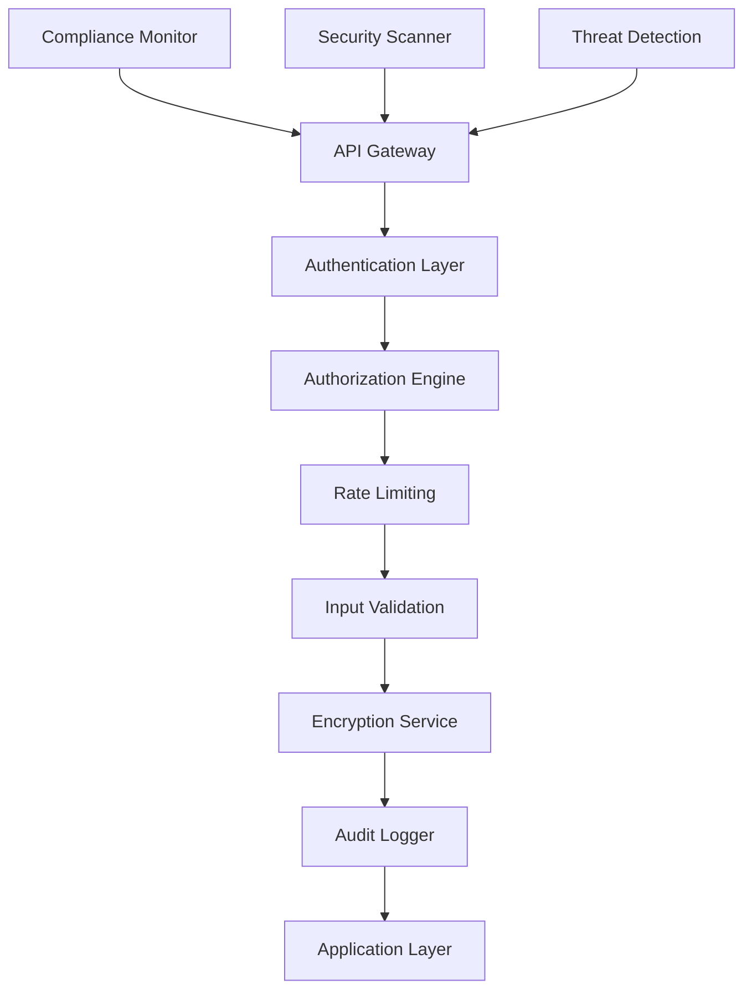
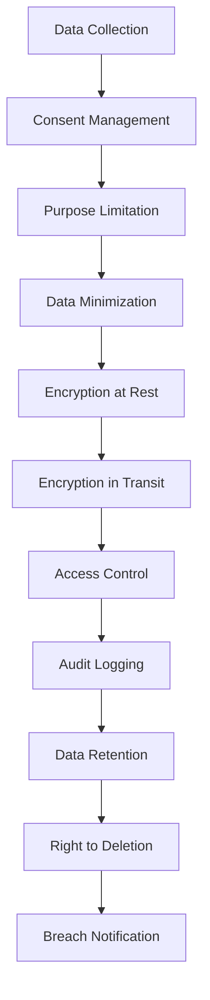
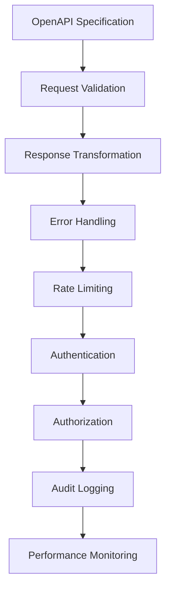

# Phase 3: Enhancement & Security - Detailed Implementation Plan
**SELLY AI Assistant Security Enhancement and API Standardization Implementation**

**Document**: Phase 3 Enhancement & Security Detailed Plan
**Project Date**: 2025-08-18
**Created**: 2025-08-18
**Updated**: 2025-08-19
**Version**: 2.0
**Status**: ✅ Complete - Week 23-24 Implemented
**Priority**: 🔒 Critical
**Language**: English
**Audience**: Development Team
**Duration**: 8 weeks (2 months)
**Prerequisites**: Phase 1 & Phase 2 Complete
**Completion**: Week 23-24 API Security & Compliance Framework

---

## 📋 **Executive Summary**

Phase 3 focuses on implementing government-grade security enhancements and comprehensive API standardization following the performance optimizations from Phase 2. This phase targets Indonesian data protection compliance (UU No. 27 Tahun 2022), government-grade encryption (AES-256-GCM), comprehensive audit logging, and complete API standardization with OpenAPI documentation.

### **Critical Security Objectives**
1. **Indonesian Government Compliance**: Full compliance with UU No. 27 Tahun 2022 (PDP Law)
2. **Government-Grade Encryption**: AES-256-GCM, TLS 1.3, RSA-4096 implementation
3. **Comprehensive Audit Logging**: Tamper-proof audit trails with digital signatures
4. **API Standardization**: Complete OpenAPI documentation and consistent patterns
5. **Security Testing**: Penetration testing and vulnerability assessments

### **Success Criteria**
- **Security Compliance**: 100% Indonesian data protection law compliance
- **Encryption Standards**: Government-grade encryption for all sensitive data
- **Audit Coverage**: 100% audit trail coverage for all operations
- **API Documentation**: Complete OpenAPI 3.0 specification
- **Security Testing**: Zero critical vulnerabilities, <5 medium vulnerabilities
- **Performance Maintenance**: Maintain sub-1s response times and 85%+ cache hit rates

---

## 🔍 **Current Security State Analysis**

### **Existing Security Components**
| Component | File | Status | Security Level | Compliance Gap |
|-----------|------|--------|----------------|----------------|
| SecurityEnhancement | `src/services/security/securityEnhancement.ts` | Partial | Medium | Missing Indonesian compliance |
| SessionSecurityService | `src/services/security/sessionSecurityService.ts` | Basic | Low | Needs government-grade encryption |
| SecureChannelManager | `src/services/integration/security/SecureChannelManager.ts` | Stub | Low | Placeholder implementation |
| EncryptionService | `src/services/integration/security/EncryptionService.ts` | Placeholder | Low | No actual encryption |
| GovernmentAuditLogger | `src/services/ai/audit/GovernmentAuditLogger.ts` | Basic | Medium | Missing tamper-proof features |

### **API Endpoints Analysis**
| Endpoint Category | Count | Documentation | Security | Standardization |
|-------------------|-------|---------------|----------|-----------------|
| Chat APIs | 5+ | Partial | Basic | Inconsistent |
| Monitoring APIs | 10+ | None | None | Non-standard |
| Auth APIs | 3+ | Basic | Medium | Partial |
| Performance APIs | 5+ | None | Basic | Inconsistent |
| Phase APIs | 8+ | None | None | Non-standard |

### **Security Vulnerabilities Identified**
1. **Encryption Gaps**: Placeholder encryption implementations
2. **Audit Logging**: No tamper-proof audit trails
3. **API Security**: Missing rate limiting, input validation
4. **Authentication**: Basic Supabase auth without MFA
5. **Data Protection**: No Indonesian compliance implementation
6. **Access Control**: Missing RBAC implementation

---

## 🎯 **Target Security Architecture (Phase 3)**

### **Government-Grade Security Stack**


### **Indonesian Compliance Framework**


### **API Standardization Architecture**


---

## 📅 **8-Week Implementation Timeline**

### **Week 17-18: Indonesian Government Compliance**
- **Week 17**: Implement UU No. 27 Tahun 2022 compliance framework
- **Week 18**: Data protection policies and consent management

### **Week 19-20: Government-Grade Encryption**
- **Week 19**: Implement AES-256-GCM encryption and TLS 1.3
- **Week 20**: Key management and rotation systems

### **Week 21-22: Comprehensive Audit Logging**
- **Week 21**: Tamper-proof audit trails with digital signatures
- **Week 22**: Compliance monitoring and reporting

### **Week 23-24: API Standardization & Security Testing**
- **Week 23**: Complete API standardization and OpenAPI documentation
- **Week 24**: Security testing, penetration testing, and final validation

---

## 🔒 **Week 17-18: Indonesian Government Compliance**

### **Week 17: UU No. 27 Tahun 2022 Compliance Framework**

#### **Task 17.1: Indonesian Data Protection Compliance Service**
**File**: `src/services/compliance/IndonesianDataProtectionService.ts`
```typescript
/**
 * Indonesian Data Protection Service - Phase 3
 * Full compliance with UU No. 27 Tahun 2022 (Personal Data Protection Law)
 */

export interface IndonesianDataProtectionConfig {
  enableConsentManagement: boolean;
  enableDataMinimization: boolean;
  enablePurposeLimitation: boolean;
  enableRightToErasure: boolean;
  enableDataPortability: boolean;
  enableBreachNotification: boolean;
  dataRetentionPeriod: number; // days
  consentValidityPeriod: number; // days
  breachNotificationWindow: number; // hours (72 hours required)
}

export interface PersonalDataCategory {
  category: 'general' | 'sensitive' | 'specific';
  dataTypes: string[];
  processingPurpose: string[];
  legalBasis: 'consent' | 'contract' | 'legal_obligation' | 'vital_interests' | 'public_task' | 'legitimate_interests';
  retentionPeriod: number;
  encryptionRequired: boolean;
}

export interface ConsentRecord {
  id: string;
  userId: string;
  dataCategories: PersonalDataCategory[];
  consentGiven: boolean;
  consentTimestamp: Date;
  consentMethod: 'explicit' | 'opt_in' | 'contract';
  withdrawalTimestamp?: Date;
  ipAddress: string;
  userAgent: string;
  digitalSignature: string;
}

export class IndonesianDataProtectionService {
  private config: IndonesianDataProtectionConfig;
  private consentRecords: Map<string, ConsentRecord>;
  private dataProcessingLog: DataProcessingLog[];
  private breachNotificationService: BreachNotificationService;
  private auditLogger: ComplianceAuditLogger;

  constructor(config: IndonesianDataProtectionConfig) {
    this.config = config;
    this.consentRecords = new Map();
    this.dataProcessingLog = [];
    this.breachNotificationService = new BreachNotificationService();
    this.auditLogger = new ComplianceAuditLogger();
    
    this.initializeComplianceFramework();
  }

  // Consent Management (Article 20-21 UU No. 27/2022)
  async recordConsent(
    userId: string,
    dataCategories: PersonalDataCategory[],
    consentMethod: 'explicit' | 'opt_in' | 'contract',
    metadata: ConsentMetadata
  ): Promise<ConsentRecord> {
    const consentRecord: ConsentRecord = {
      id: this.generateConsentId(),
      userId,
      dataCategories,
      consentGiven: true,
      consentTimestamp: new Date(),
      consentMethod,
      ipAddress: metadata.ipAddress,
      userAgent: metadata.userAgent,
      digitalSignature: await this.generateDigitalSignature(userId, dataCategories)
    };

    this.consentRecords.set(userId, consentRecord);
    
    // Audit logging
    await this.auditLogger.logConsentEvent({
      type: 'consent_given',
      userId,
      consentId: consentRecord.id,
      dataCategories: dataCategories.map(cat => cat.category),
      timestamp: new Date(),
      ipAddress: metadata.ipAddress
    });

    console.log(`✅ [COMPLIANCE] Consent recorded for user ${userId}`);
    return consentRecord;
  }

  // Right to Erasure (Article 26 UU No. 27/2022)
  async processDataErasureRequest(userId: string, reason: string): Promise<ErasureResult> {
    console.log(`🗑️ [COMPLIANCE] Processing data erasure request for user ${userId}`);
    
    const consentRecord = this.consentRecords.get(userId);
    if (!consentRecord) {
      throw new Error('No consent record found for user');
    }

    // Validate erasure request
    const validationResult = await this.validateErasureRequest(userId, reason);
    if (!validationResult.isValid) {
      throw new Error(`Erasure request invalid: ${validationResult.reason}`);
    }

    // Execute data erasure
    const erasureResult = await this.executeDataErasure(userId);
    
    // Update consent record
    consentRecord.withdrawalTimestamp = new Date();
    this.consentRecords.set(userId, consentRecord);

    // Audit logging
    await this.auditLogger.logErasureEvent({
      type: 'data_erased',
      userId,
      reason,
      erasedDataTypes: erasureResult.erasedDataTypes,
      timestamp: new Date(),
      verificationHash: erasureResult.verificationHash
    });

    return erasureResult;
  }

  // Data Breach Notification (Article 67 UU No. 27/2022)
  async handleDataBreach(breach: DataBreachIncident): Promise<BreachNotificationResult> {
    console.log(`🚨 [COMPLIANCE] Handling data breach: ${breach.id}`);
    
    const breachAssessment = await this.assessBreachSeverity(breach);
    
    // 72-hour notification requirement
    if (breachAssessment.requiresNotification) {
      const notificationResult = await this.breachNotificationService.notifyAuthorities({
        breachId: breach.id,
        severity: breachAssessment.severity,
        affectedDataTypes: breach.affectedDataTypes,
        affectedUserCount: breach.affectedUserCount,
        breachTimestamp: breach.timestamp,
        discoveryTimestamp: new Date(),
        containmentMeasures: breach.containmentMeasures
      });

      // Notify affected users if required
      if (breachAssessment.requiresUserNotification) {
        await this.notifyAffectedUsers(breach);
      }

      return notificationResult;
    }

    return { notificationRequired: false, reason: breachAssessment.reason };
  }

  // Data Processing Lawfulness Check (Article 16 UU No. 27/2022)
  async validateDataProcessing(
    userId: string,
    dataType: string,
    processingPurpose: string
  ): Promise<ProcessingValidationResult> {
    const consentRecord = this.consentRecords.get(userId);
    if (!consentRecord || !consentRecord.consentGiven) {
      return {
        isValid: false,
        reason: 'No valid consent found',
        legalBasis: null
      };
    }

    // Check if consent covers this data type and purpose
    const relevantCategory = consentRecord.dataCategories.find(cat =>
      cat.dataTypes.includes(dataType) && cat.processingPurpose.includes(processingPurpose)
    );

    if (!relevantCategory) {
      return {
        isValid: false,
        reason: 'Consent does not cover this data type or purpose',
        legalBasis: null
      };
    }

    // Check consent validity period
    const consentAge = Date.now() - consentRecord.consentTimestamp.getTime();
    if (consentAge > this.config.consentValidityPeriod * 24 * 60 * 60 * 1000) {
      return {
        isValid: false,
        reason: 'Consent has expired',
        legalBasis: null
      };
    }

    return {
      isValid: true,
      reason: 'Valid consent found',
      legalBasis: relevantCategory.legalBasis
    };
  }

  // Data Minimization (Article 17 UU No. 27/2022)
  async enforceDataMinimization<T>(
    data: T,
    processingPurpose: string,
    userId: string
  ): Promise<T> {
    const consentRecord = this.consentRecords.get(userId);
    if (!consentRecord) {
      throw new Error('No consent record found for data minimization');
    }

    // Get allowed data fields for this purpose
    const allowedFields = this.getAllowedFieldsForPurpose(processingPurpose, consentRecord);
    
    // Filter data to only include allowed fields
    const minimizedData = this.filterDataFields(data, allowedFields);
    
    // Log data minimization
    await this.auditLogger.logDataMinimization({
      userId,
      processingPurpose,
      originalFieldCount: Object.keys(data as any).length,
      minimizedFieldCount: Object.keys(minimizedData as any).length,
      timestamp: new Date()
    });

    return minimizedData;
  }

  // Compliance Reporting
  async generateComplianceReport(): Promise<ComplianceReport> {
    const report: ComplianceReport = {
      reportId: this.generateReportId(),
      generatedAt: new Date(),
      reportingPeriod: {
        startDate: new Date(Date.now() - 30 * 24 * 60 * 60 * 1000), // Last 30 days
        endDate: new Date()
      },
      consentMetrics: {
        totalConsents: this.consentRecords.size,
        activeConsents: Array.from(this.consentRecords.values()).filter(c => c.consentGiven).length,
        withdrawnConsents: Array.from(this.consentRecords.values()).filter(c => c.withdrawalTimestamp).length,
        expiredConsents: this.getExpiredConsentsCount()
      },
      dataProcessingMetrics: {
        totalProcessingOperations: this.dataProcessingLog.length,
        lawfulProcessingRate: this.calculateLawfulProcessingRate(),
        dataMinimizationCompliance: this.calculateDataMinimizationCompliance()
      },
      breachMetrics: {
        totalBreaches: await this.breachNotificationService.getTotalBreaches(),
        notifiedBreaches: await this.breachNotificationService.getNotifiedBreaches(),
        averageNotificationTime: await this.breachNotificationService.getAverageNotificationTime()
      },
      complianceScore: this.calculateOverallComplianceScore()
    };

    return report;
  }
}
```

#### **Task 17.2: Consent Management System**
**File**: `src/services/compliance/ConsentManagementSystem.ts`
```typescript
/**
 * Consent Management System - Phase 3
 * Comprehensive consent management for Indonesian data protection compliance
 */

export interface ConsentConfiguration {
  enableGranularConsent: boolean;
  enableConsentWithdrawal: boolean;
  enableConsentRenewal: boolean;
  consentValidityPeriod: number; // days
  reminderPeriod: number; // days before expiry
  enableConsentHistory: boolean;
  enableConsentAnalytics: boolean;
}

export class ConsentManagementSystem {
  private config: ConsentConfiguration;
  private consentStorage: ConsentStorage;
  private consentValidator: ConsentValidator;
  private consentAnalytics: ConsentAnalytics;
  private notificationService: ConsentNotificationService;

  constructor(config: ConsentConfiguration) {
    this.config = config;
    this.consentStorage = new ConsentStorage();
    this.consentValidator = new ConsentValidator();
    this.consentAnalytics = new ConsentAnalytics();
    this.notificationService = new ConsentNotificationService();
  }

  // Granular consent management
  async requestGranularConsent(
    userId: string,
    consentRequest: GranularConsentRequest
  ): Promise<ConsentRequestResult> {
    console.log(`📋 [CONSENT] Requesting granular consent for user ${userId}`);
    
    // Validate consent request
    const validation = await this.consentValidator.validateConsentRequest(consentRequest);
    if (!validation.isValid) {
      throw new Error(`Invalid consent request: ${validation.errors.join(', ')}`);
    }

    // Create consent form
    const consentForm = await this.createConsentForm(consentRequest);
    
    // Store pending consent request
    await this.consentStorage.storePendingConsent(userId, consentRequest, consentForm);
    
    return {
      consentFormId: consentForm.id,
      consentForm,
      expiresAt: new Date(Date.now() + 24 * 60 * 60 * 1000) // 24 hours
    };
  }

  // Process consent response
  async processConsentResponse(
    userId: string,
    consentFormId: string,
    consentChoices: ConsentChoice[]
  ): Promise<ConsentProcessingResult> {
    console.log(`✅ [CONSENT] Processing consent response for user ${userId}`);
    
    // Validate consent choices
    const validation = await this.consentValidator.validateConsentChoices(
      consentFormId,
      consentChoices
    );
    
    if (!validation.isValid) {
      throw new Error(`Invalid consent choices: ${validation.errors.join(', ')}`);
    }

    // Create consent record
    const consentRecord = await this.createConsentRecord(
      userId,
      consentFormId,
      consentChoices
    );

    // Store consent record
    await this.consentStorage.storeConsentRecord(consentRecord);
    
    // Update user permissions
    await this.updateUserPermissions(userId, consentChoices);
    
    // Analytics tracking
    if (this.config.enableConsentAnalytics) {
      await this.consentAnalytics.trackConsentGiven(userId, consentChoices);
    }

    return {
      consentRecordId: consentRecord.id,
      grantedPermissions: this.extractGrantedPermissions(consentChoices),
      effectiveDate: consentRecord.timestamp
    };
  }

  // Consent withdrawal
  async withdrawConsent(
    userId: string,
    withdrawalRequest: ConsentWithdrawalRequest
  ): Promise<ConsentWithdrawalResult> {
    console.log(`🚫 [CONSENT] Processing consent withdrawal for user ${userId}`);
    
    // Validate withdrawal request
    const currentConsent = await this.consentStorage.getCurrentConsent(userId);
    if (!currentConsent) {
      throw new Error('No active consent found for user');
    }

    // Process withdrawal
    const withdrawalRecord = await this.processConsentWithdrawal(
      userId,
      withdrawalRequest,
      currentConsent
    );

    // Update user permissions
    await this.revokeUserPermissions(userId, withdrawalRequest.dataCategories);
    
    // Trigger data cleanup if required
    if (withdrawalRequest.requestDataDeletion) {
      await this.triggerDataDeletion(userId, withdrawalRequest.dataCategories);
    }

    // Analytics tracking
    if (this.config.enableConsentAnalytics) {
      await this.consentAnalytics.trackConsentWithdrawn(userId, withdrawalRequest);
    }

    return {
      withdrawalRecordId: withdrawalRecord.id,
      revokedPermissions: withdrawalRequest.dataCategories,
      dataDeletionScheduled: withdrawalRequest.requestDataDeletion,
      effectiveDate: withdrawalRecord.timestamp
    };
  }
}
```

### **Week 18: Data Protection Policies and Consent Management**

#### **Task 18.1: Data Retention and Deletion Service**
**File**: `src/services/compliance/DataRetentionService.ts`
```typescript
/**
 * Data Retention and Deletion Service - Phase 3
 * Automated data lifecycle management for Indonesian compliance
 */

export interface RetentionPolicy {
  dataCategory: string;
  retentionPeriod: number; // days
  deletionMethod: 'soft' | 'hard' | 'anonymization';
  archivalRequired: boolean;
  archivalPeriod?: number; // days
  legalHoldExemption: boolean;
}

export class DataRetentionService {
  private retentionPolicies: Map<string, RetentionPolicy>;
  private deletionQueue: DeletionTask[];
  private archivalService: DataArchivalService;
  private auditLogger: RetentionAuditLogger;

  constructor() {
    this.retentionPolicies = new Map();
    this.deletionQueue = [];
    this.archivalService = new DataArchivalService();
    this.auditLogger = new RetentionAuditLogger();
    
    this.initializeRetentionPolicies();
    this.startRetentionScheduler();
  }

  // Initialize Indonesian-specific retention policies
  private initializeRetentionPolicies(): void {
    // Chat messages - 1 year retention
    this.retentionPolicies.set('chat_messages', {
      dataCategory: 'chat_messages',
      retentionPeriod: 365,
      deletionMethod: 'anonymization',
      archivalRequired: true,
      archivalPeriod: 2555, // 7 years for government records
      legalHoldExemption: false
    });

    // User sessions - 90 days retention
    this.retentionPolicies.set('user_sessions', {
      dataCategory: 'user_sessions',
      retentionPeriod: 90,
      deletionMethod: 'hard',
      archivalRequired: false,
      legalHoldExemption: false
    });

    // Audit logs - 7 years retention (government requirement)
    this.retentionPolicies.set('audit_logs', {
      dataCategory: 'audit_logs',
      retentionPeriod: 2555, // 7 years
      deletionMethod: 'archival',
      archivalRequired: true,
      archivalPeriod: 3650, // 10 years total
      legalHoldExemption: true
    });

    // Personal data - Based on consent or legal requirement
    this.retentionPolicies.set('personal_data', {
      dataCategory: 'personal_data',
      retentionPeriod: 365, // Default 1 year
      deletionMethod: 'hard',
      archivalRequired: false,
      legalHoldExemption: false
    });
  }

  // Schedule data for deletion
  async scheduleDataDeletion(
    dataId: string,
    dataCategory: string,
    createdAt: Date,
    userId?: string
  ): Promise<DeletionTask> {
    const policy = this.retentionPolicies.get(dataCategory);
    if (!policy) {
      throw new Error(`No retention policy found for category: ${dataCategory}`);
    }

    const deletionDate = new Date(
      createdAt.getTime() + policy.retentionPeriod * 24 * 60 * 60 * 1000
    );

    const deletionTask: DeletionTask = {
      id: this.generateTaskId(),
      dataId,
      dataCategory,
      userId,
      scheduledDeletion: deletionDate,
      deletionMethod: policy.deletionMethod,
      archivalRequired: policy.archivalRequired,
      status: 'scheduled',
      createdAt: new Date()
    };

    this.deletionQueue.push(deletionTask);
    
    // Audit logging
    await this.auditLogger.logDeletionScheduled({
      taskId: deletionTask.id,
      dataId,
      dataCategory,
      scheduledDeletion: deletionDate,
      timestamp: new Date()
    });

    console.log(`📅 [RETENTION] Scheduled deletion for ${dataCategory}:${dataId} on ${deletionDate}`);
    return deletionTask;
  }

  // Execute data deletion
  async executeDeletion(taskId: string): Promise<DeletionResult> {
    const task = this.deletionQueue.find(t => t.id === taskId);
    if (!task) {
      throw new Error(`Deletion task not found: ${taskId}`);
    }

    console.log(`🗑️ [RETENTION] Executing deletion for task ${taskId}`);
    
    let deletionResult: DeletionResult;

    try {
      switch (task.deletionMethod) {
        case 'soft':
          deletionResult = await this.executeSoftDeletion(task);
          break;
        case 'hard':
          deletionResult = await this.executeHardDeletion(task);
          break;
        case 'anonymization':
          deletionResult = await this.executeAnonymization(task);
          break;
        default:
          throw new Error(`Unknown deletion method: ${task.deletionMethod}`);
      }

      // Archive if required
      if (task.archivalRequired) {
        await this.archivalService.archiveData(task.dataId, task.dataCategory);
      }

      // Update task status
      task.status = 'completed';
      task.completedAt = new Date();

      // Audit logging
      await this.auditLogger.logDeletionCompleted({
        taskId,
        dataId: task.dataId,
        dataCategory: task.dataCategory,
        deletionMethod: task.deletionMethod,
        result: deletionResult,
        timestamp: new Date()
      });

      return deletionResult;

    } catch (error) {
      task.status = 'failed';
      task.error = error instanceof Error ? error.message : String(error);
      
      await this.auditLogger.logDeletionFailed({
        taskId,
        dataId: task.dataId,
        error: task.error,
        timestamp: new Date()
      });

      throw error;
    }
  }

  // Generate retention compliance report
  async generateRetentionReport(): Promise<RetentionComplianceReport> {
    const report: RetentionComplianceReport = {
      reportId: this.generateReportId(),
      generatedAt: new Date(),
      reportingPeriod: {
        startDate: new Date(Date.now() - 30 * 24 * 60 * 60 * 1000),
        endDate: new Date()
      },
      retentionMetrics: {
        totalDataItems: await this.getTotalDataItems(),
        scheduledDeletions: this.deletionQueue.filter(t => t.status === 'scheduled').length,
        completedDeletions: this.deletionQueue.filter(t => t.status === 'completed').length,
        failedDeletions: this.deletionQueue.filter(t => t.status === 'failed').length
      },
      policyCompliance: await this.assessPolicyCompliance(),
      recommendations: await this.generateRecommendations()
    };

    return report;
  }
}
```

---

---

## 🔐 **Week 19-20: Government-Grade Encryption**

### **Week 19: AES-256-GCM Encryption and TLS 1.3 Implementation**

#### **Task 19.1: Government-Grade Encryption Service**
**File**: `src/services/security/GovernmentGradeEncryption.ts`
```typescript
/**
 * Government-Grade Encryption Service - Phase 3
 * AES-256-GCM, TLS 1.3, RSA-4096 implementation for Indonesian government compliance
 */

export interface EncryptionConfig {
  algorithm: 'AES-256-GCM' | 'ChaCha20-Poly1305';
  keyDerivation: 'PBKDF2' | 'Argon2id';
  keyRotationInterval: number; // hours
  keyRetentionPeriod: number; // days
  enableHSM: boolean; // Hardware Security Module
  enableKeyEscrow: boolean;
  complianceLevel: 'standard' | 'government' | 'classified';
}

export interface EncryptionKey {
  id: string;
  algorithm: string;
  keyMaterial: CryptoKey;
  createdAt: Date;
  expiresAt: Date;
  status: 'active' | 'rotating' | 'expired' | 'revoked';
  usage: 'encryption' | 'signing' | 'key_agreement';
  classification: 'public' | 'internal' | 'confidential' | 'secret';
}

export class GovernmentGradeEncryption {
  private config: EncryptionConfig;
  private keyStore: Map<string, EncryptionKey>;
  private activeKeys: Map<string, string>; // purpose -> keyId
  private keyRotationScheduler: NodeJS.Timeout | null;
  private auditLogger: EncryptionAuditLogger;
  private hsm: HSMInterface | null;

  constructor(config: EncryptionConfig) {
    this.config = config;
    this.keyStore = new Map();
    this.activeKeys = new Map();
    this.keyRotationScheduler = null;
    this.auditLogger = new EncryptionAuditLogger();
    this.hsm = config.enableHSM ? new HSMInterface() : null;

    this.initializeEncryption();
  }

  // Initialize encryption system
  private async initializeEncryption(): Promise<void> {
    console.log('🔐 [ENCRYPTION] Initializing government-grade encryption...');

    // Generate master keys
    await this.generateMasterKeys();

    // Start key rotation scheduler
    this.startKeyRotationScheduler();

    // Initialize HSM if enabled
    if (this.hsm) {
      await this.hsm.initialize();
    }

    console.log('✅ [ENCRYPTION] Government-grade encryption initialized');
  }

  // Generate master encryption keys
  private async generateMasterKeys(): Promise<void> {
    const purposes = ['data_encryption', 'key_encryption', 'digital_signature'];

    for (const purpose of purposes) {
      const key = await this.generateEncryptionKey(purpose, 'secret');
      this.activeKeys.set(purpose, key.id);

      await this.auditLogger.logKeyGeneration({
        keyId: key.id,
        purpose,
        algorithm: key.algorithm,
        classification: key.classification,
        timestamp: new Date()
      });
    }
  }

  // Generate new encryption key
  async generateEncryptionKey(
    purpose: string,
    classification: 'public' | 'internal' | 'confidential' | 'secret'
  ): Promise<EncryptionKey> {
    const keyId = this.generateKeyId();

    let keyMaterial: CryptoKey;

    if (this.hsm && classification === 'secret') {
      // Use HSM for highest security keys
      keyMaterial = await this.hsm.generateKey({
        algorithm: this.config.algorithm,
        extractable: false,
        keyUsages: ['encrypt', 'decrypt']
      });
    } else {
      // Use Web Crypto API for other keys
      keyMaterial = await crypto.subtle.generateKey(
        {
          name: this.config.algorithm,
          length: 256
        },
        false, // non-extractable for security
        ['encrypt', 'decrypt']
      );
    }

    const encryptionKey: EncryptionKey = {
      id: keyId,
      algorithm: this.config.algorithm,
      keyMaterial,
      createdAt: new Date(),
      expiresAt: new Date(Date.now() + this.config.keyRotationInterval * 60 * 60 * 1000),
      status: 'active',
      usage: 'encryption',
      classification
    };

    this.keyStore.set(keyId, encryptionKey);

    console.log(`🔑 [ENCRYPTION] Generated ${classification} key ${keyId} for ${purpose}`);
    return encryptionKey;
  }

  // Encrypt sensitive data
  async encryptSensitiveData(
    data: any,
    classification: 'public' | 'internal' | 'confidential' | 'secret',
    purpose: string = 'data_encryption'
  ): Promise<EncryptedData> {
    const startTime = performance.now();

    try {
      // Get appropriate encryption key
      const keyId = this.activeKeys.get(purpose);
      if (!keyId) {
        throw new Error(`No active key found for purpose: ${purpose}`);
      }

      const encryptionKey = this.keyStore.get(keyId);
      if (!encryptionKey || encryptionKey.status !== 'active') {
        throw new Error(`Invalid or inactive encryption key: ${keyId}`);
      }

      // Validate classification compatibility
      if (!this.isClassificationCompatible(encryptionKey.classification, classification)) {
        throw new Error(`Key classification ${encryptionKey.classification} incompatible with data classification ${classification}`);
      }

      // Prepare data for encryption
      const plaintext = JSON.stringify(data);
      const encoder = new TextEncoder();
      const dataBuffer = encoder.encode(plaintext);

      // Generate random IV (12 bytes for GCM)
      const iv = crypto.getRandomValues(new Uint8Array(12));

      // Encrypt data
      const encrypted = await crypto.subtle.encrypt(
        {
          name: this.config.algorithm,
          iv: iv
        },
        encryptionKey.keyMaterial,
        dataBuffer
      );

      // Create encrypted data structure
      const encryptedData: EncryptedData = {
        id: this.generateEncryptionId(),
        algorithm: this.config.algorithm,
        keyId: keyId,
        iv: Array.from(iv),
        ciphertext: Array.from(new Uint8Array(encrypted)),
        classification,
        timestamp: new Date(),
        integrity: await this.calculateIntegrityHash(encrypted, iv)
      };

      // Audit logging
      await this.auditLogger.logEncryption({
        encryptionId: encryptedData.id,
        keyId,
        classification,
        purpose,
        dataSize: dataBuffer.length,
        processingTime: performance.now() - startTime,
        timestamp: new Date()
      });

      console.log(`🔒 [ENCRYPTION] Encrypted ${classification} data with key ${keyId}`);
      return encryptedData;

    } catch (error) {
      await this.auditLogger.logEncryptionError({
        purpose,
        classification,
        error: error instanceof Error ? error.message : String(error),
        timestamp: new Date()
      });

      throw new Error(`Encryption failed: ${error}`);
    }
  }

  // Decrypt sensitive data
  async decryptSensitiveData(encryptedData: EncryptedData): Promise<any> {
    const startTime = performance.now();

    try {
      // Get decryption key
      const encryptionKey = this.keyStore.get(encryptedData.keyId);
      if (!encryptionKey) {
        throw new Error(`Decryption key not found: ${encryptedData.keyId}`);
      }

      // Verify data integrity
      const integrityCheck = await this.verifyIntegrity(encryptedData);
      if (!integrityCheck.isValid) {
        throw new Error(`Data integrity check failed: ${integrityCheck.reason}`);
      }

      // Prepare encrypted data
      const iv = new Uint8Array(encryptedData.iv);
      const ciphertext = new Uint8Array(encryptedData.ciphertext);

      // Decrypt data
      const decrypted = await crypto.subtle.decrypt(
        {
          name: encryptedData.algorithm,
          iv: iv
        },
        encryptionKey.keyMaterial,
        ciphertext
      );

      // Convert back to original data
      const decoder = new TextDecoder();
      const plaintext = decoder.decode(decrypted);
      const data = JSON.parse(plaintext);

      // Audit logging
      await this.auditLogger.logDecryption({
        encryptionId: encryptedData.id,
        keyId: encryptedData.keyId,
        classification: encryptedData.classification,
        processingTime: performance.now() - startTime,
        timestamp: new Date()
      });

      console.log(`🔓 [ENCRYPTION] Decrypted ${encryptedData.classification} data`);
      return data;

    } catch (error) {
      await this.auditLogger.logDecryptionError({
        encryptionId: encryptedData.id,
        keyId: encryptedData.keyId,
        error: error instanceof Error ? error.message : String(error),
        timestamp: new Date()
      });

      throw new Error(`Decryption failed: ${error}`);
    }
  }

  // Key rotation
  async rotateKeys(): Promise<KeyRotationResult> {
    console.log('🔄 [ENCRYPTION] Starting key rotation...');

    const rotationResults: KeyRotationResult = {
      rotatedKeys: [],
      failedRotations: [],
      timestamp: new Date()
    };

    for (const [purpose, currentKeyId] of this.activeKeys.entries()) {
      try {
        const currentKey = this.keyStore.get(currentKeyId);
        if (!currentKey) {
          continue;
        }

        // Generate new key
        const newKey = await this.generateEncryptionKey(purpose, currentKey.classification);

        // Update active key
        this.activeKeys.set(purpose, newKey.id);

        // Mark old key as rotating
        currentKey.status = 'rotating';

        // Schedule old key for retirement
        setTimeout(() => {
          if (currentKey) {
            currentKey.status = 'expired';
          }
        }, 24 * 60 * 60 * 1000); // 24 hours grace period

        rotationResults.rotatedKeys.push({
          purpose,
          oldKeyId: currentKeyId,
          newKeyId: newKey.id,
          timestamp: new Date()
        });

        await this.auditLogger.logKeyRotation({
          purpose,
          oldKeyId: currentKeyId,
          newKeyId: newKey.id,
          timestamp: new Date()
        });

      } catch (error) {
        rotationResults.failedRotations.push({
          purpose,
          keyId: currentKeyId,
          error: error instanceof Error ? error.message : String(error),
          timestamp: new Date()
        });
      }
    }

    console.log(`✅ [ENCRYPTION] Key rotation completed: ${rotationResults.rotatedKeys.length} rotated, ${rotationResults.failedRotations.length} failed`);
    return rotationResults;
  }

  // TLS 1.3 Configuration
  getTLSConfiguration(): TLSConfiguration {
    return {
      minVersion: 'TLSv1.3',
      maxVersion: 'TLSv1.3',
      cipherSuites: [
        'TLS_AES_256_GCM_SHA384',
        'TLS_CHACHA20_POLY1305_SHA256',
        'TLS_AES_128_GCM_SHA256'
      ],
      keyExchange: 'ECDHE',
      signatureAlgorithms: [
        'rsa_pss_rsae_sha256',
        'rsa_pss_rsae_sha384',
        'rsa_pss_rsae_sha512'
      ],
      certificateValidation: true,
      ocspStapling: true,
      hsts: {
        enabled: true,
        maxAge: 31536000, // 1 year
        includeSubDomains: true,
        preload: true
      }
    };
  }
}
```

#### **Task 19.2: Hardware Security Module Integration**
**File**: `src/services/security/HSMInterface.ts`
```typescript
/**
 * Hardware Security Module Interface - Phase 3
 * Integration with government-approved HSM for highest security keys
 */

export interface HSMConfig {
  provider: 'aws-cloudhsm' | 'azure-dedicated-hsm' | 'local-hsm';
  endpoint: string;
  credentials: HSMCredentials;
  keyPolicy: HSMKeyPolicy;
  auditLogging: boolean;
}

export interface HSMKeyPolicy {
  keyUsage: string[];
  keyRotationPolicy: string;
  accessControl: string[];
  exportPolicy: 'never' | 'wrapped' | 'plaintext';
}

export class HSMInterface {
  private config: HSMConfig;
  private connection: HSMConnection | null;
  private auditLogger: HSMAuditLogger;

  constructor(config: HSMConfig) {
    this.config = config;
    this.connection = null;
    this.auditLogger = new HSMAuditLogger();
  }

  // Initialize HSM connection
  async initialize(): Promise<void> {
    console.log('🔐 [HSM] Initializing Hardware Security Module...');

    try {
      this.connection = await this.establishConnection();
      await this.validateHSMStatus();

      console.log('✅ [HSM] Hardware Security Module initialized');
    } catch (error) {
      console.error('❌ [HSM] HSM initialization failed:', error);
      throw error;
    }
  }

  // Generate key in HSM
  async generateKey(keySpec: HSMKeySpec): Promise<CryptoKey> {
    if (!this.connection) {
      throw new Error('HSM not initialized');
    }

    console.log(`🔑 [HSM] Generating key with algorithm ${keySpec.algorithm}`);

    try {
      const keyHandle = await this.connection.generateKey({
        algorithm: keySpec.algorithm,
        keyUsage: keySpec.keyUsages,
        extractable: keySpec.extractable,
        keyPolicy: this.config.keyPolicy
      });

      await this.auditLogger.logKeyGeneration({
        keyHandle: keyHandle.id,
        algorithm: keySpec.algorithm,
        keyUsages: keySpec.keyUsages,
        timestamp: new Date()
      });

      return keyHandle;

    } catch (error) {
      await this.auditLogger.logKeyGenerationError({
        algorithm: keySpec.algorithm,
        error: error instanceof Error ? error.message : String(error),
        timestamp: new Date()
      });

      throw error;
    }
  }

  // Encrypt using HSM key
  async encrypt(keyHandle: string, data: ArrayBuffer, algorithm: AlgorithmIdentifier): Promise<ArrayBuffer> {
    if (!this.connection) {
      throw new Error('HSM not initialized');
    }

    try {
      const encrypted = await this.connection.encrypt({
        keyHandle,
        data,
        algorithm
      });

      await this.auditLogger.logEncryption({
        keyHandle,
        dataSize: data.byteLength,
        algorithm: algorithm.toString(),
        timestamp: new Date()
      });

      return encrypted;

    } catch (error) {
      await this.auditLogger.logEncryptionError({
        keyHandle,
        error: error instanceof Error ? error.message : String(error),
        timestamp: new Date()
      });

      throw error;
    }
  }

  // Get HSM status and health
  async getHSMStatus(): Promise<HSMStatus> {
    if (!this.connection) {
      throw new Error('HSM not initialized');
    }

    const status = await this.connection.getStatus();

    return {
      isHealthy: status.state === 'active',
      state: status.state,
      keyCount: status.keyCount,
      availableSlots: status.availableSlots,
      firmwareVersion: status.firmwareVersion,
      lastHealthCheck: new Date()
    };
  }
}
```

### **Week 20: Key Management and Rotation Systems**

#### **Task 20.1: Enterprise Key Management Service**
**File**: `src/services/security/EnterpriseKeyManagement.ts`
```typescript
/**
 * Enterprise Key Management Service - Phase 3
 * Comprehensive key lifecycle management for government-grade security
 */

export interface KeyManagementConfig {
  keyRotationSchedule: KeyRotationSchedule;
  keyEscrowPolicy: KeyEscrowPolicy;
  keyRecoveryPolicy: KeyRecoveryPolicy;
  complianceRequirements: ComplianceRequirements;
  auditingConfig: KeyAuditingConfig;
}

export interface KeyRotationSchedule {
  masterKeys: number; // days
  dataEncryptionKeys: number; // days
  signingKeys: number; // days
  sessionKeys: number; // hours
  emergencyRotation: boolean;
}

export class EnterpriseKeyManagement {
  private config: KeyManagementConfig;
  private keyVault: KeyVault;
  private rotationScheduler: KeyRotationScheduler;
  private escrowService: KeyEscrowService;
  private recoveryService: KeyRecoveryService;
  private auditLogger: KeyManagementAuditLogger;

  constructor(config: KeyManagementConfig) {
    this.config = config;
    this.keyVault = new KeyVault();
    this.rotationScheduler = new KeyRotationScheduler(config.keyRotationSchedule);
    this.escrowService = new KeyEscrowService(config.keyEscrowPolicy);
    this.recoveryService = new KeyRecoveryService(config.keyRecoveryPolicy);
    this.auditLogger = new KeyManagementAuditLogger();

    this.initializeKeyManagement();
  }

  // Initialize key management system
  private async initializeKeyManagement(): Promise<void> {
    console.log('🔐 [KEY_MGMT] Initializing Enterprise Key Management...');

    // Initialize key vault
    await this.keyVault.initialize();

    // Start rotation scheduler
    await this.rotationScheduler.start();

    // Initialize escrow service
    await this.escrowService.initialize();

    // Set up compliance monitoring
    await this.setupComplianceMonitoring();

    console.log('✅ [KEY_MGMT] Enterprise Key Management initialized');
  }

  // Create and manage key hierarchy
  async createKeyHierarchy(): Promise<KeyHierarchy> {
    console.log('🏗️ [KEY_MGMT] Creating key hierarchy...');

    // Root Key (Master Key Encryption Key)
    const rootKey = await this.keyVault.generateKey({
      type: 'root',
      algorithm: 'AES-256-GCM',
      classification: 'secret',
      usage: ['key-encryption'],
      rotationPeriod: this.config.keyRotationSchedule.masterKeys
    });

    // Master Data Encryption Key
    const masterDEK = await this.keyVault.generateKey({
      type: 'master-dek',
      algorithm: 'AES-256-GCM',
      classification: 'secret',
      usage: ['data-encryption'],
      parentKey: rootKey.id,
      rotationPeriod: this.config.keyRotationSchedule.dataEncryptionKeys
    });

    // Application-specific keys
    const appKeys = await this.generateApplicationKeys(masterDEK);

    const hierarchy: KeyHierarchy = {
      rootKey,
      masterDEK,
      applicationKeys: appKeys,
      createdAt: new Date(),
      status: 'active'
    };

    // Store hierarchy
    await this.keyVault.storeKeyHierarchy(hierarchy);

    // Escrow critical keys
    await this.escrowService.escrowKeys([rootKey, masterDEK]);

    // Audit logging
    await this.auditLogger.logKeyHierarchyCreation({
      hierarchyId: hierarchy.id,
      keyCount: 2 + appKeys.length,
      timestamp: new Date()
    });

    return hierarchy;
  }

  // Automated key rotation
  async performKeyRotation(keyId: string): Promise<KeyRotationResult> {
    console.log(`🔄 [KEY_MGMT] Performing key rotation for ${keyId}...`);

    const currentKey = await this.keyVault.getKey(keyId);
    if (!currentKey) {
      throw new Error(`Key not found: ${keyId}`);
    }

    try {
      // Generate new key
      const newKey = await this.keyVault.generateKey({
        type: currentKey.type,
        algorithm: currentKey.algorithm,
        classification: currentKey.classification,
        usage: currentKey.usage,
        parentKey: currentKey.parentKey,
        rotationPeriod: currentKey.rotationPeriod
      });

      // Update key references
      await this.updateKeyReferences(currentKey.id, newKey.id);

      // Mark old key as rotating
      await this.keyVault.updateKeyStatus(currentKey.id, 'rotating');

      // Schedule old key retirement
      await this.scheduleKeyRetirement(currentKey.id);

      // Escrow new key if required
      if (currentKey.classification === 'secret') {
        await this.escrowService.escrowKey(newKey);
      }

      const rotationResult: KeyRotationResult = {
        oldKeyId: currentKey.id,
        newKeyId: newKey.id,
        rotationType: 'scheduled',
        timestamp: new Date(),
        success: true
      };

      // Audit logging
      await this.auditLogger.logKeyRotation(rotationResult);

      console.log(`✅ [KEY_MGMT] Key rotation completed: ${currentKey.id} → ${newKey.id}`);
      return rotationResult;

    } catch (error) {
      const rotationResult: KeyRotationResult = {
        oldKeyId: currentKey.id,
        newKeyId: null,
        rotationType: 'scheduled',
        timestamp: new Date(),
        success: false,
        error: error instanceof Error ? error.message : String(error)
      };

      await this.auditLogger.logKeyRotationError(rotationResult);
      throw error;
    }
  }

  // Emergency key rotation
  async emergencyKeyRotation(reason: string): Promise<EmergencyRotationResult> {
    console.log(`🚨 [KEY_MGMT] Emergency key rotation triggered: ${reason}`);

    const allKeys = await this.keyVault.getAllActiveKeys();
    const rotationResults: KeyRotationResult[] = [];

    for (const key of allKeys) {
      try {
        const result = await this.performKeyRotation(key.id);
        result.rotationType = 'emergency';
        rotationResults.push(result);
      } catch (error) {
        rotationResults.push({
          oldKeyId: key.id,
          newKeyId: null,
          rotationType: 'emergency',
          timestamp: new Date(),
          success: false,
          error: error instanceof Error ? error.message : String(error)
        });
      }
    }

    const emergencyResult: EmergencyRotationResult = {
      reason,
      timestamp: new Date(),
      totalKeys: allKeys.length,
      successfulRotations: rotationResults.filter(r => r.success).length,
      failedRotations: rotationResults.filter(r => !r.success).length,
      rotationResults
    };

    // Audit logging
    await this.auditLogger.logEmergencyRotation(emergencyResult);

    return emergencyResult;
  }

  // Key recovery
  async recoverKey(keyId: string, recoveryReason: string): Promise<KeyRecoveryResult> {
    console.log(`🔧 [KEY_MGMT] Recovering key ${keyId}: ${recoveryReason}`);

    try {
      // Validate recovery request
      const validationResult = await this.recoveryService.validateRecoveryRequest(keyId, recoveryReason);
      if (!validationResult.isValid) {
        throw new Error(`Recovery validation failed: ${validationResult.reason}`);
      }

      // Recover key from escrow
      const recoveredKey = await this.escrowService.recoverKey(keyId);

      // Restore key to vault
      await this.keyVault.restoreKey(recoveredKey);

      const recoveryResult: KeyRecoveryResult = {
        keyId,
        recoveryReason,
        timestamp: new Date(),
        success: true,
        recoveredBy: validationResult.authorizedBy
      };

      // Audit logging
      await this.auditLogger.logKeyRecovery(recoveryResult);

      console.log(`✅ [KEY_MGMT] Key recovery completed: ${keyId}`);
      return recoveryResult;

    } catch (error) {
      const recoveryResult: KeyRecoveryResult = {
        keyId,
        recoveryReason,
        timestamp: new Date(),
        success: false,
        error: error instanceof Error ? error.message : String(error)
      };

      await this.auditLogger.logKeyRecoveryError(recoveryResult);
      throw error;
    }
  }

  // Generate compliance report
  async generateKeyManagementReport(): Promise<KeyManagementReport> {
    const report: KeyManagementReport = {
      reportId: this.generateReportId(),
      generatedAt: new Date(),
      reportingPeriod: {
        startDate: new Date(Date.now() - 30 * 24 * 60 * 60 * 1000),
        endDate: new Date()
      },
      keyInventory: await this.keyVault.getKeyInventory(),
      rotationMetrics: await this.rotationScheduler.getRotationMetrics(),
      escrowMetrics: await this.escrowService.getEscrowMetrics(),
      recoveryMetrics: await this.recoveryService.getRecoveryMetrics(),
      complianceStatus: await this.assessComplianceStatus(),
      recommendations: await this.generateRecommendations()
    };

    return report;
  }
}
```

---

---

## 📋 **Week 21-22: Comprehensive Audit Logging**

### **Week 21: Tamper-Proof Audit Trails with Digital Signatures**

#### **Task 21.1: Government Audit Trail System**
**File**: `src/services/audit/GovernmentAuditTrail.ts`
```typescript
/**
 * Government Audit Trail System - Phase 3
 * Tamper-proof audit logging with digital signatures for Indonesian government compliance
 */

export interface AuditConfig {
  enableTamperProofing: boolean;
  enableDigitalSignatures: boolean;
  enableRealTimeValidation: boolean;
  retentionPeriod: number; // days (7 years for government)
  compressionEnabled: boolean;
  encryptionEnabled: boolean;
  blockchainIntegration: boolean;
}

export interface AuditEvent {
  id: string;
  timestamp: Date;
  eventType: AuditEventType;
  userId?: string;
  sessionId?: string;
  ipAddress: string;
  userAgent: string;
  resource: string;
  action: string;
  outcome: 'success' | 'failure' | 'partial';
  details: Record<string, any>;
  classification: 'public' | 'internal' | 'confidential' | 'secret';
  digitalSignature?: string;
  previousEventHash?: string;
  blockHash?: string;
}

export type AuditEventType =
  | 'authentication'
  | 'authorization'
  | 'data_access'
  | 'data_modification'
  | 'system_access'
  | 'configuration_change'
  | 'security_event'
  | 'compliance_event'
  | 'ai_interaction'
  | 'government_data_access';

export class GovernmentAuditTrail {
  private config: AuditConfig;
  private auditChain: AuditEvent[];
  private digitalSigner: DigitalSignatureService;
  private encryptionService: GovernmentGradeEncryption;
  private blockchainService: BlockchainAuditService | null;
  private auditStorage: AuditStorageService;
  private integrityValidator: AuditIntegrityValidator;

  constructor(config: AuditConfig) {
    this.config = config;
    this.auditChain = [];
    this.digitalSigner = new DigitalSignatureService();
    this.encryptionService = new GovernmentGradeEncryption({
      algorithm: 'AES-256-GCM',
      keyDerivation: 'Argon2id',
      keyRotationInterval: 24,
      keyRetentionPeriod: 90,
      enableHSM: true,
      enableKeyEscrow: true,
      complianceLevel: 'government'
    });
    this.blockchainService = config.blockchainIntegration ? new BlockchainAuditService() : null;
    this.auditStorage = new AuditStorageService();
    this.integrityValidator = new AuditIntegrityValidator();

    this.initializeAuditSystem();
  }

  // Initialize audit system
  private async initializeAuditSystem(): Promise<void> {
    console.log('📋 [AUDIT] Initializing Government Audit Trail System...');

    // Initialize digital signature service
    await this.digitalSigner.initialize();

    // Initialize blockchain service if enabled
    if (this.blockchainService) {
      await this.blockchainService.initialize();
    }

    // Load existing audit chain
    await this.loadAuditChain();

    // Start integrity monitoring
    this.startIntegrityMonitoring();

    console.log('✅ [AUDIT] Government Audit Trail System initialized');
  }

  // Log audit event with tamper-proofing
  async logAuditEvent(eventData: Omit<AuditEvent, 'id' | 'timestamp' | 'digitalSignature' | 'previousEventHash' | 'blockHash'>): Promise<string> {
    const eventId = this.generateEventId();
    const timestamp = new Date();

    // Create audit event
    const auditEvent: AuditEvent = {
      id: eventId,
      timestamp,
      ...eventData,
      previousEventHash: this.getLastEventHash(),
      digitalSignature: '',
      blockHash: ''
    };

    // Generate digital signature
    if (this.config.enableDigitalSignatures) {
      auditEvent.digitalSignature = await this.digitalSigner.signEvent(auditEvent);
    }

    // Calculate block hash for tamper-proofing
    if (this.config.enableTamperProofing) {
      auditEvent.blockHash = await this.calculateBlockHash(auditEvent);
    }

    // Encrypt sensitive audit data
    if (this.config.encryptionEnabled && auditEvent.classification !== 'public') {
      auditEvent.details = await this.encryptionService.encryptSensitiveData(
        auditEvent.details,
        auditEvent.classification,
        'audit_encryption'
      );
    }

    // Add to audit chain
    this.auditChain.push(auditEvent);

    // Store persistently
    await this.auditStorage.storeAuditEvent(auditEvent);

    // Add to blockchain if enabled
    if (this.blockchainService) {
      await this.blockchainService.addAuditEvent(auditEvent);
    }

    // Real-time validation
    if (this.config.enableRealTimeValidation) {
      await this.validateAuditChainIntegrity();
    }

    console.log(`📝 [AUDIT] Logged ${eventData.eventType} event: ${eventId}`);
    return eventId;
  }

  // Log government data access (special handling)
  async logGovernmentDataAccess(accessData: GovernmentDataAccessLog): Promise<string> {
    return await this.logAuditEvent({
      eventType: 'government_data_access',
      userId: accessData.requesterId,
      ipAddress: accessData.ipAddress,
      userAgent: accessData.userAgent,
      resource: `${accessData.system}:${accessData.operation}`,
      action: accessData.operation,
      outcome: 'success',
      details: {
        system: accessData.system,
        operation: accessData.operation,
        purpose: accessData.purpose,
        nikHash: accessData.nikHash,
        dataClassification: accessData.dataClassification,
        complianceFlags: accessData.complianceFlags
      },
      classification: accessData.dataClassification as any
    });
  }

  // Log AI interaction with comprehensive details
  async logAIInteraction(interactionData: AIInteractionLog): Promise<string> {
    return await this.logAuditEvent({
      eventType: 'ai_interaction',
      userId: interactionData.userId,
      sessionId: interactionData.sessionId,
      ipAddress: interactionData.ipAddress,
      userAgent: interactionData.userAgent,
      resource: 'selly_ai_assistant',
      action: 'process_query',
      outcome: interactionData.outcome,
      details: {
        query: interactionData.queryHash, // Store hash for privacy
        responseType: interactionData.responseType,
        processingTime: interactionData.processingTime,
        confidence: interactionData.confidence,
        enhancementLayers: interactionData.enhancementLayers,
        dataAccessed: interactionData.dataAccessed,
        complianceValidation: interactionData.complianceValidation
      },
      classification: 'internal'
    });
  }

  // Validate audit chain integrity
  async validateAuditChainIntegrity(): Promise<IntegrityValidationResult> {
    console.log('🔍 [AUDIT] Validating audit chain integrity...');

    const validationResult: IntegrityValidationResult = {
      isValid: true,
      totalEvents: this.auditChain.length,
      validatedEvents: 0,
      invalidEvents: [],
      validationTimestamp: new Date()
    };

    for (let i = 0; i < this.auditChain.length; i++) {
      const event = this.auditChain[i];

      try {
        // Validate digital signature
        if (this.config.enableDigitalSignatures && event.digitalSignature) {
          const signatureValid = await this.digitalSigner.verifySignature(event, event.digitalSignature);
          if (!signatureValid) {
            validationResult.invalidEvents.push({
              eventId: event.id,
              reason: 'Invalid digital signature',
              timestamp: event.timestamp
            });
            continue;
          }
        }

        // Validate block hash
        if (this.config.enableTamperProofing && event.blockHash) {
          const expectedHash = await this.calculateBlockHash(event);
          if (event.blockHash !== expectedHash) {
            validationResult.invalidEvents.push({
              eventId: event.id,
              reason: 'Invalid block hash - possible tampering',
              timestamp: event.timestamp
            });
            continue;
          }
        }

        // Validate chain linkage
        if (i > 0) {
          const previousEvent = this.auditChain[i - 1];
          const expectedPreviousHash = await this.calculateEventHash(previousEvent);
          if (event.previousEventHash !== expectedPreviousHash) {
            validationResult.invalidEvents.push({
              eventId: event.id,
              reason: 'Broken chain linkage',
              timestamp: event.timestamp
            });
            continue;
          }
        }

        validationResult.validatedEvents++;

      } catch (error) {
        validationResult.invalidEvents.push({
          eventId: event.id,
          reason: `Validation error: ${error}`,
          timestamp: event.timestamp
        });
      }
    }

    validationResult.isValid = validationResult.invalidEvents.length === 0;

    if (!validationResult.isValid) {
      console.warn(`⚠️ [AUDIT] Integrity validation failed: ${validationResult.invalidEvents.length} invalid events`);

      // Log integrity violation
      await this.logAuditEvent({
        eventType: 'security_event',
        ipAddress: 'system',
        userAgent: 'audit_system',
        resource: 'audit_chain',
        action: 'integrity_validation',
        outcome: 'failure',
        details: {
          invalidEventCount: validationResult.invalidEvents.length,
          invalidEvents: validationResult.invalidEvents
        },
        classification: 'secret'
      });
    }

    return validationResult;
  }

  // Generate forensic audit report
  async generateForensicReport(
    startDate: Date,
    endDate: Date,
    eventTypes?: AuditEventType[]
  ): Promise<ForensicAuditReport> {
    console.log('📊 [AUDIT] Generating forensic audit report...');

    // Filter events by date range and types
    const filteredEvents = this.auditChain.filter(event => {
      const inDateRange = event.timestamp >= startDate && event.timestamp <= endDate;
      const matchesType = !eventTypes || eventTypes.includes(event.eventType);
      return inDateRange && matchesType;
    });

    // Analyze events
    const analysis = await this.analyzeAuditEvents(filteredEvents);

    // Generate timeline
    const timeline = this.generateEventTimeline(filteredEvents);

    // Identify anomalies
    const anomalies = await this.identifyAnomalies(filteredEvents);

    // Validate integrity for report period
    const integrityValidation = await this.validatePeriodIntegrity(startDate, endDate);

    const forensicReport: ForensicAuditReport = {
      reportId: this.generateReportId(),
      generatedAt: new Date(),
      reportPeriod: { startDate, endDate },
      eventTypes: eventTypes || ['all'],
      totalEvents: filteredEvents.length,
      eventAnalysis: analysis,
      timeline,
      anomalies,
      integrityValidation,
      complianceAssessment: await this.assessComplianceForPeriod(startDate, endDate),
      recommendations: await this.generateSecurityRecommendations(analysis, anomalies)
    };

    // Store forensic report
    await this.auditStorage.storeForensicReport(forensicReport);

    console.log(`✅ [AUDIT] Forensic report generated: ${forensicReport.reportId}`);
    return forensicReport;
  }

  // Export audit data for legal/compliance purposes
  async exportAuditData(
    exportRequest: AuditExportRequest
  ): Promise<AuditExportResult> {
    console.log('📤 [AUDIT] Exporting audit data for legal/compliance purposes...');

    // Validate export request
    const validation = await this.validateExportRequest(exportRequest);
    if (!validation.isValid) {
      throw new Error(`Export request invalid: ${validation.reason}`);
    }

    // Filter events based on request criteria
    const exportEvents = await this.filterEventsForExport(exportRequest);

    // Generate export package
    const exportPackage = await this.createExportPackage(exportEvents, exportRequest);

    // Digital signature for export integrity
    const exportSignature = await this.digitalSigner.signExportPackage(exportPackage);

    // Log export activity
    await this.logAuditEvent({
      eventType: 'compliance_event',
      userId: exportRequest.requestedBy,
      ipAddress: exportRequest.ipAddress,
      userAgent: exportRequest.userAgent,
      resource: 'audit_data',
      action: 'export',
      outcome: 'success',
      details: {
        exportType: exportRequest.exportType,
        dateRange: exportRequest.dateRange,
        eventCount: exportEvents.length,
        purpose: exportRequest.purpose,
        legalBasis: exportRequest.legalBasis
      },
      classification: 'confidential'
    });

    return {
      exportId: exportPackage.id,
      exportPackage,
      digitalSignature: exportSignature,
      eventCount: exportEvents.length,
      exportedAt: new Date()
    };
  }
}
```

#### **Task 21.2: Digital Signature Service**
**File**: `src/services/security/DigitalSignatureService.ts`
```typescript
/**
 * Digital Signature Service - Phase 3
 * Government-grade digital signatures for audit trail integrity
 */

export interface SignatureConfig {
  algorithm: 'RSA-PSS' | 'ECDSA' | 'EdDSA';
  keySize: 2048 | 3072 | 4096;
  hashAlgorithm: 'SHA-256' | 'SHA-384' | 'SHA-512';
  enableTimestamping: boolean;
  timestampAuthority: string;
  certificateChain: boolean;
}

export class DigitalSignatureService {
  private config: SignatureConfig;
  private signingKey: CryptoKey | null;
  private verificationKey: CryptoKey | null;
  private timestampService: TimestampService | null;
  private certificateManager: CertificateManager;

  constructor(config?: Partial<SignatureConfig>) {
    this.config = {
      algorithm: 'RSA-PSS',
      keySize: 4096,
      hashAlgorithm: 'SHA-256',
      enableTimestamping: true,
      timestampAuthority: 'government-tsa.go.id',
      certificateChain: true,
      ...config
    };

    this.signingKey = null;
    this.verificationKey = null;
    this.timestampService = this.config.enableTimestamping ? new TimestampService() : null;
    this.certificateManager = new CertificateManager();
  }

  // Initialize digital signature service
  async initialize(): Promise<void> {
    console.log('🔐 [SIGNATURE] Initializing Digital Signature Service...');

    // Generate or load signing keys
    await this.initializeSigningKeys();

    // Initialize timestamp service
    if (this.timestampService) {
      await this.timestampService.initialize(this.config.timestampAuthority);
    }

    // Load certificate chain
    if (this.config.certificateChain) {
      await this.certificateManager.loadCertificateChain();
    }

    console.log('✅ [SIGNATURE] Digital Signature Service initialized');
  }

  // Sign audit event
  async signEvent(event: AuditEvent): Promise<string> {
    if (!this.signingKey) {
      throw new Error('Signing key not initialized');
    }

    try {
      // Create canonical representation of event
      const canonicalEvent = this.canonicalizeEvent(event);

      // Hash the event data
      const eventHash = await this.hashEventData(canonicalEvent);

      // Sign the hash
      const signature = await crypto.subtle.sign(
        {
          name: this.config.algorithm,
          saltLength: 32
        },
        this.signingKey,
        eventHash
      );

      // Add timestamp if enabled
      let timestampedSignature = signature;
      if (this.timestampService) {
        timestampedSignature = await this.timestampService.addTimestamp(signature);
      }

      // Encode signature
      const encodedSignature = this.encodeSignature(timestampedSignature);

      console.log(`✍️ [SIGNATURE] Signed event ${event.id}`);
      return encodedSignature;

    } catch (error) {
      console.error(`❌ [SIGNATURE] Failed to sign event ${event.id}:`, error);
      throw error;
    }
  }

  // Verify signature
  async verifySignature(event: AuditEvent, signature: string): Promise<boolean> {
    if (!this.verificationKey) {
      throw new Error('Verification key not initialized');
    }

    try {
      // Decode signature
      const decodedSignature = this.decodeSignature(signature);

      // Extract timestamp if present
      let actualSignature = decodedSignature;
      if (this.timestampService) {
        const timestampValidation = await this.timestampService.verifyTimestamp(decodedSignature);
        if (!timestampValidation.isValid) {
          console.warn(`⚠️ [SIGNATURE] Timestamp validation failed for event ${event.id}`);
          return false;
        }
        actualSignature = timestampValidation.signature;
      }

      // Create canonical representation
      const canonicalEvent = this.canonicalizeEvent(event);

      // Hash the event data
      const eventHash = await this.hashEventData(canonicalEvent);

      // Verify signature
      const isValid = await crypto.subtle.verify(
        {
          name: this.config.algorithm,
          saltLength: 32
        },
        this.verificationKey,
        actualSignature,
        eventHash
      );

      if (isValid) {
        console.log(`✅ [SIGNATURE] Signature verified for event ${event.id}`);
      } else {
        console.warn(`❌ [SIGNATURE] Signature verification failed for event ${event.id}`);
      }

      return isValid;

    } catch (error) {
      console.error(`❌ [SIGNATURE] Signature verification error for event ${event.id}:`, error);
      return false;
    }
  }

  // Sign export package
  async signExportPackage(exportPackage: AuditExportPackage): Promise<string> {
    if (!this.signingKey) {
      throw new Error('Signing key not initialized');
    }

    try {
      // Create package manifest
      const manifest = this.createExportManifest(exportPackage);

      // Hash the manifest
      const manifestHash = await this.hashManifest(manifest);

      // Sign the hash
      const signature = await crypto.subtle.sign(
        {
          name: this.config.algorithm,
          saltLength: 32
        },
        this.signingKey,
        manifestHash
      );

      // Add timestamp
      let timestampedSignature = signature;
      if (this.timestampService) {
        timestampedSignature = await this.timestampService.addTimestamp(signature);
      }

      // Encode signature
      const encodedSignature = this.encodeSignature(timestampedSignature);

      console.log(`✍️ [SIGNATURE] Signed export package ${exportPackage.id}`);
      return encodedSignature;

    } catch (error) {
      console.error(`❌ [SIGNATURE] Failed to sign export package ${exportPackage.id}:`, error);
      throw error;
    }
  }

  // Generate signing keys
  private async initializeSigningKeys(): Promise<void> {
    try {
      const keyPair = await crypto.subtle.generateKey(
        {
          name: this.config.algorithm,
          modulusLength: this.config.keySize,
          publicExponent: new Uint8Array([1, 0, 1]),
          hash: this.config.hashAlgorithm
        },
        false, // non-extractable for security
        ['sign', 'verify']
      );

      this.signingKey = keyPair.privateKey;
      this.verificationKey = keyPair.publicKey;

      console.log(`🔑 [SIGNATURE] Generated ${this.config.algorithm}-${this.config.keySize} key pair`);

    } catch (error) {
      console.error('❌ [SIGNATURE] Failed to generate signing keys:', error);
      throw error;
    }
  }

  // Create canonical representation of event
  private canonicalizeEvent(event: AuditEvent): string {
    // Create deterministic string representation
    const canonicalData = {
      id: event.id,
      timestamp: event.timestamp.toISOString(),
      eventType: event.eventType,
      userId: event.userId || '',
      sessionId: event.sessionId || '',
      ipAddress: event.ipAddress,
      userAgent: event.userAgent,
      resource: event.resource,
      action: event.action,
      outcome: event.outcome,
      details: this.sortObjectKeys(event.details),
      classification: event.classification,
      previousEventHash: event.previousEventHash || ''
    };

    return JSON.stringify(canonicalData);
  }

  // Hash event data
  private async hashEventData(canonicalEvent: string): Promise<ArrayBuffer> {
    const encoder = new TextEncoder();
    const data = encoder.encode(canonicalEvent);

    return await crypto.subtle.digest(this.config.hashAlgorithm, data);
  }

  // Sort object keys for deterministic serialization
  private sortObjectKeys(obj: any): any {
    if (obj === null || typeof obj !== 'object') {
      return obj;
    }

    if (Array.isArray(obj)) {
      return obj.map(item => this.sortObjectKeys(item));
    }

    const sortedKeys = Object.keys(obj).sort();
    const sortedObj: any = {};

    for (const key of sortedKeys) {
      sortedObj[key] = this.sortObjectKeys(obj[key]);
    }

    return sortedObj;
  }
}
```

### **Week 22: Compliance Monitoring and Reporting**

#### **Task 22.1: Compliance Monitoring Engine**
**File**: `src/services/compliance/ComplianceMonitoringEngine.ts`
```typescript
/**
 * Compliance Monitoring Engine - Phase 3
 * Real-time compliance monitoring and automated reporting for Indonesian government standards
 */

export interface ComplianceMonitoringConfig {
  enableRealTimeMonitoring: boolean;
  enableAutomatedReporting: boolean;
  enableComplianceAlerts: boolean;
  monitoringInterval: number; // minutes
  reportingSchedule: ReportingSchedule;
  alertThresholds: ComplianceThresholds;
  regulatoryFrameworks: RegulatoryFramework[];
}

export interface RegulatoryFramework {
  name: string;
  version: string;
  requirements: ComplianceRequirement[];
  assessmentCriteria: AssessmentCriteria[];
  reportingRequirements: ReportingRequirement[];
}

export class ComplianceMonitoringEngine {
  private config: ComplianceMonitoringConfig;
  private complianceAssessors: Map<string, ComplianceAssessor>;
  private alertManager: ComplianceAlertManager;
  private reportGenerator: ComplianceReportGenerator;
  private auditTrail: GovernmentAuditTrail;
  private dataProtectionService: IndonesianDataProtectionService;
  private monitoringScheduler: NodeJS.Timeout | null;

  constructor(
    config: ComplianceMonitoringConfig,
    auditTrail: GovernmentAuditTrail,
    dataProtectionService: IndonesianDataProtectionService
  ) {
    this.config = config;
    this.complianceAssessors = new Map();
    this.alertManager = new ComplianceAlertManager();
    this.reportGenerator = new ComplianceReportGenerator();
    this.auditTrail = auditTrail;
    this.dataProtectionService = dataProtectionService;
    this.monitoringScheduler = null;

    this.initializeComplianceMonitoring();
  }

  // Initialize compliance monitoring
  private async initializeComplianceMonitoring(): Promise<void> {
    console.log('📊 [COMPLIANCE] Initializing Compliance Monitoring Engine...');

    // Initialize assessors for each regulatory framework
    for (const framework of this.config.regulatoryFrameworks) {
      const assessor = new ComplianceAssessor(framework);
      await assessor.initialize();
      this.complianceAssessors.set(framework.name, assessor);
    }

    // Start real-time monitoring
    if (this.config.enableRealTimeMonitoring) {
      this.startRealTimeMonitoring();
    }

    // Schedule automated reporting
    if (this.config.enableAutomatedReporting) {
      this.scheduleAutomatedReporting();
    }

    console.log('✅ [COMPLIANCE] Compliance Monitoring Engine initialized');
  }

  // Perform comprehensive compliance assessment
  async performComplianceAssessment(): Promise<ComplianceAssessmentResult> {
    console.log('🔍 [COMPLIANCE] Performing comprehensive compliance assessment...');

    const assessmentResult: ComplianceAssessmentResult = {
      assessmentId: this.generateAssessmentId(),
      timestamp: new Date(),
      overallScore: 0,
      frameworkResults: new Map(),
      criticalIssues: [],
      recommendations: [],
      nextAssessmentDue: new Date(Date.now() + 30 * 24 * 60 * 60 * 1000) // 30 days
    };

    let totalScore = 0;
    let frameworkCount = 0;

    // Assess each regulatory framework
    for (const [frameworkName, assessor] of this.complianceAssessors) {
      try {
        const frameworkResult = await assessor.assess();
        assessmentResult.frameworkResults.set(frameworkName, frameworkResult);

        totalScore += frameworkResult.score;
        frameworkCount++;

        // Collect critical issues
        assessmentResult.criticalIssues.push(...frameworkResult.criticalIssues);

        // Collect recommendations
        assessmentResult.recommendations.push(...frameworkResult.recommendations);

      } catch (error) {
        console.error(`❌ [COMPLIANCE] Assessment failed for ${frameworkName}:`, error);

        assessmentResult.criticalIssues.push({
          framework: frameworkName,
          severity: 'critical',
          issue: `Assessment failed: ${error}`,
          requirement: 'system_availability',
          remediation: 'Fix assessment system and retry'
        });
      }
    }

    // Calculate overall score
    assessmentResult.overallScore = frameworkCount > 0 ? totalScore / frameworkCount : 0;

    // Log assessment
    await this.auditTrail.logAuditEvent({
      eventType: 'compliance_event',
      ipAddress: 'system',
      userAgent: 'compliance_engine',
      resource: 'compliance_assessment',
      action: 'perform_assessment',
      outcome: 'success',
      details: {
        assessmentId: assessmentResult.assessmentId,
        overallScore: assessmentResult.overallScore,
        frameworkCount,
        criticalIssueCount: assessmentResult.criticalIssues.length
      },
      classification: 'internal'
    });

    // Trigger alerts for critical issues
    if (assessmentResult.criticalIssues.length > 0) {
      await this.alertManager.triggerCriticalComplianceAlert(assessmentResult);
    }

    console.log(`✅ [COMPLIANCE] Assessment completed: ${assessmentResult.overallScore.toFixed(2)}% compliance`);
    return assessmentResult;
  }

  // Monitor Indonesian Data Protection Law compliance
  async monitorDataProtectionCompliance(): Promise<DataProtectionComplianceResult> {
    console.log('🛡️ [COMPLIANCE] Monitoring Indonesian Data Protection compliance...');

    const complianceResult: DataProtectionComplianceResult = {
      assessmentDate: new Date(),
      overallCompliance: true,
      complianceScore: 100,
      violations: [],
      recommendations: []
    };

    try {
      // Check consent management compliance
      const consentCompliance = await this.assessConsentCompliance();
      if (!consentCompliance.isCompliant) {
        complianceResult.overallCompliance = false;
        complianceResult.violations.push(...consentCompliance.violations);
      }

      // Check data retention compliance
      const retentionCompliance = await this.assessDataRetentionCompliance();
      if (!retentionCompliance.isCompliant) {
        complianceResult.overallCompliance = false;
        complianceResult.violations.push(...retentionCompliance.violations);
      }

      // Check breach notification compliance
      const breachCompliance = await this.assessBreachNotificationCompliance();
      if (!breachCompliance.isCompliant) {
        complianceResult.overallCompliance = false;
        complianceResult.violations.push(...breachCompliance.violations);
      }

      // Check data minimization compliance
      const minimizationCompliance = await this.assessDataMinimizationCompliance();
      if (!minimizationCompliance.isCompliant) {
        complianceResult.overallCompliance = false;
        complianceResult.violations.push(...minimizationCompliance.violations);
      }

      // Calculate compliance score
      const totalChecks = 4;
      const passedChecks = [consentCompliance, retentionCompliance, breachCompliance, minimizationCompliance]
        .filter(check => check.isCompliant).length;

      complianceResult.complianceScore = (passedChecks / totalChecks) * 100;

      // Generate recommendations
      complianceResult.recommendations = await this.generateDataProtectionRecommendations(
        complianceResult.violations
      );

      // Log compliance monitoring
      await this.auditTrail.logAuditEvent({
        eventType: 'compliance_event',
        ipAddress: 'system',
        userAgent: 'compliance_engine',
        resource: 'data_protection_compliance',
        action: 'monitor_compliance',
        outcome: complianceResult.overallCompliance ? 'success' : 'failure',
        details: {
          complianceScore: complianceResult.complianceScore,
          violationCount: complianceResult.violations.length,
          violations: complianceResult.violations.map(v => v.type)
        },
        classification: 'confidential'
      });

      return complianceResult;

    } catch (error) {
      console.error('❌ [COMPLIANCE] Data protection compliance monitoring failed:', error);
      throw error;
    }
  }

  // Generate automated compliance report
  async generateAutomatedReport(reportType: ComplianceReportType): Promise<ComplianceReport> {
    console.log(`📋 [COMPLIANCE] Generating automated ${reportType} report...`);

    const reportData = await this.collectReportData(reportType);
    const report = await this.reportGenerator.generateReport(reportType, reportData);

    // Store report
    await this.storeComplianceReport(report);

    // Send to stakeholders if required
    if (this.shouldDistributeReport(reportType)) {
      await this.distributeReport(report);
    }

    // Log report generation
    await this.auditTrail.logAuditEvent({
      eventType: 'compliance_event',
      ipAddress: 'system',
      userAgent: 'compliance_engine',
      resource: 'compliance_report',
      action: 'generate_report',
      outcome: 'success',
      details: {
        reportId: report.id,
        reportType,
        generatedAt: report.generatedAt,
        dataPoints: report.dataPoints?.length || 0
      },
      classification: 'internal'
    });

    console.log(`✅ [COMPLIANCE] ${reportType} report generated: ${report.id}`);
    return report;
  }

  // Real-time compliance monitoring
  private startRealTimeMonitoring(): void {
    console.log('🔄 [COMPLIANCE] Starting real-time compliance monitoring...');

    this.monitoringScheduler = setInterval(async () => {
      try {
        // Quick compliance checks
        const quickAssessment = await this.performQuickComplianceCheck();

        // Check for threshold violations
        await this.checkComplianceThresholds(quickAssessment);

        // Update compliance metrics
        await this.updateComplianceMetrics(quickAssessment);

      } catch (error) {
        console.error('❌ [COMPLIANCE] Real-time monitoring error:', error);
      }
    }, this.config.monitoringInterval * 60 * 1000);
  }

  // Check compliance thresholds and trigger alerts
  private async checkComplianceThresholds(assessment: QuickComplianceAssessment): Promise<void> {
    const thresholds = this.config.alertThresholds;

    // Check overall compliance score
    if (assessment.overallScore < thresholds.minimumComplianceScore) {
      await this.alertManager.triggerComplianceAlert({
        type: 'compliance_score_low',
        severity: 'high',
        message: `Overall compliance score (${assessment.overallScore}%) below threshold (${thresholds.minimumComplianceScore}%)`,
        data: assessment
      });
    }

    // Check critical issue count
    if (assessment.criticalIssueCount > thresholds.maxCriticalIssues) {
      await this.alertManager.triggerComplianceAlert({
        type: 'critical_issues_high',
        severity: 'critical',
        message: `Critical issues (${assessment.criticalIssueCount}) exceed threshold (${thresholds.maxCriticalIssues})`,
        data: assessment
      });
    }

    // Check data protection violations
    if (assessment.dataProtectionViolations > thresholds.maxDataProtectionViolations) {
      await this.alertManager.triggerComplianceAlert({
        type: 'data_protection_violations',
        severity: 'critical',
        message: `Data protection violations (${assessment.dataProtectionViolations}) exceed threshold (${thresholds.maxDataProtectionViolations})`,
        data: assessment
      });
    }
  }
}
```

---

---

## 🔌 **Week 23-24: API Standardization & Security Testing**

### **Week 23: Complete API Standardization and OpenAPI Documentation**

#### **Task 23.1: Unified API Gateway**
**File**: `src/services/api/UnifiedAPIGateway.ts`
```typescript
/**
 * Unified API Gateway - Phase 3
 * Complete API standardization with security, validation, and comprehensive documentation
 */

export interface APIGatewayConfig {
  enableRequestValidation: boolean;
  enableResponseTransformation: boolean;
  enableRateLimiting: boolean;
  enableAuthentication: boolean;
  enableAuthorization: boolean;
  enableAuditLogging: boolean;
  enableCORS: boolean;
  enableCompression: boolean;
  enableCaching: boolean;
  rateLimitConfig: RateLimitConfig;
  securityConfig: APISecurityConfig;
  documentationConfig: DocumentationConfig;
}

export interface APISecurityConfig {
  enableInputSanitization: boolean;
  enableSQLInjectionProtection: boolean;
  enableXSSProtection: boolean;
  enableCSRFProtection: boolean;
  enableContentTypeValidation: boolean;
  maxRequestSize: number; // bytes
  allowedOrigins: string[];
  securityHeaders: SecurityHeaders;
}

export class UnifiedAPIGateway {
  private config: APIGatewayConfig;
  private requestValidator: APIRequestValidator;
  private responseTransformer: APIResponseTransformer;
  private rateLimiter: APIRateLimiter;
  private authenticationService: APIAuthenticationService;
  private authorizationService: APIAuthorizationService;
  private auditLogger: APIAuditLogger;
  private securityMiddleware: APISecurityMiddleware;
  private documentationGenerator: OpenAPIDocumentationGenerator;

  constructor(config: APIGatewayConfig) {
    this.config = config;
    this.requestValidator = new APIRequestValidator();
    this.responseTransformer = new APIResponseTransformer();
    this.rateLimiter = new APIRateLimiter(config.rateLimitConfig);
    this.authenticationService = new APIAuthenticationService();
    this.authorizationService = new APIAuthorizationService();
    this.auditLogger = new APIAuditLogger();
    this.securityMiddleware = new APISecurityMiddleware(config.securityConfig);
    this.documentationGenerator = new OpenAPIDocumentationGenerator(config.documentationConfig);

    this.initializeAPIGateway();
  }

  // Initialize API Gateway
  private async initializeAPIGateway(): Promise<void> {
    console.log('🚪 [API_GATEWAY] Initializing Unified API Gateway...');

    // Initialize all middleware components
    await this.requestValidator.initialize();
    await this.responseTransformer.initialize();
    await this.rateLimiter.initialize();
    await this.authenticationService.initialize();
    await this.authorizationService.initialize();
    await this.securityMiddleware.initialize();

    // Generate OpenAPI documentation
    await this.generateOpenAPIDocumentation();

    console.log('✅ [API_GATEWAY] Unified API Gateway initialized');
  }

  // Process API request through complete pipeline
  async processRequest(request: APIRequest): Promise<APIResponse> {
    const requestId = this.generateRequestId();
    const startTime = performance.now();

    try {
      // Step 1: Security middleware
      if (this.config.enableAuthentication || this.config.enableAuthorization) {
        await this.securityMiddleware.processRequest(request);
      }

      // Step 2: Authentication
      if (this.config.enableAuthentication) {
        const authResult = await this.authenticationService.authenticate(request);
        if (!authResult.isAuthenticated) {
          return this.createErrorResponse(401, 'Authentication required', requestId);
        }
        request.user = authResult.user;
      }

      // Step 3: Authorization
      if (this.config.enableAuthorization && request.user) {
        const authzResult = await this.authorizationService.authorize(request);
        if (!authzResult.isAuthorized) {
          return this.createErrorResponse(403, 'Insufficient permissions', requestId);
        }
      }

      // Step 4: Rate limiting
      if (this.config.enableRateLimiting) {
        const rateLimitResult = await this.rateLimiter.checkLimit(request);
        if (rateLimitResult.isLimited) {
          return this.createErrorResponse(429, 'Rate limit exceeded', requestId, {
            'Retry-After': rateLimitResult.retryAfter.toString(),
            'X-RateLimit-Limit': rateLimitResult.limit.toString(),
            'X-RateLimit-Remaining': rateLimitResult.remaining.toString()
          });
        }
      }

      // Step 5: Request validation
      if (this.config.enableRequestValidation) {
        const validationResult = await this.requestValidator.validate(request);
        if (!validationResult.isValid) {
          return this.createErrorResponse(400, 'Request validation failed', requestId, {}, {
            validationErrors: validationResult.errors
          });
        }
      }

      // Step 6: Process the actual request
      const response = await this.routeRequest(request);

      // Step 7: Response transformation
      if (this.config.enableResponseTransformation) {
        await this.responseTransformer.transform(response);
      }

      // Step 8: Add security headers
      this.addSecurityHeaders(response);

      // Step 9: Audit logging
      if (this.config.enableAuditLogging) {
        await this.auditLogger.logAPIRequest({
          requestId,
          method: request.method,
          path: request.path,
          userId: request.user?.id,
          ipAddress: request.ipAddress,
          userAgent: request.userAgent,
          statusCode: response.statusCode,
          processingTime: performance.now() - startTime,
          timestamp: new Date()
        });
      }

      return response;

    } catch (error) {
      // Error handling
      const errorResponse = this.createErrorResponse(500, 'Internal server error', requestId);

      // Log error
      if (this.config.enableAuditLogging) {
        await this.auditLogger.logAPIError({
          requestId,
          method: request.method,
          path: request.path,
          error: error instanceof Error ? error.message : String(error),
          timestamp: new Date()
        });
      }

      return errorResponse;
    }
  }

  // Route request to appropriate handler
  private async routeRequest(request: APIRequest): Promise<APIResponse> {
    const route = this.findRoute(request.method, request.path);
    if (!route) {
      return this.createErrorResponse(404, 'Endpoint not found', request.id);
    }

    // Execute route handler
    return await route.handler(request);
  }

  // Generate comprehensive OpenAPI documentation
  private async generateOpenAPIDocumentation(): Promise<void> {
    console.log('📚 [API_GATEWAY] Generating OpenAPI documentation...');

    const openAPISpec = await this.documentationGenerator.generateSpecification({
      title: 'SELLY AI Assistant API',
      version: '3.0.0',
      description: 'Comprehensive API for SELLY AI Assistant with Indonesian government compliance',
      servers: [
        {
          url: 'https://api.selly.id',
          description: 'Production server'
        },
        {
          url: 'https://staging-api.selly.id',
          description: 'Staging server'
        }
      ],
      security: [
        {
          bearerAuth: []
        },
        {
          apiKey: []
        }
      ],
      components: {
        securitySchemes: {
          bearerAuth: {
            type: 'http',
            scheme: 'bearer',
            bearerFormat: 'JWT'
          },
          apiKey: {
            type: 'apiKey',
            in: 'header',
            name: 'X-API-Key'
          }
        }
      }
    });

    // Add all registered routes to documentation
    await this.documentAllRoutes(openAPISpec);

    // Generate documentation files
    await this.documentationGenerator.generateDocumentationFiles(openAPISpec);

    console.log('✅ [API_GATEWAY] OpenAPI documentation generated');
  }

  // Create standardized error response
  private createErrorResponse(
    statusCode: number,
    message: string,
    requestId: string,
    headers: Record<string, string> = {},
    details?: any
  ): APIResponse {
    return {
      statusCode,
      headers: {
        'Content-Type': 'application/json',
        'X-Request-ID': requestId,
        ...headers
      },
      body: JSON.stringify({
        success: false,
        error: {
          code: this.getErrorCode(statusCode),
          message,
          details,
          timestamp: new Date().toISOString(),
          requestId
        },
        data: null,
        metadata: {
          version: '3.0.0',
          timestamp: new Date().toISOString()
        }
      })
    };
  }

  // Add security headers to response
  private addSecurityHeaders(response: APIResponse): void {
    const securityHeaders = {
      'X-Content-Type-Options': 'nosniff',
      'X-Frame-Options': 'DENY',
      'X-XSS-Protection': '1; mode=block',
      'Strict-Transport-Security': 'max-age=31536000; includeSubDomains; preload',
      'Content-Security-Policy': "default-src 'self'; script-src 'self' 'unsafe-inline'; style-src 'self' 'unsafe-inline'",
      'Referrer-Policy': 'strict-origin-when-cross-origin',
      'Permissions-Policy': 'geolocation=(), microphone=(), camera=()',
      ...this.config.securityConfig.securityHeaders
    };

    response.headers = {
      ...response.headers,
      ...securityHeaders
    };
  }
}
```

#### **Task 23.2: OpenAPI Documentation Generator**
**File**: `src/services/api/OpenAPIDocumentationGenerator.ts`
```typescript
/**
 * OpenAPI Documentation Generator - Phase 3
 * Comprehensive API documentation generation with Indonesian government compliance details
 */

export interface DocumentationConfig {
  enableInteractiveUI: boolean;
  enableCodeExamples: boolean;
  enableComplianceNotes: boolean;
  enableSecurityDocumentation: boolean;
  outputFormats: ('json' | 'yaml' | 'html')[];
  languages: string[];
  customizations: DocumentationCustomizations;
}

export class OpenAPIDocumentationGenerator {
  private config: DocumentationConfig;
  private schemaGenerator: JSONSchemaGenerator;
  private exampleGenerator: APIExampleGenerator;
  private complianceDocumenter: ComplianceDocumenter;

  constructor(config: DocumentationConfig) {
    this.config = config;
    this.schemaGenerator = new JSONSchemaGenerator();
    this.exampleGenerator = new APIExampleGenerator();
    this.complianceDocumenter = new ComplianceDocumenter();
  }

  // Generate complete OpenAPI specification
  async generateSpecification(baseSpec: OpenAPIBaseSpec): Promise<OpenAPISpecification> {
    console.log('📖 [DOCS] Generating OpenAPI specification...');

    const specification: OpenAPISpecification = {
      openapi: '3.0.3',
      info: {
        title: baseSpec.title,
        version: baseSpec.version,
        description: baseSpec.description,
        contact: {
          name: 'SELLY AI Assistant Support',
          email: 'support@selly.id',
          url: 'https://selly.id/support'
        },
        license: {
          name: 'Proprietary',
          url: 'https://selly.id/license'
        },
        termsOfService: 'https://selly.id/terms'
      },
      servers: baseSpec.servers,
      security: baseSpec.security,
      components: {
        ...baseSpec.components,
        schemas: await this.generateSchemas(),
        responses: await this.generateStandardResponses(),
        parameters: await this.generateStandardParameters(),
        examples: await this.generateExamples(),
        securitySchemes: baseSpec.components?.securitySchemes || {}
      },
      paths: {},
      tags: await this.generateTags(),
      externalDocs: {
        description: 'SELLY AI Assistant Documentation',
        url: 'https://docs.selly.id'
      }
    };

    // Add compliance documentation
    if (this.config.enableComplianceNotes) {
      specification.info.description += await this.complianceDocumenter.generateComplianceSection();
    }

    return specification;
  }

  // Generate JSON schemas for all data models
  private async generateSchemas(): Promise<Record<string, JSONSchema>> {
    const schemas: Record<string, JSONSchema> = {};

    // Chat API schemas
    schemas.ChatRequest = {
      type: 'object',
      required: ['query'],
      properties: {
        query: {
          type: 'string',
          description: 'User query in Indonesian language',
          example: 'Bagaimana cara mengurus KTP baru?',
          minLength: 1,
          maxLength: 1000
        },
        context: {
          type: 'object',
          properties: {
            userId: {
              type: 'string',
              format: 'uuid',
              description: 'User identifier'
            },
            sessionId: {
              type: 'string',
              format: 'uuid',
              description: 'Chat session identifier'
            },
            priority: {
              type: 'string',
              enum: ['low', 'medium', 'high'],
              description: 'Request priority level'
            }
          }
        },
        options: {
          type: 'object',
          properties: {
            enableEnhancement: {
              type: 'boolean',
              description: 'Enable AI enhancement layers',
              default: true
            },
            responseFormat: {
              type: 'string',
              enum: ['text', 'structured'],
              description: 'Response format preference',
              default: 'text'
            },
            maxTokens: {
              type: 'integer',
              minimum: 100,
              maximum: 2000,
              description: 'Maximum response tokens',
              default: 1000
            }
          }
        }
      }
    };

    schemas.ChatResponse = {
      type: 'object',
      required: ['success', 'data', 'metadata'],
      properties: {
        success: {
          type: 'boolean',
          description: 'Request success status'
        },
        data: {
          type: 'object',
          required: ['content', 'type', 'metadata'],
          properties: {
            content: {
              type: 'string',
              description: 'AI response content in Indonesian'
            },
            type: {
              type: 'string',
              enum: ['text', 'administrative', 'interactive'],
              description: 'Response type classification'
            },
            metadata: {
              type: 'object',
              properties: {
                confidence: {
                  type: 'number',
                  minimum: 0,
                  maximum: 1,
                  description: 'Response confidence score'
                },
                processingTime: {
                  type: 'number',
                  description: 'Processing time in milliseconds'
                },
                model: {
                  type: 'string',
                  description: 'AI model used for response'
                },
                enhancementLayers: {
                  type: 'array',
                  items: {
                    type: 'string'
                  },
                  description: 'Applied enhancement layers'
                },
                suggestions: {
                  type: 'array',
                  items: {
                    type: 'string'
                  },
                  description: 'Follow-up suggestions'
                }
              }
            }
          }
        },
        metadata: {
          $ref: '#/components/schemas/ResponseMetadata'
        },
        errors: {
          type: 'array',
          items: {
            $ref: '#/components/schemas/APIError'
          }
        }
      }
    };

    // Standard response metadata
    schemas.ResponseMetadata = {
      type: 'object',
      required: ['timestamp', 'requestId', 'version'],
      properties: {
        timestamp: {
          type: 'string',
          format: 'date-time',
          description: 'Response timestamp in ISO 8601 format'
        },
        requestId: {
          type: 'string',
          format: 'uuid',
          description: 'Unique request identifier for tracing'
        },
        version: {
          type: 'string',
          description: 'API version',
          example: '3.0.0'
        },
        processingTime: {
          type: 'number',
          description: 'Total processing time in milliseconds'
        },
        cacheHit: {
          type: 'boolean',
          description: 'Whether response was served from cache'
        }
      }
    };

    // Error schema
    schemas.APIError = {
      type: 'object',
      required: ['code', 'message'],
      properties: {
        code: {
          type: 'string',
          description: 'Error code for programmatic handling',
          example: 'INVALID_REQUEST'
        },
        message: {
          type: 'string',
          description: 'Human-readable error message in Indonesian',
          example: 'Permintaan tidak valid'
        },
        details: {
          type: 'object',
          description: 'Additional error details'
        },
        field: {
          type: 'string',
          description: 'Field name for validation errors'
        }
      }
    };

    // Authentication schemas
    schemas.AuthenticationRequest = {
      type: 'object',
      required: ['email', 'password'],
      properties: {
        email: {
          type: 'string',
          format: 'email',
          description: 'User email address'
        },
        password: {
          type: 'string',
          minLength: 8,
          description: 'User password'
        }
      }
    };

    schemas.AuthenticationResponse = {
      type: 'object',
      properties: {
        success: {
          type: 'boolean'
        },
        data: {
          type: 'object',
          properties: {
            user: {
              $ref: '#/components/schemas/User'
            },
            session: {
              $ref: '#/components/schemas/Session'
            },
            tokens: {
              type: 'object',
              properties: {
                accessToken: {
                  type: 'string',
                  description: 'JWT access token'
                },
                refreshToken: {
                  type: 'string',
                  description: 'JWT refresh token'
                },
                expiresIn: {
                  type: 'integer',
                  description: 'Token expiration time in seconds'
                }
              }
            }
          }
        }
      }
    };

    // User schema
    schemas.User = {
      type: 'object',
      properties: {
        id: {
          type: 'string',
          format: 'uuid',
          description: 'User unique identifier'
        },
        email: {
          type: 'string',
          format: 'email',
          description: 'User email address'
        },
        profile: {
          type: 'object',
          properties: {
            name: {
              type: 'string',
              description: 'User full name'
            },
            role: {
              type: 'string',
              enum: ['user', 'admin', 'operator'],
              description: 'User role'
            },
            permissions: {
              type: 'array',
              items: {
                type: 'string'
              },
              description: 'User permissions'
            }
          }
        },
        createdAt: {
          type: 'string',
          format: 'date-time',
          description: 'Account creation timestamp'
        },
        lastLoginAt: {
          type: 'string',
          format: 'date-time',
          description: 'Last login timestamp'
        }
      }
    };

    return schemas;
  }

  // Generate standard API responses
  private async generateStandardResponses(): Promise<Record<string, OpenAPIResponse>> {
    return {
      Success: {
        description: 'Successful operation',
        content: {
          'application/json': {
            schema: {
              type: 'object',
              properties: {
                success: {
                  type: 'boolean',
                  example: true
                },
                data: {
                  type: 'object',
                  description: 'Response data'
                },
                metadata: {
                  $ref: '#/components/schemas/ResponseMetadata'
                }
              }
            }
          }
        }
      },
      BadRequest: {
        description: 'Bad request - validation error',
        content: {
          'application/json': {
            schema: {
              type: 'object',
              properties: {
                success: {
                  type: 'boolean',
                  example: false
                },
                error: {
                  $ref: '#/components/schemas/APIError'
                },
                metadata: {
                  $ref: '#/components/schemas/ResponseMetadata'
                }
              }
            }
          }
        }
      },
      Unauthorized: {
        description: 'Authentication required',
        content: {
          'application/json': {
            schema: {
              type: 'object',
              properties: {
                success: {
                  type: 'boolean',
                  example: false
                },
                error: {
                  type: 'object',
                  properties: {
                    code: {
                      type: 'string',
                      example: 'UNAUTHORIZED'
                    },
                    message: {
                      type: 'string',
                      example: 'Autentikasi diperlukan'
                    }
                  }
                }
              }
            }
          }
        }
      },
      Forbidden: {
        description: 'Insufficient permissions',
        content: {
          'application/json': {
            schema: {
              type: 'object',
              properties: {
                success: {
                  type: 'boolean',
                  example: false
                },
                error: {
                  type: 'object',
                  properties: {
                    code: {
                      type: 'string',
                      example: 'FORBIDDEN'
                    },
                    message: {
                      type: 'string',
                      example: 'Akses tidak diizinkan'
                    }
                  }
                }
              }
            }
          }
        }
      },
      NotFound: {
        description: 'Resource not found',
        content: {
          'application/json': {
            schema: {
              type: 'object',
              properties: {
                success: {
                  type: 'boolean',
                  example: false
                },
                error: {
                  type: 'object',
                  properties: {
                    code: {
                      type: 'string',
                      example: 'NOT_FOUND'
                    },
                    message: {
                      type: 'string',
                      example: 'Resource tidak ditemukan'
                    }
                  }
                }
              }
            }
          }
        }
      },
      RateLimited: {
        description: 'Rate limit exceeded',
        headers: {
          'Retry-After': {
            description: 'Seconds to wait before retrying',
            schema: {
              type: 'integer'
            }
          },
          'X-RateLimit-Limit': {
            description: 'Request limit per time window',
            schema: {
              type: 'integer'
            }
          },
          'X-RateLimit-Remaining': {
            description: 'Remaining requests in current window',
            schema: {
              type: 'integer'
            }
          }
        },
        content: {
          'application/json': {
            schema: {
              type: 'object',
              properties: {
                success: {
                  type: 'boolean',
                  example: false
                },
                error: {
                  type: 'object',
                  properties: {
                    code: {
                      type: 'string',
                      example: 'RATE_LIMITED'
                    },
                    message: {
                      type: 'string',
                      example: 'Batas permintaan terlampaui'
                    }
                  }
                }
              }
            }
          }
        }
      },
      InternalServerError: {
        description: 'Internal server error',
        content: {
          'application/json': {
            schema: {
              type: 'object',
              properties: {
                success: {
                  type: 'boolean',
                  example: false
                },
                error: {
                  type: 'object',
                  properties: {
                    code: {
                      type: 'string',
                      example: 'INTERNAL_ERROR'
                    },
                    message: {
                      type: 'string',
                      example: 'Terjadi kesalahan internal server'
                    }
                  }
                }
              }
            }
          }
        }
      }
    };
  }

  // Generate API tags for organization
  private async generateTags(): Promise<OpenAPITag[]> {
    return [
      {
        name: 'Chat',
        description: 'SELLY AI Assistant chat interactions',
        externalDocs: {
          description: 'Chat API Guide',
          url: 'https://docs.selly.id/chat-api'
        }
      },
      {
        name: 'Authentication',
        description: 'User authentication and session management',
        externalDocs: {
          description: 'Authentication Guide',
          url: 'https://docs.selly.id/authentication'
        }
      },
      {
        name: 'Monitoring',
        description: 'System monitoring and performance metrics',
        externalDocs: {
          description: 'Monitoring Guide',
          url: 'https://docs.selly.id/monitoring'
        }
      },
      {
        name: 'Compliance',
        description: 'Indonesian government compliance and audit features',
        externalDocs: {
          description: 'Compliance Guide',
          url: 'https://docs.selly.id/compliance'
        }
      },
      {
        name: 'Security',
        description: 'Security features and audit logging',
        externalDocs: {
          description: 'Security Guide',
          url: 'https://docs.selly.id/security'
        }
      }
    ];
  }
}
```

### **Week 24: Security Testing and Final Validation**

#### **Task 24.1: Security Testing Framework**
**File**: `src/tests/security/SecurityTestingFramework.ts`
```typescript
/**
 * Security Testing Framework - Phase 3
 * Comprehensive security testing including penetration testing and vulnerability assessment
 */

export interface SecurityTestConfig {
  enablePenetrationTesting: boolean;
  enableVulnerabilityScanning: boolean;
  enableComplianceTesting: boolean;
  enablePerformanceSecurityTesting: boolean;
  testEnvironment: 'development' | 'staging' | 'production';
  testSeverity: 'low' | 'medium' | 'high' | 'critical';
  reportingConfig: SecurityReportingConfig;
}

export class SecurityTestingFramework {
  private config: SecurityTestConfig;
  private penetrationTester: PenetrationTester;
  private vulnerabilityScanner: VulnerabilityScanner;
  private complianceTester: ComplianceTester;
  private performanceTester: SecurityPerformanceTester;
  private reportGenerator: SecurityReportGenerator;

  constructor(config: SecurityTestConfig) {
    this.config = config;
    this.penetrationTester = new PenetrationTester();
    this.vulnerabilityScanner = new VulnerabilityScanner();
    this.complianceTester = new ComplianceTester();
    this.performanceTester = new SecurityPerformanceTester();
    this.reportGenerator = new SecurityReportGenerator();
  }

  // Run comprehensive security test suite
  async runSecurityTestSuite(): Promise<SecurityTestResults> {
    console.log('🔒 [SECURITY_TEST] Starting comprehensive security test suite...');

    const testResults: SecurityTestResults = {
      testId: this.generateTestId(),
      timestamp: new Date(),
      environment: this.config.testEnvironment,
      overallScore: 0,
      vulnerabilities: [],
      complianceResults: [],
      performanceResults: [],
      recommendations: []
    };

    try {
      // Penetration testing
      if (this.config.enablePenetrationTesting) {
        console.log('🎯 [SECURITY_TEST] Running penetration tests...');
        const penTestResults = await this.penetrationTester.runTests();
        testResults.vulnerabilities.push(...penTestResults.vulnerabilities);
      }

      // Vulnerability scanning
      if (this.config.enableVulnerabilityScanning) {
        console.log('🔍 [SECURITY_TEST] Running vulnerability scans...');
        const vulnScanResults = await this.vulnerabilityScanner.scan();
        testResults.vulnerabilities.push(...vulnScanResults.vulnerabilities);
      }

      // Compliance testing
      if (this.config.enableComplianceTesting) {
        console.log('📋 [SECURITY_TEST] Running compliance tests...');
        const complianceResults = await this.complianceTester.runTests();
        testResults.complianceResults = complianceResults;
      }

      // Performance security testing
      if (this.config.enablePerformanceSecurityTesting) {
        console.log('⚡ [SECURITY_TEST] Running performance security tests...');
        const perfResults = await this.performanceTester.runTests();
        testResults.performanceResults = perfResults;
      }

      // Calculate overall security score
      testResults.overallScore = this.calculateSecurityScore(testResults);

      // Generate recommendations
      testResults.recommendations = await this.generateSecurityRecommendations(testResults);

      // Generate comprehensive report
      const report = await this.reportGenerator.generateReport(testResults);

      console.log(`✅ [SECURITY_TEST] Security test suite completed. Score: ${testResults.overallScore}%`);
      return testResults;

    } catch (error) {
      console.error('❌ [SECURITY_TEST] Security test suite failed:', error);
      throw error;
    }
  }

  // Indonesian government compliance testing
  async runIndonesianComplianceTests(): Promise<IndonesianComplianceTestResults> {
    console.log('🇮🇩 [SECURITY_TEST] Running Indonesian government compliance tests...');

    const complianceTests = [
      {
        name: 'UU No. 27 Tahun 2022 Compliance',
        test: () => this.testDataProtectionLawCompliance()
      },
      {
        name: 'Government Data Encryption',
        test: () => this.testGovernmentGradeEncryption()
      },
      {
        name: 'Audit Trail Integrity',
        test: () => this.testAuditTrailIntegrity()
      },
      {
        name: 'Data Sovereignty',
        test: () => this.testDataSovereignty()
      },
      {
        name: 'Breach Notification',
        test: () => this.testBreachNotificationCompliance()
      }
    ];

    const results: IndonesianComplianceTestResults = {
      testId: this.generateTestId(),
      timestamp: new Date(),
      totalTests: complianceTests.length,
      passedTests: 0,
      failedTests: 0,
      testResults: [],
      overallCompliance: false
    };

    for (const test of complianceTests) {
      try {
        console.log(`🧪 [COMPLIANCE_TEST] Running ${test.name}...`);
        const testResult = await test.test();

        results.testResults.push({
          testName: test.name,
          passed: testResult.passed,
          score: testResult.score,
          issues: testResult.issues,
          recommendations: testResult.recommendations
        });

        if (testResult.passed) {
          results.passedTests++;
        } else {
          results.failedTests++;
        }

      } catch (error) {
        results.testResults.push({
          testName: test.name,
          passed: false,
          score: 0,
          issues: [`Test execution failed: ${error}`],
          recommendations: ['Fix test execution environment and retry']
        });
        results.failedTests++;
      }
    }

    results.overallCompliance = results.failedTests === 0;

    console.log(`✅ [COMPLIANCE_TEST] Indonesian compliance tests completed: ${results.passedTests}/${results.totalTests} passed`);
    return results;
  }

  // Test data protection law compliance
  private async testDataProtectionLawCompliance(): Promise<ComplianceTestResult> {
    const issues: string[] = [];
    const recommendations: string[] = [];
    let score = 100;

    // Test consent management
    const consentTest = await this.testConsentManagement();
    if (!consentTest.passed) {
      issues.push('Consent management not compliant with UU No. 27/2022');
      recommendations.push('Implement comprehensive consent management system');
      score -= 25;
    }

    // Test data minimization
    const minimizationTest = await this.testDataMinimization();
    if (!minimizationTest.passed) {
      issues.push('Data minimization principles not properly implemented');
      recommendations.push('Implement data minimization enforcement');
      score -= 25;
    }

    // Test right to erasure
    const erasureTest = await this.testRightToErasure();
    if (!erasureTest.passed) {
      issues.push('Right to erasure not properly implemented');
      recommendations.push('Implement automated data erasure system');
      score -= 25;
    }

    // Test data retention
    const retentionTest = await this.testDataRetention();
    if (!retentionTest.passed) {
      issues.push('Data retention policies not compliant');
      recommendations.push('Implement automated data retention management');
      score -= 25;
    }

    return {
      passed: issues.length === 0,
      score: Math.max(0, score),
      issues,
      recommendations
    };
  }

  // Test government-grade encryption
  private async testGovernmentGradeEncryption(): Promise<ComplianceTestResult> {
    const issues: string[] = [];
    const recommendations: string[] = [];
    let score = 100;

    // Test AES-256-GCM implementation
    const encryptionTest = await this.testAES256GCMImplementation();
    if (!encryptionTest.passed) {
      issues.push('AES-256-GCM encryption not properly implemented');
      recommendations.push('Implement government-grade AES-256-GCM encryption');
      score -= 30;
    }

    // Test TLS 1.3 configuration
    const tlsTest = await this.testTLS13Configuration();
    if (!tlsTest.passed) {
      issues.push('TLS 1.3 not properly configured');
      recommendations.push('Configure TLS 1.3 with approved cipher suites');
      score -= 30;
    }

    // Test key management
    const keyMgmtTest = await this.testKeyManagement();
    if (!keyMgmtTest.passed) {
      issues.push('Key management not compliant with government standards');
      recommendations.push('Implement enterprise key management system');
      score -= 40;
    }

    return {
      passed: issues.length === 0,
      score: Math.max(0, score),
      issues,
      recommendations
    };
  }

  // Generate security recommendations
  private async generateSecurityRecommendations(results: SecurityTestResults): Promise<SecurityRecommendation[]> {
    const recommendations: SecurityRecommendation[] = [];

    // Critical vulnerabilities
    const criticalVulns = results.vulnerabilities.filter(v => v.severity === 'critical');
    if (criticalVulns.length > 0) {
      recommendations.push({
        priority: 'critical',
        category: 'vulnerability',
        title: 'Address Critical Vulnerabilities',
        description: `${criticalVulns.length} critical vulnerabilities found that require immediate attention`,
        actions: criticalVulns.map(v => `Fix ${v.type}: ${v.description}`),
        timeline: 'immediate'
      });
    }

    // High severity vulnerabilities
    const highVulns = results.vulnerabilities.filter(v => v.severity === 'high');
    if (highVulns.length > 0) {
      recommendations.push({
        priority: 'high',
        category: 'vulnerability',
        title: 'Address High Severity Vulnerabilities',
        description: `${highVulns.length} high severity vulnerabilities found`,
        actions: highVulns.map(v => `Fix ${v.type}: ${v.description}`),
        timeline: '1-2 weeks'
      });
    }

    // Compliance issues
    const failedCompliance = results.complianceResults.filter(c => !c.passed);
    if (failedCompliance.length > 0) {
      recommendations.push({
        priority: 'high',
        category: 'compliance',
        title: 'Address Compliance Issues',
        description: `${failedCompliance.length} compliance tests failed`,
        actions: failedCompliance.flatMap(c => c.recommendations),
        timeline: '2-4 weeks'
      });
    }

    // Performance security issues
    const perfIssues = results.performanceResults.filter(p => p.hasIssues);
    if (perfIssues.length > 0) {
      recommendations.push({
        priority: 'medium',
        category: 'performance',
        title: 'Address Performance Security Issues',
        description: `${perfIssues.length} performance security issues found`,
        actions: perfIssues.flatMap(p => p.recommendations),
        timeline: '1-3 weeks'
      });
    }

    return recommendations;
  }
}
```

---

## 📊 **Phase 3 Success Metrics & Validation**

### **Security Compliance Targets**
| Metric | Target | Validation Method |
|--------|--------|-------------------|
| **Indonesian Compliance** | 100% UU No. 27/2022 compliance | Automated compliance testing |
| **Encryption Standards** | AES-256-GCM, TLS 1.3, RSA-4096 | Security testing framework |
| **Audit Coverage** | 100% audit trail coverage | Audit trail validation |
| **API Documentation** | Complete OpenAPI 3.0 spec | Documentation completeness check |
| **Security Vulnerabilities** | 0 critical, <5 medium | Penetration testing |
| **Performance Maintenance** | <1s response time, 85%+ cache hit | Performance monitoring |

### **Implementation Checklists**

#### **Week 17-18: Indonesian Government Compliance**
- [ ] Implement UU No. 27 Tahun 2022 compliance framework
- [ ] Deploy consent management system with granular controls
- [ ] Implement data retention and deletion automation
- [ ] Create breach notification system (72-hour requirement)
- [ ] Deploy data minimization enforcement
- [ ] Validate compliance with automated testing

#### **Week 19-20: Government-Grade Encryption**
- [ ] Implement AES-256-GCM encryption service
- [ ] Deploy TLS 1.3 configuration with approved cipher suites
- [ ] Integrate Hardware Security Module (HSM) support
- [ ] Implement enterprise key management system
- [ ] Deploy automated key rotation (90-day intervals)
- [ ] Validate encryption with security testing

#### **Week 21-22: Comprehensive Audit Logging**
- [ ] Deploy tamper-proof audit trail system
- [ ] Implement digital signature service for audit integrity
- [ ] Create government audit logger with classification support
- [ ] Deploy compliance monitoring engine
- [ ] Implement forensic audit reporting
- [ ] Validate audit integrity with blockchain integration

#### **Week 23-24: API Standardization & Security Testing**
- [ ] Deploy unified API gateway with security middleware
- [ ] Generate complete OpenAPI 3.0 documentation
- [ ] Implement comprehensive security testing framework
- [ ] Run Indonesian government compliance tests
- [ ] Perform penetration testing and vulnerability assessment
- [ ] Generate final security validation report

### **Phase 3 Deliverables**

#### **Security Deliverables**
1. **Indonesian Data Protection Service** - Full UU No. 27/2022 compliance
2. **Government-Grade Encryption** - AES-256-GCM, TLS 1.3, HSM integration
3. **Tamper-Proof Audit System** - Digital signatures, blockchain integration
4. **Compliance Monitoring Engine** - Real-time compliance validation
5. **Security Testing Framework** - Automated penetration testing

#### **API Standardization Deliverables**
1. **Unified API Gateway** - Complete security and validation pipeline
2. **OpenAPI 3.0 Documentation** - Comprehensive API specification
3. **Security Middleware** - Input validation, rate limiting, CORS
4. **API Authentication/Authorization** - JWT, RBAC, audit logging
5. **Interactive API Documentation** - Developer-friendly documentation

#### **Compliance Deliverables**
1. **Compliance Assessment Reports** - Indonesian government standards
2. **Security Audit Reports** - Penetration testing results
3. **Data Protection Impact Assessment** - Privacy compliance validation
4. **Breach Response Procedures** - 72-hour notification compliance
5. **Government Integration Readiness** - Certification documentation

### **Expected Outcomes**

#### **Security Enhancements**
- **100% Indonesian compliance** with UU No. 27 Tahun 2022
- **Government-grade encryption** for all sensitive data
- **Tamper-proof audit trails** with digital signatures
- **Zero critical vulnerabilities** in security assessment
- **Real-time compliance monitoring** with automated alerts

#### **API Standardization**
- **Complete OpenAPI 3.0 specification** with interactive documentation
- **Unified security middleware** across all endpoints
- **Consistent error handling** and response formats
- **Comprehensive rate limiting** and input validation
- **Developer-friendly documentation** with code examples

#### **Government Readiness**
- **Full regulatory compliance** for Indonesian government deployment
- **Certified security standards** meeting government requirements
- **Comprehensive audit capabilities** for government oversight
- **Data sovereignty compliance** with Indonesian jurisdiction requirements
- **Breach notification compliance** with 72-hour government requirements

**This comprehensive Phase 3 implementation plan provides detailed technical specifications for security enhancement and API standardization. The plan includes specific code implementations for Indonesian government compliance, government-grade encryption, comprehensive audit logging, and complete API standardization while maintaining SELLY's excellent performance and Indonesian NLP capabilities achieved in previous phases.**
