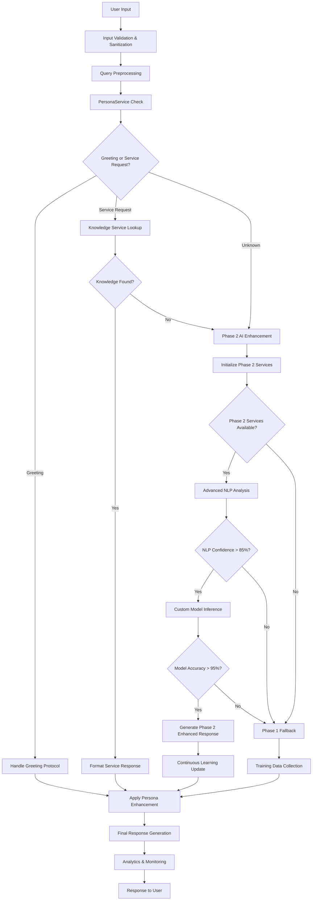
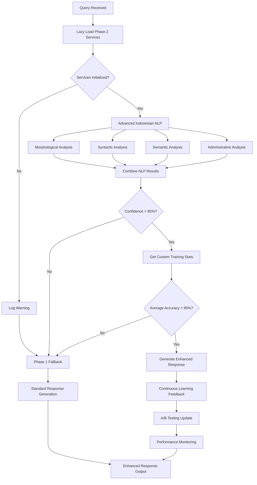
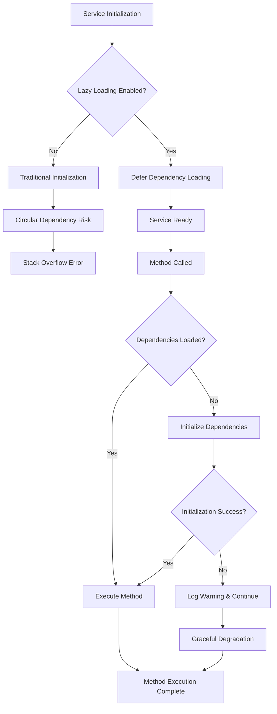
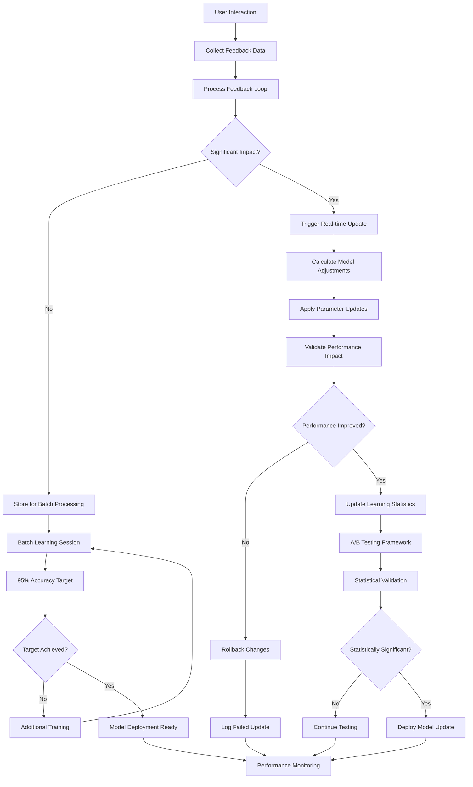
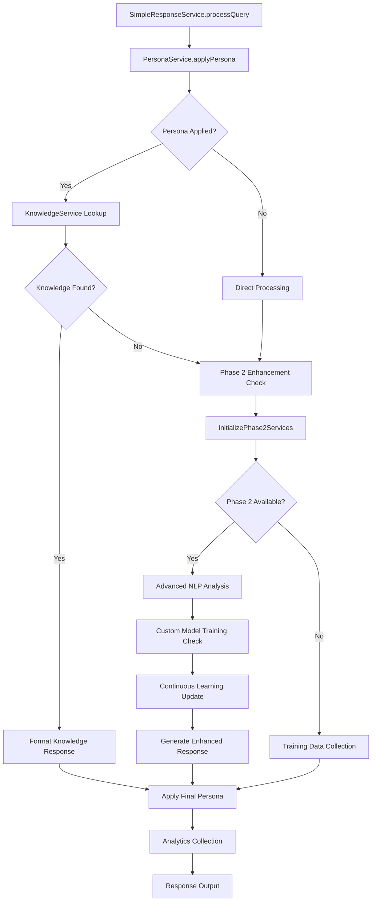
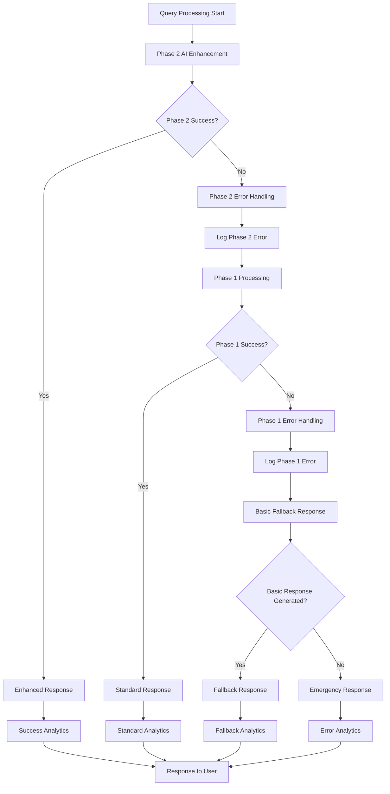
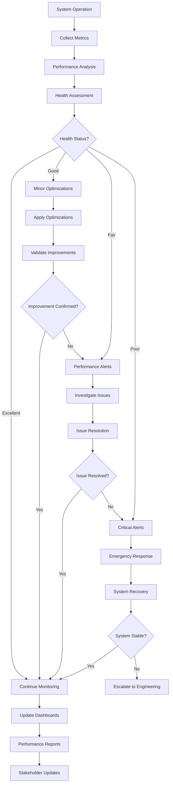
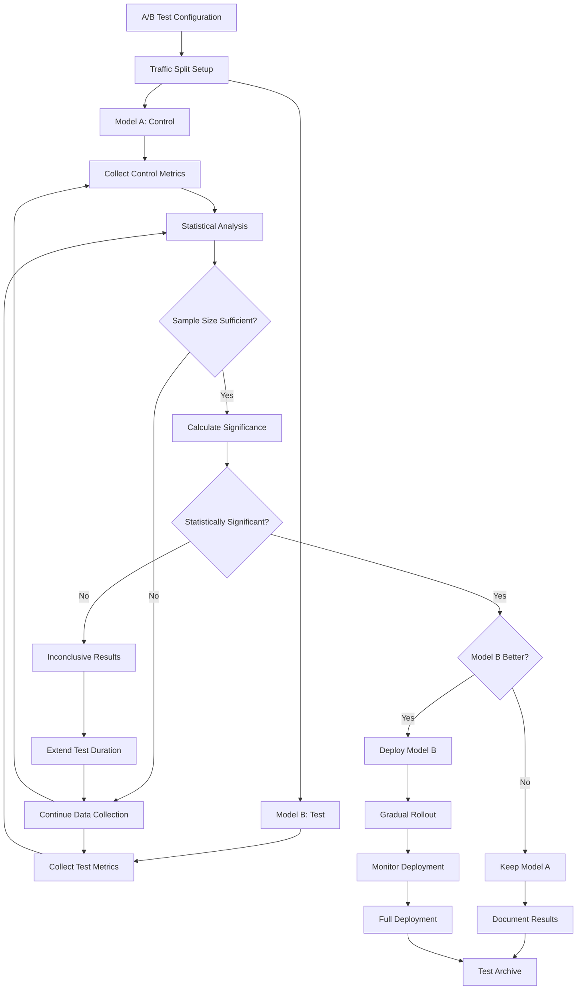

# SELLY Workflow Diagrams
**Complete Processing Pipeline with Phase 2 AI Enhancement**

**Version**: 1.0  
**Created**: August 3, 2025  
**Audience**: System Architects, Developers, Technical Leads  
**Complexity**: Intermediate to Advanced  

---

## 🎯 **Overview**

This document provides comprehensive workflow diagrams for SELLY's complete processing pipeline, including the enhanced Phase 2 Priority 1 AI capabilities. It illustrates the decision trees, fallback mechanisms, and integration patterns that make SELLY a robust, intelligent government service AI.

---

## 🔄 **Complete SELLY Processing Pipeline**

### **Enhanced Query Processing Flow (Phase 2)**

---

## 🤖 **Phase 2 AI Enhancement Decision Tree**

### **AI Enhancement Workflow**

---

## 🔄 **Lazy Loading Architecture Flow**

### **Circular Dependency Prevention**

---

## 📊 **Continuous Learning Workflow**

### **Real-time Model Optimization**

---

## 🔧 **Service Integration Patterns**

### **SimpleResponseService Integration**

---

## 🚨 **Error Handling & Fallback Mechanisms**

### **Multi-layer Fallback System**

---

## 📈 **Performance Monitoring Flow**

### **Real-time Performance Tracking**

---

## 🔄 **A/B Testing Workflow**

### **Statistical Validation Process**

---

## 🔗 **Related Documentation**

### **Architecture References**
- **[Architecture Summary](../01-getting-started/architecture-summary.md)** - Complete system architecture
- **[System Architecture](./system-architecture.md)** - Detailed system design

### **Phase 2 Components**
- **[Phase 2 Priority 1 Integration](../03-ai-services/phase2-priority1-integration.md)** - AI/ML integration overview
- **[Custom Model Trainer](../03-ai-services/custom-model-trainer.md)** - Model training workflows
- **[Continuous Learning Engine](../03-ai-services/continuous-learning-engine.md)** - Learning optimization workflows

### **Implementation Guides**
- **[Performance Optimization](../08-implementation-guides/performance-optimization.md)** - Optimization strategies
- **[Error Handling Best Practices](../08-implementation-guides/error-handling-best-practices.md)** - Error handling patterns

**Ready to understand SELLY's complete workflow architecture?** 🚀
