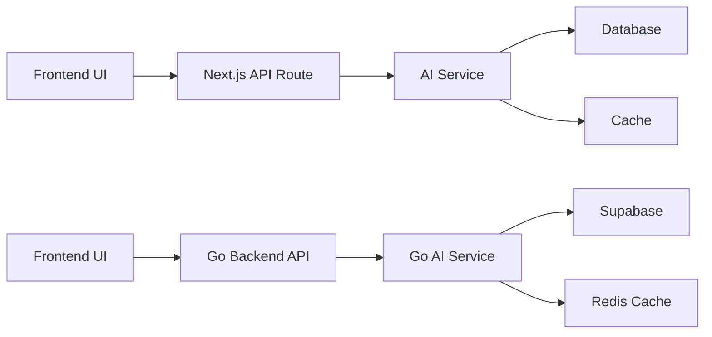
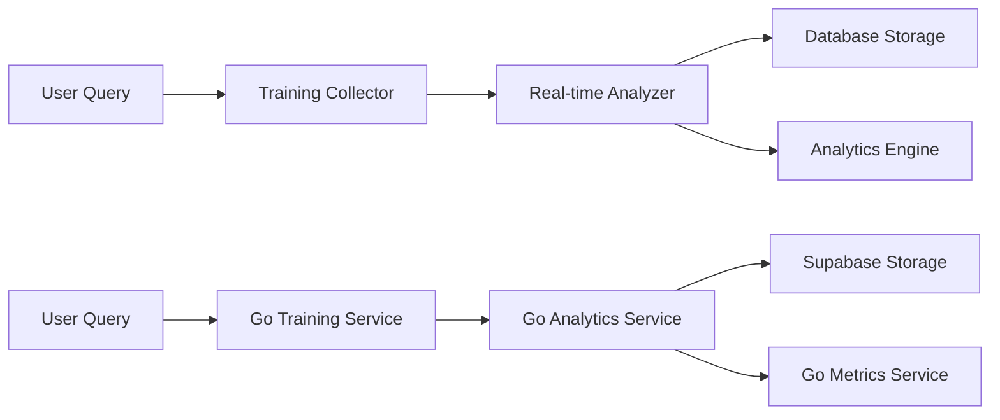

# Legacy Next.js to Go Backend Migration Mapping

## 🎯 **API Contract Mapping**

### **Core Chat API**
```typescript
// LEGACY: frontend/src/app/api/chat/route.ts
POST /api/chat
Request: { message: string, context?: any, sessionId?: string }
Response: { success: boolean, response: string, type: string, metadata: any }

// NEW: backend/internal/api/handlers/chat.go
POST /chat
Request: { message: string, context?: any, sessionId?: string, enhancementMode?: string }
Response: { success: boolean, response: string, type: string, metadata: any }
```

### **Training Data API**
```typescript
// LEGACY: frontend/src/app/api/training-data/route.ts
GET /api/training-data?action=stats
Response: { success: boolean, data: TrainingStats }

// NEW: backend/internal/api/handlers/training.go
GET /api/training/stats
Response: { success: boolean, data: TrainingStats }
```

### **Authentication API**
```typescript
// LEGACY: frontend/src/app/api/register/route.ts
POST /api/register
Request: { email: string, password: string, profile: UserProfile }
Response: { success: boolean, user: User, session: Session }

// NEW: backend/internal/api/handlers/auth.go
POST /auth/register
Request: { email: string, password: string, profile: UserProfile }
Response: { success: boolean, user: User, session: Session }
```

## 🔄 **Service Layer Mapping**

### **AI Services Migration**
| Legacy Next.js Service | Go Backend Service | Migration Notes |
|------------------------|-------------------|-----------------|
| `aiService.ts` | `internal/services/ai/service.go` | Core AI processing logic |
| `customModelTrainer.ts` | `internal/services/training/trainer.go` | Model training workflows |
| `continuousLearningEngine.ts` | `internal/services/learning/engine.go` | Learning pipeline |
| `advancedIndonesianNLP.ts` | `internal/services/nlp/indonesian.go` | Indonesian language processing |

### **Database Services Migration**
| Legacy Next.js Service | Go Backend Service | Migration Notes |
|------------------------|-------------------|-----------------|
| `resilientDatabaseService.ts` | `internal/services/database/service.go` | Database connection management |
| `connectionErrorRecovery.ts` | `internal/services/database/recovery.go` | Connection error handling |
| `MigrationRunner.ts` | `internal/services/database/migration.go` | Database migration utilities |

### **Authentication Services Migration**
| Legacy Next.js Service | Go Backend Service | Migration Notes |
|------------------------|-------------------|-----------------|
| `EnhancedAuthService.ts` | `internal/services/auth/service.go` | Authentication logic |
| `UUIDMappingService.ts` | `internal/services/auth/uuid.go` | User ID management |
| `UUIDMismatchResolver.ts` | `internal/services/auth/resolver.go` | ID conflict resolution |

## 📊 **Data Flow Mapping**

### **Chat Processing Flow**


### **Training Data Flow**


## 🔧 **Configuration Mapping**

### **Environment Variables**
| Legacy Next.js | Go Backend | Purpose |
|----------------|------------|---------|
| `NEXT_PUBLIC_SUPABASE_URL` | `SUPABASE_URL` | Database connection |
| `NEXT_PUBLIC_SUPABASE_ANON_KEY` | `SUPABASE_ANON_KEY` | Database auth |
| `SUPABASE_SERVICE_ROLE_KEY` | `SUPABASE_SERVICE_ROLE_KEY` | Admin operations |
| `REDIS_URL` | `REDIS_URL` | Cache connection |
| `GROQ_API_KEY` | `GROQ_API_KEY` | AI service |

### **Feature Flags Migration**
| Legacy Feature Flag | Go Backend Config | Migration Status |
|--------------------|-------------------|------------------|
| `enableBackendIntegration` | `ENABLE_AI_PROCESSING` | ✅ **Migrated** |
| `disable_tensorflow` | `DISABLE_TENSORFLOW` | ✅ **Migrated** |
| `enable_groq_integration` | `ENABLE_GROQ` | ✅ **Migrated** |

## 🏗️ **Architecture Comparison**

### **Legacy Next.js Architecture**
```
Frontend (Next.js)
├── UI Components (React)
├── API Routes (Next.js)
│   ├── Business Logic
│   ├── Database Calls
│   ├── AI Processing
│   └── Cache Management
└── Services (TypeScript)
    ├── AI Services
    ├── Database Services
    └── Cache Services
```

### **New Separated Architecture**
```
Frontend (Next.js)          Backend (Go)
├── UI Components (React)   ├── API Handlers (Gin)
├── Client Services         ├── Business Logic Services
├── State Management        ├── Database Services
└── UI Utilities           ├── AI Processing Services
                           ├── Cache Services
                           └── Monitoring Services
```

## 📋 **Migration Checklist**

### **Phase 1: Critical Services**
- [ ] Chat API migration
- [ ] Training data services
- [ ] Authentication services
- [ ] Database connection services
- [ ] Core AI processing services

### **Phase 2: Infrastructure Services**
- [ ] Caching services
- [ ] Monitoring services
- [ ] Session management
- [ ] Performance optimization
- [ ] Security services

### **Phase 3: Supporting Services**
- [ ] Analytics services
- [ ] Compliance services
- [ ] Administrative services
- [ ] Integration services
- [ ] Testing utilities

## 🔍 **Validation Criteria**

### **Functional Parity**
- [ ] All API endpoints return identical responses
- [ ] Business logic produces same results
- [ ] Error handling maintains compatibility
- [ ] Performance meets or exceeds targets

### **Performance Targets**
- [ ] Response time: <100ms (vs 800-3800ms legacy)
- [ ] Memory usage: <100MB (vs 200-500MB legacy)
- [ ] Concurrent requests: >1000 (vs 100-200 legacy)
- [ ] Error rate: <0.1% (maintain current levels)

### **Compatibility Requirements**
- [ ] Frontend requires no changes
- [ ] API contracts remain identical
- [ ] Authentication flow preserved
- [ ] Session management compatible
- [ ] Cache behavior consistent

## 🚀 **Implementation Strategy**

### **Week 1-2: Foundation**
1. Move critical API routes to staging
2. Migrate core AI and database services
3. Implement Go backend equivalents
4. Test basic functionality

### **Week 3-4: Infrastructure**
1. Migrate monitoring and caching services
2. Implement session management
3. Add performance optimization
4. Test integration points

### **Week 5-6: Completion**
1. Migrate remaining services
2. Archive legacy components
3. Final testing and validation
4. Documentation updates

## 📁 **Final Archive Structure**

```
/backend/data-init/selly-legacy-nextjs-backend/
├── api-routes/              # All Next.js API routes
├── business-logic/          # Backend business services
├── infrastructure/          # Infrastructure services
├── utilities/               # Backend utilities
├── middleware/              # Server-side middleware
├── documentation/           # Migration documentation
└── reference/               # Reference implementations
```

This mapping ensures complete traceability from legacy Next.js components to their Go backend equivalents, maintaining full functionality while achieving the performance and architectural benefits of the separation.
